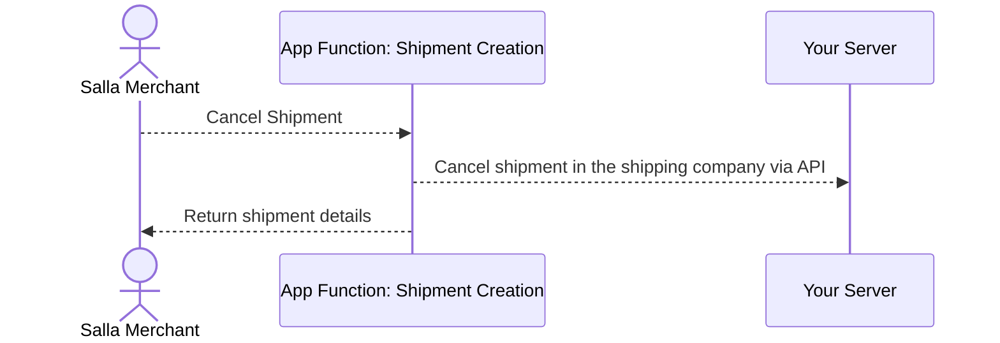
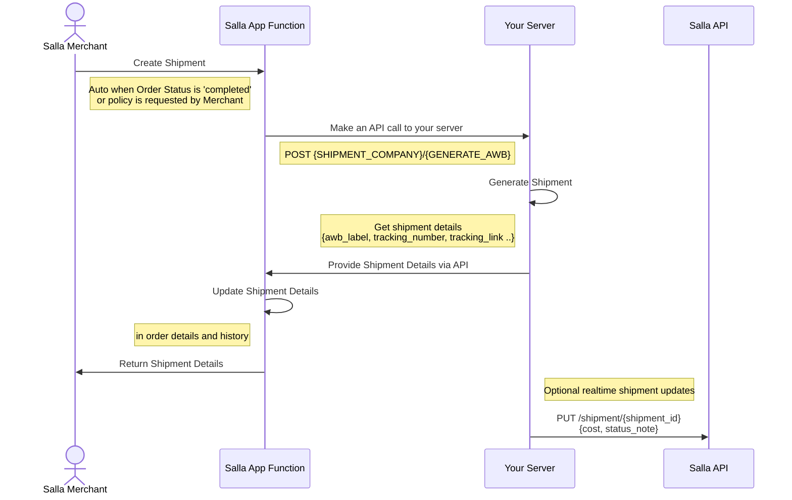

# App Functions

## Table of Contents

- [app-functions/Shipment-Cancelled-App-Functions-Salla-Merchants-APIs-Salla-Docs](#app-functions-shipment-cancelled-app-functions-salla-merchants-apis-salla-docs)
- [app-functions/Shipment-Creating-App-Functions-AWB-Salla-Merchants-APIs-Salla-Docs](#app-functions-shipment-creating-app-functions-awb-salla-merchants-apis-salla-docs)

---

## app-functions/Shipment-Cancelled-App-Functions-Salla-Merchants-APIs-Salla-Docs

# Shipment Cancelled

Use the Shipment Cancelled Function to manage cancellation requests. The function receives the shipment details, and the shipping system can update the status to “Cancelled” when applicable.

:::note[]
Cancellation can be declined if the shipment has already been dispatched or delivered.
:::

## Step By Step Guide

On Salla Partners Portal, click on "+ Add New Function"


Select the App Function you want to add, which is in this case the Shipment Creating Function. After selecting, add a name to the function.


### Code Details
      
Salla auto-generates starter code, which you can overwrite with the following implementation. This gives you a clean foundation to build your shipping logic and ensures the function behaves the way your integration needs.


      
<Tabs>
  <Tab title="Explanation">
<Steps>
  <Step title="Function definition">
    This function is autogenerated by Salla. It runs when Salla triggers Shipment Cancellation, receives the `context` data, and must return a `GenericResponse` object.
    ```js
    export default async (context: Shipments): Promise<Resp> {
    ```
  </Step>

  <Step title="Cancel shipment in shipping company">
    Sends a POST request to the shipping company's API to cancel the shipment. The request includes the shipment data from the event payload.
    ```js
    const response = await fetch("https://{SHIPMENT_COMPANY_BASE_URL}/{CANCEL_SHIPMENT}", {
      method: "POST",
      headers: {
        "Content-Type": "application/json"
      },
      body: JSON.stringify(context.payload.data)
    });
    ```
  </Step>
  <Step title="Return success response">
    Returns a success response with the shipment data. This is autogenerated by Salla and confirms to Salla that the cancellation was processed.
    ```js
    return Resp.success();
    ```
  </Step>
</Steps>


  </Tab>
  <Tab title="Full Code">
      
Feel free to copy the below code and paste it *(with some modifications)* to the Salla Partners Portal > App Functions.
      
```js
export default async (context: Shipments): Promise<Resp> {
  console.log('Shipment cancelled event triggered');
  // Cancel shipment in the shipping company
  const response = await fetch("https://{SHIPMENT_COMPANY_BASE_URL}/{CANCEL_SHIPMENT}", {
        method: "POST",
        headers: {
            "Content-Type": "application/json"
        },
        body: JSON.stringify(context.payload.data)
    });


  return Shipment.success().setData();
}; 
```
  </Tab>
</Tabs>

### Sequence Diagram
      
The following diagram shows visually how the shipment cancelled app function works within Salla Partners Portal:
      


---

## app-functions/Shipment-Creating-App-Functions-AWB-Salla-Merchants-APIs-Salla-Docs

# Shipment Creating

The Shipment Creation function is triggered whenever a new shipment or a return shipment is created. The following app function allows the shipping company to call its API to generate the AWB label, return the tracking link, and provide tracking information. The returned data is then used to update the shipment details inside Salla.

## Step By Step Guide

On Salla Partners Portal, click on "+ Add New Function"


Select the App Function you want to add, which is in this case the Shipment Cancelled Function. After selecting, add a name to the function.


### Code Details

Salla auto-generates starter code, which you can overwrite with the following implementation. This gives a clear place to plug in your shipping logic and connect Salla with the shipping company’s API.


:::note[]
This flow handles both shipments and return shipments. Shipments use the payload type `"shipment"`, while returns follow the same process with the payload type `"return"`.
:::

<Tabs>
  <Tab title="Explanation">

<Steps>
  <Step title="Function definition">
    This function is autogenerated by Salla. It runs when Salla triggers Shipment Creation, receives the `context` data, and must return a `Shipment` object.
    ```js
    export default async (context: Shipments): Promise<Shipment> => {
    ```
  </Step>

  <Step title="Shipment Company API call">
    Declares the supported shipment types: a forward shipment or a return shipment. This makes it easier to branch logic later.
    ```js
      // generate the awb from thridparty shipping API
  const labelRequest = {
        shipment_id: shipment.id,
        order_id: shipment.order_id,
        tracking_number: shipment.tracking_number,
        origin_address: shipment.ship_from,
        shipping_address: shipment.ship_to,
        customer: {
          id: settings.customer_id,
        },
        label_options: {
          format: settings.label_format, // pdf
          size: settings.label_size, // A6
        },
  };

  const response = await fetch(`https://api.mock.com/label/generate`, {
        method: "POST",
        headers: {
          "Content-Type": "application/json",
        },
        body: JSON.stringify(labelRequest),
  });

  const result = await response.json();
    ```
  </Step>

  <Step title="Build and return final Shipment object">
    This part is autogenerated by Salla. It builds the final response using Salla’s `Shipment` builder. All fields are taken from the updated `shipmentResponse` object and returned to Salla.
    ```js
    return Shipment.success()
        .setShipmentNumber(shipment.id)
        .setPdfLabel(result.label_url);
    ```
  </Step>
</Steps>

  </Tab>
  <Tab title="Full Code">

Feel free to copy the below code and paste it *(with some modifications)* to the Salla Partners Portal > App Functions.
      
```js
export default async (context: Shipments): Promise<Shipment> => {
  const { payload, settings, merchant } = context;
  const { data: shipment } = payload;

  const labelRequest = {
    shipment_id: shipment.id,
    order_id: shipment.order_id,
    tracking_number: shipment.tracking_number,
    origin_address: shipment.ship_from,
    shipping_address: shipment.ship_to,
    customer: {
      id: settings.customer_id,
    },
    label_options: {
      format: settings.label_format, // pdf
      size: settings.label_size, // A6
    },
  };

  const response = await fetch(`https://api.mock.com/label/generate`, {
    method: "POST",
    headers: {
      "Content-Type": "application/json",
    },
    body: JSON.stringify(labelRequest),
  });

  const result = await response.json();
  /*
   * The Shipment can be used to set multiple things based on the use
   * case. There are other setter methods available to set other things.
   * The setShipmentNumber() is required to be set to identiify shipment.
   * Use Shipment.error() incase an error needs to be returned.
   */
  return Shipment.success()
    .setShipmentNumber(shipment.id)
    .setPdfLabel(result.label_url);
    .setStatus(ShipmentStatusEnum.IN_TRANSIT);
};
```
  </Tab>
</Tabs>
      

### Sequence Diagram
      
The following diagram shows visually how the shipment creating app function works within Salla Partners Portal:
      


---

