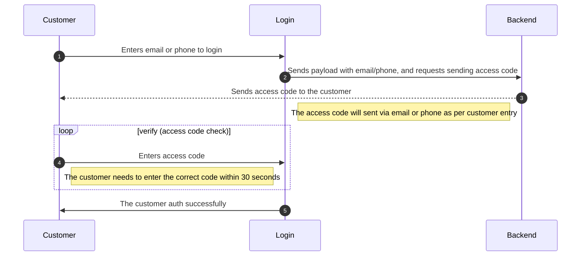
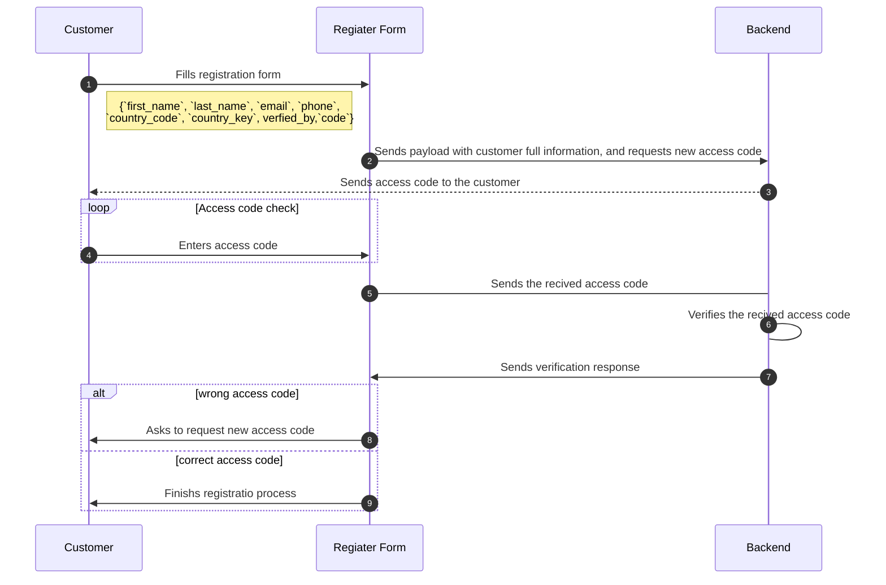
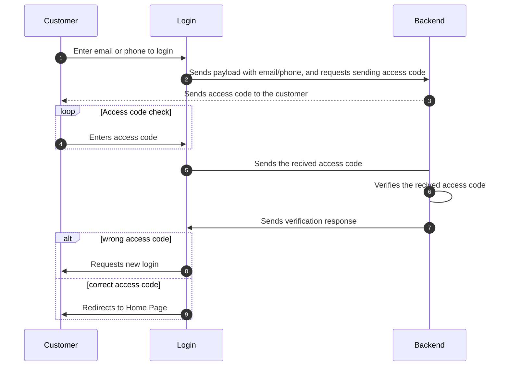

# Auth

## Table of Contents

- [auth/Twilight-JS-SDK-Login-Twilight-SDK-Documentation-Salla-Docs](#auth-twilight-js-sdk-login-twilight-sdk-documentation-salla-docs)
- [auth/Twilight-JS-SDK-Logout-Twilight-SDK-Documentation-Salla-Docs](#auth-twilight-js-sdk-logout-twilight-sdk-documentation-salla-docs)
- [auth/Twilight-JS-SDK-Refresh-Twilight-SDK-Documentation-Salla-Docs](#auth-twilight-js-sdk-refresh-twilight-sdk-documentation-salla-docs)
- [auth/Twilight-JS-SDK-Register-Twilight-SDK-Documentation-Salla-Docs](#auth-twilight-js-sdk-register-twilight-sdk-documentation-salla-docs)
- [auth/Twilight-JS-SDK-Resend-Twilight-SDK-Documentation-Salla-Docs](#auth-twilight-js-sdk-resend-twilight-sdk-documentation-salla-docs)
- [auth/Twilight-JS-SDK-Verify-Twilight-SDK-Documentation-Salla-Docs](#auth-twilight-js-sdk-verify-twilight-sdk-documentation-salla-docs)

---

## auth/Twilight-JS-SDK-Login-Twilight-SDK-Documentation-Salla-Docs

# Login

In general, the authentication API allows a developer to control all aspects of a user's identity. It has endpoints for logging in, logging out, and using APIs, among other things. This *login* endpoint is used to authenticate a user. Either the email or the phone number can be used as a login identifier, which means that the user has two *types* of login process, `email` and `phone`. 

:::tip
The *login* endpoint has been implemented in the [Login](https://docs.salla.dev/doc-422711?nav=01HNFTE06J4QC24T0D5BPRYKMD) Web Component, and It's all setup to save developer's time and effort.
:::




## Payload


<DataSchema id="1387184" />

## Response

<Tabs>
  <Tab title="Success">


<DataSchema id="1427183" />

</Tab>
<Tab title="Error">


<DataSchema id="1427184" />

</Tab>
</Tabs>


## Usage

<Tabs>
  <Tab title="Mobile">
  
In the case of using the phone number as a *login* type, the developer can use the example below to receive the data, and redirect the user accordingly.

```js
salla.auth.login({
  type: 'mobile', 
  phone: '555555555', 
  country_code: 'SA'
}).then((response) => {
  /* add your code here */
});
```
      
  </Tab>
  <Tab title="Email">

On the other hand, when using an email as a *login* type, the developer can receive the data using the example below and redirect the user accordingly.

```js
salla.auth.login({
  type: 'email', 
  email: 'demo@demo.com'
}).then((response) => {
  /* add your code here */
});
```
      
  </Tab>
</Tabs>

## Events
The *login* process may trigger two events during the login process, onCodeSent and onCodeNotSent.

### onCodeSent
This event will be triggered when the login process is completed successfully and the loing code has been sent.

```js
salla.event.auth.onCodeSent((response) => {
  /* add your code here */
  console.log(response);
});
```

### onCodeNotSent
This event will be triggered when a failure occurs in receiving and setting the access code.

```js
salla.event.auth.onCodeNotSent((errorMessage) => {
  /* add your code here */
  console.log(errorMessage)
});
```

---

## auth/Twilight-JS-SDK-Logout-Twilight-SDK-Documentation-Salla-Docs

# Logout

This logout endpoint terminates the current session. As a result, the customer's authentication will be terminated, and it will be required to obtain a new access token in order to make further API calls.

:::tip
The *logout* endpoint has been implemented in the [Login](https://docs.salla.dev/doc-422711?nav=01HNFTE06J4QC24T0D5BPRYKMD) Web Component, and It's all setup to save developer's time and effort.
:::


## Response

<Tabs>
 <Tab title="Success">
     
     
   <DataSchema id="1427188" />
     
</Tab>
   <Tab title="Error">
       
       
   <DataSchema id="1427189" />
       
   </Tab>
</Tabs>

## Usage
The method `logout()` can be called in order to process the logout request. It does not require any input.

```js
salla.auth.logout().then((response) => {
    /* add your code here */
});
```

## Events
The *logout* process may trigger two events during the login process, onLoggedOut and onFailedLogout.

### onLoggedOut
This event will be triggered when the *logout* process is completed successfully without errors.
```js
salla.event.auth.onLoggedOut((response) => {
  console.log(response)
});
```

### onFailedLogout
This event will be triggered when the *logout* process is not completed, and an error has occurred.

```js
salla.event.auth.onFailedLogout((errorMessage) => {
  console.log(errorMessage)
});
```

---

## auth/Twilight-JS-SDK-Refresh-Twilight-SDK-Documentation-Salla-Docs

# Refresh

To make the customer's login process easier, the store may use an access token to keep the client logged in for a period of time. Access tokens, on the other hand, may only be valid for a short amount of time for security reasons. A refresh token is used to "refresh" the access token once it has expired. This endpoint refresh token allows a client to receive new access tokens without requiring them to log in again.


:::tip
The *refresh* endpoint has been implemented in the [Login](https://docs.salla.dev/doc-422711?nav=01HNFTE06J4QC24T0D5BPRYKMD) Web Component, and It's all setup to save developer's time and effort.
:::

## Response

<Tabs>
  <Tab title="Success">


<DataSchema id="1427208" />
      
  </Tab>
   <Tab title="Error">


       
<DataSchema id="1427184" />
  </Tab>
  
</Tabs>

## Usage

The method `refresh()` can be called in order to generate a new access token for the customer. It does not require any input.

```js
salla.auth.refresh().then((response) => {
    /* add your code here */
});
```

## Events
This endpoint may trigger one event, which is the onRefreshFailed event.

### onRefreshFailed
This event will be triggered when the access token *refresh* process is not completed, and an error has occurred.
```js
salla.event.auth.onRefreshFailed((response) => {
  console.log(response)
});
```

---

## auth/Twilight-JS-SDK-Register-Twilight-SDK-Documentation-Salla-Docs

# Register

The customer registration endpoint creates a customer account in the merchant's store. A registration request must provide the customer main information such as *first name, email, phone*, and more. Additionally, the login verification type should be stored in *verfied_by* field, so that later the verification *code* will be sent to that verification type.

<!-- theme: success -->

:::tip
The *register* endpoint has been implemented in the [Login](https://docs.salla.dev/doc-422711?nav=01HNFTE06J4QC24T0D5BPRYKMD) Web Component, and It's all setup to save developer's time and effort.
:::




## Payload


<DataSchema id="1387187" />


## Response

<Tabs>
  <Tab title="Success">


<DataSchema id="1427200" />
      
  </Tab>
   <Tab title="Error">


<DataSchema id="1427184" />
  </Tab>
  
</Tabs>

## Usage
The `register()` creates a new customer account. A registration request must provide a user with the following information: `first_name`, `last_name`, `email`, `phone`, `country_code`, and `country_key`. Additionally, the login verification type should be stored in `verfied_by`, so that later the verification `code` will be sent to that verification type.
```js
salla.auth.register({
  first_name: 'Mohammed', 
  last_name: 'Ahmed', 
  phone: '5555555',
  country_code: 'SA'
  country_key: '966',
  verified_by: 'phone',
  code: 123
}).then((response) => {
  /* add your code here */
});

```

## Events
This endpoint may trigger two events, the onRegistered and onCodeNotReSent events.

### onRegistered
This event is triggered when the customer registration process is done without having any errors coming back from the backend.

```js
salla.event.auth.onRegistered((response) => {
  console.log(response)
});
```
### onRegistrationFailed
This event will be triggered when the *register* process is not completed, and an error has occurred.
```js
salla.event.auth.onRegistrationFailed((errorMessage) => {
	console.log(errorMessage)
});
```

---

## auth/Twilight-JS-SDK-Resend-Twilight-SDK-Documentation-Salla-Docs

# Resend

This `resend` endpoint is simply to re-send the access code to the customer if it was not received correctly. The customer is given 30 seconds to enter the received access code, so if there was an issue with receiving the access code, another new code may be re-sent.

:::tip
The *resend* endpoint has been implemented in the [Login](https://docs.salla.dev/doc-422711?nav=01HNFTE06J4QC24T0D5BPRYKMD) Web Component, and It's all setup to save developer's time and effort.
:::


## Payload


<DataSchema id="1387189" />


## Response
<Tabs>
  <Tab title="Success">

<DataSchema id="1427198" />

  </Tab>
   <Tab title="Error">


      
<DataSchema id="1427184" />
  </Tab>
  
</Tabs>

## Usage

The `resend()` method passes a request for a new access code to the customer. 

<Tabs>
  <Tab title="Mobile">

The method may pass the phone number and country code to where the new access code should be sent.

```js
salla.auth.resend({
  type: 'mobile', 
  phone: '555555555', 
  country_code: 'SA'
}).then((response) => {
  /* add your code here */
});
```
      
  </Tab>
   <Tab title="Email">

On the other hand, when using an email as a *login* type, the developer can receive the data using the example below and redirect the user accordingly.

```js
salla.auth.resend({
  type: 'email', 
  email: 'demo@demo.com'
}).then((response) => {
  /* add your code here */
});
```      
  </Tab>
  
</Tabs>


## Events
This endpoint may trigger two events, the onCodeSent and onCodeNotSent events.

### onCodeSent
This event is triggered when the new access code generation has been done without having any errors back from the backend.

```js
salla.event.auth.onCodeSent((response) => {
  console.log(response)
});
```
### onCodeNotSent
This event is triggered when the new access code generation has failed, and no new access code has been sent to the customer.

```js
salla.event.auth.onCodeNotSent((errorMessage) => {
  console.log(errorMessage)
});
```

---

## auth/Twilight-JS-SDK-Verify-Twilight-SDK-Documentation-Salla-Docs

# Verify

This endpoint handles the customer's access code verification. It sends the entered access code to the backend and waits for the response. In the case of receiving a positive response, it helps by directing the customer to the store's home page. Otherwise, if the verification process fails, it informs the customer to re-send the correct access code.

:::tip
The *verify* endpoint has been implemented in the [Login](https://docs.salla.dev/doc-422711?nav=01HNFTE06J4QC24T0D5BPRYKMD) Web Component, and It's all setup to save developer's time and effort.
:::




## Payload


<DataSchema id="1387191" />


## Response

<Tabs>
 <Tab title="Success">
 
 
<DataSchema id="1427196" />
     
  </Tab>
  <Tab title="Error">
 
 

<DataSchema id="1427184" />
</Tab>
  
</Tabs>

## Usage
The `verify()` passes the customer access code to the backend in order to proceed with the verification process. In the case of using the phone number method to receive the access code, this method will pass the received access code along with the customer's phone number and the country code.

<Tabs>
  <Tab title="Mobile">
 
```js
salla.auth.verify({
  type: 'mobile', 
  phone: '5555555', 
  country_code: 'SA'
  code: '1111'
}).then((response) => {
  /* add your code here */
});
```     
  </Tab>
   <Tab title="Email">

```js
salla.auth.verify({
  type: 'email', 
  email: 'demo@demo.com', 
  code: '1111'
}).then((response) => {
  /* add your code here */
});
```      
  </Tab>
  
</Tabs>


## Events
This endpoint may trigger two events, the onVerified and onVerificationFailed events.

### onVerified
This event is triggered when the verification process is done without having any errors back from the backend.
```js
salla.event.auth.onVerified((response) => {
  console.log(response)
});
```
### onVerificationFailed
This event may happen when there is an issue with setting the verification type, by `phone` or `email`. Additionally, this event will be triggered when the verification process fails and the backend sends error codes. In other words, the received response status is not 200.
```js
salla.event.auth.onVerificationFailed((errorMessage) => {
  console.log(errorMessage)
});
```

---

