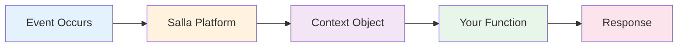

# Docs  Get Started App Functions Documentation Salla Docs

## Table of Contents

- [docs/Get-Started-App-Functions-Documentation-Salla-Docs](#docs-get-started-app-functions-documentation-salla-docs)
- [docs/Get-Started-Partners-Apps-APIs-Salla-Docs](#docs-get-started-partners-apps-apis-salla-docs)
- [docs/Getting-Started](#docs-getting-started)
- [docs/Getting-Started-with-the-Shipping-API-Partners-Apps-APIs-Salla-Docs](#docs-getting-started-with-the-shipping-api-partners-apps-apis-salla-docs)
- [docs/Manage-Recurring-App-Subscriptions-Salla-Merchants-APIs-Salla-Docs](#docs-manage-recurring-app-subscriptions-salla-merchants-apis-salla-docs)
- [docs/Migration-to-the-New-API-Partners-Apps-APIs-Salla-Docs](#docs-migration-to-the-new-api-partners-apps-apis-salla-docs)
- [docs/Multi-Language-Support-Merchant-API-Salla-Docs](#docs-multi-language-support-merchant-api-salla-docs)
- [docs/NodeJs-Support-App-Functions-Documentation-Salla-Docs](#docs-nodejs-support-app-functions-documentation-salla-docs)
- [docs/Order-Fulfilment](#docs-order-fulfilment)
- [docs/Pagination-Merchant-API-Salla-Docs](#docs-pagination-merchant-api-salla-docs)
- [docs/Publish-Shipping-App-Partners-Apps-APIs-Salla-Docs](#docs-publish-shipping-app-partners-apps-apis-salla-docs)

---

## docs/Get-Started-App-Functions-Documentation-Salla-Docs

# Get Started

Get started with App Functions in minutes. This guide walks you through creating your first App Function that responds to store events.

---

## Prerequisites

Before you begin, make sure you have:

- ✔️ **Salla Partner Account** — [Sign up here](https://portal.salla.partners) if you don't have one
- ✔️ **An App Created** — Create an app in the Salla Partner Portal
- ✔️ **Demo Store** — Install your app on a demo store for testing
- ✔️ **App Scopes** — Configure the necessary scopes for the events you want to listen to

---

## Setup Your Environment

### 1. Configure App Scopes

App scopes determine which events your app can access. To configure scopes:

<Steps>
  <Step title="Open Partner Portal">
    Navigate to your app in the [Salla Partner Portal](https://portal.salla.partners)
  </Step>

  <Step title="Configure Scopes">
    Scroll down to the **App Scopes** section and select the scopes needed for your App Functions (e.g., `orders.read`, `products.read`)
  </Step>

  <Step title="Save Changes">
    Click **Save** to apply your scope configuration
  </Step>
</Steps>


<Info>
Read more about Webhooks, App Scopes, and Events in the [Salla Documentation](https://docs.salla.dev/421119m0).
</Info>

---

### 2. Install on Demo Store

To test your App Functions, install your app on a demo store:

<Steps>
  <Step title="Navigate to Your App">
    In the Partner Portal, open your app dashboard
  </Step>

  <Step title="Install on Demo Store">
    Click **Install on Demo Store** and select or create a demo store
  </Step>

  <Step title="Complete Installation">
    Follow the installation wizard to complete the process
  </Step>
</Steps>


<TipGood>Learn more about [testing with demo stores](https://salla.dev/blog/how-to-test-your-app-using-salla-demo-stores/).</TipGood>

---

## Understanding the Context Object

Before creating your first function, it's important to understand what data your function receives.

### How App Functions Work



**The Flow:**

1. ⚡ **Event Occurs** — Merchant creates order, customer views product, etc.
2. 🔄 **Salla Platform** — Detects the event and finds your App Function
3. 📦 **Context Object** — Wraps event data (payload) + your app settings
4. 💻 **Your Function** — Receives context and executes your logic
5. ✔️ **Response** — Returns result (affects action for sync, ignored for async)

---

### What You Receive

Every App Function receives a **context object** with three main parts:

```javascript Basic Structure
export default async (context: ContextType): Promise<Resp> {
  const { payload, settings, merchant } = context;

  // payload - The webhook event data from Salla
  // settings - Your app configuration from Partner Portal
  // merchant - Merchant details object
}
```

```typescript TypeScript
export default async (context: ContextType): Promise<Resp> {
  const { payload, settings, merchant } = context;

  // Full type safety and autocomplete
  const orderId = payload.data.id;
  const merchantId = merchant.id;
}
```

---

### The Payload Object

The `payload` contains the event data that Salla sends:

| Field | Type | Description |
|-------|------|-------------|
| `event` | `string` | Event name (e.g., `order.created`, `product.updated`) |
| `merchant` | `number` | Merchant ID who installed your app |
| `created_at` | `string` | ISO timestamp when the event occurred |
| `data` | `object` | Event-specific data (order, product, customer, etc.) |

**Example:**

```json
{
  "event": "order.created",
  "merchant": '123456',
  "created_at": "2024-03-24T10:30:00Z",
  "data": {
    "id": 789,
    "status": "pending",
    "total": 299.99
  }
}
```

> The payload is diffrenet for each event/action, you can find the schema of each event/action in [Merchants Events](https://docs.salla.dev/5460616f0.md) or [Customers Events](https://docs.salla.dev/5460615f0.md) pages

---

### The Settings Object

The `settings` contains your app's configuration values that you define in the Partner Portal:

```json
{
  "apiKey": "your-api-key",
  "webhookUrl": "https://api.example.com/webhook",
  "syncEnabled": true
}
```

<TipInfo>Each merchant can customize these settings when they install your app.</TipInfo>

---

## Creating Your First App Function

Let's create a simple App Function that listens to order status updates and sends data to an external webhook.

---

### Step 1: Access the App Functions Editor

<Steps>
  <Step title="Login to Partner Portal">
    Log in to your [Salla Partner Portal](https://portal.salla.partners/login)
  </Step>

  <Step title="Open Your App">
    Navigate to the app you want to add the function to
  </Step>

  <Step title="Find App Functions Section">
    Scroll down to the **App Functions** section
  </Step>

  <Step title="Add New Function">
    Click **Add New Function** to open the editor
  </Step>
</Steps>


The App Function builder will appear with these sections:

- 🏷️ **Function Name** — Name your function
- 📋 **Action Selector** — Choose which event triggers your function
- 💻 **Code Editor** — Write your function logic
- 👁️ **Preview Panel** — Test and view results


---

### Step 2: Name Your Function

Enter a descriptive name for your function that clearly indicates its purpose.

**Example:** `order-status-webhook-notifier`

**Best Practices:**

- ✔️ Use lowercase with hyphens
- ✔️ Be descriptive and specific
- ✔️ Include the event type and action

---

### Step 3: Select an Action

Click on the **Select Action** dropdown to see all available actions and events.


For this example, select **Order Status Updated** from the list.

**Available Event Categories:**

| Category | Examples |
|----------|----------|
| **Orders** | created, updated, cancelled, refunded |
| **Products** | added, updated, deleted, quantity low |
| **Customers** | created, updated, login, OTP request |
| **Shipments** | creating, created, cancelled, updated |
| **And many more...** | brands, categories, coupons, reviews |


---

### Step 4: Write Your Function Code

Once you select an action, the code editor updates with the function signature. Now you can write your custom logic.

**Example Function**: Send order status updates to a webhook


```typescript Full Example
export default async (context: OrderStatusUpdated): Promise<Resp> => {
  // Destructure context for clarity
  const { payload, settings, merchant } = context;
  const { data: order, event, } = payload;

  // 1. Prepare payload for the external webhook service
  const webhookPayload = {
    order_id: order.id,
    event: event,
    order_status: order.status,
    merchant_id: merchant.id,
    timestamp: new Date().toISOString(),
    message: "Order status updated successfully"
  };

  // 2. Call the external webhook URL defined in the app settings
  // The API key is also stored in settings and customized by the merchant
  const response = await fetch(settings.webhookUrl, {
    method: 'POST',
    headers: {
      'Content-Type': 'application/json',
      'Authorization': `Bearer ${settings.webhookApiKey}` // Key from app settings
    },
    body: JSON.stringify(webhookPayload)
  });

  // 3. Return a consistent response based on the webhook call status
  if (!response.ok) {
    await sendEmail({
        to: payload.data.customer.email,
        subject: `Order ${payload.data.id} Confirmed`,
        body: `Thank you for your order!`
      });
  }

  return Resp.success().setData({
      webhook_status: response.status,
      order_id: order.id
  });
}
```

**Key Points:**

- ✔️ The function receives a `context` object with `payload`, `settings` and `merchant` objects
- ✔️ Use `async/await` for asynchronous operations
- ✔️ Always return a response object with `success` status

---

### Step 5: Test Your Function

Before deploying, test your function using the preview feature.

<Steps>
  <Step title="Select Demo Store">
    Click **Select Store** and choose your demo store
      
    
  </Step>

  <Step title="Get Test Data">
    Navigate to your demo store dashboard and get test data (e.g., an Order ID)
      
    
  </Step>

  <Step title="Enter Test Parameters">
    Enter the Order ID in the preview panel
      
    
  </Step>

  <Step title="Execute Function">
    Click **Save and Preview** to execute your function
      
    
  </Step>

  <Step title="Review Results">
    Review the results in the preview panel:

    - ✔️ Check for successful execution
    - ✔️ Verify the response data
    - ✔️ Look for any errors
    - ✔️ If using a webhook testing service, verify the payload was received
  </Step>
</Steps>

:::check[]
**Congratulations!** You've successfully created your first App Function. 🎉
:::

---

## Accessing Salla APIs

App Functions have built-in access to Salla APIs with automatic authentication:


```typescript Fetch Orders
export default async (context: Order): Promise<Resp> => {
  // Fetch order details from Salla API
  const response = await fetch('https://api.salla.dev/admin/v2/orders', {
    method: 'GET'
    // No need to add Authorization header - it's automatic!
  });

  const orders = await response.json();
  /*
    * The .setData() should be called mandatorily. (Pass {} as default)
    * The .setStatus() is optionallly called. The default status is 200.
    * The .setMessage() is optional. 
    * Incase there is any error invoke Resp.error().
  */
  return Resp.success().setData(orders);
}
```

```typescript Update Product
export default async (context: Order): Promise<Resp> => {
  // Update product via Salla API
  // NOTE: Authentication token is automatically injected by the platform.
  const response = await fetch(`https://api.salla.dev/admin/v2/products/${context.payload.data.id}`, {
    method: 'PUT',
    headers: { 
      'Content-Type': 'application/json' 
      // Authorization header is automatically handled
    },
    body: JSON.stringify({
      name: 'Updated Product Name' // Example: Renaming the product
    })
  });
  
  const product = await response.json();

  // Return the success status of the API call
  return Resp.success().setData(product);
}
```

:::info[]
Explore all available Salla APIs in the [API Reference](https://docs.salla.dev/426392m0)
:::

---

## Best Practices

### 1. Keep Functions Focused

Each function should do one thing well. If you need complex logic, break it into multiple functions or queue the remining impratant jobs

```typescript
// ✅ Good: Focused function
export default async (context: ContextType): Promise<Resp> => {
  await sendEmail(context.payload.data);
  return Resp.success().setData({});
}

// ❌ Bad: Too many responsibilities
export default async (context: ContextType): Promise<Resp> => {
  await sendEmail();
  await updateInventory();
  await syncCRM();
  await generateInvoice();
  // Too much in one function!
}
```

### 2. Return Consistent Responses

Always return `Response` object with `.success` or `.setError`. You can find all the information about handling responses in [🤝 Understanding App Function Responses](https://docs.salla.dev/1758222m0.md)

```typescript
// ✅ Success
return Resp.success().setData({ ... });

// ✅ Failure
return Resp.error().setError({ message: "Something went wrong" });
```

### 3. Use Settings for Configuration

Store API keys, URLs, and feature flags in app settings, not in code.

```typescript
// ✅ Good: Use settings
const apiKey = context.settings.externalApiKey;
const webhookUrl = context.settings.webhookUrl;

// ❌ Bad: Hardcoded values
const apiKey = "sk_live_abc123"; // Never do this!
```

### 4. Log Important Information

Use `console.log()` for debugging, but avoid logging sensitive data.

```typescript
// ✅ Good logging
console.log('Processing order:', context.payload.data.id);
console.log('Webhook status:', response.status);

// ❌ Bad logging - Never log sensitive data
console.log('API Key:', settings.apiKey); // Don't!
console.log('Customer data:', customer); // Don't!
```

### 5. Test Thoroughly

Test your functions with various scenarios:

- ✔️ Successful operations
- ✔️ Failed operations
- ✔️ Edge cases (null values, empty arrays)
- ✔️ Different data types

---

## Publishing Your App Functions

After creating and testing your App Functions:

<Steps>
  <Step title="Return to Partner Portal">
    Navigate to the [Salla Partner Portal](https://portal.salla.partners)
  </Step>

  <Step title="Open Your App">
    Go to your app dashboard
  </Step>

  <Step title="Publish Changes">
    Click **Publish** to make your changes live
  </Step>

  <Step title="Notify Merchants">
    Merchants who have installed your app will receive the updates automatically
  </Step>
</Steps>

:::warning[]
**Sandbox vs Production**: Changes are saved in the sandbox environment until you publish. Always test thoroughly before publishing.
:::

---

## Event Types Quick Reference

Understanding when to use synchronous vs asynchronous events:

<Tabs>
  <Tab title="Asynchronous Events">

### Asynchronous Events Lifecycle
      
:::info[]
**When to use**: Notifications, logging, syncing data, analytics, tracking
:::
      
:::info[]
**Works for**: Both merchant actions and customer interactions
:::

```mermaid
sequenceDiagram
    participant Actor as Actor<br/>(Merchant/Customer)
    participant S as Salla Platform
    participant Q as Event Queue
    participant F as Your App Function
    participant E as External Service

    Actor->>S: 1. Completes Action<br/>(e.g., Create Order, View Product)
    S->>Actor: 2. Action Completed<br/>(immediately, < 1s)
    S->>Q: 3. Queue Event
    Note over Q: Event Queued
    Q->>F: 4. Triggers Function<br/>(context with payload + settings)
    Note over F: Executes in Background<br/>(max 30s timeout)
    F->>E: 5. Send Notification/Sync/Track
    E->>F: 6. Response
    Note over F: Return value ignored<br/>(action already complete)
```

**Characteristics:**

- ✔️ Queued instantly (< 1 second) - user never waits
- ✔️ Runs in background after action completes
- ✔️ Doesn't block user experience
- ✔️ Function can take up to 30 seconds to execute
- ✔️ Return value doesn't affect the original action

**Example Events:**


```javascript Merchant Events
order.created
order.updated
order.status.updated
product.created
brand.updated
```

```javascript Customer Events
Product Viewed
Product Added
Cart Updated
Order Completed
```


**Example Use Cases:**


```javascript Merchant Event
export default async (context: Order): Promise<Resp> => {
  const { payload, settings, merchant } = context;

  // Send notification after order is created
  await sendEmail({
    to: payload.data.customer.email,
    subject: `Order ${payload.data.id} Confirmed`,
    body: `Thank you for your order!`
  });
          fetch(`https://api.salla.dev/admin/v2/products/${context.payload.data.id}`, {
    method: 'PUT',
    headers: { 'Content-Type': 'application/json' },
    body: JSON.stringify({
      name: 'Updated Product Name'
    })
  });
      
  // Log to analytics
  await fetch(`https://api.mock.com/analytics`, {
      method: 'POST',
      headers: { 'Content-Type': 'application/json' },
      body: JSON.stringify({
        orderId: payload.data.id,
        total: payload.data.total
      })
  })
  
  /*
    * The .setData() should be called mandatorily. (Pass {} as default)
    * The .setStatus() is optionallly called. The default status is 200.
    * The .setMessage() is optional. 
    * Incase there is any error invoke Resp.error().
  */
  return Resp.success().setData({}).setMessage('Analytics synced');
}
```

```javascript Customer Event
export default async (context) => Promise<Resp> {
  const { payload, settings, merchant } = context;

  // Track product view
  await analytics.track('Product Viewed', {
    userId: payload.data.userId,
    productId: payload.data.product_id,
    productName: payload.data.name
  });
}
```


  </Tab>

  <Tab title="Synchronous Actions">

### Synchronous Actions (Advanced)

      
:::warning[]
**When to use**: Creation, validation, modification, custom calculations
:::

:::warning[]
**Important**: User is blocked and waiting - must be extremely fast!
:::

**Characteristics:**

- ⚡ Runs immediately before action completes
- ⚡ Blocks the operation until complete
- ⚡ Must complete within 3 seconds
- ⚡ Return value can modify or reject the action

**Example Events:**

```javascript
// Shipment Actions
shipment.creating
```

**Example Use Case:**

```javascript
export default async (context: Shipments): Promise<Shipment> {
  const { payload, settings, merchant } = context;
  const { data: shipment } = payload;

  // Validate shipment address (must be fast - no external API calls!)
  const isValid = await validateAddress(payload.data.address);

  if (!isValid) {
    // Reject the shipment creation
    return Shipment.error()
      .setMessage("Invalid shipping address. Please verify and try again.");
  }

  /// Allow shipment creation to proceed (required: set shipment number)
  return Shipment.success()
    .setShipmentNumber(shipment.id);
}
```

  </Tab>

  <Tab title="Comparison">

### Comparison Table

| Feature | Asynchronous Events | Synchronous Actions |
|---------|---------------------|---------------------|
| **Timing** | After action completes | Before action completes |
| **Blocking** | Non-blocking (queued < 1s) | ⚠️ Blocks operation |
| **Timeout** | 30 seconds (background) | 5-10 seconds |
| **User Impact** | User never waits ✔️ | User waits ⚠️ |
| **Return Impact** | No effect on action | Can modify/reject action |
| **Use Cases** | Notifications, logging, sync, analytics, tracking | Validation, modification |
| **Examples** | `order.created`, `Product Viewed` | `shipment.creating` |

  </Tab>
</Tabs>

---

## Next Steps

Now that you've created your first App Function, explore more advanced features:

- 📋 **[Supported Events](https://docs.salla.dev/1726818m0.md)** — See all available merchant and customer events
- 🧪 **[Testing App Functions](https://docs.salla.dev/1726816m0.md)** — Learn advanced testing techniques
- 📚 **[Salla APIs](https://docs.salla.dev/426392m0)** — Explore Salla API documentation

---

## Need Help?

- 📖 **[Documentation](https://docs.salla.dev)** — Browse complete documentation
- 👤 **[Partner Portal](https://portal.salla.partners)** — Access your developer dashboard
- 👥 **[Community](https://salla.dev/)** — Join our developer community

---

## docs/Get-Started-Partners-Apps-APIs-Salla-Docs

# Get Started

Apps give more capabilities for developers to design, develop, build, ship, and connect their apps with the Salla E-commerce Platform using the [Salla Partners Portal](https://salla.partners).

With [App Events](https://docs.salla.dev/doc-421413?nav=01HNA8M216X4HFNGWM9TWSTCKQ), you get to listen to occurrences of your app whenever they happen on the Merchant's side.

:::tip[Learn More]
You are advised to unravel more details about the following topics by navigating the next pages:
- [How to create your first app with Salla Partners](https://docs.salla.dev/doc-421410?nav=01HNA8M216X4HFNGWM9TWSTCKQ).
- [App Events](https://docs.salla.dev/doc-421413?nav=01HNA8M216X4HFNGWM9TWSTCKQ) you receive via Webhooks.
:::

You can read more about [OAuth2.0 Protocol Implementation](https://docs.salla.dev/doc-421118) for secured, modernized authorization to your apps. If you are using Postman, you may follow up with a [detailed article](https://salla.dev/blog/oauth-2-using-postman/).

## Support

We are excited to invite all developers to join the Global Salla Developer Community on our [Telegram Group](https://t.me/salladev).

Want further support? Contact the support via [email](mailto:support@salla.dev).

## Resources

To enrich your knowledge and ease your development journey with Salla, we have compiled tips, best practises, and behind-the-secens articles. Check them out right from the Partners Portal in [here](https://salla.partners/help/resources).

---

## docs/Getting-Started

# Welcome to Salla's themes engine, Twilight

✨ **Twilight** enables developers to create a memorable experience for Salla store's look-and-feel for the benefit of Merchants and their Customers.

Developers can create themes for merchant stores to suit the uniqueness of each store on [Salla Platform](https://salla.sa/site/). With custom themes, developers will have a much easier time adapting the Merchant's store to the store's growing needs as time goes on.

:::tip[Tip]
**Twilight** is Salla's theme engine for developers to create customizable themes to be used on [Salla Platform](https://salla.sa/site/).
:::

:::info[What can you do with Twilight?]
- Full control of Themes using the [Partners Portal](https://salla.partners/themes)
- Storefront APIs (Application Programming Interfaces)
- Providing continuously updated [educational resources](https://docs.salla.dev/) tailored for developers from Salla.
- Enhanced [Salla CLI commands](https://docs.salla.dev/?nav=01HNA8QHCPJTCY5VSEZ616JCAK) for creating and saving themes.
- Manage code seamlessly with the alignment of Twilight's GitHub.
- Web components displayed to Merchants, enabled by the [JavaScript SDK](https://docs.salla.dev/?nav=01HNFTDZPB31Y2E120R84YXKCX) development tools.
- Quick access to store data through the Salla Twilight Engine.
- IDE plugins to complete the perfect code.
-  [Create a new Salla theme](doc-421877?nav=01HNFTD5Y5ESFQS3P9MJ0721VM) with customized HTML/CSS/JS files.
- Create reusable [custom UI components](doc-422690?nav=01HNFTE06J4QC24T0D5BPRYKMD).
- Listen to Twig [events](doc-422611?nav=01HNFTDZPB31Y2E120R84YXKCX) / [hooks](doc-422552?nav=01HNFTD5Y5ESFQS3P9MJ0721VM) to fire custom actions. 
- Override [languages files](doc-422553?nav=01HNFTD5Y5ESFQS3P9MJ0721VM).
- And many more!
:::

:::caution[What do you need to start?]
- Basic knowledge in HTML, CSS, JS, and [Twig Template Engine](https://twig.symfony.com/).
- Install [`nodejs` - `npm`](https://nodejs.org/) - [`yarn`](https://yarnpkg.com/) into your system.
- Install [`Salla CLI`](https://github.com/SallaApp/Salla-CLI) along with all of its [prerequisites](project-451700?nav=01HNA8QHCPJTCY5VSEZ616JCAK).
- [Github](https://github.com/) account to sync the theme's files to it.
- [Salla Partner Account](https://salla.partners/) to manage the themes, set up demo stores for testing, and publish the theme to the [Store Themes Marketplace](https://s.salla.sa/marketplace/themes/tag-all).
The steps to get your started are explained in the following [tutorial](https://youtu.be/uEskI7KOITk?si=c2_tre1ZI1Uz1N1a).
:::

:::tip[Where to Begin?]
- [Create a new theme](doc-421877?nav=01HNFTD5Y5ESFQS3P9MJ0721VM)
- [Check the Theme Directory Tree](doc-421918?nav=01HNFTD5Y5ESFQS3P9MJ0721VM)
- Read more about [Theme Architecture](doc-421943?nav=01HNFTD5Y5ESFQS3P9MJ0721VM)
:::

### Resources

Utilize the following materials to familiarize yourself with the Twilight Engine: a compilation of curated blogs, instructional videos, a list of frequently asked questions, and a community of developers that is always willing to offer assistance:


<Card title="Salla Partners Resources" href="https://salla.partners/help/resources" Icon icon="material-outline-menu_book">
</Card>

<CardGroup cols={2}>
  <Card title="Salla Developer Blog" href="https://salla.dev/category/theme/" Icon icon="material-outline-bookmark_border">
    
  </Card>
  <Card title="Educational Videos" href="https://youtube.com/playlist?list=PLeAh6geWgZi3YdWKZAnG1leDuenBlCa_7&si=2fxPAQmX7Aa4fJOC" Icon icon="material-outline-video_library">
    
  </Card>
  <Card title="Frequently Asked Questions" href="https://salla.partners/help/faq" Icon icon="material-outline-question_mark">
    
  </Card>
  <Card title="Global Developer Community" href="https://t.me/salladev" Icon icon="material-outline-send">
  
  </Card>
</CardGroup>


### About this documentation
This comprehensive documentation guides you through a wide range of topics, empowering you to create a captivating theme for [Salla's Store](https://salla.sa/) effortlessly. Learn the step-by-step process to customize various elements of the store with your unique style.

---

## docs/Getting-Started-with-the-Shipping-API-Partners-Apps-APIs-Salla-Docs

# Getting Started

Salla Shipping API enable you to manage and track Salla Store's **shipments and orders** seamlessly. With this API, you can integrate with a [Salla](https://salla.sa) Store's shipping  process to make shipping as well as order management more efficient and streamlined. 


:::info[]
- With Salla Shipping API, you will be able to **manage multiple orders, shipments, and branches**
- Whether you need to retrieve shipment information, create shipment label, or set tracking ID, our API have you covered.
:::

:::tip[What do you need to start?]

- Verified account on [Salla Partners Portal](https://salla.partners)
- [Created a Shipping App](https://docs.salla.dev/doc-422995?nav=01HNA8MH78MVX1S0DRXDHE3A1K) on the Salla Partners Portal.
:::
This documentation provides you with all the necessary information and guidelines to get started with our shipment APIs, such as:


| Topic | Description |
|---|---|
|[Migration to the New API](https://docs.salla.dev/doc-422989?nav=01HNA8MH78MVX1S0DRXDHE3A1K) | Here we will guide you through the Migration process to the latest API for the Shipping App. This involves a comprehensive comparison between the old and new APIs, providing a detailed overview of the advantages and benefits of transitioning to the new API. |
|[Change Log](https://docs.salla.dev/doc-422992?nav=01HNA8MH78MVX1S0DRXDHE3A1K)|We are constantly refining our Shipping and Orders Fulfillment API. Here, find the latest updates—new endpoints, bug fixes, and performance improvements— in reverse chronological order, showcasing the most recent changes at the top|
|**Shipping Management** | In this section we will go through managing Shipping Apps which are: Create Shipping App, Shipping App Cycle, Setup Shipping App and Test Shipping Apps.|
|[Create Shipping App](https://docs.salla.dev/doc-422995?nav=01HNA8MH78MVX1S0DRXDHE3A1K)|This article walks you through the process of creating Salla Apps of Shipping type |
|[Shipping App Cycle](https://docs.salla.dev/doc-422994?nav=01HNA8MH78MVX1S0DRXDHE3A1K)|Before shipping an order, several important steps take place to make sure everything goes smoothly. This article will explain each of these steps in detail, from creating the shipment based on the merchant's order to handling returned and canceled shipments.|
|[Setup Shipping App](https://docs.salla.dev/doc-422996?nav=01HNA8MH78MVX1S0DRXDHE3A1K) | We will walk you through the process of setting up a Shipping App in the Partners Portal. |
|[Test Shipping App](https://docs.salla.dev/doc-422998?nav=01HNA8MH78MVX1S0DRXDHE3A1K) | Use demo stores with simulated data to demonstrate your Shipping App. |
|**Order Fulfillment**|This section we'll go in depth to discuss Order dulfilment process starting with New Order Fulfilment, Order Fulfilment App Cycle, Setup Order Fulfilment App and lastly, Order Fulfilment App Test|
|[New Order Fulfilment App](https://docs.salla.dev/doc-423001?nav=01HNA8MH78MVX1S0DRXDHE3A1K) | We will guide you through the process of starting a custom Order Fulfillment App on the Partners Portal, based on your organization's needs. |
|[Order Fulfilment App Cycle](https://docs.salla.dev/doc-423000?nav=01HNA8MH78MVX1S0DRXDHE3A1K) | Salla Order Fulfilment works seamlessly with many shipping companies for fast delivery. This section shows how to use our API to manage orders, assign shipments, and handle parcels across several carriers to streamline order fulfillment and deliver products quickly and reliably. |
|[Setup Order Fulfillment App](https://docs.salla.dev/doc-423002?nav=01HNA8MH78MVX1S0DRXDHE3A1K) | We will walk you through the process of setting up an Order Fulfilment App in the Partners Portal. |
|[Test Order Fulfilment App](https://docs.salla.dev/doc-423003?nav=01HNA8MH78MVX1S0DRXDHE3A1K) | Use demo stores with simulated data to demonstrate your Order Fulfilment App. |
|[Publish Apps](https://docs.salla.dev/doc-422990?nav=01HNA8MH78MVX1S0DRXDHE3A1K) | Last but not least, publish your App to the Salla App Store for Salla Merchants to download and start using your services. |
|[List of Shipping API](https://docs.salla.dev/api-5578809?nav=01HNA8MH78MVX1S0DRXDHE3A1K) | This section contains the complete list of Shipping API, as well as the details for endpoint. |

:::check[ 🕹 Test it out]
To get going quickly, we recommend using an API collaboration tool called [Postman](https://www.postman.com/). You can use the link below to import our collection of endpoints.
<br> [](https://www.postman.com/salla-app/workspace/salla-e-commerce-platform/collection/17687195-d700cd60-adf3-4b20-82ee-94851e88bd44)

:::

## 💬&nbsp;Community

The [Salla Developer Community](https://t.me/salladev) is a dynamic hub for developers to explore Salla products, including APIs, open-source projects, and Twilight. It is a space to collaborate, build , and ask qeustions about apps and themes, as well as create end-to-end solutions for Salla Merchants with Salla Products (such as Services, Influencers, and Affiliates). Visit the [Knowledge Base Portal](https://salla.dev) for developer-focused blogs and tutorials.

## 💻&nbsp;Support

The support team is available during working hours via the following channels:


<CardGroup cols={2}>
  <Card title="Email" href="mailto:support@salla.dev">
  </Card>
  <Card title="Developers Community" href="https://t.me/salladev">
    
  </Card>
</CardGroup>

---

## docs/Manage-Recurring-App-Subscriptions-Salla-Merchants-APIs-Salla-Docs

# Webhook Events

Recurring Payments automatically triggers **webhook notifications** for critical lifecycle events.  
These webhooks enable your application to synchronize subscription data and perform downstream actions such as invoice generation, CRM updates, or access management.

### Available Webhook Events

| Event | Description |
|-------|-------------|
| `subscription.created` | Triggered when a new subscription is successfully created. |
| `subscription.charge.succeeded` | Triggered when a recurring payment for a subscription is successfully processed. |
| `subscription.charge.failed` | Triggered when a recurring payment attempt for a subscription fails. |
| `subscription.cancelled` | Triggered when a subscription is cancelled by the system or the user. |
| `subscription.updated` | Triggered when a subscription is updated

### Webhook Payload Example


<Tabs>
  <Tab title="Data Schema">
    <DataSchema id="10094240" />
  </Tab>
  <Tab title="Example">
```json
{
  "event": "subscription.created",
  "merchant": 1817217048,
  "created_at": "Mon Oct 13 2025 14:45:01 GMT+0300",
  "data": {
    "id": 2112507795,
    "total": {
      "amount": 4,
      "currency": "SAR"
    },
    "reference": {
      "id": 2112507795,
      "customer": 443321212
    },
    "created_at": "2025-10-13T14:44:59+03:00",
    "slug": "plan-identifier",
    "valid_till": "2025-11-11T09:00:00+03:00",
    "interval_unit": "day",
    "interval_count": 30,
    "meta": {
      "notes": "optional metadata",
      "trial_days": 14,
      "grace_period": 5
    }
  }
}
```
  </Tab>

</Tabs>

---

## docs/Migration-to-the-New-API-Partners-Apps-APIs-Salla-Docs

# Migration to the New API

We in [**Salla**](http://salla.sa/) are delighted to introduce our latest API for the Shipping App, which is designed to provide a more efficient and reliable shipping management process. The new API features a variety of new endpoints and webhooks, which are essential for enhancing the merchant experience and simplifying the management of multiple shipments from various locations.


:::caution[Alert]
Migrating to the new API is highly recommended to ensure that the Shipping App can take advantage of the latest features and benefits. The new API is designed to give Merchants more control over their shipments and more information about where they are in the shipping process.
:::
 
In this article, we'll go into more about the new APIs. We'll compare the old and new APIs to give a full rundown of the benefits of switching to the new APIs.


## Old vs. New Webhooks
The webhooks for our shipping app have been updated to a new and improved version to enhance the Merchant experience. Here's a comparison between the old and new webhooks:

|  | Old Webhooks | New Webhooks |
|---|---|---|
| Purpose | Trigger events when orders or shipments are created, returned, or canceled. | Trigger only two webhooks when shipments are created, retuned, or canceled. |
| Webhook Names | `order.shipment.creating`<br>`order.shipment.return.creating`<br>`order.shipment.cancelled`<br> `order.shipment.return.cancelled` | `shipment.creating``shipment.created`<br>`shipment cancelled` |


As you can see, the old webhooks were designed to trigger events when orders or shipments were being created, returned, or canceled. The new webhooks have been streamlined to have only two webhooks providing greater clarity and simplicity for developers to work with. The new webhooks, `shipment.creating`, `shipment.created`, and `shipment.cancelled`, trigger events when shipments are created, returned, or canceled, respectively.

:::tip[Note] 
The new webhooks provide an updated and more efficient way of handling shipments and the process of creating and canceling them. Updating to the new webhooks will allow Merchants to enjoy a more streamlined and hassle-free shipping experience.
:::

## Old vs. New Endpoints
The endpoints for our shipping App have been updated to a new and improved version to provide greater flexibility and efficiency when managing shipments. Here's a comparison between the old and new endpoints:
|  | Old Endpoints | New Endpoints |
|---|---|---|
| Purpose | Used to update, list, and cancel order shipments. | Used to create, list, update, cancel, and return shipments. |
| Endpoint URLs | [`GET /orders/{order_id}/shipments`](https://docs.salla.dev/api-5394160?nav=01HNA8MH78MVX1S0DRXDHE3A1K) <br/>[`PUT /orders/{order_id}/update-shipment`](https://docs.salla.dev/api-5435735?nav=01HNA8MH78MVX1S0DRXDHE3A1K) </br>[`POST /orders/{order_id}/cancel-shipment`](https://docs.salla.dev/api-5394159?nav=01HNA8MH78MVX1S0DRXDHE3A1K) | [`POST /shipments`](https://docs.salla.dev/api-5394231?nav=01HNA8MH78MVX1S0DRXDHE3A1K)<br>[`GET /shipments`](https://docs.salla.dev/api-5435734?nav=01HNA8MH78MVX1S0DRXDHE3A1K?nav=01HNA8MH78MVX1S0DRXDHE3A1K)<br>[`PUT /shipments/{shipment_id}`<br>`GET /shipments/{shipment_id}`](https://docs.salla.dev/api-5435736?nav=01HNA8MH78MVX1S0DRXDHE3A1K)<br>[`POST /shipments/{shipment_id}/cancel`](https://docs.salla.dev/api-5435737?nav=01HNA8MH78MVX1S0DRXDHE3A1K)<br>[`POST /shipments/{shipment_id}/return`](https://docs.salla.dev/api-5435738?nav=01HNA8MH78MVX1S0DRXDHE3A1K)|

As you can see, the old endpoints were designed to update, list, and cancel order shipments. In contrast, the new endpoints provide greater flexibility and efficiency, allowing merchants to create, list, update, cancel, and return shipments. The new endpoints provide a more clearly defined and intuitive actions to enable a more seamless shipping experience.

:::tip[Note]
Updating to the new endpoints will allow merchants to manage their shipments more effectively, providing greater control and visibility of their shipments. The new endpoints also simplify the process of creating and managing shipments, which can reduce time and resource demands for Merchants.
:::

In conclusion, the new APIs for our shipping app with their new webhooks and endpoints provide better functionality, reliability, and ease of use than the old APIs. The new webhooks and endpoints are simpler, more intuitive, making it easier for developers to use them. We highly recommend our users to migrate to the new APIs as soon as possible to take advantage of these improvements and avoid any disruption of service.

---

## docs/Multi-Language-Support-Merchant-API-Salla-Docs

# Multi-Language Support

Developers are able to utilize the feature of multi-language in certain endpoints, as shown in the table of [Applicable Locations](#applicable-locations), to assure that the content is fit to the language set in a store. 

That said, it is achievable by setting header values, such as `ACCEPT-LANGUAGE` and `CONTENT-LANGUAGE`. Let's dive into each one of the header values settings.

<!-- focus: false -->


## Accept Language

Accept-Language, a request HTTP header, advertises which languages the merchant is able to understand, and which locale variant is preferred.

Set Language Code you want to get the response with. Use the `iso_code` value you get from the [Language Endpoint](https://docs.salla.dev/5738815e0) as a value in this header.

By default, Accept-Language header is set to the Arabic language, with an `iso_code` of `ar`.

### Content Language (Optional)

Content-Language, an entity header, is used to describe the language(s) intended for the audience, allowing the developer to differentiate based on the merchant's preferred language.

Checkout the [Languages Endpoint](https://docs.salla.dev/5738815e0) for more on the ISO Codes.

:::info
🧵 __TL;DR__
 The best way to think of this is that `Content-Language` describes content and `Accept-Language` conveys a preference.
:::

## Usage

The following cURL request example gets Product Details in the English and Arabic languages and returns a corresponding payload. Note that the header request is appending the `ACCEPT-LANGUAGE` to the specified language.


<Tabs>
  <Tab title="English Language">

<br>

### cURL Request Sample
```bash 
curl --location --request GET 'https://api.salla.dev/admin/v2/products/720881993' \
--header 'ACCEPT-LANGUAGE: en' \
--header 'Accept: application/json' \
--header 'Authorization: Bearer YOUR_ACCESS_TOKEN'
```


<br>

### Response Sample
```json
{
  "status": 200,
  "success": true,
  "data": {
    "id": 720881993,
    "promotion": {
      "title": "Order now",
      "sub_title": "veggie pizza"
    },
    "sku": "54534534",
    "mpn": null,
    "gtin": null,
    "type": "food",
    "name": "Pizza",
    "short_link_code": "zlrrRr",
    "urls": {
      "customer": "https://salla.sa/dev-wofftr4xsra5xtlv/pizza/p720881993",
      "admin": "https://s.salla.sa/products/720881993"
    },
    "price": {
      "amount": 51.75,
      "currency": "SAR"
    },
    "taxed_price": {
      "amount": 51.75,
      "currency": "SAR"
    },
    "pre_tax_price": {
      "amount": 45,
      "currency": "SAR"
    },
    "tax": {
      "amount": 6.75,
      "currency": "SAR"
    },
    "description": "<p><br></p>",
    "quantity": null,
    "status": "sale",
    "is_available": true,
    "views": 0,
    "sale_price": {
      "amount": 51.75,
      "currency": "SAR"
    },
    "sale_end": "2022-05-26",
    "require_shipping": true,
    "cost_price": "15.00",
    "weight": 0.25,
    "with_tax": true,
    "url": "https://salla.sa/dev-wofftr4xsra5xtlv/pizza/p720881993",
    "main_image": "https://cdn.salla.sa/bYQEn/buItWZf4OLbaTmL7vTMlDUWLOn20hfpq3QUbD2AB.jpg",
    "images": [
      {
        "id": 1592532977,
        "url": "https://cdn.salla.sa/bYQEn/fruYYNomFLINttfdlKPAz7WYG50z0j5zPzzy2MjS.jpg",
        "main": true,
        "three_d_image_url": "",
        "alt": "",
        "video_url": "",
        "type": "image",
        "sort": 0
      }
    ],
    "sold_quantity": "1",
    "rating": {
      "total": 0,
      "count": 1,
      "rate": 0
    },
    "regular_price": {
      "amount": 51.75,
      "currency": "SAR"
    },
    "max_items_per_user": 2,
    "maximum_quantity_per_order": 2,
    "show_in_app": true,
    "notify_quantity": null,
    "hide_quantity": false,
    "unlimited_quantity": true,
    "managed_by_branches": false,
    "calories": "600.00",
    "metadata": {
      "title": null,
      "description": null
    },
    "allow_attachments": false,
    "is_pinned": false,
    "pinned_date": "2022-05-24 15:40:23",
    "sort": 0,
    "enable_upload_image": true,
    "updated_at": "2022-05-26 09:45:09",
    "options": [
      {
        "id": 1674915438,
        "name": "الاضافات",
        "description": "",
        "type": "checkbox",
        "required": true,
        "associated_with_order_time": 0,
        "availability_range": false,
        "not_same_day_order": false,
        "choose_date_time": null,
        "from_date_time": null,
        "to_date_time": null,
        "sort": 0,
        "advance": false,
        "display_type": null,
        "visibility": "always",
        "translations": {
          "ar": {
            "option_name": "الاضافات",
            "description": ""
          }
        },
        "values": [
          {
            "id": 152115913,
            "name": "بصل",
            "price": {
              "amount": 0,
              "currency": "SAR"
            },
            "display_value": null,
            "advance": false,
            "option_id": 1674915438,
            "image_url": null,
            "hashed_display_value": null,
            "translations": {
              "ar": {
                "option_details_name": "بصل"
              }
            }
          },
          {
            "id": 1526610378,
            "name": "فلفل",
            "price": {
              "amount": 0,
              "currency": "SAR"
            },
            "display_value": null,
            "advance": false,
            "option_id": 1674915438,
            "image_url": null,
            "hashed_display_value": null,
            "translations": {
              "ar": {
                "option_details_name": "فلفل"
              }
            }
          },
          {
            "id": 886790347,
            "name": "زيتون",
            "price": {
              "amount": 0,
              "currency": "SAR"
            },
            "display_value": null,
            "advance": false,
            "option_id": 1674915438,
            "image_url": null,
            "hashed_display_value": null,
            "translations": {
              "ar": {
                "option_details_name": "زيتون"
              }
            }
          }
        ]
      }
    ],
    "skus": [],
    "categories": [
      {
        "id": 399447873,
        "name": "Italian",
        "urls": {
          "customer": "https://salla.sa/dev-wofftr4xsra5xtlv/italian/c399447873",
          "admin": "https://s.salla.sa/categories"
        },
        "items": [
          {
            "id": 1887256138,
            "name": "Pizza",
            "urls": {
              "customer": "https://salla.sa/dev-wofftr4xsra5xtlv/pizza/c1887256138",
              "admin": "https://s.salla.sa/categories"
            },
            "items": [],
            "parent_id": 399447873,
            "status": "active",
            "sort_order": 0
          }
        ],
        "parent_id": 298280307,
        "status": "active",
        "sort_order": 0
      }
    ],
    "brand": {
      "id": 146591953,
      "name": "Pizza time",
      "description": "Pizza store since 1955",
      "banner": null,
      "logo": "https://cdn.salla.sa/bYQEn/LeeG0bRRnUvjaz31JQtWSwZNRsLiJUigt9LK0riW.jpg",
      "ar_char": "ب",
      "en_char": "B"
    },
    "tags": [
      {
        "id": 1285143056,
        "name": "أكل"
      },
      {
        "id": 1924963095,
        "name": "طعام"
      }
    ]
  }
}
```

  </Tab>
  <Tab title="Arabic Language">

<br>

### cURL Request Sample     
```bash
curl --location --request GET 'https://api.salla.dev/admin/v2/products/720881993' \
--header 'ACCEPT-LANGUAGE: ar' \
--header 'Accept: application/json' \
--header 'Authorization: Bearer YOUR_ACCESS_TOKEN'

```

<br>
### Response Sample
```json

{
  "status": 200,
  "success": true,
  "data": {
    "id": 720881993,
    "promotion": {
      "title": "اطلبها ساخنه",
      "sub_title": "بيتزا خضار مشكل"
    },
    "sku": "54534534",
    "mpn": null,
    "gtin": null,
    "type": "food",
    "name": "بيتزا",
    "short_link_code": "zlrrRr",
    "urls": {
      "customer": "https://salla.sa/dev-wofftr4xsra5xtlv/بيتزا/p720881993",
      "admin": "https://s.salla.sa/products/720881993"
    },
    "price": {
      "amount": 51.75,
      "currency": "SAR"
    },
    "taxed_price": {
      "amount": 51.75,
      "currency": "SAR"
    },
    "pre_tax_price": {
      "amount": 45,
      "currency": "SAR"
    },
    "tax": {
      "amount": 6.75,
      "currency": "SAR"
    },
    "description": "<p><strong style=\"color: rgb(189, 193, 198); background-color: rgb(32, 33, 36);\">Pizza</strong><span style=\"color: rgb(189, 193, 198); background-color: rgb(32, 33, 36);\">)‏ هي أكلة تعود أصولها إلى دول شرق البحر الأبيض المتوسط كاليونان وتركيا حيث كانوا يقومون بإنضاج طبقة من العجين على حجر ساخن ويغطونها بأنواع المكونات المختلفة مثل اللحم والخضروات.</span></p>",
    "quantity": null,
    "status": "sale",
    "is_available": true,
    "views": 0,
    "sale_price": {
      "amount": 51.75,
      "currency": "SAR"
    },
    "sale_end": "2022-05-26",
    "require_shipping": true,
    "cost_price": "15.00",
    "weight": 0.25,
    "with_tax": true,
    "url": "https://salla.sa/dev-wofftr4xsra5xtlv/بيتزا/p720881993",
    "main_image": "https://cdn.salla.sa/bYQEn/buItWZf4OLbaTmL7vTMlDUWLOn20hfpq3QUbD2AB.jpg",
    "images": [
      {
        "id": 1592532977,
        "url": "https://cdn.salla.sa/bYQEn/fruYYNomFLINttfdlKPAz7WYG50z0j5zPzzy2MjS.jpg",
        "main": true,
        "three_d_image_url": "",
        "alt": "",
        "video_url": "",
        "type": "image",
        "sort": 0
      }
    ],
    "sold_quantity": "1",
    "rating": {
      "total": 0,
      "count": 1,
      "rate": 0
    },
    "regular_price": {
      "amount": 51.75,
      "currency": "SAR"
    },
    "max_items_per_user": 2,
    "maximum_quantity_per_order": 2,
    "show_in_app": true,
    "notify_quantity": null,
    "hide_quantity": false,
    "unlimited_quantity": true,
    "managed_by_branches": false,
    "calories": "600.00",
    "metadata": {
      "title": null,
      "description": null
    },
    "allow_attachments": false,
    "is_pinned": false,
    "pinned_date": "2022-05-24 15:40:23",
    "sort": 0,
    "enable_upload_image": true,
    "updated_at": "2022-05-26 09:45:09",
    "options": [
      {
        "id": 1674915438,
        "name": "الاضافات",
        "description": "",
        "type": "checkbox",
        "required": true,
        "associated_with_order_time": 0,
        "availability_range": false,
        "not_same_day_order": false,
        "choose_date_time": null,
        "from_date_time": null,
        "to_date_time": null,
        "sort": 0,
        "advance": false,
        "display_type": null,
        "visibility": "always",
        "translations": {
          "ar": {
            "option_name": "الاضافات",
            "description": ""
          }
        },
        "values": [
          {
            "id": 152115913,
            "name": "بصل",
            "price": {
              "amount": 0,
              "currency": "SAR"
            },
            "display_value": null,
            "advance": false,
            "option_id": 1674915438,
            "image_url": null,
            "hashed_display_value": null,
            "translations": {
              "ar": {
                "option_details_name": "بصل"
              }
            }
          },
          {
            "id": 1526610378,
            "name": "فلفل",
            "price": {
              "amount": 0,
              "currency": "SAR"
            },
            "display_value": null,
            "advance": false,
            "option_id": 1674915438,
            "image_url": null,
            "hashed_display_value": null,
            "translations": {
              "ar": {
                "option_details_name": "فلفل"
              }
            }
          },
          {
            "id": 886790347,
            "name": "زيتون",
            "price": {
              "amount": 0,
              "currency": "SAR"
            },
            "display_value": null,
            "advance": false,
            "option_id": 1674915438,
            "image_url": null,
            "hashed_display_value": null,
            "translations": {
              "ar": {
                "option_details_name": "زيتون"
              }
            }
          }
        ]
      }
    ],
    "skus": [],
    "categories": [
      {
        "id": 399447873,
        "name": "ايطالي",
        "urls": {
          "customer": "https://salla.sa/dev-wofftr4xsra5xtlv/ايطالي/c399447873",
          "admin": "https://s.salla.sa/categories"
        },
        "items": [
          {
            "id": 1887256138,
            "name": "بيتزا",
            "urls": {
              "customer": "https://salla.sa/dev-wofftr4xsra5xtlv/بيتزا/c1887256138",
              "admin": "https://s.salla.sa/categories"
            },
            "items": [],
            "parent_id": 399447873,
            "status": "active",
            "sort_order": 0
          }
        ],
        "parent_id": 298280307,
        "status": "active",
        "sort_order": 0
      }
    ],
    "brand": {
      "id": 146591953,
      "name": "بيتزا تايم",
      "description": "مخبز بيتزا من 1955",
      "banner": null,
      "logo": "https://cdn.salla.sa/bYQEn/LeeG0bRRnUvjaz31JQtWSwZNRsLiJUigt9LK0riW.jpg",
      "ar_char": "ب",
      "en_char": "B"
    },
    "tags": [
      {
        "id": 1285143056,
        "name": "أكل"
      },
      {
        "id": 1924963095,
        "name": "طعام"
      }
    ]
  }
}

```


  </Tab>

</Tabs>


### Applicable Variables

The following section showcases the endpoints with their respective available translation variables that developers may use to demonstrate multi-language support.

#### [Create Product Endpoint](https://docs.salla.dev/api-5394167)

| Variable Title          |
| ----------------------- |
| `metdata.title `      |
| `metdata.description `   |
| `metdata.url `   |

#### [List Products Endpoint](https://docs.salla.dev/api-5394168)

| Variable Title          |
| ----------------------- |
| `name`                  |
| `promotion.title `      |
| `promotion.subtitle `   |
| `metdata.title `      |
| `metdata.description `   |
| `metdata.url `   |
| `description` |
| `categories.name `      |

#### [Product Details Endpoint](https://docs.salla.dev/api-5394169)

| Variable Title          |
| ----------------------- |
| `name`                  |
| `promotion.title`       |
| `promotion.subtitle`    |
| `metdata.title `      |
| `metdata.description `   |
| `metdata.url `   |
| `description` |
| `categories.name`       |

#### [Update Product Endpoint](https://docs.salla.dev/api-5394170)

<Tabs>
  <Tab title="Body Request">
   
| Variable Title          |
| ----------------------- |
| `metdata_title `      |
| `metdata_description `   |
| `metdata_url `   |

  </Tab>
  <Tab title="Body Response">

| Variable Title          |
| ----------------------- |
| `name`                  |
| `promotion.title`       |
| `promotion.subtitle`    |
| `metdata.title `      |
| `metdata.description `   |
| `metdata.url `   |
| `description` |

  </Tab>
</Tabs>

#### [Product Details by SKU Endpoint](https://docs.salla.dev/api-5394173)

| Variable Title          |
| ----------------------- |
| `metdata.title `      |
| `metdata.description `   |
| `metdata.url `   |

#### [Update Product by SKU Endpoint](https://docs.salla.dev/api-5394174)

<Tabs>
  <Tab title="Body Request">

| Variable Title          |
| ----------------------- |
| `metdata_title `      |
| `metdata_description `   |
| `metdata_url `   |
  </Tab>
  <Tab title="Body Response">


| Variable Title          |
| ----------------------- |
| `metdata.title `      |
| `metdata.description `   |
| `metdata.url `   |

  </Tab>
</Tabs>


#### [Create Custom Sub-Status](https://docs.salla.dev/api-5394149)

| Variable Title          |
| ----------------------- |
| `name`      |
| `message`   |

#### [List Order Statuses](https://docs.salla.dev/api-5394146)

| Variable Title          |
| ----------------------- |
| `name`      |

#### [Order Status Details](https://docs.salla.dev/api-5394151)

| Variable Title          |
| ----------------------- |
| `name`      |
| `message`   |

#### [Update Statuses ](https://docs.salla.dev/api-5394152)

| Variable Title          |
| ----------------------- |
| `name`      |
| `message`   |

#### [List Branches Endpoint](https://docs.salla.dev/api-5394224)
| Variable Title |
| -- |
| `name` |
| `address_description` |
| `street` |
| `local` |

#### [Branch Details Endpoint](https://docs.salla.dev/api-5394225)
| Variable Title |
| -- |
| `name` |
| `address_description` |
| `street` |
| `local` |

#### [Update Branch Endpoint](https://docs.salla.dev/api-5394226)
| Variable Title |
| -- |
| `name` |
| `address_description` |
| `street` |
| `local` |

#### [List Categories Endpoint](https://docs.salla.dev/api-5394207)

| Variable Title |
| -------------- |
| `name`         |
| `items.name`   |

#### [Category Details Endpoint](https://docs.salla.dev/api-5394208)

| Variable Title |
| -------------- |
| `name`         |
| `items.name`   |

#### [Update Category Endpoint](https://docs.salla.dev/api-5394209)

| Variable Title |
| -------------- |
| `name`         |

#### [List Brands](https://docs.salla.dev/api-5394213)

| Variable Title |
| -------------- |
| `name`         |
| `description`  |
|`metadata.title`|
|`metadata.description`|
|`metadata.url`|

#### [Brand Details Endpoint](https://docs.salla.dev/api-5394214)

| Variable Title |
| -------------- |
| `name`         |
| `description`  |
|`metadata.title`|
|`metadata.description`|
|`metadata.url`|

#### [Update Brand Endpoint](https://docs.salla.dev/api-5394215)

| Variable Title |
| -------------- |
| `name`         |
| `description`  |
|`metadata.title`|
|`metadata.description`|
|`metadata.url`|

#### [List Special Offers](https://docs.salla.dev/api-5394218)

| Variable Title |
| -------------- |
| `name`         |
| `message`  |

#### [Special Offer Details](https://docs.salla.dev/api-5394219)
| Variable Title |
| -------------- |
| `name`         |
| `message`  |

#### [Update Special Offer](https://docs.salla.dev/api-5394220)

| Variable Title |
| -------------- |
| `name`         |

#### [List Advertisments Endpoint](https://docs.salla.dev/api-5394265)

| Variable Title |
| -------------- |
| `description`  |

#### [Advertisement Details Endpoint](https://docs.salla.dev/api-5394266)

| Variable Title |
| -------------- |
| `description`  |

#### [Update Advertisement Endpoint](https://docs.salla.dev/api-5394267)

| Variable Title |
| -------------- |
| `description`  |

#### [List SEO Settings Endpoint](https://docs.salla.dev/api-5394262)

| Variable Title |
| -------------- |
| `title`        |
| `keywords`     |
| `description`  |

#### [Update SEO Settings Endpoint](https://docs.salla.dev/api-5394263)

| Variable Title |
| -------------- |
| `title`        |
| `keywords`     |
| `description`  |

---

## docs/NodeJs-Support-App-Functions-Documentation-Salla-Docs

# NodeJs Support

# Node.js Support in App Functions

## Overview

App Functions are executed in a V8 isolate runtime, which is a lightweight and secure environment. This runtime is distinct from a full Node.js environment. Consequently, while App Functions support JavaScript, they do not support all the native APIs and core modules that are available in Node.js.

This document outlines the level of support for Node.js features within the App Functions environment.

## Unsupported Node.js Core Modules

The following Node.js core modules are not available in App Functions. Attempting to use them will result in an error.

-   `child_process`
-   `cluster`
-   `dgram`
-   `fs`
-   `fs/promises`
-   `http` (for creating servers)
-   `https2`
-   `net`
-   `repl`
-   `readline`
-   `tls`
-   `worker_threads`
-   `zlib` (Node.js API)

### Examples of Unsupported Usage

Here are some examples of code that will not work in the App Functions environment.

**Filesystem Access:**
```javascript
// This will fail because the 'fs' module is not available.
import fs from 'fs';
const data = fs.readFileSync('/tmp/file.txt');
```

**Creating a TCP Server:**
```javascript
// This will fail because the 'net' module is not available.
import net from 'net';
net.createServer(() => {}).listen(3000);
```

**Spawning a Subprocess:**
```javascript
// This will fail because the 'child_process' module is not available.
import { exec } from 'child_process';
exec('ffmpeg -i input.mp4 out.mp4');
```

**Creating an HTTP Server:**
```javascript
// This will fail because the 'http' module cannot be used to create servers.
import http from 'http';
http.createServer((req, res) => res.end('hi')).listen(80);
```

**Creating a UDP Socket:**
```javascript
// This will fail because the 'dgram' module is not available.
import dgram from 'dgram';
dgram.createSocket('udp4').bind(1234);
```

## Partially Supported Modules

Some Node.js modules are partially supported, meaning that only a subset of their functionality is available.

-   **`crypto`**: Only the [Web Crypto API](https://developer.mozilla.org/en-US/docs/Web/API/Web_Crypto_API) is supported.
-   **`buffer`**: Basic buffer functionality is available.
-   **`stream`**: Only [WHATWG streams](https://streams.spec.whatwg.org/) are supported.
-   **`os`**: Partially supported.
-   **`path`**: Partially supported.
-   **`util`**: Partially supported.
-   **`events`**: Partially supported.

## Supported Patterns

While direct Node.js APIs for networking are limited, you can make outbound HTTP requests using the `fetch` API, which is a standard web API.

```javascript
async function fetchData() {
  try {
    const response = await fetch("https://api.example.com");
    if (!response.ok) {
      throw new Error(`HTTP error! status: ${response.status}`);
    }
    const text = await response.text();
    console.log(text);
    return text;
  } catch (error) {
    console.error('Error fetching data:', error);
  }
}
```

## External Packages

Currently, App Functions do not support importing external packages or libraries from sources like npm. We are actively working on enhancing the platform to include support for external libraries in future versions.

---

## docs/Order-Fulfilment

# Order Fulfilment

## Docs

- [Create App](https://docs.salla.dev/423001m0.md): Enabling a better and more efficient ordering process for Salla stores, the new Orders Fulfilment App is here! Salla is proud to introduce the new addition of Apps to help merchants better manage their orders by utilizing the most suitable shipping companies to ship and deliver the orders placed by the store customers.
- [App Cycle](https://docs.salla.dev/423000m0.md): **Salla** Order Fulfilment is a powerful workflow used by Merchants to streamline their orders' processing. It manages the entire order-to-delivery from the time an order is placed until it has been fulfilled, returned, or canceled.
- [Setup App](https://docs.salla.dev/423002m0.md): After successfully [creating](https://docs.salla.dev/doc-423001?nav=01HNA8MH78MVX1S0DRXDHE3A1K) Orders Fulfilment App the developer needs to apply further detailing to the App to make it fit for functioning at [Salla platform](https://apps.salla.sa). 
- [Test App](https://docs.salla.dev/423003m0.md): Testing Apps is one step closer towards having your Apps on [Salla Apps Store](https://apps.salla.sa/). These step are critical and are simplified in this article.

---

## docs/Pagination-Merchant-API-Salla-Docs

# Pagination

All paginated responses will append the following pagination section to the response like so:

```json
{
    "status": 200,
    "success": true,
    "data": [
        ...
    ],
    "pagination": {
        "count": 2,
        "total": 2,
        "perPage": 15,
        "currentPage": 1,
        "totalPages": 1,
        "links": {}
    }
}

```

:::info[]
Certain routes, such as `index` listing may return an array of results.
:::

By default, the API will return the results in batch. The `count` parameter may be used to increase the number of results per request.

To get the next batch of results, call the same route again with a `page` request parameter corresponding to the `currentPage` and `totalPages` property received in the last call on the `pagination` part of the response. For instance, if you want to move to the next pagse in the [List Orders](https://docs.salla.dev/api-5394146) endpoint, simply execute the following cURL request:

```curl
curl --request GET \
  --url 'https://api.salla.dev/admin/v2/orders?page=2' \
  --header 'Accept: application/json' \
  --header 'Authorization: <YOUR_ACCESS_TOKEN>'
```

Additionally, you may also include the `per_page` query parameter in any list endpoint to decrease or increase the number of records returned per page. 

```curl
curl --request GET \
  --url 'https://api.salla.dev/admin/v2/orders?page=2?per_page=40' \
  --header 'Accept: application/json' \
  --header 'Authorization: <YOUR_ACCESS_TOKEN>'
```

:::note[]
Note that the maximum value for the `per_page` query parameter is `60`
:::

---

## docs/Publish-Shipping-App-Partners-Apps-APIs-Salla-Docs

# Publish App

After successfully creating and setting up [Shipping Apps](doc-422995?nav=01HNA8MH78MVX1S0DRXDHE3A1K) and [Orders Management Apps](doc-423001?nav=01HNA8MH78MVX1S0DRXDHE3A1K). The developer can submit them to be published at [Salla Apps Store](https://apps.salla.sa/).

On the [Partners Portal](https://salla.partners), go to *App Details* page and scroll to the buttom of the page. Click on *Start Publishing you App* .

<!--
focus: false
-->


This will display the *App Listing* page with the App details request for publishing.

<!--
focus: false
-->


Fill in the details following the [standards guidline](https://salla.dev/blog/standards-salla-apps-publications/) for a faster publishing process.


**Kudos🎉!!** By getting here the developer has successfully submitted the App for publishing at [Salla Apps Store](https://apps.salla.sa)!


:::info[Information]
Make your App reach more stores by applying these [simple tips](https://salla.dev/blog/make-your-app-popular-with-these-simple-tips/) shared by our experts!
:::

---

