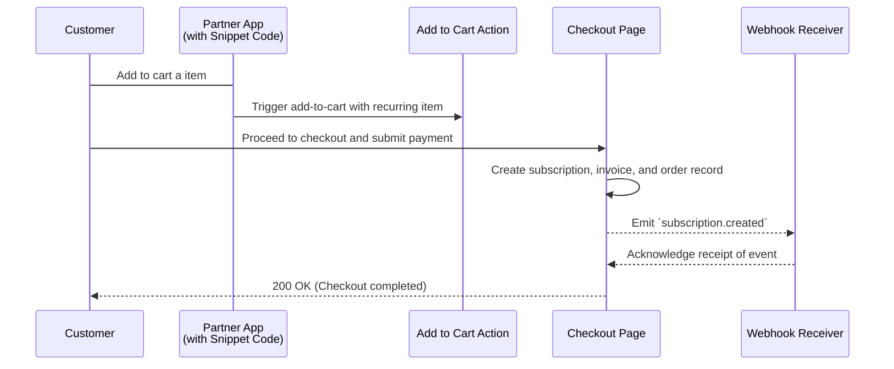
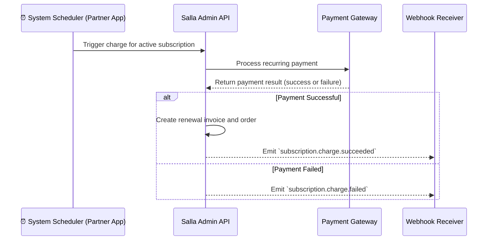

# Docs  Rate Limiting Merchant Api Salla Docs

## Table of Contents

- [docs/Rate-Limiting-Merchant-API-Salla-Docs](#docs-rate-limiting-merchant-api-salla-docs)
- [docs/Recurring-Payment-App-Overview-Salla-Merchants-APIs-Salla-Docs](#docs-recurring-payment-app-overview-salla-merchants-apis-salla-docs)
- [docs/Recurring-Payment-App-Usage-Salla-Merchants-APIs-Salla-Docs](#docs-recurring-payment-app-usage-salla-merchants-apis-salla-docs)
- [docs/Recurring-Payment-Apps-Changelog-Salla-Merchants-APIs-Salla-Docs](#docs-recurring-payment-apps-changelog-salla-merchants-apis-salla-docs)
- [docs/Recurring-Payment-Apps-Troubleshooting-Salla-Merchants-APIs-Salla-Docs](#docs-recurring-payment-apps-troubleshooting-salla-merchants-apis-salla-docs)
- [docs/Requirements-&-Review](#docs-requirements-&-review)
- [docs/Responses-App-Functions-Documentation-Salla-Docs](#docs-responses-app-functions-documentation-salla-docs)
- [docs/Responses-Merchant-API-Salla-Docs](#docs-responses-merchant-api-salla-docs)
- [docs/Root](#docs-root)
- [docs/Salla-Partners'-documentations](#docs-salla-partners'-documentations)

---

## docs/Rate-Limiting-Merchant-API-Salla-Docs

# Rate Limiting

To ensure Salla remains stable and fair for everyone, all APIs are rate-limited. Developers should adopt **industry-standard practices** such as limiting calls, caching results, and retrying requests responsibly. 🌐

---

## 📊 **Rate Limit Plans**

Rate limits vary based on the store subscribed plan. Use the table below for details:

<Container>
| **Plan**    | **Max Requests** | **Timeout Duration** | **Leak Limit**           |
| ----------- | ---------------- | -------------------- | ------------------------ |
| **Plus**    | 120              | 1 minute             | 1 request per second     |
| **Pro**     | 360              | 1 minute             | 1 request per second     |
| **Special** | 720              | 1 minute             | 1 request per second     |
</Container>

<details>
<summary>💡 <strong>How It Works</strong> (Click to expand)</summary>

- Each plan provides a maximum number of API calls (**Max Requests**) per **1 minute**.
- If you exceed this, you can still send **1 request per second** until the minute resets.  
- The **leaky bucket algorithm** is used to enforce this behavior.

</details>

---

## 🧩 **Rate Limit Headers**

Each request includes headers to help you track and manage your usage.  

<Tabs>
<TabItem value="X-RateLimit-Limit" label="X-RateLimit-Limit">

This header indicates the total number of calls allowed per minute for your plan (e.g., 60, 120, or 180).

</TabItem>
<TabItem value="X-RateLimit-Remaining" label="X-RateLimit-Remaining">

Displays the remaining number of calls in the current rate limit window.

</TabItem>
<TabItem value="Retry-After" label="Retry-After">

Specifies the number of seconds until the API becomes available after exceeding the rate limit.

</TabItem>
<TabItem value="X-RateLimit-Reset" label="X-RateLimit-Reset">

Indicates the time (in UTC epoch seconds) when the current rate limit window resets.

</TabItem>
</Tabs>

---

## 🛡️ **Special Limits for Customer Endpoints**

Each store’s rate limit depends on its plan. Additionally:
- **Customers' Endpoint:** Limited to **500 requests per 10 minutes**.

---

## ⚠️ **Important Notes**  
:::caution
- Exceeding rate limits or exhibiting unusual behavior may result in **temporary access restrictions**.  
- Plan your API calls responsibly to avoid disruptions. ✅
:::

---

## ❓ **Need Help?**

We’re here for you! Reach out using any of the following methods:  
- ✉️ [Email Support](mailto:support@salla.dev)  
- 💻 [Developer Community](https://t.me/salladev)  
- 🤖 [Support Bot](https://t.me/SallaSupportBot)

Let’s keep your API experience smooth and uninterrupted! 🚀

---

## docs/Recurring-Payment-App-Overview-Salla-Merchants-APIs-Salla-Docs

# Overview

The **Recurring Payments** feature enables merchants and third-party apps to offer **subscription billing** to customers.  

This feature provides comprehensive subscription lifecycle management through APIs, allowing you to **create, charge, and manage recurring payments seamlessly**. It supports full lifecycle operations, including **subscription creation, invoicing, payment processing, renewal, and cancellation**, using a consistent RESTful architecture.

This API is designed for developers integrating recurring billing logic into merchant or third-party apps, ensuring **predictable behavior**, **event-driven updates**, and **compatibility** with existing checkout and payment workflows.

---

## Before You Start

To use the **Recurring Payments API**, you must have a [Salla Partner Account](https://portal.salla.partners/) and an App registered in the [Salla Partner Portal](https://portal.salla.partners/).


- Your app credentials (**Client ID** and **Client Secret**) are required to authenticate API requests through [Salla OAuth 2.0](https://docs.salla.dev/421118m0).  
- Once your app is authorized, you can obtain access tokens and begin making authenticated requests to the Recurring Payments endpoints.
  


:::caution[Important]
Ensure your App in the Salla Partner Portal has the appropriate [API scopes enabled](https://docs.salla.dev/439059m0#2--app-scope), specifically:

- Recurring Payments: `subscriptions.read_write`

**Contact Salla Support via [email](mailto:partners@salla.sa) or the [Telegram group](https://t.me/salladev) to enable these scopes for your App.**

For full setup instructions, refer to the [Partner Account & App Registration Guide](https://docs.salla.dev/439059m0).
:::

---

## Enabling Recurring Payments

By default, Recurring Payments are **disabled** for all stores. Only merchants or authorized third-party apps can enable this feature.

### How to Enable Recurring Payments

Recurring Payments can be enabled programmatically using the [Update Setting Slug](https://docs.salla.dev/6965780e0) endpoint in the **Merchant API**.  To activate the feature, update the setting slug `enable_recurring_payment` to `true` for the target store using a **request call** as below:
   
   

<Tabs>
  <Tab title="Request">
```bash
 curl --location --request PUT 'https://api.salla.dev/admin/v2/settings/fields/enable_recurring_payment' \
--header 'Authorization: Bearer <token>' \
--header 'Content-Type: application/json' \
--data-raw '{
    "value": true
}'
```

  </Tab>
  <Tab title="Response">


For this, the **reponse** will be:

```
{
    "status": 201,
    "success": true,
    "data": {
        "message": "The record has been updated successfully",
        "code": 201
    }
}
```
  </Tab>
</Tabs>

    

<CardGroup cols={2}>
  <Card>
      
:::info[Further Details]
Refer to the following resources for full implementation details:
🔗 [Update Setting Slug](https://docs.salla.dev/6965780e0): Update individual settings.  
:::
  </Card>
  <Card>


:::note[Note]
Once enabled, the App can add subscription products to the cart and start processing recurring payments through the Recurring Payments API.
:::
  </Card>
</CardGroup>


    


    
---

## Process Flow

The following diagrams illustrate the **end-to-end flow** of the Recurring Payments process, beginning from the checkout page where the merchant’s customer submits payment.  
    
They show how the system validates the recurring configuration, processes the payment through the gateway, and emits webhook events to reflect successful or failed charge attempts within the subscription lifecycle.

---

### Subscription Creation Flow

This diagram illustrates how **Salla** initiates recurring payments and emits the `subscription.created` webhook, which returns the `subscription_id`.

:::warning[Important]
Developers must store this `subscription_id` to use it for upcoming renewal operations.
:::



---

### Recurring Charge Attempt

This diagram illustrates how **Salla** processes recurring charge attempts for existing subscriptions, emitting either the `subscription.charge.succeeded` or `subscription.charge.failed` webhook based on the payment outcome.

:::info[]
Developers should handle these events to update subscription status and billing records accordingly.
:::



---

## General Considerations 

- Recurring payments can be automated by **implementing a System Scheduler on the partner’s side**. This scheduler is responsible for periodically triggering renewal requests for active subscriptions based on their billing cycles.  
- If a **coupon code** or **store-wide discount** is applied at checkout, the subscription price is set to the discounted amount.  
- All future recurring payments for that subscription will continue at the discounted rate unless the subscription is expired or terminated. 


---

---

## docs/Recurring-Payment-App-Usage-Salla-Merchants-APIs-Salla-Docs

# Usage

This section provides a practical overview of how to implement and use **Recurring Payments** within your integration. It explains how to embed the required **App Snippet** to enable recurring billing functionality on the storefront or creating subscription orders via **[Create Order](https://docs.salla.dev/5394145e0) API**

---

## 1- Storefront Implementation

### App Snippet Requirement 

Using Recurring Payments on storefront requires an [**App Snippet**](https://salla.dev/blog/a-guide-to-app-snippet/) to inject the client‑side logic that adds subscription items via the **Salla Twilight SDK**. Your snippet should:

- Render the subscription UI (plan selector, interval, etc.).
- Use the **[Twilight SDK Add Item](https://docs.salla.dev/422629m0)**  method to add the product **with a `recurring` payload**.
- Enforce the **one‑item cart** rule when a subscription is present.
- Read plan/config values from **App/Store Settings** to build the payload.

The implementation leverages the Salla **[Twilight SDK](https://docs.salla.dev/422629m0)** to inject subscription metadata into the cart flow, transforming regular product purchases into recurring subscriptions with defined billing intervals and terms.

:::highlight gray

Here goes some screenshots of where you may find the App Snippet from the [Salla Partners Portal](https://portal.salla.partners)

<CardGroup cols={2}>
  <Card>

      


  </Card>
  <Card>


  </Card>
</CardGroup>
:::

### Implementation Guide


<Steps>
  <Step title="Step 1">

App Snippets provide the client-side logic necessary for recurring payments. The snippet intercepts the add-to-cart action and appends subscription metadata to transform the purchase into a recurring payment.
  </Step>
  <Step title="Step 2">
The developer must add/modify a **Subscribe** button in the product page, or any page, using the App Snippet.

```javascript
// Wait for Salla SDK to be fully loaded
salla.onReady(() => {

    // todo:: you need to check if the product id is converted by your app
    // todo:: can be do by return a list of products ids from your backend during the snippet initialization
    const supportedProductsIds = [12333655445];

    // Intercept add-to-cart action to append recurring payment data
    Salla.cart.event.onBeforeAddItem(item => {

        if(supportedProductsIds.includes(item.id)) {
            return;
        }

        // Configure recurring payment parameters
        item.set('recurring[app_id]', 987654321);  // Your App ID from Partner Portal
        item.set('recurring[slug]', 'pro-annual');
        item.set('recurring[interval_unit]', 'day');
        item.set('recurring[interval_count]', 30);
        // item.set('recurring[meta][notes]', 'Pro plan yearly subscription');
    });

    // Update button text to indicate subscription
    Salla.hooks.registerHook('salla-add-product-button', 'componentDidLoad', (component) => {
        if (component.host.getAttribute('type') === 'submit' && supportedProductsIds.includes(component.productId)) {
            component.btn.setText('Subscribe Now');
        }
    });
});
```
  </Step>
  <Step title="Step 3">

Deploy your App Snippet through the Salla Partner Portal and test the subscription flow on a development store before releasing to production.
  </Step>
</Steps>

## 2- Server-to-Server API Implementation
This approach does not require any modifications to the storefront, you may use the [Orders API](https://docs.salla.dev/5394145e0) to create an order with subscription items.

When creating subscription items through Orders API, ensure the followings:

1- `payment.status` should be set to `pending_payment`
2- `payment.method` should be set to `credit_card`
3- `payment.accepted_methods` should only contain `credit_card`
4- `payment.recurring` should be set to `true`

Set the `products.recurring` object as per your needs.

```json
{
    "customer": {
        "id": 1209983424,
        "name": "new name",
        "mobile": "+966566666666",
        "email": "mail@mail.com"
    },
    "receiver": {
        "name": "i am the one",
        "country_code": "SA",
        "phone": "966566666666",
        "email": "email@mail.com",
        "notify": false
    },
    "delivery_method": "shipping",
    "branch_id": 203948803,
    "courier_id": 1433878184,
    "ship_to": {
        "country": 1473353380,
        "city": 1939592358,
        "district": 674989864,
        "block": "Apt. 836",
        "street_number": "8230",
        "address": "24453 Rosalinda Well",
        "address_line": "West",
        "postal_code": "51434",
        "geo_coordinates": {
            "lat": 79.0225,
            "lng": 53.5041
        }
    },
    "payment": {
        "status": "pending_payment",
        "method": "credit_card",
        "accepted_methods": [
            "credit_card"
        ],
        "recurring": true
    },
    "products": [
        {
            "identifier_type": "id",
            "identifier": 892907448,
            "quantity": 1,
            "options": [
                {
                    "id": 1626535321,
                    "value": [
                        "96445177"
                    ]
                }
            ],
            "recurring":{
                "slug": "premium-subscription-plan",
                "interval_unit": "month",
                "interval_count": 12,
                "meta":{
                    "note": "Internal note"
                }
            }
        }
    ]
}
```


### Parameters Reference

### Required Parameters

The recurring payment object requires the following parameters to function correctly:

| Parameter | Type | Description |
|-----------|------|-------------|
| `app_id` | integer | Your unique application identifier from the Salla Partner Portal - Optional when using Orders API|
| `slug` | string | A unique identifier for the subscription plan (e.g., `basic-monthly`, `pro-annual`) |
| `interval_unit` | string | The unit of time for billing cycles. Accepted values: `day`, `week`, `month`, `year` |
| `interval_count` | integer | The number of interval units between billing cycles (e.g., 30 days, 1 month) |

### Optional Parameters

| Parameter | Type | Description |
|-----------|------|-------------|
| `meta` | object | Custom metadata object for storing additional information like plan details, customer notes, or tracking data |


### Interval Management 


- For a subscriber with an active subscription for a specific product, a new subscription for the same product cannot be initiated until the current subscription has expired or been terminated.


- The partner must not trigger multiple charges for an active subscription within the same billing interval. Each interval represents a single valid billing cycle.


- Each subscription item must define its own recurring object. Non-recurring items can coexist in the same cart.


## Cart Restrictions

Subscription items have special cart handling requirements:


- When a subscription item is added to the cart, all items must share the same subscription interval unit (e.g., month, year) and interval count (e.g., every 1 month, every 3 months). This restriction ensures that subscriptions with different billing intervals cannot be mixed in a single cart.


- Once created, subscription parameters (price, interval, plan details) cannot be modified. Changes require cancelling the existing subscription and creating a new one.


  
## Additional Resources

- [Salla Twilight SDK Documentation](https://docs.salla.dev/)
- [App Snippet Development Guide](https://salla.dev/blog/a-guide-to-app-snippet/)
- [Partner Portal Dashboard](https://partners.salla.sa/)

---

## docs/Recurring-Payment-Apps-Changelog-Salla-Merchants-APIs-Salla-Docs

# Change Log

# Changelog

All notable updates to the **Recurring Payments API** and its public documentation are recorded here.

This changelog follows [Keep a Changelog](https://keepachangelog.com/en/1.0.0/) and [Semantic Versioning](https://semver.org/).


> _Next planned release: `v1.1.0` — Nov 2025 (includes update subscription, create order as subscription from admin APIs)._

---

## [1.1.0] - 2025-11-30
This release includes new endpoint for updating subscription payment method, as well as adds support for creating subscription payments using the [Create Order](https://docs.salla.dev/5394145e0.md) Endpoint.

### Added

#### Core API Endpoints

| Endpoint | Method | Description |
|-----------|---------|-------------|
| `/subscriptions/{subscription_id}` | **PUT** | Update Subscription Payment Method |

- **Create Order Endpoint Enhancements**:
    - Introduced the `products.recurring` object to specify subscription products within an order.
    - Added a new boolean field `payment.recurring` to indicate if the payment is for a recurring subscription.

#### Webhook Events
| Event | Description |
|--------|-------------|
| `subscription.updated` | Triggered when a subscription is updated |


## [1.0.0] - 2025-10-22

🎉 **Initial Public Release**

This is the first official public release of the **Recurring Payments API**, enabling developers to automate subscription billing and recurring charges.

### Added

#### Core API Endpoints

| Endpoint | Method | Description |
|-----------|---------|-------------|
| `/subscriptions/charge` | **POST** | Manually trigger a recurring charge for a specific subscription. |
| `/subscriptions/{subscription_id}` | **DELETE** | Cancel an active subscription. |

#### Webhook Events

| Event | Description |
|--------|-------------|
| `subscription.created` | Triggered when a new subscription is created. |
| `subscription.charge.succeeded` | Triggered when a recurring charge is successfully processed. |
| `subscription.charge.failed` | Triggered when a recurring charge fails. |
| `subscription.cancelled` | Triggered when a subscription is cancelled. |

---

### Changed
- N/A — first release.

### Fixed
- N/A — first release.

---

## docs/Recurring-Payment-Apps-Troubleshooting-Salla-Merchants-APIs-Salla-Docs

# Troubleshooting

## Subscription Not Created

**Symptoms:**  Checkout completes successfully, but no subscription record appears in the dashboard or API.

**Possible Causes & Solutions:**

| Cause | Recommended Action |
|--------|--------------------|
| Missing or malformed `recurring` object | Ensure the recurring object follows the documented structure and contains valid fields. |
| Feature not enabled | Confirm Recurring Payments are enabled in store settings. |
| Gateway transaction failed | Review payment gateway logs for declined or incomplete transactions. |

### Other Common Issues


<CardGroup cols={2}>
  <Card title="Subscription not creating">
Verify the `app_id` matches your [Partner Portal](https://portal.salla.partners) application ID and all required parameters are present.
  </Card>
  <Card title="Button text not updating">
Check that the hook is targeting the correct component and product ID.
  </Card>
</CardGroup>


:::check[Developer Tip]
Use [webhook logs](https://salla.dev/blog/the-new-salla-apps-events-activity-log/) (`subscription.created`) to confirm whether a subscription event was generated for the checkout.
:::

---

## docs/Requirements-&-Review

# Requirements & Review

## Docs

- [Overview](https://docs.salla.dev/421885m0.md): Personalized experiences are provided by the Themes in the Salla Themes Marketplace for both online customers and retail owners. Before being approved for publication, every Theme is put through a rigorous vetting process that follows strict publishing criteria. By ensuring that Salla Themes are presented in a polished and unified manner, this meticulous procedure improves user experience. 
- [Main Requirements](https://docs.salla.dev/421886m0.md): Salla team will review the Theme to check the eligibility of the Theme to be published in the Salla Themes Market. There are three Main Requirements the Theme developer should comply with which are:
- [Review Process](https://docs.salla.dev/845943f0.md):

---

## docs/Responses-App-Functions-Documentation-Salla-Docs

# Responses

# 🤝 Understanding App Function Responses

Understanding how your App Function returns data is crucial, especially for **Synchronous Actions** where the response directly influences the merchant's operation. This guide details the structure, behavior, and utility tools for handling function responses.

---

## 1. The Core Contract: `Response` 💡

Every App Function is expected to return an object conforming to the `Response` contract. While the structure is required for all functions, its effect on the platform varies significantly based on the execution type.

| Field | Type | Required | Description |
| :--- | :--- | :--- | :--- |
| `success` | `boolean` | Yes | Indicates if your function logic completed successfully. |
| `data` | `object` | No | A payload containing data to be returned or applied to the Salla operation (used primarily for **Synchronous Actions**). |
| `error` | `string` | No | A human-readable error message. Required if `success` is `false` for **Synchronous Actions**. |
| `status` | `number` | No | (Optional) An HTTP status code (e.g., 200, 400). Set via the `Response` utility class. |
| `message` | `string` | No | (Optional) An informative message. Set via the `Response` utility class. |

<Info>
**Response Format**: You can return responses in two ways:
- **Plain Object**: Return a simple object with `success`, `data`, and `error` fields
- **Response Utility**: Use the `Response` utility class for more structured responses (recommended for Customer Events and some Merchant Events)
</Info>

---

## 2. Response Behavior by Execution Type 🔄

The platform handles the `Response` differently depending on whether your function is an **Asynchronous Event** or a **Synchronous Action**.

### 2.1 Responses for Synchronous Actions (Blocking)

For synchronous actions (e.g., `shipment.creating`), your response is **critical**. The merchant is blocked and waiting for your function's decision.

<Warning>
**Performance Critical**: Synchronous actions block the user. Your function must respond in **milliseconds** (< 500ms recommended). Keep logic simple and fast!
</Warning>

| Return Value | Platform Action | Example Use Case |
| :--- | :--- | :--- |
| `success: true` | **Proceeds**. The action completes, and any data in the `data` field is merged or applied to the resulting entity. | Validating an address and proceeding with shipment creation. |
| `success: false` | **Rejects**. The action is halted, and the `error` message is displayed to the merchant immediately. | Rejecting a promotion if a custom rule is violated. |

#### Example: Accepting a Synchronous Action

```typescript
export default async (context: Shipments): Promise<Shipment> => {
  const { payload, settings, merchant } = context;
  const { data: shipment } = payload;

  // Quick validation (must be fast!)
  if (shipment.ship_to.country !== 'السعودية') {
    return Shipment.error()
      .setMessage("Shipment creation rejected: The app only supports shipping within Saudi Arabia (SA).");
  }

  // Allow the action to proceed (required: set shipment number)
  return Shipment.success()
    .setShipmentNumber(shipment.id);
    .setStatus(ShipmentStatusEnum.IN_TRANSIT);
}
```

#### Example: Rejecting a Synchronous Action

This immediately stops the operation and tells the merchant why.

```typescript
export default async (context: CustomActionCreatingContext): Promise<Resp> => {
  const { payload, settings, merchant } = context;
  const order = payload.data;

  // Check if the order total is too low for a custom shipping rule
  if (order.amounts.total < 100) {
    return Resp.error()
      .setMessage("Minimum order value of 100 is required for this custom shipping method");
  }

  // If validation passes, proceed
  return  Resp.success().setData({
    validated: true,
    order_id: order.id
  });
}
```

#### Special Case: `shipment.creating` Event

The `shipment.creating` event requires the use of the specialized **`Shipment` utility class** to successfully modify or complete the shipment details (e.g., setting a tracking number, generating a label).

<Note>
**Shipment Utility**: For `shipment.creating` events:
- Context type: `Shipments`
- Return type: `Promise<Shipment>`
- Use the `Shipment` utility class (`Shipment.success()`, `Shipment.error()`) to modify shipment data
- Always call `.setShipmentNumber()` when returning success
- Refer to the Shipment Events documentation for detailed examples.
</Note>

---

### 2.2 Responses for Asynchronous Events (Non-Blocking)

For asynchronous events (e.g., `order.created`, `Product Viewed`), your response is **informational only**. The original action has already completed, and the user is not waiting.

<Info>
**Return Value Ignored**: For asynchronous events, your return value doesn't affect the original action. The action completes immediately, and your function executes in the background.
</Info>

| Return Value | Platform Action | Example Use Case |
| :--- | :--- | :--- |
| `success: true` | **Logged**. The response is logged for debugging purposes, but doesn't affect the operation. | Sending a notification after an order is created. |
| `success: false` | **Logged**. The error is logged, but the original action remains successful. | Failed to sync with external CRM, but order creation succeeded. |

#### Example: Asynchronous Merchant Event

```typescript
export default async (context: OrderCreatedContext): Promise<Resp> => {
  const { payload, settings, merchant } = context;
  const order = payload.data;

  try {
    // Send notification to external system (non-blocking)
    const response = await fetch(settings.webhookUrl, {
      method: 'POST',
      headers: {
        'Content-Type': 'application/json',
        'Authorization': `Bearer ${settings.apiKey}`
      },
      body: JSON.stringify({
        event: payload.event,
        merchant_id: merchant.id,
        order_id: order.id,
        total: order.amounts.total,
        timestamp: new Date().toISOString()
      })
    });

    if (!response.ok) {
      // Log error, but don't fail the operation
      console.error(`Webhook failed: ${response.statusText}`);
      return Resp.error()
      .setMessage(response.statusText || 'Unknown error')
      .setStatus(500)
      .setData({ error_type: response.text() });
    }

    // Success response (for logging/debugging)
    return  Resp.success().setData({
      order_id: order.id,
      webhook_status: response.status,
      sent_at: new Date().toISOString()
    });
  } catch (error) {
    // Handle errors gracefully
    console.error('Error sending webhook:', error);
    return Resp.error()
      .setMessage(error.message || 'Unknown error')
      .setStatus(500)
      .setData({ error_type: error.name });
  }
}
```

#### Example: Asynchronous Customer Event

```typescript
export default async (context: ProductViewedEvent): Promise<Resp> => {
  const { payload, settings, merchant } = context;
  const product = payload.data;

  try {
    // Track product view in analytics (non-blocking)
    await fetch(settings.analyticsUrl, {
      method: 'POST',
      headers: {
        'Content-Type': 'application/json',
        'Authorization': `Bearer ${settings.analyticsKey}`
      },
      body: JSON.stringify({
        event: 'product_viewed',
        product_id: product.product_id,
        product_name: product.name,
        user_id: product.userId,
        timestamp: new Date().toISOString()
      })
    });

    // Success response (for logging/debugging)
    return  Resp.success().setData({
      tracked: true,
        product_id: product.product_id
    });
  } catch (error) {
    // Analytics failures shouldn't break the user experience
    console.error('Analytics tracking failed:', error);
    return Resp.error()
      .setMessage(error.message || 'Unknown error')
      .setStatus(500)
      .setData({ error_type: error.name });
  }
}
```

---

## 3. The Response Utility Class 🛠️

The `Response` utility class provides a structured way to create responses. It's particularly useful for Customer Events and some Merchant Events that require more detailed response handling.

### 3.1 Using Resp.success()

Create a successful response with data, optional status code, and optional message.

```typescript
export default async (context: OrderStatusUpdatedContext): Promise<Resp> => {
  const { payload, settings, merchant } = context;
  const order = payload.data;

  // Process the order status change
  const actionTaken = await processOrderStatus(order);

  const data = {
    order_id: order.id,
    status: order.status.slug,
    action_taken: actionTaken,
    processed_at: new Date().toISOString()
  };

  /*
   * The .setData() should be called mandatorily. (Pass {} as default)
   * The .setStatus() is optionally called. The default status is 200.
   * The .setMessage() is optional.
   * In case there is any error invoke Resp.error().
   */
  return Resp.success()
    .setData(data)
    .setStatus(200)
    .setMessage('Order status processed successfully');
}
```

### 3.2 Using Resp.error()

Create an error response for handling failures.

```typescript
export default async (context: CommunicationEvent): Promise<Resp> => {
  const { payload, settings, merchant } = context;

  try {
    // Attempt to send SMS
    const response = await fetch(`${settings.smsApiUrl}/send`, {
      method: 'POST',
      headers: {
        'Content-Type': 'application/json',
        'Authorization': `Bearer ${settings.smsApiKey}`
      },
      body: JSON.stringify({
        to: payload.data.mobile,
        message: payload.data.message
      })
    });

    if (!response.ok) {
      // Return error response
      return Resp.error()
        .setMessage('Failed to send SMS')
        .setStatus(response.status)
        .setData({
          error_code: response.status,
          error_message: await response.text()
        });
    }

    const result = await response.json();

    return Resp.success()
      .setData({
        sms_id: result.id,
        status: result.status,
        to: payload.data.mobile
      })
      .setStatus(200);
  } catch (error) {
    return Resp.error()
      .setMessage(error.message || 'Unknown error occurred')
      .setStatus(500)
      .setData({
        error_type: error.name,
        error_details: error.stack
      });
  }
}
```

### 3.3 Response Utility Methods

| Method | Description | Required | Default |
| :--- | :--- | :--- | :--- |
| `Resp.success()` | Create a successful response | Yes (for success) | - |
| `Resp.error()` | Create an error response | Yes (for errors) | - |
| `.setData(data)` | Set response data object | **Yes** (pass `{}` if no data) | `{}` |
| `.setStatus(code)` | Set HTTP status code | No | `200` |
| `.setMessage(msg)` | Set human-readable message | No | - |

### 3.4 When to Use Response Utility vs Plain Object

| Scenario | Recommended Approach | Reason |
| :--- | :--- | :--- |
| **Customer Events** | `Response` utility | Provides structured responses for tracking/analytics |
| **Synchronous Actions** | Plain object | Simpler, faster (performance critical) |
| **Merchant Events (Simple)** | Plain object | Straightforward, less overhead |
| **Merchant Events (Complex)** | `Response` utility | Better error handling and status codes |
| **Error Handling** | Either (Response utility recommended) | Response utility provides better error structure |

---

## 4. Error Handling Patterns 🚨

Proper error handling ensures your functions fail gracefully and provide useful debugging information.

### 4.1 Basic Error Handling

```typescript
export default async (context: OrderCreatedContext): Promise<Resp> => {
  const { payload, settings, merchant } = context;

  try {
    // Your logic here
    await processOrder(payload.data);

    return Resp.success()
      .setData({
        processed: true
      })
      .setStatus(200);
  } catch (error) {
    // Log error for debugging
    console.error('Error processing order:', error);
    // Handle errors gracefully
    return Resp.error()
      .setMessage(error.message || 'Unknown error occurred')
      .setStatus(500)
      .setData({
        error_type: error.name,
        error_details: error.stack
    });
  }
}
```

### 4.2 Validation Error Handling

```typescript
export default async (context: OrderCreatedContext): Promise<Resp> => {
  const { payload, settings, merchant } = context;
  const order = payload.data;

  // Validate required data
  if (!order.id) {
    return Resp.error()
      .setMessage('Order ID is missing')
      .setStatus(500)
      .setData({});
  }

  if (!settings.webhookUrl) {
    return Resp.error()
      .setMessage('Webhook URL not configured in app settings')
      .setStatus(500)
      .setData({});
  }

  // Validate order total
  if (order.amounts.total <= 0) {
    return Resp.error()
      .setMessage('Invalid order total')
      .setStatus(500)
      .setData({});
  }

  // Process if validation passes
  try {
    await sendWebhook(order, settings.webhookUrl);
    return Resp.success()
      .setData({
        order_id: order.id
      })
      .setStatus(200);
  } catch (error) {
    return Resp.error()
      .setMessage(`Failed to send webhook: ${error.message}`)
      .setStatus(500)
      .setData({
        error_type: error.name,
        error_details: error.stack
    });
  }
}
```

### 4.3 External API Error Handling

```typescript
export default async (context: OrderCreatedContext): Promise<Resp> => {
  const { payload, settings, merchant } = context;

  try {
    const response = await fetch(settings.webhookUrl, {
      method: 'POST',
      headers: {
        'Content-Type': 'application/json',
        'Authorization': `Bearer ${settings.apiKey}`
      },
      body: JSON.stringify(payload.data),
      // Add timeout for long-running requests
      signal: AbortSignal.timeout(10000) // 10 seconds
    });

    if (!response.ok) {
      return Resp.error()
        .setMessage(`External API error: ${response.status} - ${errorText}`)
        .setStatus(response.status)
        .setData({
          error_code: response.status,
          error_message: await response.text()
        });
    }

    const result = await response.json();
    return Resp.success()
      .setData({
        external_id: result.id,
        status: result.status
      })
      .setStatus(200);
  } catch (error) {
    if (error.name === 'AbortError') {
      return Resp.error()
        .setMessage(error.message || 'Unknown error occurred')
        .setStatus(500)
        .setData({
          error: 'Request timed out after 10 seconds'
      });
    }

    return Resp.error()
      .setMessage(error.message || 'Unknown error occurred')
      .setStatus(500)
      .setData({
        error: `Network error: ${error.message}`
    });
  }
}
```

### 4.4 Error Handling with Response Utility

```typescript
export default async (context: CustomerEvent): Promise<Resp> => {
  const { payload, settings, merchant } = context;

  try {
    // Validate settings
    if (!settings.apiKey) {
      return Resp.error()
        .setMessage('API key not configured')
        .setStatus(400)
        .setData({ missing_setting: 'apiKey' });
    }

    // Process the event
    const result = await processEvent(payload.data);

    return Resp.success()
      .setData(result)
      .setStatus(200)
      .setMessage('Event processed successfully');
  } catch (error) {
    // Handle different error types
    if (error instanceof ValidationError) {
      return Resp.error()
        .setMessage('Validation failed')
        .setStatus(400)
        .setData({ validation_errors: error.errors });
    }

    if (error instanceof NetworkError) {
      return Resp.error()
        .setMessage('Network error occurred')
        .setStatus(503)
        .setData({ retry_after: 60 });
    }

    // Generic error
    return Resp.error()
      .setMessage(error.message || 'Unknown error')
      .setStatus(500)
      .setData({ error_type: error.name });
  }
}
```

---

## 5. Best Practices ✅

### 5.1 Keep Responses Focused

Return only the data that's necessary for the operation or debugging.

```typescript
// ❌ Bad: Returning entire payload
return Resp.success()
    .setData({
        data: context.payload // Too large!
    })
    .setStatus(200)
    .setMessage('Event processed successfully');

// ✅ Good: Returning only relevant data
return Resp.success()
    .setData({
        order_id: context.payload.data.id,
        status: context.payload.data.status,
        processed_at: new Date().toISOString()
    })
    .setStatus(200)
    .setMessage('Event processed successfully');
```

### 5.2 Provide Meaningful Error Messages

Error messages should be clear, actionable, and user-friendly (especially for synchronous actions).

```typescript
// ❌ Bad: Generic error message
return Resp.error()
    .setMessage('Error occurred')
    .setStatus(500)
    .setData({});

// ✅ Good: Specific, actionable error message
return Resp.error()
    .setMessage('Minimum order value of 100 SAR is required for this shipping method. Current order total: 75 SAR.')
    .setStatus(400)
    .setData({});
```

### 5.3 Handle Async vs Sync Differently

Remember that synchronous actions block the user, while async events don't.

```typescript
// ✅ Synchronous Action: Keep it simple and fast
export default async (context: Shipments): Promise<Shipment> => {
  const { payload, settings, merchant } = context;
  const { data: shipment } = payload;
  // Quick validation only - no external API calls!
  if (!isValidAddress(shipment.ship_to)) {
    return Shipment.error()
      .setMessage('Invalid shipping address');
  }
  return Shipment.success()
    .setShipmentNumber(shipment.id);
    .setStatus(ShipmentStatusEnum.IN_TRANSIT);
}

// ✅ Asynchronous Event: Can do more complex operations
export default async (context: OrderCreatedContext): Promise<Resp> => {
  const { payload, settings, merchant } = context;
  // External API calls are OK here
  await sendNotification(payload.data);
  await syncWithCRM(payload.data);
  await updateAnalytics(payload.data);
  return Resp.success()
    .setData({})
    .setStatus(200)
    .setMessage('Event processed successfully');
}
```

### 5.4 Always Return a Response

Every function must return a response object, even if the operation fails.

```typescript
// ❌ Bad: Function might not return anything
export default async (context: OrderCreatedContext): Promise<Resp> => {
  const { payload, settings, merchant } = context;
  if (someCondition) {
    await doSomething();
    // Missing return statement!
  }
}

// ✅ Good: Always return a response
export default async (context: OrderCreatedContext): Promise<Resp> => {
  const { payload, settings, merchant } = context;
  if (someCondition) {
    await doSomething();
    return Resp.success()
      .setData({})
      .setStatus(200)
      .setMessage('Event processed successfully');
  }
  return Resp.success()
    .setData({})
    .setStatus(200)
    .setMessage('Success');
}
```

### 5.5 Log for Debugging, Not for Response

Use `console.log()` for debugging information, not for returning data to the platform.

```typescript
// ✅ Good: Log for debugging
export default async (context: OrderCreatedContext): Promise<Resp> => {
  const { payload, settings, merchant } = context;
  const order = payload.data;
  console.log('Processing order:', order.id);
  console.log('Order total:', order.amounts.total);

  // Return structured response
  return Resp.success()
    .setData({
      order_id: order.id,
      processed: true
    })
    .setStatus(200)
    .setMessage('Event processed successfully');
}

// ❌ Bad: Don't rely on logs for response data
export default async (context: OrderCreatedContext): Promise<Resp> => {
  const { payload, settings, merchant } = context;
  console.log('Order data:', payload.data); // Not returned to platform!
  // Missing return statement
}
```

### 5.6 Validate Before Processing

Always validate required data and settings before processing.

```typescript
export default async (context: OrderCreatedContext): Promise<Resp> => {
  const { payload, settings, merchant } = context;

  // Validate payload
  if (!payload.data?.id) {
    return Resp.error()
      .setMessage('Order ID is missing from payload')
      .setStatus(400)
      .setData({});
  }

  // Validate settings
  if (!settings.webhookUrl) {
    return Resp.error()
      .setMessage('Webhook URL not configured. Please configure it in app settings.')
      .setStatus(400)
      .setData({});
  }

  // Process if validation passes
  try {
    await sendWebhook(payload.data, settings.webhookUrl);
    return Resp.success()
      .setData({})
      .setStatus(200)
      .setMessage('Event processed successfully');
  } catch (error) {
    return Resp.error()
      .setMessage(`Webhook failed: ${error.message}`)
      .setStatus(400)
      .setData({});
  }
}
```

---

## 6. Common Patterns and Examples 📚

### 6.1 Webhook Notification Pattern

```typescript
export default async (context: OrderCreatedContext): Promise<Resp> => {
  const { payload, settings, merchant } = context;
  const order = payload.data;

  try {
    const response = await fetch(settings.webhookUrl, {
      method: 'POST',
      headers: {
        'Content-Type': 'application/json',
        'Authorization': `Bearer ${settings.apiKey}`
      },
      body: JSON.stringify({
        event: payload.event,
        merchant_id: merchant.id,
        order_id: order.id,
        reference_id: order.reference_id,
        total: order.amounts.total,
        currency: order.currency,
        customer_email: order.customer.email,
        timestamp: new Date().toISOString()
      })
    });

    if (!response.ok) {
      return Resp.error()
        .setMessage(`Webhook failed: ${response.status} ${response.statusText}`)
        .setStatus(500)
        .setData({});
    }

    return Resp.success()
      .setData({
        order_id: order.id,
        webhook_status: response.status
      })
      .setStatus(200)
      .setMessage('Event processed successfully');
  } catch (error) {
    return Resp.error()
      .setMessage(error.message || 'Unknown error occurred')
      .setStatus(500)
      .setData({
        error_type: error.name,
        error_details: error.stack
    });
  }
}
```

### 6.2 Analytics Tracking Pattern

```typescript
export default async (context: ProductViewedEvent): Promise<Resp> => {
  const { payload, settings, merchant } = context;
  const product = payload.data;

  const analyticsData = {
    event: 'product_viewed',
    product_id: product.product_id,
    product_name: product.name,
    product_price: product.price,
    user_id: product.userId,
    timestamp: new Date().toISOString()
  };

  try {
    await fetch(settings.analyticsUrl, {
      method: 'POST',
      headers: {
        'Content-Type': 'application/json',
        'Authorization': `Bearer ${settings.analyticsKey}`
      },
      body: JSON.stringify(analyticsData)
    });

    return Resp.success()
      .setData({
        tracked: true,
        product_id: product.product_id
      })
      .setStatus(200);
  } catch (error) {
    // Analytics failures shouldn't break user experience
    console.error('Analytics tracking failed:', error);
    return Resp.error()
      .setMessage('Analytics tracking failed')
      .setStatus(500)
      .setData({ error: error.message });
  }
}
```

### 6.3 Data Validation Pattern

```typescript
export default async (context: Shipments): Promise<Shipment> => {
  const { payload, settings, merchant } = context;
  const { data: shipment } = payload;

  // Validate shipping address
  if (!shipment.ship_to) {
    return Shipment.error()
      .setMessage('Shipping address is required');
  }

  // Validate country
  if (shipment.ship_to.country !== 'السعودية') {
    return Shipment.error()
      .setMessage('This shipping method only supports deliveries within Saudi Arabia');
  }

  // Validate order total (if applicable)
  if (shipment.total?.amount < settings.minimumOrderValue) {
    return Shipment.error()
      .setMessage(`Minimum order value of ${settings.minimumOrderValue} SAR is required`);
  }

  // All validations passed (required: set shipment number)
  return Shipment.success()
    .setShipmentNumber(shipment.id);
    .setStatus(ShipmentStatusEnum.IN_TRANSIT);
}
```

### 6.4 External API Integration Pattern

```typescript
export default async (context: OrderCreatedContext): Promise<Resp> => {
  const { payload, settings, merchant } = context;
  const order = payload.data;

  try {
    // Call external API with timeout
    const controller = new AbortController();
    const timeout = setTimeout(() => controller.abort(), 10000); // 10s timeout

    const response = await fetch(settings.externalApiUrl, {
      method: 'POST',
      headers: {
        'Content-Type': 'application/json',
        'Authorization': `Bearer ${settings.externalApiKey}`
      },
      body: JSON.stringify({
        order_id: order.id,
        total: order.amounts.total,
        items: order.items
      }),
      signal: controller.signal
    });

    clearTimeout(timeout);

    if (!response.ok) {
      const errorData = await response.json().catch(() => ({}));
      return Resp.error()
        .setMessage(`External API error: ${response.status} - ${errorData.message || response.statusText}`)
        .setStatus(500)
        .setData({});
    }

    const result = await response.json();

    return Resp.success()
      .setData({
        order_id: order.id,
        external_id: result.id,
        sync_status: 'success'
      })
      .setStatus(200);
  } catch (error) {
    if (error.name === 'AbortError') {
      return Resp.error()
        .setMessage('Request timed out. Please try again.')
        .setStatus(500)
        .setData({});
    }

    return Resp.error()
        .setMessage(`Integration error: ${error.message}`)
        .setStatus(500)
        .setData({});
  }
}
```

---

## 7. Quick Reference 🎯

### 7.1 Response Format Comparison

| Aspect | Plain Object | Response Utility |
| :--- | :--- | :--- |
| **Syntax** | Simple object literal | Method chaining |
| **Use Case** | Synchronous actions, simple events | Customer events, complex error handling |
| **Performance** | Faster (less overhead) | Slightly more overhead |
| **Error Handling** | Basic | Advanced (status codes, messages) |
| **Type Safety** | Good | Excellent |

### 7.2 Response Fields Quick Reference

| Field | When to Use | Example |
| :--- | :--- | :--- |
| `success: true` | Operation completed successfully | `{ success: true, data: {...} }` |
| `success: false` | Operation failed | `{ success: false, error: "..." }` |
| `data` | Return relevant data | `{ success: true, data: { order_id: 123 } }` |
| `error` | Provide error message | `{ success: false, error: "Validation failed" }` |
| `status` | Set HTTP status code (Response utility) | `Resp.success().setStatus(201)` |

### 7.3 Execution Type Quick Reference

| Type | Response Impact | Performance | Example |
| :--- | :--- | :--- | :--- |
| **Synchronous Action** | **Critical** - Affects operation | Must be < 500ms | `shipment.creating` |
| **Asynchronous Event** | **Informational** - Logged only | Can take up to 30s | `order.created`, `Product Viewed` |

---

## 8. Troubleshooting 🔍

### Issue: Response Not Affecting Operation

**Symptom**: Your function returns `success: false`, but the operation still completes.

**Solution**: Check if you're using an asynchronous event. Async events don't affect the original operation - they execute in the background after the action completes.

```typescript
// For async events, the return value is for logging only
export default async (context: OrderCreatedContext): Promise<Resp> => {
  const { payload, settings, merchant } = context;
  // This won't stop order creation - it's already done!
  return Resp.error()
        .setMessage('This error is logged but doesn\'t affect the order')
        .setStatus(500)
        .setData({});
}
```

### Issue: Synchronous Action Too Slow

**Symptom**: Merchant experiences delays when performing actions.

**Solution**: Remove slow operations (external API calls, complex calculations) from synchronous actions. Keep them simple and fast.

```typescript

// ❌ Bad: Slow external API call in synchronous action
export default async (context: Shipments): Promise<Shipment> => {
  const { payload, settings, merchant } = context;
  await fetch('https://slow-api.com/validate'); // Too slow!
  return Shipment.success()
    .setShipmentNumber(payload.data.id);
    .setStatus(ShipmentStatusEnum.IN_TRANSIT);
}

// ✅ Good: Quick validation only
export default async (context: Shipments): Promise<Shipment> => {
  const { payload, settings, merchant } = context;
  const { data: shipment } = payload;
  // Fast local validation
  if (!isValid(shipment)) {
    return Shipment.error()
      .setMessage('Validation failed');
  }
  return Shipment.success()
    .setShipmentNumber(shipment.id);
    .setStatus(ShipmentStatusEnum.IN_TRANSIT);
}
```

### Issue: Error Message Not Displayed

**Symptom**: Error message in response doesn't show to merchant.

**Solution**: For synchronous actions, ensure `error` field is a string and `success` is `false`. For async events, errors are logged but not displayed to users.

```typescript
// ✅ Correct format for synchronous actions
return Shipment.error()
    .setMessage(
      'Clear, user-friendly error message' // Must be a string
    );

// ❌ Wrong format
return Shipment.error()
    .setMessage(
      'Error' // Should be string, not object
    );
```

---

## Summary 📝

- **Synchronous Actions**: Response is critical - affects operation, must be fast (< 500ms)
- **Asynchronous Events**: Response is informational - logged only, doesn't affect operation
- **Plain Object**: Simple, fast, good for sync actions
- **Response Utility**: Structured, good for customer events and complex error handling
- **Error Handling**: Always provide clear, actionable error messages
- **Best Practices**: Keep responses focused, validate data, handle errors gracefully

---

## Next Steps 🚀

Now that you understand App responses:

- 📋 **[Testing App Functions](https://docs.salla.dev/1726816m0.md)** — Learn how to test your functions and verify responses
- 🚀 **[Get Started](https://docs.salla.dev/1726815m0.md)** — Create your first App Function
- 📚 **[Event Reference](https://docs.salla.dev/1726818m0.md)** — Explore all available events and their response requirements
- 🛠️ **[Salla APIs](https://docs.salla.dev/426392m0)** — Access Salla APIs from your functions

---

## docs/Responses-Merchant-API-Salla-Docs

# Responses

Salla have applied all the technical standards have been placed by the REST principles. So, developers can always receive, read, decode, or understand the errors in responses based on the following form:

| Color Code | Response | Status     | Meaning                                                                                                             |
| ---------- | -------- | ---------- | ------------------------------------------------------------------------------------------------------------------- |
| 🟩         | 200      | Success    | The request has succeeded.                                                                                          |
| 🟩         | 201      | Created    | API call has been accepted for processing. The sent resource has been successfully inserted/updated at our database |
| 🟩         | 202      | Accepted    | API call has been accepted for processing. This status code is used only when the sent resource has been successfully deleted from our database |
| 🟩         | 204      | No content | The server successfully processed the request, but is not returning any content                                     |
<br>

:::info
With a `2xx` success response, the response body will include a `status` field reflecting the HTTP status (2xx) and a `success` field set to `true` and , as shown in the following example:


```json
{
  "status": 200,
  "success": true,
  "data": {
    "message": null,
    "code": 200
  }
}
```

:::


Salla APIs may return the following error codes in response to any request encountering an error.:

| Color Code | Response | Slug                | Status                | Meaning                                                                                                                             |
| ---------- | -------- | ------------------- | --------------------- | ----------------------------------------------------------------------------------------------------------------------------------- |
| 🟧         | **400**      | `bad_request`         | Bad Request           | Invalid parameters, fields or filters                                                                                               |
| 🟧         | **401**      | `unauthorized`        | Unauthorized          | authorization error (invalid basic auth data or API key)                                                                            |
| 🟧         | **403**      | `forbidden`           | Forbidden             | The server understood the request, but is refusing it (blocked due to many errors in particular time) or the access is not allowed. |
| 🟧         | **404**      | `not_found`           | Not Found             | The specified resource/url-path could not be found                                                                                  |
| 🟧         | **405**      | `method_not_allowed`  | Method Not Allowed    | The method used is not allowed.                                                                                                     |
| 🟧         | **406**      | `not_acceptable`      | Not Acceptable        | The format used is not acceptable.                                                                                                  |
| 🟧         | **410**      | `gone`                | Gone                  | The resource requested is no longer available.                                                                                      |
| 🟧         | **422**      | `validation_failed`   | Unprocessible Entity  | used if the server cannot process the enitity, e.g. mandatory fields are missing in the payload.                                    |
| 🟧         | **429**      | `too_many_requests`   | Too Many Requests     | Rate limit exceeded.                                                                                                                |
| 🟥         | **500**      | `server_error`        | Internal Server Error | We might be updating our services, please wait a while before trying again.                                                         |
| 🟥         | **503**      | `service_unavailable` | Service Unavailable   | We were unable to handle the HTTP request due to a temporary overloading or maintenance of the server. Please try again later.      |


:::caution[Important]
In case of multiple errors resulting in a **4xx response**, the response will include a list of "`fields`" and an array of error messages as "`values`" for those fields, explaining the errors for each field. Here is an example for reference.


<Tabs>
  <Tab title="Single Error Message">
```json
{
    "status": 422,
    "success": false,
    "error": {
        "code": "error",
        "message": "alert.invalid_fields",
        "fields": {
            "first_name": [
                "الاسم الاول للعميل مطلوب"
            ]
        }
    }
}
```
  </Tab>
  <Tab title="Multiple Error Messages">
 ```json
{
    "status": 422,
    "success": false,
    "error": {
        "code": "error",
        "message": "alert.invalid_fields",
        "fields": {
            "first_name": [
                "الاسم الاول للعميل مطلوب"
            ],
            "last_name": [
                "الاسم الاخير للعميل مطلوبً"
            ],
            "country_code": [
                "حقل كود الدولة مطلوب"
            ],
            "mobile_code_country": [
                "حقل رمز الدولة للجوال مطلوب"
            ],
            "mobile": [
                "رقم الجوال مطلوب"
            ]
        }
    }
}
```
  </Tab>
</Tabs>


:::


#### 
---
### 401 Cases
This section outlines common scenarios where the API responds with a 401 Unauthorized status. These responses typically indicate issues with user accounts, tokens, or permissions. By understanding these cases, you can troubleshoot and handle errors effectively to ensure seamless integration with our API.

#### 1. Deleted User

If the user installed the app and this user account is deleted. The token associated with this user will got 401 response.

```json
{
    "status": 401,
    "success": false,
    "error": {
        "code": "Unauthorized",
        "message": "The User is not exists."
    }
}
```
#### 2. Inactive User

If the user installed the app and user account is inactive. The token associated with this user will got 401 response. 

```json
{
    "status": 401,
    "success": false,
    "error": {
        "code": "Unauthorized",
        "message": "عفوا لا يمكنك تسجيل الدخول, حسابك غير مفعل"
    }
}
```


#### 3. Using The Same Refresh Token More Than Once to Generate Token

If the `refresh_token` is used more than once, this will invalidate the token. The API response will be 401. Additionally, both the access token and the refresh token will be revoked. 


```json
{
    "error": "invalid_grant",
    "error_description": "The provided authorization grant (e.g., authorization code, resource owner credentials) or refresh token is invalid, expired, revoked, does not match the redirection URI used in the authorization request, or was issued to another client. The OAuth 2.0 Client ID from this request does not match the ID during the initial token issuance."
}
```

#### 4. Not allowed Scopes

If the user try to access the endpoint which scopes are not allowed, the API response with 401.
```json
{
  "status": 401,
  "success": false,
  "error": {
    "code": "Unauthorized",
    "message": "The access token should have access to one of those scopes: products.read_write"
  }
}
```


#### 5. Invalid Access token
This might happen due to expired access token, uninstalled app, or invalid access token value provided in the request
```json
{
    "status": 401,
    "success": false,
    "error": {
        "code": "Unauthorized",
        "message": "The access token is invalid"
    }
}
```

---

## docs/Root

# Merchant Partner APIs

---

## docs/Salla-Partners'-documentations

# Welcome 👋

Welcome to [Salla](https://salla.sa/) [Partners'](https://salla.partners/) documentation. Here, you will discover a comprehensive collection of guidelines for developing [Apps](https://docs.salla.dev/doc-421410?nav=01HNA8M216X4HFNGWM9TWSTCKQ) and [Themes](https://docs.salla.dev/doc-421877?nav=01HNFTD5Y5ESFQS3P9MJ0721VM) for [Salla Online Stores](https://salla.sa/). 
:::info[]
This resource is designed to support both developers and business owners who aim to integrate with the [Salla](https://salla.sa/) Platform.
:::

Whether you're starting a new project or improving your current e-commerce solution, this collection provides essential insights and instructions. Designed to simplify your integration with Salla, these guidelines cover everything from technical requirements to seamless execution, ensuring a smoother development process.


<!-- focus: false -->


[Salla](https://salla.sa/) empowers its e-commerce platform for developers while allowing merchants to establish, operate, and manage their online stores with no technical hassle. Moreover, it grants them the ability to enable (or disable) the connection with any logistics company and/or payment gateway with a click of a button.


:::tip[Note]
Visit the [Salla Partners Blog](https://salla.dev/blog/) to check out the latest updates on the [Salla developers community](https://t.me/salladev).

:::


## 📝 Salla Documentations

| Documentation                                                                    | Description                                                                                                                                                                                                                                                                                                                                                                                                                                                                                                                                                                                                                                                                                                                                                                                                                          |
| -------------------------------------------------------------------------------- | ------------------------------------------------------------------------------------------------------------------------------------------------------------------------------------------------------------------------------------------------------------------------------------------------------------------------------------------------------------------------------------------------------------------------------------------------------------------------------------------------------------------------------------------------------------------------------------------------------------------------------------------------------------------------------------------------------------------------------------------------------------------------------------------------------------------------------------ |
| [Salla Merchant API](https://docs.salla.dev/doc-426392)                                                 | Salla Merchant APIs are a suite of RESTful endpoints purpose-built for secure, fast, and easy access to Merchant data. Developers can build their Apps by consuming Salla's standard APIs, scale their Apps to encompass a mass base of over 60,000 online stores, and publish their innovations to one central hub, the Salla App Store.<TipInfo>Read about Salla APIs Docs [here](https://salladev.hashnode.dev/review-on-salla-merchants-apis )</TipInfo>|
| [Apps API](https://docs.salla.dev/doc-421412/?nav=01HNA8M216X4HFNGWM9TWSTCKQ)                           | The Apps API enables the use of functionalities within the Salla Partners Portal, such as [App Settings](https://salla.dev/blog/how-to-build-app-settings-form/) and [Subscriptions](https://salla.dev/blog/partners-portal-hidden-gem/), to customize and enhance your applications usage for [Salla Merchants](https://salla.sa). Additionally, discover the [App Events](https://docs.salla.dev/doc-421413/?nav=01HNA8M216X4HFNGWM9TWSTCKQ) that will be sent from the [Salla Partners Portal](https://salla.partners) concerning any activities related to your app.                                                                                                                                                                                                                                                                                    |
| [Salla Shipping and Fulfillment API](https://docs.salla.dev/doc-422988/?nav=01HNA8MH78MVX1S0DRXDHE3A1K) | Salla Shipping and Fulfillment API  enable you to manage and track Salla Store's **shipments and orders** seamlessly. With this API, you can integrate with a [Salla](https://salla.sa/) Store's shipping process to make shipping as well as order fulfillment more efficient and streamlined.                                                                                                                                                                                                                                                                                                                                                                                                                                                                                                                                      |
| [Salla CLI](https://docs.salla.dev/doc-429774/?nav=01HNA8QHCPJTCY5VSEZ616JCAK)                          | Salla CLI is a tool designed for developers to create Salla Apps and Themes. Once the App or Theme has been developed, it can go through the publication process to be featured in the Salla App Store. This process typically involves testing, quality assurance, and verification of the App or Theme to ensure that it meets the necessary [standards and guidelines](https://salla.dev/blog/standards-salla-apps-publications/). Once the App or Theme has been approved, it can be published in the [Salla App Store](https://apps.salla.sa/) and made available for installation in any of the Salla Merchant Stores. This gives the flexibility for merchants and other users who use the Salla Platform to be able to easily install and customize their store with a variety of apps or themes that can match their needs. |
| [Twilight Engine](https://docs.salla.dev/doc-422053/?nav=01HNFTD5Y5ESFQS3P9MJ0721VM)                    | Twilight enables developers to create a memorable experience for the [Salla Store](https://salla.sa/)'s look and feel for the benefit of merchants and their customers. Developers can create themes for merchant stores to suit the uniqueness of each store on the Salla Platform. With custom themes, developers will have a much easier time adapting the merchant's store to the store's growing needs as time goes on. This documentation covers several topics, from creating a complete theme for Salla's Store with easy steps to changing multiple items in the store with your own style.                                                                                                                                                                                                                                 |
| [Twilight SDK](https://docs.salla.dev/doc-422610/?nav=01HNFTDZPB31Y2E120R84YXKCX)                       | Twilight comes with a JavaScript SDK for the Salla storefront APIs. This is to provide the developers with helper methods, or REST API endpoints, that allow communication between the frontend and backend.                                                                                                                                                                                                                                                                                                                                                                                                                                                                                                                                                                                                                         |
| [Twilight Web Components](https://docs.salla.dev/doc-422688/?nav=01HNFTE06J4QC24T0D5BPRYKMD)            | Twilight comes with a ready-designed and styled set of web components for Salla stores. For example, ready components to display the [login form](https://docs.salla.dev/doc-422711/?nav=01HNFTE06J4QC24T0D5BPRYKMD), [product availability](https://docs.salla.dev/doc-422717/?nav=01HNFTE06J4QC24T0D5BPRYKMD) section, [search bar](doc-422730/?nav=01HNFTE06J4QC24T0D5BPRYKMD), [localization menu](https://docs.salla.dev/doc-422710/?nav=01HNFTE06J4QC24T0D5BPRYKMD), and many more                                                                                                                                                                                                                                                                                                                                                                                                                                                                                                                                                                                                          |


## ⚒️ Resources

Utilize the following materials to familiarize yourself with the Merchant APIs: a compilation of curated blogs, a list of frequently asked questions, and a community of developers that is always willing to offer assistance:

<CardGroup cols={2}>
  <Card title="Salla Partners Resources" href="https://portal.salla.partners/help/resources">

  </Card>
  <Card title="Salla Developer Blog" href="https://salla.dev/blog/">
    
  </Card>
  <Card title="Frequently Asked Questions" href="https://portal.salla.partners/help/faq">
    
  </Card>
  <Card title="Global Developer Community" href="https://t.me/salladev">
    
  </Card>
</CardGroup>


## 💡 Contact Support
Contact support either at [support@salla.dev](mailto:support@salla.dev) or the [Global Developers Community](https://t.me/salladev) on Telegram to get help from our team of in-house experts.

## 🔗 Service Status
Check current Salla service status from [Salla Status](https://status.salla.sa/).

---

