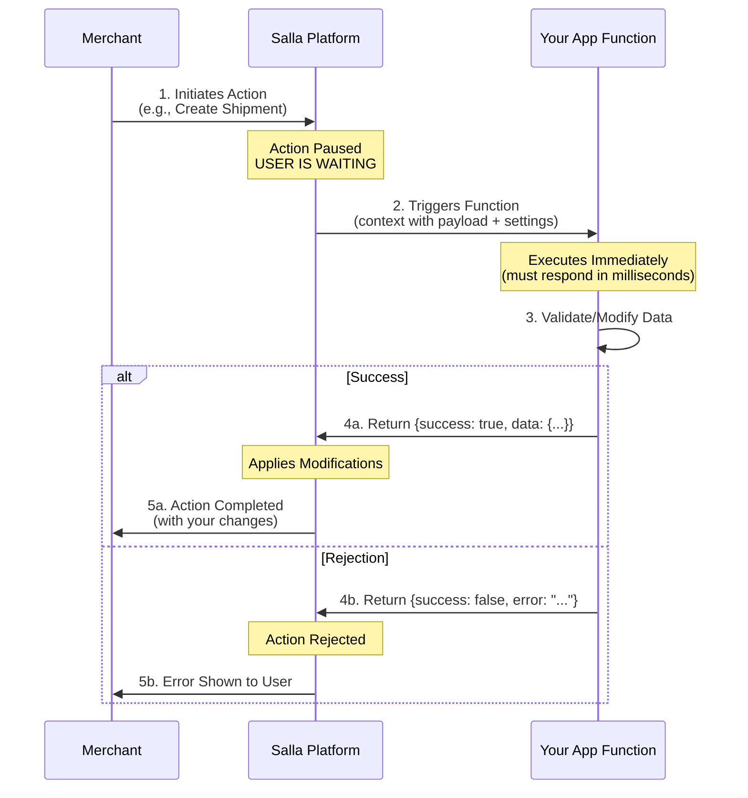

# Docs  Theme Architecture

## Table of Contents

- [docs/Theme-Architecture](#docs-theme-architecture)
- [docs/Twig-Template-Engine](#docs-twig-template-engine)
- [docs/Versioning-Merchant-API-Salla-Docs](#docs-versioning-merchant-api-salla-docs)
- [docs/Welcome-App-Functions-Documentation-Salla-Docs](#docs-welcome-app-functions-documentation-salla-docs)
- [docs/What-are-App-Functions-App-Functions-Documentation-Salla-Docs](#docs-what-are-app-functions-app-functions-documentation-salla-docs)
- [docs/إعداد-حساب-المحاسب](#docs-إعداد-حساب-المحاسب)
- [docs/تسجيل-دخول-المحاسب-لأول-مرة](#docs-تسجيل-دخول-المحاسب-لأول-مرة)
- [docs/سجل-العمليات](#docs-سجل-العمليات)
- [docs/سداد-الفاتورة-ومتابعة-حالتها](#docs-سداد-الفاتورة-ومتابعة-حالتها)
- [docs/عرض-الفواتير](#docs-عرض-الفواتير)
- [docs/مقدمة-النظام](#docs-مقدمة-النظام)

---

## docs/Theme-Architecture

# Theme Architecture

Salla theme manages the appearance and features of the merchant's store. As we saw previously, it's organized within a standard directory structure of files and folders.

In a nutshell, Salla theme consists of three building blocks; [Layouts](4.3-Layouts.md), [Pages](4.1-Pages/4.00.0-Pages-overview.md), and [Components](4.2-Components/4-2-00-Components-overview.md).

## 📙 What you'll learn
In this article, you will learn about:
- [Theme views files](#theme-views-files). 
- [Assets files](#assets-files)
- [Localization files](#localization-files).
- [Config files](#config-files).

<hr>

## Theme views files
The theme files fall into 3 types: [Layouts](https://docs.salla.dev/421943m0), [Pages](https://docs.salla.dev/422556m0), and [Components](https://docs.salla.dev/422580m0). These files are twig files (*.twig), and their task is to control theme appearance.


## Assets Files
Assets are files that can be called and consumed to support any file's needs, such as images, styling files, fonts, javascript, etc.
### Location
```shell
[root]
...
+---src
   +---assets
     |   +---dist
     |   +---fonts      
     |   +---images      
     |   +---js      
     |   +---styles
...
```

## Localization files.
Locale files work on the adaptation of meeting a particular language output.
### Location
```shell
[root]
...
+---src
   +---locales
     |------ar.json
     |------en.json
...
```

## Config files.
Config files, which use JSON format, store configuration data that merchants can customize.

### Location
```shell
[root]
...
|   package.json
|   tailwind.config.js
|   twilight.json
|   webpack.config.js
...
```

---

## docs/Twig-Template-Engine

# Twig Template Engine

## Docs

- [Basic syntax](https://docs.salla.dev/421928m0.md): [Twig](https://twig.symfony.com/doc/3.x/templates.html) is a "template engine" the template contains variables and functions which get replaced when the template is evaluated it also uses tags to manage the template logic. In other words, Twig helps buliding interactive interfaces with feasible connections to the underlying programming. It's meant to be used with a js class that sends the variables to be displayed on an HTML page, and the HTML just displays the data.
- [Twilight flavoured twig](https://docs.salla.dev/421929m0.md): Although Twig already provides a large list of helper functions and filters, Twilight also has added a selection of useful helpers and filters to make theming easier.

---

## docs/Versioning-Merchant-API-Salla-Docs

# Versioning

Changes in an API are inevitable as your understanding and experience with a system evolve. To effectively manage the impact of these changes, we have implemented URI versioning.

### URI Versioning
One approach to version a REST API is by incorporating the version number within the URI path. When the version is introduced in the URI space, the representations of resources are treated as immutable. Therefore, when modifications are necessary, a new URI space must be created.

For instance, consider an API that provides the following resources: users and privileges:

http://api.salla.dev/admin/v1/customers http://api.salla.dev/admin/v1/products


If a breaking change occurs in the users API, we would introduce a second version:

http://api.salla.dev/admin/v2/customers http://api.salla.dev/admin/v2/products


### When to Add a New Version?
APIs should only be versioned up when a breaking change occurs. Breaking changes may include:

- Alterations in the format of the response data for one or more calls
- Changes in the request or response type (e.g., changing an integer to a float)
- Removal of any component of the API.

### Changelog
The [changelog](https://docs.salla.dev/doc-421127) details every available version.

---

## docs/Welcome-App-Functions-Documentation-Salla-Docs

# Welcome 👋

## Overview

Welcome to the App Functions documentation for third-party developers. This comprehensive guide will help you build powerful, event-driven applications on Salla platform.

---

## What are App Functions?

App Functions allow you to embed custom logic directly into the lifecycle of merchant and customer activities on Salla. Write serverless functions that execute automatically when specific events occur in a store - no infrastructure to manage, automatic scaling, and seamless integration with Salla APIs.

---

## 📚 Documentation Structure

### Core Documentation

- 📖 **[What are App Functions?](https://docs.salla.dev/1726814m0.md)** — Introduction to App Functions, execution types, pricing, and benefits
- 🚀 **[Get Started](https://docs.salla.dev/1726815m0.md)** — Get started with your first App Function in minutes
- 📋 **[Supported Events](https://docs.salla.dev/1726818m0.md)** — Complete list of all available merchant and customer events
- 🧪 **[Testing App Functions](https://docs.salla.dev/1726816m0.md)** — Comprehensive guide to testing your App Functions

### Event Reference

The event directories contain detailed schemas and examples for all available events:

- 🏷️ **Brand Events** — Brand creation, updates, and deletion
- 📦 **Order Events** — Order lifecycle events
- 🛍️ **Product Events** — Product management events
- 👤 **Customer Events** — Customer account events
- 🚚 **Shipment Events** — Shipping and fulfillment events
- And many more...

## Quick Links

### Getting Started

1. **[Read the Overview](https://docs.salla.dev/1726817m0.md)** to understand App Functions
2. **[Follow the Quick Start](https://docs.salla.dev/1726815m0.md)** to create your first function
3. **[Explore Supported Events](https://docs.salla.dev/1726818m0.md)** to find events for your use case
4. **[Learn Testing](https://docs.salla.dev/1726816m0.md)** to validate your functions

### Key Concepts

#### Execution Types

**Synchronous Actions** — Execute immediately, **block the user**, must respond in milliseconds (e.g., `shipment.creating`)

**Asynchronous Events** — Process in the background after the operation completes (e.g., `order.created`)

**Customer Events** — Triggered by storefront interactions, always asynchronous

#### Context Object

Every function receives a context object:

```typescript
{
  merchant: {},              // Merchant info object
  payload: {                 // Event payload object
    event: string,           // Event name
    created_at: string,      // ISO timestamp
    data: { ... }            // Event-specific data
  },
  settings: { ... }          // Your app settings
}
```

#### Pricing

App Functions are currently in **beta** and **free of charge**. When generally available, pricing will be based on:

- Number of function calls
- Execution time
- Resource usage

## Common Use Cases

### Merchant Events

**Order Management** — Send confirmations, sync with fulfillment systems

**Inventory Sync** — Update external inventory systems when products change

**Shipping Integration** — Calculate rates, generate labels, track shipments

**Customer Sync** — Update CRM systems with customer data

**Analytics** — Track business metrics and generate reports

### Customer Events

**Behavior Tracking** — Monitor product views, searches, and interactions

**Cart Recovery** — Send reminders for abandoned carts

**Personalization** — Customize user experience based on behavior

**Marketing** — Trigger campaigns based on customer actions

**Analytics** — Track conversion funnels and user journeys

## Example Function

Here's a simple example that sends order data to a webhook:

```typescript
export default async (context: OrderCreatedContext): Promise<Resp> => {
  // Destructure context for clarity
  const { payload, settings, merchant } = context;
  const order = payload.data; 

  // 1. Prepare payload for the external webhook service
  const webhookData = {
    order_id: order.id,
    reference: order.reference_id,
    total: order.amounts.total,
    currency: order.currency,
    customer_email: order.customer.email,
    timestamp: new Date().toISOString()
  };

  // 2. Call the external webhook URL defined in the app settings
  const response = await fetch(settings.webhookUrl, {
    method: 'POST',
    headers: {
      'Content-Type': 'application/json',
      'Authorization': `Bearer ${settings.apiKey}` // API key stored in settings
    },
    body: JSON.stringify(webhookData)
  });

  if (!response.ok) {
    // Handle errors gracefully
    console.error('Error sending webhook:', error);
    return Resp.error()
      .setMessage(response.statusText || 'Unknown error')
      .setStatus(500)
      .setData({ error_type: response.text() });
  }

  // 4. Return success with relevant data
  const data = { 
    order_id: order.id,
    webhook_status: response.status
  };
  /*
    * The .setData() should be called mandatorily. (Pass {} as default)
    * The .setStatus() is optionallly called. The default status is 200.
    * The .setMessage() is optional. 
    * Incase there is any error invoke Resp.error().
  */
  const response = Resp.success().setData(data)

  return response;
}
```

## Best Practices

### Keep Functions Focused

Each function should have a single, clear purpose. Break complex logic into multiple functions.

### Use Settings for Configuration

Store API keys, URLs, and feature flags in app settings, not in code.

### Return Consistent Responses

Always return an object with a `success` boolean and relevant data or error information.

### Test Thoroughly

Test with various scenarios including success cases, failures, and edge cases.

### Validate Input Data

Check that required data exists before using it to prevent runtime errors.

### Keep Responses Small

Return only necessary data. Large responses can slow down execution and make debugging difficult.

## Available Events

### Merchant Events (50+ events)

**Orders** — created, updated, cancelled, refunded, etc.

**Products** — added, updated, deleted, quantity low, etc.

**Shipments** — creating (sync), created, cancelled, updated

**Customers** — created, updated, login, OTP request

**Brands** — created, updated, deleted

**Categories** — created, updated

**Store** — branch management, tax configuration

**Cart** — abandoned cart

**Coupons** — applied

**Invoices** — created

**Special Offers** — created, updated

**Reviews** — added

**Checkout** — started, step completed

### Customer E-commerce Events (25+ events)

**Product Interactions** — viewed, clicked, searched, shared, reviewed

**Cart & Checkout** — product added/removed, cart viewed/updated, checkout flow

**Promotions** — viewed, clicked, coupon entered/applied/denied/removed

**Wishlist** — product added/removed, added to cart

**User Account** — signed in/up/out, profile updated

## Resources

### Documentation

**Salla Developer Docs** — [**Salla Developer Docs**](https://docs.salla.dev)

**API Reference** — [Salla API Documentation](https://docs.salla.dev/426392m0)

**Webhooks Guide** — [Webhooks, Scopes & Events](https://docs.salla.dev/421119m0)

### Tools

**Partner Portal** — [portal.salla.partners](https://portal.salla.partners)

**Demo Stores** — [Testing with Demo Stores](https://salla.dev/blog/how-to-test-your-app-using-salla-demo-stores/)

**App Settings** — [Building App Settings](https://salla.dev/blog/how-to-build-app-settings-form/)

### Support

**Community** — Join our developer community

**Partner Portal** — Access support through the portal

**Documentation** — Comprehensive guides and references

## TypeScript Support

All events have TypeScript interfaces for better development experience:

```typescript
export default async (context: OrderCreatedContext): Promise<Resp> => {
  // TypeScript provides autocomplete and type checking
  const orderId = context.payload.data.id;
  const orderStatus = context.payload.data.status;
  
  return Resp.success().setData({});
}
```

---

## Next Steps

Ready to get started? Follow these steps:

1. **[Read The Overview](https://docs.salla.dev/1726817m0.md)** - Understand the fundamentals
2. **[Complete Quick Start](https://docs.salla.dev/1726815m0.md)** - Build your first function
3. **[Explore Events](https://docs.salla.dev/1726818m0.md)** - Find the right events for your app
4. **[Test Your Functions](https://docs.salla.dev/1726816m0.md)** - Ensure everything works correctly
5. **[Review Event Schemas](https://docs.salla.dev/1726816m0.md)** - Understand the data structures

Happy coding! 🚀

---

## docs/What-are-App-Functions-App-Functions-Documentation-Salla-Docs

# What are App Functions?

App Functions allow third-party developers to embed custom logic directly into the lifecycle of merchant and customer activities on Salla. This powerful feature enables you to build dynamic, event-driven applications that respond to real-time store events without managing your own infrastructure.

---

## What are App Functions?

App Functions are serverless functions that execute automatically when specific activities occur in a Salla store. These activities, called **Actions** and **Events**, trigger your custom code with relevant context data, allowing you to:

- 📦 Process orders and update external systems
- 🔄 Sync inventory across platforms
- 📧 Send custom notifications
- ✔️ Validate and transform data
- 🔌 Integrate with third-party services
- ⚙️ Implement custom business logic

---

## How It Works?

When a merchant or customer performs an action in a Salla store (e.g., creating an order, updating a product, or completing checkout), Salla triggers the corresponding App Function with a context object containing:

- **payload** — Event-specific data (order details, product information, customer data, etc.)
- **settings** — Your app's configuration values defined in the Salla Partner Portal and customized by each merchant
- **merchant** - An object contains the merchant info on which the Action/Event occures.


Your function processes this data and can:

- 🔐 Call Salla APIs (with automatic authentication)
- 🔌 Integrate with external services
- ✔️ Return responses that affect the store's behavior (for synchronous actions)
- 🔄 Process data asynchronously in the background (for events)

---

## Execution Types

App Functions support two execution types based on when they run and how they affect operations. Understanding these types is critical for building performant and reliable integrations.

---

### Synchronous Actions

Synchronous actions execute immediately within the same process. **The user is blocked and waiting** for your function to complete before they can proceed.

<Warning>
**Use Case**: Validation, modification, custom calculations (e.g., `shipment.creating`)

⚠️ **Critical**: User is waiting - must be extremely fast!
</Warning>



**Characteristics:**

- ⚠️ **Blocks the user** — Merchant cannot proceed until your function responds
- ⚡ **Must respond in milliseconds** — Target < 500ms for good user experience
- ⏱️ **Maximum timeout** — 5 seconds (but this creates poor UX)
- 🔄 Executed in real-time, synchronously
- ✔️ Can return data that affects the operation
- ✔️ Can modify or reject the action
- ⚠️ **Critical performance** — Slow responses create poor user experience

**Performance Requirements:**

| Metric | Target |
|--------|--------|
| **Recommended** | Under 500 milliseconds |
| **Acceptable** | Under 1 seconds |
| **Maximum** | 5 seconds (poor UX) |

**What to Avoid:**

- ❌ External API calls that may be slow
- ❌ Complex calculations or database queries
- ✔️ **Best practice** — Keep logic simple and fast

**Use Cases:**

- ✔️ Validating data before creation
- ✔️ Calculating custom shipping rates
- ✔️ Applying custom pricing logic
- ✔️ Real-time inventory checks

**Example Events:**

- `shipment.creating` — Runs before a shipment is created

**Example Response:**
```typescript
export default async (context: Shipments): Promise<Shipment> => {
  const { payload, settings, merchant } = context;
  // Synchronous actions must be extremely fast (< 500ms target)
  const { data: shipment } = payload;
  const shippingAddress = shipment.ship_to; 
  
  // Assume this is a simple, quick internal check or validation
  if (shippingAddress.country !== 'السعودية') {
    // 2. Reject the action: The merchant will see this error immediately
    return Shipment.error()
      .setMessage("Shipment creation rejected: The app only supports shipping within Saudi Arabia (SA).");
  }

  // 3. Allow the action to proceed (required: set shipment number)
  return Shipment.success()
    .setShipmentNumber(shipment.id);
}
```

---

### Asynchronous Events

Asynchronous events are queued and processed in the background without blocking other operations. They work the same way regardless of who triggers them (merchant or customer).

<Info>
**Use Case**: Notifications, logging, syncing, analytics, tracking (e.g., `order.created`, `Product Viewed`)

✔️ User never waits - instant response
</Info>

```mermaid
sequenceDiagram
    participant Actor as Actor<br/>(Merchant/Customer)
    participant S as Salla Platform
    participant Q as Event Queue
    participant F as Your App Function
    participant E as External Service

    Actor->>S: 1. Completes Action<br/>(e.g., Create Order, View Product)
    S->>Actor: 2. Action Completed<br/>(immediately, < 1s)
    S->>Q: 3. Queue Event
    Note over Q: Event Queued
    Q->>F: 4. Triggers Function<br/>(context with payload + settings)
    Note over F: Executes in Background<br/>(max 30s timeout)
    F->>E: 5. Send Notification/Sync/Track
    E->>F: 6. Response
    Note over F: Return value ignored<br/>(action already complete)
```

**Characteristics:**

- ✔️ Action completes **immediately** (user doesn't wait)
- ⚡ Event is **queued** for background processing (happens in < 1 second)
- 🔄 Function executes in background (max 30 seconds timeout)
- ℹ️ Your return value **doesn't affect** the original action
- 👥 Works for both **merchant actions** and **customer interactions**
- ✔️ User cycle is **never impacted** - queuing is instant
- ✔️ Ideal for non-critical operations

**Use Cases:**

**For Merchant Events:**

- 📧 Sending notifications
- 📊 Logging and analytics
- 🔄 Syncing data to external systems
- ⚙️ Triggering workflows

**For Customer Events:**

- 📊 Tracking customer behavior
- 🎯 Personalizing user experience
- 📧 Triggering marketing campaigns
- 📈 Analytics and reporting

### Example Events:

**Merchant Events:**

- `order.created` — Runs after an order is created
- `brand.updated` — Runs after a brand is updated
- `product.deleted` — Runs after a product is deleted

**Customer Events:**

- `Product Viewed` — Customer views a product
- `Product Added` — Customer adds product to cart
- `Order Completed` — Customer completes checkout

**Example Handler (Merchant Event):**
```javascript
export default async (context: ContextType): Promise<Resp> => {
  // Destructure context for clarity
  const { payload, settings, merchant } = context;

  // 1. Send notification to external system
  await fetch(settings.webhookUrl, {
    method: 'POST',
    headers: { 'Content-Type': 'application/json' },
    body: JSON.stringify({
      event: payload.event,
      merchant_id: merchant.id, // Accessing merchant ID from the merchant object
      data: payload.data
    })
  });

  // 2. Return a consistent response based on the webhook call status
  return Resp
    .success()
    .setData({})
    .setMessage(`Order ${payload.data.id} created`);
}
```

**Example Handler (Customer Event):**
```javascript
export default async (context): Promise<Resp> => {
  const { payload, settings, merchant } = context;

  // Track product view in analytics
  await fetch(`https://analytics.api.mock.com/track/analytics`, {
    method: "POST",
    body: JSON.stringify({
      event: "Product Viewed",
      userId: payload.data.userId,
      properties: {
        productId: payload.data.product_id,
        productName: payload.data.name,
        price: payload.data.price,
      },
    }),
  });

  return Resp.success()
    .setMessage(`Analytics synced`);
}

```

---

### Quick Comparison

| Feature | Synchronous Actions | Asynchronous Events |
|---------|---------------------|---------------------|
| **Execution** | Immediate, blocks user | Queued instantly (< 1s), executes in background |
| **Response Time** | Milliseconds (< 500ms recommended) | N/A (queued instantly) |
| **Max Timeout** | 5-10 seconds | 30 seconds (background execution) |
| **User Impact** | ⚠️ **User is blocked and waiting** | ✔️ User never waits - instant response |
| **Performance** | ⚠️ **Critical - must be extremely fast** | ✔️ Non-critical, can take time |
| **Response** | Can modify/reject action | Notification only |
| **Use Case** | Validation, modification (simple & fast) | Logging, sync, notifications, analytics, tracking |
| **Examples** | `shipment.creating` | `order.created`, `Product Viewed` |
| **Return Value** | Affects action | Ignored |

---

## Understanding Webhooks vs App Functions

It's important to understand the difference between Salla Webhooks and App Functions:

---

### Salla Webhooks (Traditional Approach)

Webhooks send HTTP POST requests to your server endpoint when events occur:

```javascript
// Your server receives this payload
{
  "event": "order.created",
  "merchant": 123456,
  "created_at": "2024-03-24T10:30:00Z",
  "data": {
    "id": 789,
    "status": "pending",
    // ... order details
  }
}
```

**Requirements:**

- 🖥️ You need to host and maintain a server
- 🔐 You need to handle authentication and security
- 📈 You need to manage scaling and infrastructure
- 🔄 You need to implement retry logic for failures

---

### App Functions (Modern Approach)

App Functions receive the webhook payload wrapped in a context object with additional features:

```javascript
// Your function receives this context
export default async (context): Promise<Resp> => {
  const { payload, settings, merchant } = context;

  // payload contains the webhook data
  console.log(payload.event);      // "order.created"
  console.log(payload.merchant);   // 123456
  console.log(payload.data);       // Order details

  // settings contains your app configuration
  console.log(settings.apiKey);    // Your API key
  console.log(settings.webhookUrl); // Your webhook URL
}
```

**Benefits:**

- ✔️ No server infrastructure needed (serverless)
- 🔐 Automatic authentication and security
- 📈 Auto-scaling handled by Salla
- 🔄 Built-in retry logic and error handling
- ⚙️ Access to app settings for each merchant

---

### Key Difference: The Context Object

**Webhook Payload** (what Salla sends):

```json
{
  "event": "brand.created",
  "merchant": 596493488,
  "created_at": "Sun Mar 24 2024 16:09:48 GMT+0300",
  "data": {
    "id": 190175156,
    "name": "Brand Name"
  }
}
```

**App Function Context** (what your function receives):

```javascript
{
  merchant: {
    id: '596493488'
  },
  payload: {
    event: "brand.created",
    merchant: "596493488",
    created_at: "Sun Mar 24 2024 16:09:48 GMT+0300",
    data: {
      id: 190175156,
      name: "Brand Name"
    }
  },
  settings: {
    // Your app settings from Partner Portal
    apiKey: "your-api-key",
    syncEnabled: true,
    webhookUrl: "https://api.example.com/webhook"
  }
}
```

<Tip>
**Migration Tip**: If you're migrating from webhooks to App Functions, your existing webhook payload structure is available in `context.payload`. Simply wrap your existing logic in a function handler and access the payload data.
</Tip>

---

## Context Object Structure

Every App Function receives a context object with the following structure:

```typescript
{
  merchant: {                // Merchant info object
    id: string
  },
  payload: {                 // Event payload object
    event: string,           // Event name (e.g., "order.created")
    created_at: string,      // ISO timestamp
    merchant: number,        // Merchant ID who installed the application on their store
                             // Get details via: https://docs.salla.dev/841814f0
    data: {                  // Event-specific data
      // Varies based on the event type
    }
  },
  settings: {                // Your app's settings
    // Custom settings defined in Partner Portal
    // Values configured by the merchant
  }
}
```

---

### Payload Object

The `payload` object contains the webhook event data that Salla sends. This is the same data structure you would receive if using traditional webhooks:

- 📋 **event**: The event name (e.g., `order.created`, `brand.updated`)
- 🏪 **merchant**: The merchant ID (number) who installed your app. [Get merchant details via API](https://docs.salla.dev/841814f0)
- 🕐 **created_at**: ISO timestamp when the event occurred
- 📦 **data**: Event-specific data that varies by event type

---

### Settings Object

The `settings` object contains your app's configuration values:

- ⚙️ Defined in the Salla Partner Portal when building your app
- 🎛️ Customized by each merchant when they install your app
- ✔️ Accessible in all your App Functions
- 🔑 Can include API keys, feature flags, preferences, etc.


### Merchant Object
The `merchant` object contains the info of the merchant on which the event took place, You can get more details about the merchant using [Get merchant details API](https://docs.salla.dev/841814f0).

**Example Settings:**
```javascript
{
  apiKey: "sk_live_abc123",
  webhookUrl: "https://api.example.com/webhook",
  syncEnabled: true,
  notificationEmail: "merchant@example.com",
  customField: "custom_value"
}
```

<Note>
**Settings Best Practice**: Store sensitive data like API keys in the settings object rather than hardcoding them in your function code. This allows each merchant to use their own credentials.
</Note>

---

## Pricing Model

App Functions are currently in **beta** and are **free of charge**.

When the feature becomes generally available, pricing will be based on:

- 📊 **Number of function calls**: Pay only for what you use
- ⏱️ **Execution time**: Longer-running functions may incur additional costs
- 💾 **Resource usage**: Memory and CPU consumption

<Note>
**Beta Period**: During the beta period, you can use App Functions without any charges. This is a great opportunity to build and test your integrations before general availability.
</Note>

---

## Benefits for Third-Party Developers

- 🖥️ **Serverless Infrastructure** — No servers to manage or maintain
- 📈 **Automatic Scaling** — Handles any volume of events automatically
- 🔐 **Built-in Authentication** — Seamless access to Salla APIs with automatic token injection
- 💻 **TypeScript Support** — Strong static typing for better development experience
- 🧪 **Real-time Testing** — Test your functions directly in the Partner Portal
- 👨‍💻 **Developer-Friendly** — Syntax highlighting, autocomplete, and error detection
- ⚡ **Event-Driven** — Respond to store activities in real-time
- 🔌 **Flexible Integration** — Connect with any external service or API

---

## Next Steps

- 🚀 **[Get Started](https://docs.salla.dev/1726815m0.md)** — Get started with your first App Function in minutes
- 📋 **[Supported Events](https://docs.salla.dev/1726818m0.md)** — Explore all available actions and events
- 🧪 **[Testing App Functions](https://docs.salla.dev/1726816m0.md)** — Learn how to test your App Functions

---

## Support and Resources

- 📖 **[Documentation](https://docs.salla.dev)** — Salla Developer Docs
- 📚 **[API Reference](https://docs.salla.dev/426392m0)** — Salla API Documentation
- 👤 **[Partner Portal](https://portal.salla.partners)** — Salla Partners Portal
- 👥 **Community** — Join our developer community for support and discussions

---

## docs/إعداد-حساب-المحاسب

# إعداد حساب المحاسب

<div dir="rtl">

يشرح هذا الدليل خطوات إنشاء حساب موظف كمحاسب على [منصة شركاء سلة](https://portal.salla.partners)، بدءا من قيام مدير الحساب بإنشاء حساب موظف وإكمال البيانات اللازمة حتى إرسال الدعوة إلى المحاسب.

## إضافة موظف جديد
يقوم مدير الحساب بتسجيل الدخول إلى حسابه على [منصة شركاء سلة](https://portal.salla.partners)، ينتقل إلى صفحة الموظفين من لوحة التحكم، ثم يقوم بالضغط على زر **إضافة موظف جديد**.

    


    
<div dir="rtl">
## إدخال بيانات المحاسب

عند إضافة موظف جديد، يجب إدخال البيانات التالية بدقة:
</div>
<table dir="rtl">
  <tr>
    <th align="right">العنوان</th>
    <th align="right">التفاصيل</th>
  </tr>
  <tr>
    <td align="right">الاسم الاول</td>
    <td align="right">الاسم الاول للموظف</td>
  </tr>
  <tr>
    <td align="right">الاسم الاخير</td>
    <td align="right">الاسم الاخير للموظف</td>
  </tr>
  <tr>
    <td align="right">البريد الالكتروني</td>
    <td align="right">البريد الخاص بالموظف</td>
  </tr>
  <tr>
    <td align="right">ادوار الموظف</td>
    <td align="right">يجب اختيار دور محاسب</td>
  </tr>
  <tr>
    <td align="right">رابط الدعوة</td>
    <td align="right">
        
      يمكن إرسال الدعوة إلى الموظف عبر البريد الإلكتروني، كما يمكن نسخ رابط الدعوة ومشاركته مع الموظف بأي طريقة أخرى.
    </td>
  </tr>
</table>
    
    بعد إكمال تفاصيل الموظف والضغط على زر إضافة موظف جديد، سوف يتم تلقائيا إرسال الدعوة الى الحساب البريدي الذي تم ادخالة في تفاصيل الموظف.


و ستظهر صفحة التأكيد، وتظهر حالة الموظف الجديدة على أنها بانتظار الموافقة.


:::check[  الخلاصة  ]
بهذه الخطوات، يكون قد تم إنشاء حساب محاسب على [منصة شركاء سلة](https://portal.salla.partners) بنجاح و إرسال دعوة من مدير حساب التطبيق، مما يتيح للمحاسب إكمال الخطوات المتبقية لإنشاء الحساب.
:::
    
</div>

---

## docs/تسجيل-دخول-المحاسب-لأول-مرة

# تسجيل دخول المحاسب لأول مرة

<div dir="rtl">

يشرح هذا الدليل خطوات قبول الدعوة من قبل المحاسب، تسجيل الدخول والوصول الى لوحة المحاسب على [منصة شركاء سلة](https://portal.salla.partners)

## قبول الدعوة 
كمحاسب، سيصلك بريد إلكتروني يحتوي على دعوة للانضمام إلى منصة شركاء سلة. 
    


    
:::info[ معلومات عامة]
في حال لم يصلك البريد، يمكنك التواصل مع مدير الحساب لمشاركة رابط الدعوة المباشر معك.

:::
عند الضغط على زر **قبول الدعوة** في البريد الالكتروني أو فتح رابط الدعوة، سيظهر نموذج اشتراك جديد يحتوي على البيانات التالية:

<table dir="rtl">
  <tr><td align="right">الاسم الاول</td></tr>
  <tr><td align="right">الاسم الاخير</td></tr>
  <tr><td align="right">اسم الشركة</td></tr>
  <tr><td align="right">كلمة المرور</td></tr>
  <tr><td align="right">تأكيد كلمة المرور</td></tr>
</table>

        


بعد التأكد من صحة جميع البيانات المدخلة، اضغط على زر **اشتراك** لإتمام إنشاء الحساب.


## تسجيل الدخول

بعد إتمام عملية الاشتراك، ستظهر صفحة تسجيل الدخول، ويمكنك تسجيل الدخول باستخدام البريد الإلكتروني وكلمة المرور التي تم ادخالها في الخطوة السابقة.

    

سيتم إرسال رمز تحقق مكون من أربعة أرقام إلى بريدك الإلكتروني لإكمال عملية تسجيل الدخول.


## الوصول إلى لوحة المحاسب

بعد إدخال رمز التحقق بنجاح، سيتم الدخول تلقائيا إلى حسابك كمحاسب على منصة شركاء سلة، وستظهر لك مباشرة تفاصيل الفواتير والبيانات المرتبطة بدور المحاسب.

<div dir="rtl">
<TipInfo>سيتم توجيهك تلقائيا الى هذه الصحفة عند تسجيل دخولك مرة أخرى مستقبلا</TipInfo>
</div>


    
:::check[  الخلاصة  ]
بهذه الخطوات، يكون قد تم إنشاء حساب محاسب على [منصة شركاء سلة](https://portal.salla.partners) بنجاح عبر دعوة من مدير حساب التطبيق، مما يتيح لك الوصول إلى لوحة المحاسب وعرض الفواتير ومتابعة العمليات المالية بسهولة ووضوح داخل المنصة.
:::
    
</div>

---

## docs/سجل-العمليات

# سجل العمليات

<div dir="rtl">

يعرض سجل العمليات في [منصة شركاء سلة](https://portal.salla.partners) الشحنات التي تم تضمينها ضمن فواتير صادرة، مع توضيح حالة الطلب المرتبط بكل شحنة. 
    
ومع تزايد عدد العمليات المفوترة، توفّر المنصة إشعارات الفوترة وأدوات البحث والتصفية لمساعدة الشريك على متابعة التحديثات والعثور على العمليات المطلوبة بسرعة داخل سجل العمليات، دون الحاجة إلى مراجعة السجل يدويا.

## سجل العمليات

من خلال سجل العمليات، يمكنك عرض قائمة الشحنات المفوترة، والاطلاع على تفاصيل كل عملية، بما في ذلك رقم السجل، رقم الفاتورة، تاريخ العملية، وحالة الطلب المرتبط بها.

<br />


<br />

<div dir="rtl">

<table dir="rtl">
  <tr>
    <th align="right">العنصر</th>
    <th align="right">الوصف</th>
  </tr>
  <tr>
    <td align="right">رقم السجل</td>
    <td align="right">الرقم المعرف الخاص بالعملية</td>
  </tr>
  <tr>
    <td align="right">رقم الفاتورة</td>
    <td align="right">رقم الفاتورة التابعة للعملية</td>
  </tr>
  <tr>
    <td align="right">التاريخ</td>
    <td align="right">تاريخ تسليم الشحنة أو استرجاعها</td>
  </tr>
  <tr>
    <td align="right">الحالة</td>
    <td align="right">
      حالة الشحنة، وتصنّف كالتالي:
      <ul>
        <li>تم الاستلام: تم تسليم الشحنة.</li>
        <li>مسترجعة: تم استرجاع الشحنة.</li>
      </ul>
    </td>
  </tr>
</table>

</div>

<br clear="all" />
    
## الإشعارات

    
يتم إشعار الشريك بجميع التحديثات الخاصة بكل عملية، ويتم تسجيلها داخل سجل العمليات، مما يساعد على إبقاء الشريك على اطّلاع وتنبيهه بجميع التغييرات.


يتم إرسال إشعارات الفوترة في الحالات التالية:

- عند إنشاء فاتورة شهرية جديدة  
- عند تغيّر حالة الفاتورة، مثل انتقالها إلى مدفوعة، قيد المراجعة، أو مرفوضة  

تساهم هذه الإشعارات في تقليل الحاجة إلى المتابعة اليدوية والتحقق المستمر لكل عملية.

## البحث في سجل العمليات

قد يتراكم لديك عدد كبير من العمليات المفوترة، مما قد يصعّب العثور على عملية معينة.  
في هذه الحالة، يمكنك استخدام أداة التصفية للبحث عن العمليات بعدة طرق، مثل البحث حسب التاريخ، الحالة، أو رقم الفاتورة.

للبدء، اضغط على زر **تصفية** المتواجد أعلى يسار الصفحة.

<br />


<br />

ستظهر لك خيارات التصفية، والتي تشمل تحديد التواريخ، اختيار الحالة، أو إدخال رقم الفاتورة.

<br />


<br />

### البحث عن طريق الحالة

للبحث في سجل العمليات حسب حالة العملية، اضغط على السهم أسفل خيار الحالة لعرض قائمة الحالات المتاحة، ثم اضغط على زر عرض النتائج.

<br />


<br />

في المثال التالي، تم اختيار الحالة مسترجعة لعرض العمليات التي تم استرجاعها.

<br />


<br />

سيعرض النظام قائمة العمليات المسترجعة كما هو موضح في الصورة التالية.

<br />


<br />

لإزالة خيارات التصفية، يمكنك الضغط على زر (x) بجانب خيار التصفية، أو الضغط على زر إعادة تعيين لإزالة جميع خيارات التصفية دفعة واحدة.

<br />


<br />

بعد ذلك، سيظهر سجل العمليات كاملا بدون أي خيارات تصفية.

<br />


<br />

## تصدير نتائج البحث

يمكنك أيضا تصدير نتائج البحث للاحتفاظ بنسخة من السجل على جهازك، وذلك من خلال الضغط على زر **تصدير النتائج** كما هو موضح أدناه.

<br />


<br />

:::check[  الخلاصة  ]
من خلال إشعارات الفوترة وأدوات البحث والتصفية في سجل العمليات، يمكن للشريك متابعة التغييرات فور حدوثها، والوصول إلى العمليات المرتبطة بحالات أو فواتير معينة بسهولة، مما يجعل إدارة الفوترة والعمليات أكثر وضوحا وتنظيما.
:::
    
</div>

---

## docs/سداد-الفاتورة-ومتابعة-حالتها

# سداد الفاتورة ومتابعة حالتها

<div dir="rtl">

يشرح هذا الدليل كيفية دفع الفاتورة بعد إصدارها من قبل سلة، وطريقة إرفاق إيصال التحويل البنكي، بالإضافة إلى كيفية طباعة الفاتورة من [منصة شركاء سلة](https://portal.salla.partners).

عند إصدار الفاتورة من قبل سلة، ستظهر تلقائيا ضمن صفحة الفواتير في منصة شركاء سلة كما هو موضح أدناه.


للبدء بعملية الدفع، اضغط على زر **دفع** المتواجد على يسار الفاتورة التي تود سدادها.


عند فتح الفاتورة، ستظهر على الشاشة تفاصيل الفاتورة، وتشمل بيانات التحويل البنكي وخيار إرفاق إيصال البنك.


بعد إكمال عملية الدفع عن طريق التحويل البنكي (تتم هذه العملية خارج منصة شركاء سلة)، اضغط على خيار رفع إيصال البنك لتصفح جهازك واختيار ملف إثبات الدفع.


اضغط مرتين على الملف المراد إرفاقه لإكمال العملية، ثم اضغط على زر **دفع**. بعد ذلك سيتم تغيير حالة الفاتورة إلى تحت المراجعة.

## طباعة الفاتورة

لطباعة الفاتورة، توجه إلى الفاتورة التي ترغب بطباعتها ثم اضغط على زر الطباعة المتواجد على يسار الفاتورة كما هو موضح أدناه.


ستظهر الفاتورة في صفحة جديدة داخل المتصفح، وتحتوي على جميع تفاصيل الفاتورة كما هو موضح في الصورة التالية.


:::check[  الخلاصة  ]
من خلال هذه الخطوات، يمكن للمحاسب دفع الفواتير، إرفاق إثبات التحويل البنكي، وطباعتها بسهولة من منصة شركاء سلة، مما يساعد على إدارة الفواتير بشكل منظم وواضح.
:::
</div>

---

## docs/عرض-الفواتير

# عرض الفواتير

<div dir="rtl">

يشرح هذا الدليل كيفية عرض جميع الفواتير الخاصة بتطبيق شركة الشحن على [منصة شركاء سلة](https://portal.salla.partners)، وكيف يمكن للمحاسب الاطلاع على قائمة الفواتير، وفتح أي فاتورة لمراجعة تفاصيلها، والبحث عن فاتورة محددة بسهولة.

يمكنك عرض جميع الفواتير الخاصة بالتطبيق من خلال الانتقال إلى قسم الماليات ثم اختيار الفواتير، حيث ستظهر جميع الفواتير في جدول منظم.


## عرض تفاصيل الفاتورة

عند الضغط على إحدى الفواتير من القائمة، يمكنك عرض تفاصيل أكثر عن الفاتورة، حيث ستظهر جميع المعلومات المرتبطة بها في صفحة واحدة.


## البحث عن فاتورة

يمكنك البحث عن فاتورة معينة باستخدام رقم الفاتورة، مما يساعدك على الوصول السريع إلى الفاتورة المطلوبة دون الحاجة إلى تصفح القائمة كاملة.


## تصفية الفواتير

يمكنك استخدام زر **تصفية** الفواتير للبحث عن الفواتير المصنفة تحت حالة معينة، أو فواتير أُصدرت خلال تواريخ محددة، بالإضافة إلى إمكانية البحث حسب مبلغ الفاتورة.


في المثال الموضح أدناه، تم تصفية الفواتير تحت حالة **غير مدفوعة**.


لإزالة خيارات التصفية، يمكنك الضغط على زر (x) بجانب خيار التصفية، أو الضغط على زر إعادة تعيين لإزالة جميع خيارات التصفية دفعة واحدة.

:::check[  الخلاصة  ]
من خلال صفحة الفواتير في [منصة شركاء سلة](https://portal.salla.partners)، يمكن للمحاسب متابعة جميع الفواتير الخاصة بالتطبيق، الاطلاع على تفاصيل كل فاتورة، والبحث عنها بسهولة، مما يساعد على إدارة الفوترة ومراجعة المدفوعات بشكل منظم وواضح.
:::
</div>

---

## docs/مقدمة-النظام

# مقدمة النظام

<p dir="rtl">
تم إطلاق نظام فوترة جديد يعمل بشكل آلي على [منصة شركاء سلة](https://portal.salla.partners)، حيث يتم إنشاء الفواتير الشهرية لتطبيقات شركات الشحن دون الحاجة إلى حسابات يدوية أو تنسيق مباشر مع فرق سلة.
    
:::note[معلومات عامة]
في السابق، كانت عملية الفوترة تعتمد على مراجعات يدوية ومقارنات متكررة بين محاسبي شركات الشحن ومحاسبي سلة، وهو ما كان يستغرق وقتا وجهدا إضافيا في كل دورة فوترة.
:::
جاء النظام الجديد لمعالجة هذا التعقيد وتوحيد عملية الفوترة بطريقة واضحة وثابتة، حيث تعتمد الفوترة الآن على حالتين فقط للشحنات، وهما الشحنات المسلّمة والشحنات المسترجعة، وهما الحالتان اللتان يتم على أساسهما احتساب رسوم الشحن.
    
وبناء على ذلك، يتم إنشاء الفواتير بشكل شهري وبنفس الآلية في كل دورة فوترة، مما يضمن وضوح الحسابات وثباتها.

:::check[بإختصار ]
يهدف هذا النظام إلى تقليل المراجعات اليدوية والتواصل المتكرر بين محاسبي شركات الشحن ومحاسبي سلة، مع إتاحة جميع الفواتير في مكان واحد داخل منصة شركاء سلة، ليسهل الوصول إليها ومراجعتها.
:::
    
في هذا الدليل، ستجد شرحا مبسطا لكيفية استخدام النظام الجديد، بدءا من إنشاء الحساب، وحتى متابعة الفواتير، المدفوعات، وسجل العمليات بشكل يومي.
</p>

<h2 dir="rtl"><strong>لمن هذا الدليل؟</strong></h2>

<p dir="rtl">
هذا الدليل موجه للمحاسبين والعاملين في الشؤون المالية لدى شركات الشحن.
إذا تم منحك دور محاسب على منصة شركاء سلة، فهذا الدليل يساعدك على فهم النظام الجديد للفوترة وكيفية التعامل معه بشكل يومي.
</p>


<h2 dir="rtl"><strong>ماذا يمكنك القيام به كمحاسب على شركاء سلة؟</strong></h2>

<div dir="rtl">

• من خلال منصة شركاء سلة، يمكنك إدارة الفواتير دون الحاجة إلى مراسلات أو مراجعات يدوية كما كان يحدث سابقا.  
• بعد إنشاء الحساب وتسجيل الدخول، ستظهر لك جميع الفواتير المرتبطة بتطبيق شركة الشحن في مكان واحد.
• يمكنك فتح أي فاتورة للاطلاع على تفاصيلها، البحث عن فاتورة محددة، ودفع الفواتير مباشرة مع إرفاق إثبات التحويل البنكي.  
• بعد الدفع، يمكنك متابعة حالة الفاتورة لمعرفة ما إذا كانت قيد المراجعة أو تم اعتمادها.
• يتيح لك سجل العمليات متابعة الشحنات التي تم تضمينها ضمن فواتير صادرة، ومعرفة حالة الطلب المرتبط بكل شحنة.  
• تساعدك الإشعارات وأدوات التصفية على الوصول السريع إلى العمليات المهمة دون الحاجة إلى تصفح السجل بالكامل.

</div>


<h2 dir="rtl"><strong>محتوى هذا الدليل</strong></h2>


<div dir="rtl">

<CardGroup cols={2}>

  <Card
    title="إنشاء حساب محاسب وتسجيل الدخول"
    href="https://share.apidog.com/6c19f251-8258-41e0-9ac9-ccad7a8a5106/1894253m0"
    icon="material-two-tone-person"
  >
    تشرح هذه المقالة كيفية قبول دعوة المحاسب من مدير الحساب، إنشاء الحساب لأول مرة، ثم تسجيل الدخول إلى منصة شركاء سلة، مع توضيح خطوات التحقق والوصول إلى صفحة الفواتير.
  </Card>

  <Card
    title="عرض الفواتير"
    href="https://share.apidog.com/6c19f251-8258-41e0-9ac9-ccad7a8a5106/1894262m0"
    icon="material-two-tone-receipt"
  >
    توضّح كيفية الانتقال إلى صفحة الفواتير داخل منصة شركاء سلة، استعراض الفواتير الشهرية الخاصة بالتطبيق، وفتح أي فاتورة للاطلاع على تفاصيلها أو البحث عنها بسهولة.
  </Card>

  <Card
    title="دفع الفاتورة وإرفاق إثبات الدفع"
    href="https://share.apidog.com/6c19f251-8258-41e0-9ac9-ccad7a8a5106/1894263m0"
    icon="material-two-tone-payments"
  >
    تشرح خطوات دفع الفاتورة بعد إصدارها من قبل سلة، كيفية إرفاق إيصال التحويل البنكي، ومتابعة تغيّر حالة الفاتورة بعد إرسال إثبات الدفع للمراجعة.
  </Card>

  <Card
    title="سجل العمليات والإشعارات والتصفية"
    href="https://share.apidog.com/6c19f251-8258-41e0-9ac9-ccad7a8a5106/1894264m0"
    icon="material-two-tone-list"
  >
    توضّح كيفية استخدام سجل العمليات لمتابعة الشحنات التي تم تضمينها ضمن فواتير صادرة، وفهم حالة الطلبات المرتبطة بها، مع الاستفادة من الإشعارات وأدوات التصفية للوصول السريع إلى العمليات المطلوبة.
  </Card>

</CardGroup>

</div>

<h2 dir="rtl"><strong>كيف تستخدم هذا الدليل؟</strong></h2>

<div dir="rtl">

<table>
  <thead>
    <tr>
      <th align="right">الحالة</th>
      <th align="right">ما الذي يفضّل فعله؟</th>
    </tr>
  </thead>
  <tbody>
    <tr>
      <td align="right">إذا كنت جديدا على النظام</td>
      <td align="right">يفضّل قراءة المقالات بالترتيب من البداية.</td>
    </tr>
    <tr>
      <td align="right">إذا كنت تبحث عن خطوة معينة</td>
      <td align="right">يمكنك الانتقال مباشرة إلى المقالة التي تناسب ما تريد.</td>
    </tr>
  </tbody>
</table>

</div>


<h2 dir="rtl"><strong>الدعم</strong></h2>

<p dir="rtl">
استخدم الموارد التالية للتعرّف بشكل أفضل على نظام الفوترة في منصة شركاء سلة، والاطلاع على الشروحات، الأسئلة الشائعة، والتواصل مع مجتمع يساعدك عند الحاجة:
</p>


<div dir="rtl">

<CardGroup cols={2}>

  <Card title="مركز موارد شركاء سلة" icon="material-two-tone-info" href="https://portal.salla.partners/help/resources">
    يحتوي على شروحات وأدلة تساعدك على فهم استخدام منصة شركاء سلة وإدارة الفوترة والعمليات المرتبطة بها.
  </Card>

  <Card title="مدونة مطوري سلة" icon="material-two-tone-article" href="https://salla.dev/blog/">
    مقالات تقنية وتحديثات توضّح الميزات الجديدة وأفضل الممارسات المتعلقة بأنظمة سلة، بما في ذلك الفوترة والتكاملات.
  </Card>

  <Card title="الأسئلة الشائعة" icon="material-two-tone-help" href="https://portal.salla.partners/help/faq">
    إجابات مباشرة على أكثر الأسئلة شيوعا حول استخدام المنصة، الفواتير، الحالات، وسير العمل المحاسبي.
  </Card>

  <Card title="مجتمع المطورين العالمي" icon="material-two-tone-forum" href="https://t.me/salladev">
    مجتمع نشط يمكنك من خلاله طرح الأسئلة، مشاركة التجارب، والحصول على دعم من فريق سلة ومطوري المنصة.
  </Card>

</CardGroup>


</div>

---

