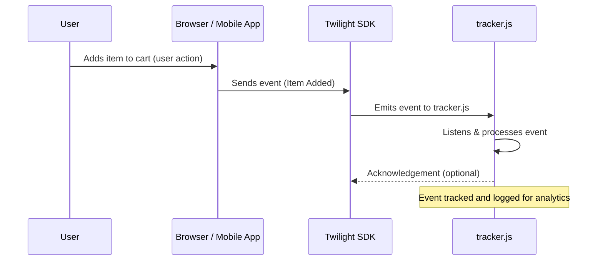
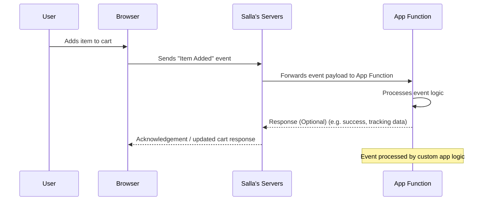

# Learn What You'Ll Learn  Elements

## Table of Contents

- [📙-what-you'll-learn/Elements](#📙-what-you'll-learn-elements)
- [📙-what-you'll-learn/Form](#📙-what-you'll-learn-form)
- [📙-what-you'll-learn/Getting-Started](#📙-what-you'll-learn-getting-started)
- [📙-what-you'll-learn/Languages-API-Twilight-SDK-Documentation-Salla-Docs](#📙-what-you'll-learn-languages-api-twilight-sdk-documentation-salla-docs)
- [📙-what-you'll-learn/Local-Storage-with-Twilight-JS-SDK-Twilight-SDK-Documentation-Salla-Docs](#📙-what-you'll-learn-local-storage-with-twilight-js-sdk-twilight-sdk-documentation-salla-docs)
- [📙-what-you'll-learn/Loyalty](#📙-what-you'll-learn-loyalty)
- [📙-what-you'll-learn/Notify-API-Twilight-SDK-Documentation-Salla-Docs](#📙-what-you'll-learn-notify-api-twilight-sdk-documentation-salla-docs)
- [📙-what-you'll-learn/Order](#📙-what-you'll-learn-order)
- [📙-what-you'll-learn/Overview](#📙-what-you'll-learn-overview)
- [📙-what-you'll-learn/Product](#📙-what-you'll-learn-product)
- [📙-what-you'll-learn/Profile](#📙-what-you'll-learn-profile)
- [📙-what-you'll-learn/Rating](#📙-what-you'll-learn-rating)
- [📙-what-you'll-learn/Salla-CLI-Authorization-Salla-CLI-Salla-Docs](#📙-what-you'll-learn-salla-cli-authorization-salla-cli-salla-docs)
- [📙-what-you'll-learn/Salla-CLI-Usage-Salla-CLI-Salla-Docs](#📙-what-you'll-learn-salla-cli-usage-salla-cli-salla-docs)
- [📙-what-you'll-learn/Salla-CLI-help-Salla-CLI-Salla-Docs](#📙-what-you'll-learn-salla-cli-help-salla-cli-salla-docs)
- [📙-what-you'll-learn/Twilight-JS-SDK-Configuration-Guide-Twilight-SDK-Documentation-Salla-Docs](#📙-what-you'll-learn-twilight-js-sdk-configuration-guide-twilight-sdk-documentation-salla-docs)
- [📙-what-you'll-learn/Twilight-JS-SDK-Events-Twilight-SDK-Documentation-Salla-Docs](#📙-what-you'll-learn-twilight-js-sdk-events-twilight-sdk-documentation-salla-docs)
- [📙-what-you'll-learn/Twilight-JS-SDK-Forms-Guide-Twilight-SDK-Documentation-Twilight-SDK-Documentation-Salla-Docs](#📙-what-you'll-learn-twilight-js-sdk-forms-guide-twilight-sdk-documentation-twilight-sdk-documentation-salla-docs)
- [📙-what-you'll-learn/Twilight-JS-SDK-Helpers-Twilight-SDK-Documentation-Salla-Docs](#📙-what-you'll-learn-twilight-js-sdk-helpers-twilight-sdk-documentation-salla-docs)
- [📙-what-you'll-learn/Twilight-JS-SDK-Overview-Twilight-SDK-Documentation-Salla-Docs](#📙-what-you'll-learn-twilight-js-sdk-overview-twilight-sdk-documentation-salla-docs)
- [📙-what-you'll-learn/Twilight-JS-Web-Components-Salla-Storefront-Twilight-Documentation-Salla-Docs](#📙-what-you'll-learn-twilight-js-web-components-salla-storefront-twilight-documentation-salla-docs)
- [📙-what-you'll-learn/Twilight-Themes-Command](#📙-what-you'll-learn-twilight-themes-command)
- [📙-what-you'll-learn/Twilight-Web-Components-–-Salla-Storefront-Twilight-Documentation-Salla-Docs](#📙-what-you'll-learn-twilight-web-components-–-salla-storefront-twilight-documentation-salla-docs)
- [📙-what-you'll-learn/Usage-Cloud-Mode](#📙-what-you'll-learn-usage-cloud-mode)

---

## 📙-what-you'll-learn/Elements

# Elements

## Docs

- [Apps Icons](https://docs.salla.dev/478518m0.md):  
- [Breadcrumb](https://docs.salla.dev/482370m0.md): The `<salla-breadcrumb>` web component is used as a navigational helper and hierarchy for pages. Breadcrumbs are used as a high-level representation of where users have navigated. Users can click the pages' texts to go back to previous pages.
- [Color Picker](https://docs.salla.dev/422696m0.md): The `<salla-color-picker>` web component is used to select a color using a variety of input methods in a [pop-up modal](https://docs.salla.dev/doc-422714?nav=01HNFTE06J4QC24T0D5BPRYKMD). Listen to events when the user changes the color or when the modal is either closed, open, or the chosen color has been submitted. Several methods can be used as well as customizable properties.
- [Conditional Fields](https://docs.salla.dev/422699m0.md): The `<salla-conditional-fields>` web component allows for hiding / displaying certain features in a product, such as size, where it only works if the product has, for instance, a specific value for the color.
- [Count Down](https://docs.salla.dev/422701m0.md): The `<salla-count-down>` web component is used to show the amount of time left until a given date. It's perfect for tracking important events, or counting down to special occasions like birthdays and anniversaries. It displays the days, hours, minutes, and seconds left with an easy-to-read countdown timer, as well as customized color, size, and labeled text properties.
- [Filters](https://docs.salla.dev/422704m0.md): The `<salla-filters>` web component is used to filter data in a variety of ways, such as by text, by date, or by number. They can also be used to filter data based on the user's input. They are easy to use and can be customized to meet the specific needs of the Theme.
- [Infinite Scroll](https://docs.salla.dev/422706m0.md): The `<salla-infinite-scroll>` web component allows for infinite scrolling to load content continuously as the user scrolls down the page, eliminating the need for pagination, and that can be customized using the properties' parameters available.
- [List Tile](https://docs.salla.dev/422708m0.md): The `<salla-list-tile>` web component is used to display listing items in a tile form, which is one of the popular ways used in E-commerce. List tile component allows this style of display to be applied while supporting various properties and slots to customize the component.
- [Loading](https://docs.salla.dev/422709m0.md): The `<salla-loading>` web component is used to convey that some data is currently loading to the user, and that can be customized using the properties' parameters available.
- [Map](https://docs.salla.dev/422713m0.md): The `<salla-map>` web component displays geographical maps from various sources. It supports multiple layers, tiled and full-image sources, adding markers, and interaction through events.
- [Modal](https://docs.salla.dev/422714m0.md): The `<salla-modal>` web component displays a dialog box or pop-up window on top of the current page. It is positioned above all other components in the application, restricting scrolling of the main page and only allowing scrolling of the modal's content. It consists of a [Button](https://docs.salla.dev/doc-422694?nav=01HNFTE06J4QC24T0D5BPRYKMD) component to activate the modal, and that can be customized using the properties, events, methods and slots' parameters available.
- [Placeholder](https://docs.salla.dev/422716m0.md): The `<salla-placeholder>` web component is used to reserve space for content that soon will appear in a layout soon. It may include a paragraph, a header, and an image, depending on the content type. It emphasizes that the content is to be loaded and can be customized using the properties' parameters available.
- [Progress Bar](https://docs.salla.dev/422723m0.md): The `<salla-progress-bar>` web component is used to convey data visually to users. It is also designed to help users quickly interpret numerical data at a glance, and can be customized according to the color and unit of the bar, as well as the unit, value, and textual representation. 
- [Rating Stars](https://docs.salla.dev/422727m0.md): This web component is used to display a form of rating scale using a star glyph or similar typographic symbol that is customizable in terms if `name`, `size`, and `value`, and that can be customized using the properties' parameters available.
- [Reviews](https://docs.salla.dev/508226m0.md): The `<salla-reviews>` web component displays a vertically scrollable reviews, which you can customize its data source using the properties available.
- [Reviews Summary](https://docs.salla.dev/602149m0.md): The `<salla-reviews-summary>` web component allows users to display the general rating out of 5 stars on the product details page. This makes it easier for customers to quickly find the information they need by highlighting the main topics that appear across existing reviews.
- [Sheet](https://docs.salla.dev/422733m0.md): The `<salla-sheet>` component is the baseline for numerous components such as the [Button component](https://docs.salla.dev/doc-422694?nav=01HNFTE06J4QC24T0D5BPRYKMD). It is a transformable layout, based on the `position` property, that provides a basic foundation for other components to be set on.
- [Skeleton](https://docs.salla.dev/422734m0.md): The `<salla-skeleton>` web component is used to display an indication to the user that something is coming but not yet available, which means that the content is to be loaded and can be customized using the properties' parameters.
- [Slider](https://docs.salla.dev/422735m0.md): The `<salla-slider>` component allows you to create a slider that can display multiple slides, which can be navigated by the Merchant using arrows or thumbnails.
- [Social](https://docs.salla.dev/499802m0.md): The `<salla-social>` web component allows users to click on the Store's social media accounts, such as YouTube, X _(formerly Twitter)_, and Instagram.
- [Social Share](https://docs.salla.dev/422736m0.md): The `<salla-social-share>` web component is used to display a menu with social media platforms and sharing capabilities in the form of email and copyable links. This can be customized using the properties' parameters.
- [Tabs](https://docs.salla.dev/422738m0.md): The `<salla-tabs>` web component makes it possible to have several panes inside a single view. This implies the content is presented in several independent panes, each of which can be seen independently of the others. If the user wants to see a certain section of the page, they click on that tab's header. The component groups several tabs/panes that each consists of `<salla-tabs-header>` and `<salla-tabs-content>` where:

---

## 📙-what-you'll-learn/Form

# Form

## Docs

- [Button](https://docs.salla.dev/422694m0.md): The `<salla-button>` web component shows a customizable button, in terms of size, color, style, status, position etc ,which can be used with any other web component, and that can be customized using the properties' parameters available.
- [Bottom Alert](https://docs.salla.dev/422693m0.md): The `<salla-bottom-alert>` web component displays a message to the Merchant at the bottom of the used component. It blockes interaction with the rest of the screen until they are dismissed
- [Contacts](https://docs.salla.dev/478494m0.md): The `<salla-contacts>` web component allows users to display contact items. It is possible to include the [`salla-social`](https://docs.salla.dev/doc-499802?nav=01HNFTE06J4QC24T0D5BPRYKMD) component for icon visual representation. 
- [Date Time Picker](https://docs.salla.dev/422702m0.md): The `<salla-datetime-picker>` web component is used to allow users to select both date and time with the same control. The date and time can be entered directly in the format of the current locale or through the Date Time Picker’s visible overlay.
- [File Upload](https://docs.salla.dev/422703m0.md): The `<salla-file-upload>` web component is used to allow the user to allow uploading a file or a number of files is supported by the File Upload web component, with the help of completed and supported parameters.
- [Menu](https://docs.salla.dev/478492m0.md):  
- [Quantity Input](https://docs.salla.dev/422724m0.md): The `<salla-quantity-input>` web component is used to allow the customer to use a counter to specify the needed quantity of a specific product, which is framed by a [Button](https://docs.salla.dev/doc-422694?nav=01HNFTE06J4QC24T0D5BPRYKMD) component. The component extends the input number element. For more, read from [Mozilla](https://developer.mozilla.org/en-US/docs/Web/HTML/Element/input/number).
- [Select](https://docs.salla.dev/422746m0.md): The `<salla-select>` web component is used to allow selection from a particular dropdown list, which can be an item's color, size, and so on. The component can be customized using the properties' parameters available.
- [Tel Input](https://docs.salla.dev/422739m0.md): The `<salla-tel-input>` web component is used to show a field for entering a telephone number, with country key/code prefix, and that can be customized using the properties' parameters available.

---

## 📙-what-you'll-learn/Getting-Started

# Getting Started

This guide will walk you through the process of integrating with our E-commerce events system. Whether you're working on the client-side with our Device Mode or on the server-side with Cloud Mode, you'll find the essential steps to get up and running quickly.

## Choosing Your Integration Mode

First, decide which integration mode is right for your application's needs:

*   **Device Mode:** Ideal for capturing events directly from the user's browser or mobile app. Choose this mode for client-side analytics, marketing automation, or real-time user interface reactions.
*   **Cloud Mode:** Best suited for server-side applications that need to react to events occurring on our platform. This mode is perfect for backend services such as order management, fulfillment, and custom data processing.

---

## Device Mode Integration

Follow these steps to integrate with our E-commerce events in Device Mode. For a complete, step-by-step guide on setting up, customizing, and publishing your `tracker.js` script, refer to the [Usage - Device Mode](https://docs.salla.dev/1724504m0.md).

### 1. Include the `tracker.js` Script

As detailed in the [Usage - Device Mode](https://docs.salla.dev/1724504m0.md), you will include your custom-built `tracker.js` script in your website's HTML, typically within the `<head>` section.

### 2. Listen for Events

Once your `tracker.js` script is loaded and configured, you can listen for E-commerce events using standard browser event listeners. Your custom logic within the `tracker.js` will define how these events are processed.

```javascript
document.addEventListener('ProductAdded', function(event) {
  const eventData = event.detail;
  console.log('Product Added to cart:', eventData);

  // Example: Send this data to your analytics service or trigger other client-side actions.
});
```

### 3. Available Events

For a comprehensive list of all available E-commerce events, including their properties and example payloads, please refer to the documentation within the `Events` directory.

---

## Cloud Mode Integration (App Functions)

Cloud Mode offers a powerful server-to-server integration for processing E-commerce events directly through your App Functions. This method is highly reliable as events are delivered from our platform directly to your backend, eliminating client-side dependencies.

For a detailed walkthrough on how to set up, configure, and develop your App Functions to consume E-commerce events, please refer to the dedicated [Usage - Cloud Mode](https://docs.salla.dev/1724667m0.md). This guide will cover:

*   Enabling App Functions for your application.
*   Receiving and parsing event payloads.
*   Implementing custom business logic in response to events.
*   Testing and deployment of your App Functions.

---

## 📙-what-you'll-learn/Languages-API-Twilight-SDK-Documentation-Salla-Docs

# Languages

**Salla** theme developers can easily support other languages thanks to the Twilight's localization function, which makes it simple to extract text in a selected language.
In the previous [article](doc-422553?nav=01HNFTD5Y5ESFQS3P9MJ0721VM), we explained how to perform localization within the Twilight theme engine. 


:::info
✅ **Twilight JS SDK** provides API methods meant to ease the access to the store's transaltions.
✅ The theme's languages are all **loaded by default** when the SDK is initialized via [salla.init()](doc-421943?nav=01HNFTD5Y5ESFQS3P9MJ0721VM).
::: 

In this article, we are going to talk about using the **Twilight JS SDK** for setting and getting a store's translation in action. 

## 📙 What you'll learn
- Usage
- Getting transaltion
- Setting transaltion


## Usage

The locales directory [`/locales/`](https://github.com/SallaApp/theme-raed/tree/master/src/locales) contains the localization files, which are *JSON-based* files that define translation strings. Each of these is a collection of key-value pairs found in a JSON string file, such as "Key":"Value."

**The following is an example of a locale file:**


```js
{
  "common": {
    "remember_my_choice": "Remember my choice",
    "note": "Note",
    "country_code": "country code"
  },

  "pages": {
    "cart": {
      "free_shipping": "Free Shipping"
    }
  }
}

```

:::tip
 Supporting multiple languages is known as **internationalization**, or **i18n** (18 letters separate the i and n). [Twilight i18n](https://github.com/SallaApp/twilight-i18n) provides the developer with access to many translations that are ready made for your Twilight Theme. The developer can find a complete list of all the language translation files supported by Twilight [here](https://localazy.com/p/twilight)

:::

Mainly, the **Twilight JS SDK** offers two methods to manage the translations, `get()` and `set()`. 

## Getting transaltion
The `get()` method can be used to retrieve text from the locale file. It needs only one parameter, which is `key` of that text. For example, in the previous code, the developer might return the text "Free Shipping" as follows:

```js
salla.lang.get('pages.cart.free_shipping')
```

## Setting transaltion
The `set()` method can be used to change the translation of text in the locale file. It needs two parameters, the `key` of that text and the value that will be stored for that text. For example, in the previous code, the developer may change the text "Remember my choice" as follows:

```js
salla.lang.set('en.pages.order.new_order','New Order')
```

:::warning
This updates an existing key of the current locale
:::

## Events

In some scenarios, the developer may need to retrieve some translations upon the completion of the loading. In such a case, the event "onLoaded()" may be invoked as follows:

```js
Salla.lang.onLoaded(() => {
  Salla.log(salla.lang.get('pages.profile.verify_title'))
});
```

<br>

# Adding New Translations

## Using Single Key Path

The `add()` method can be used to add a new translation key path to multiple locales. It needs two parameters, which is the `key` of the text to be translated, and the `object` that contains the translation of the `key` in multiple locales. For example, the developer can add the text "New Order" to different locales as follows:

```js
salla.lang.add('pages.order.new_order', {'ar': "طلب جديد", 'en': "New Order"})
```

## Using Bulk Key Paths

The `addBulk()` method can be used to add more than one new translation key paths to multiple locales. It needs one parameter, which is the `object` containing multiple keys and their corresponding translations in different locales. For example, the developer can add the texts "New Order" and "New Product" to different locales as follows:

```js
salla.lang.addBulk({
    pages.order.new_order', {'ar': "طلب جديد", 'en': "New Order"},
    pages.product.new_product', {'ar': "منتج جديد", 'en': "New Product"}
});  
```


:::check[Information]
To explore more about this API, check the [Lang.js](https://github.com/rmariuzzo/Lang.js) library on GitHub.
:::

---

## 📙-what-you'll-learn/Local-Storage-with-Twilight-JS-SDK-Twilight-SDK-Documentation-Salla-Docs

# Storage

Developers can use local storage to save and retrieve data in the browser. The data in local storage does not have an expiration date. This means that even if the tab or browser window is closed, the data will remain. Furthermore, the data is only saved locally. 

The token, cart, and wishlist data of the user are stored in local storage.This decreases client-server communication strain. Unlike regular cookies, the stored values last beyond the current session.


:::info
Under the hood, the **Twilight JS SDK** makes use of [**Store.js**](https://github.com/marcuswestin/store.js), which is a is a cross-browser local storage solution for all use cases that is utilized all over the web. It includes both basic key/value storage (get/set/remove/each) and a robust set of plug-in storage and extra capabilities.
:::

In this article, we will explore how **Twilight JS SDK** manages the local storage using Store.js.

## 📙 What you'll learn
- [Basic usage](#basic-usage).
- [Handeling user's token](#handeling-user's-token)
- [Handeling user's cart summary](#handeling-user's-cart-summary)


## Basic usage
**Twilight JS SDK** provides a basic APIs for local storage across browsers:
#### Store new value
The method ` salla.storage.set()` can be used to store a name value in the browser's local storage. In the following example, a key named `user` has been stored with the value `Ahmed`.
```js
// Store current user
salla.storage.set('user', { name:'Ahmed' })
```
#### Get stored value
The method `salla.store.get()` can be used to retrieve the value of the stored key `user` from the browser's local storage.
```js
// Get current user
salla.storage.get('user')
```
#### Remove stored value
The method `salla.store.remove()` can be used to remove the value of the stored key `user` from the browser's local storage.
```js
// Remove current user
salla.storage.remove('user')
```
#### Clear all keys
he method `salla.storage.clearALL()` can be used to remove any stored key/value from the browser's local storage.
```js
// Clear all keys
salla.storage.clearAll()
```
#### Loop over all stored values
In the following example, we see an example of a **for-loop** statement used to loop over all stored values.
```js
// Loop over all stored values
salla.storage.each(function(value, key) {
  console.log(key, '==', value)
})
```
## Handling user's token
Tokens for users are stored in the browser's local storage, which means that they stay the same even if a page is refreshed or a new browser tab is opened. The following is an example code to return the user's token as an `object`.
```js
user_token = salla.storage.get("token");
```
## Handling a user's cart summary
Another advantage of using local storage is the ability to manage the user's cart summary. This will create a persistent shopping cart instance. To do so, the developer needs to create the following fields in the browser's local storage:
- `total`: grand total for the cart.
- `sub_total`: cart sub total, which is the items total without any extra cost, such as shipping cost.
- `discount`: any given discount.
- `real_shipping_cost`: The real cost of shipping.
- `count`: the number of the items in the cart.
- `shipping_cost`: the total cost of the shipping. 
The method `salla.storage.set()` is used to create a `cart.summery` in the local storage as follows:
```js
salla.storage.set("cart.summary", {
  total: 200,
  sub_total: 150,
  discount: 10,
  real_shipping_cost: 60,
  count: 3,
  shipping_cost: 0,
});
```
On the other hand, the method `salla.storage.get()` is used to return the user's cat summary from the local storage as follows:
```js
user_cart = salla.storage.get('cart');
```

---

## 📙-what-you'll-learn/Loyalty

# Loyalty

## Docs

- [Get Program](https://docs.salla.dev/422667m0.md): This endpoint is used to retrieve the details of the loyalty program sponsored by the store, as well as offer prizes and discounts to attract and retain customers. 
- [Exchange](https://docs.salla.dev/422668m0.md): This endpoint is used to exchange a customer's accumulated points for any preset reward, such as free goods or discounts.
- [Reset](https://docs.salla.dev/422669m0.md): This endpoint is used when the customer removes an added reward from the live cart. In some cases, customers may need to remove a prize after adding it to the live cart.

---

## 📙-what-you'll-learn/Notify-API-Twilight-SDK-Documentation-Salla-Docs

# Notify

Alert messages can be used to **notify** the user about a special event, such as a danger, success, information, or warning. For many user-related events, strong alert notification messages are required. 

The **Twilight JS SDK** offers a flexible method for managing notification messages. Its flexibility comes from the fact that the developer can use any external Javascript library as the theme's *notifier* tool in order to manage the display of the notification messages. 

Besides that, the developer has the option of building their own notification message library, *notifier*. It requires a basic knowledge of HTML, CSS, and Javascript. In this way, the theme will have a customized notification message that fits its look-and-feel.

:::info
✅  By default, the **Twilight JS SDK** displays a message to the user that requires their attention using the Javascript built-in `alert()` method.
✅  The developer is required to *include any external Javascript library* along with the theme files. This can be accomplished by inserting an HTML script tag, adding a CDN external link in the page's header, or installing it using *npm*, just like any other Javascript library.
:::
 
In this article, we look at how to include any external JavaScript library for notification messages to make it the theme's notifier tool. We also explain how to use it within the theme.

## 📙 What you'll learn
- [Selecting a notification library](#selecting-a-notification-library).
- [Setup the notifier](#setup-the-notifier).
- [Usage](#usage).

## Selecting a notification library
There are a huge number of Javascript libraries that can be utilized as a nyifier tool for the theme. The developer may check this [link](https://github.com/topics/notifications) to choose any of the themes.
:::info
 [Noty](https://ned.im/noty/) and [AlertifyJS](https://alertifyjs.com/) are two Javascript libraries that stand out for managing notification messages. We use the [Noty](https://ned.im/noty/) for this demonstration.
:::
## Setup the notifier
In order to use the [Noty](https://ned.im/noty/) library, it should first be included within the theme files as we stated previously. After that, the developer needs to call the `setNotifier()` method to set it up. This function wraps the external library by creating an instance of it as an object and then passing the library's basic parameters. 
Creating an object for this library, for example, can be done as follows, according to the [Noty](https://ned.im/noty/) installation [guide](https://ned.im/noty/#/installation?id=es6-import-amp-require-usages):
```js
new Noty({
  type: "info",
  text: "Welcome",
}).show();
```
On that basis, we can use the setNotifier() method to wrap the [Noty](https://ned.im/noty/) and prepare it for us as follows:
```js
salla.notify.setNotifier(function (message, type, data) {
  new Noty({
    type: type,
    text: message,
  }).show();
});
```
This way has the advantage of customizing the behavior of the external library without needing to modify its source code.

## Usage
Now that we have the theme *notifer* ready, it can be called easily as per the case the developer is handling. **Twilight JS SDK** includes three pre-defined cases for displaying the message, which are the `success`, `info`, and the `error` cases.

<Tabs>
  <Tab title="Success">
      
Success notification message indicates a successful user action. They can be displayed as follows:
```js
salla.notify.success("The item has been added to the cart");
```
In this example, the *notifier's* type will be `success`, and the list of the arguments will be passed to the `message` and `data` parameters.

  </Tab>
  <Tab title="Information">


Information notification message shows an informative message for the user. They can be displayed as follows:
```js
salla.notify.info("The item is already sold out");
```
In this example, the *notifier's* type will be `info`, and the list of the arguments will be passed to the `message` and `data` parameters.
      
  </Tab>
  <Tab title="Error">


Error notification messages indicate a failing in the user's action. They can be displayed as follows:
```js
salla.notify.error("An error occured while removing the item from the wishlist");  
```
In this example, the *notifier's* type will be `error`, and the list of the arguments will be passed to the `message` and `data` parameters.
      
  </Tab>
</Tabs>


### Advance Usage

The developer may need to pass additional options when displaying notifications, such as the 'layout' parameter. This can be accomplished as follows:


```js
// lets defind our notifier callback at once in the app
salla.notify.setNotifier(function (message, type, data) {
  new Noty({
    type: type,
    text: message,
    timeout: data.timeout || 20, // use a default value or custom
    layout: data.layout || 'topRight', // use a default value or custom
  }).show();
});

// when you want to pass additional options
salla.notify.success("The item has been added to the cart", {layout: 'centerRight', timeout:10});
```

---

## 📙-what-you'll-learn/Order

# Order

## Docs

- [Create cart from order](https://docs.salla.dev/422671m0.md): This endpoint simply creates a new cart list for the customer, which will include the same items as any previous order. When customers are signed in to their account, they have the option to easily place a repeated order with one click. As a result, the customer will be sent to the checkout page with a new cart list that includes the previous order's items.
- [Cancel](https://docs.salla.dev/422672m0.md): This endpoint cancels an order, indicating that the customer no longer wants the product that was initially ordered.
- [Send invoice](https://docs.salla.dev/422673m0.md): This endpoint is used to send the order's invoice to the customer's email. The invoice is to confirm the customer's order by showing the products he has ordered, their quantities, and their prices.
- [Show order](https://docs.salla.dev/422674m0.md): This endpoint is used to show an order details, such as the quantity, price, delivery date,and payment terms. Mainly it should be called in the [thank you](https://docs.salla.dev/doc-422577?nav=01HNFTD5Y5ESFQS3P9MJ0721VM) page to display the order details.

---

## 📙-what-you'll-learn/Overview

# Overview

# E-commerce Events: Overview and Integration Guide

E-commerce events provide a powerful way to track and understand customer interactions throughout their shopping journey, from browsing products to completing a purchase. By leveraging these events, developers can build robust applications that react to user behavior, personalize experiences, optimize marketing efforts, and streamline backend processes. This guide outlines the available integration modes and the lifecycle of these events.

Our E-commerce event system currently supports two primary integration modes:

-   Device Mode
-   Cloud Mode through [App Functions](https://docs.salla.dev/1726817m0.md)

---

### Integration Modes
#### Device Mode

In this integration mode, events are dispatched directly from the customer's device (e.g., mobile app or web browser) to your designated callback function. This approach typically utilizes a `tracker.js` script embedded within the store's frontend, enabling real-time client-side event capture and processing. For detailed integration steps, refer to the [Usage - Device Mode](https://docs.salla.dev/1724504m0.md).


#### Cloud Mode - App Functions

In Cloud Mode, events are securely transmitted from our servers directly to your configured [App Functions](https://docs.salla.dev/1726817m0.md). This server-to-server integration eliminates the need for client-side snippets, making it ideal for backend services such as order management, fulfillment, and complex data processing. For comprehensive setup instructions, consult the [Usage - Cloud Mode](https://docs.salla.dev/1724667m0.md).


---

### Events Lifecycle

#### Device Mode


---

#### Cloud Mode



---

## 📙-what-you'll-learn/Product

# Product

## Docs

- [Add Product](https://docs.salla.dev/422692m0.md): The `<salla-add-product-button>` web component allows controllability over button text labels and behaviours based on the `product-status` and `product-type` properties. It consists of [Product Availability](https://docs.salla.dev/doc-422717?nav=01HNFTE06J4QC24T0D5BPRYKMD) component and [Button](https://docs.salla.dev/doc-422694?nav=01HNFTE06J4QC24T0D5BPRYKMD) component.
- [Advertisement](https://docs.salla.dev/478502m0.md): 
- [Comments](https://docs.salla.dev/482455m0.md): 
- [Conditional Offer](https://docs.salla.dev/537931m0.md): The `<salla-conditional-offer>` web component enables dynamic presentation of offers and discounts based on the customer's cart status.
- [Gifting](https://docs.salla.dev/422705m0.md): The `<salla-gifting>` web component is used to display items as gifts, which can be used after the customer has completed a purchase. It can be customized using the properties' parameters available.
- [Installment](https://docs.salla.dev/422707m0.md): The `<salla-installment>` web component is used to show a block area for the available installment payment options provided for a specific product. It consists of the supported payment in installments' options in an inline manner, and that can be customized using the properties' parameters available.
- [Meta Data](https://docs.salla.dev/464599m0.md): The `<salla-metadata>` web component helps to show detailed specifications for a product. It can display one or multiple sections of information, like links, text, files, and other details about the product.
- [Offer](https://docs.salla.dev/440408m0.md): 
- [Offer Modal](https://docs.salla.dev/422715m0.md): The `<salla-offer-modal>` web component shows a list of products with an offer given by the store admin. These offered products are related to a specific product. It consists of [Button](https://docs.salla.dev/doc-422694?nav=01HNFTE06J4QC24T0D5BPRYKMD) component to which Merchants can select offers related to product(s) they added to the cart, and that can be customized using the slots' parameters available.
- [Orders](https://docs.salla.dev/508225m0.md): The `<salla-orders>` web component shows a table with order details, such as order ID, product total, order status, and more.
- [Payments](https://docs.salla.dev/478374m0.md): 
- [Product Availability](https://docs.salla.dev/422717m0.md): The `<salla-product-availability>` web component is to show the "Notify availability" option as a button for the registered customer, while prompting unregistered merchants to input their phone number/email to be added to the notification list. It consists of a [Modal](https://docs.salla.dev/doc-422714?nav=01HNFTE06J4QC24T0D5BPRYKMD) activated by the [Button](https://docs.salla.dev/doc-422694?nav=01HNFTE06J4QC24T0D5BPRYKMD) component and that can be customized using the properties' parameters available.
- [Product Card](https://docs.salla.dev/422718m0.md): The `<salla-product-card>` web component is used to contain content and actions about a single product in a card display mode. The component incorporates options for displaying images, hovering over buttons, product information, and more.
- [Products List](https://docs.salla.dev/422719m0.md): The `<salla-products-list>` web component is used to display a group of related products with some information, such as products' names, prices, and other relevant information in an organized way. Users can interact with the component by clicking on a product to view its details.
- [Product Options](https://docs.salla.dev/422720m0.md): The `<salla-product-options>` web component is used to show to the Merchant all the fields that are customizable to curate the experience of personalizing a product prior to ordering it. Read more details on the proper use of each element of the component from [here](https://docs.salla.dev/doc-422605?nav=01HNFTD5Y5ESFQS3P9MJ0721VM).
- [Product Size Guide](https://docs.salla.dev/422721m0.md): The `<salla-product-size-guide>` web component is used to enable the merchant to add product measurements of height, weight, depth and other metrics for the customer to visualize the actual product size in real life. The pre-defined `methods` allow for calling functions built by Salla to carry out certain actvities, such as `open` and `close` the Product Size Guide component.
- [Products Slider](https://docs.salla.dev/422722m0.md): The `<salla-products-slider>` web component is used to navigate horizontally through a group of related products. Product sliders can be easily arranged in a highly customizable layout, allowing for various product views or collections to be presented in a visually appealing way.
- [Quick Buy](https://docs.salla.dev/422725m0.md): The `<salla-quick-buy>` web component is used for quick purchase. It redirects the customer immediately to the checkout page. By streamlining the shopping experience, customer can cut out extra steps and reduce abandonments, giving customers a secure and frictionless way to buy goods online. 
- [Quick Order](https://docs.salla.dev/422726m0.md): The `<salla-quick-order>` web component allows customers to request a call from the store owner for assistance with making their order. Customers provide their contact information through this component and the store owner is notified of the request. The store owner can then contact the customer directly to provide assistance with their order. This web component is an easy and convenient way for customers to receive help and support from the store owner, improving the overall customer experience. 
- [Scopes](https://docs.salla.dev/422729m0.md): The `<salla-Scopes>` web component shows a list of scopes (Branches) owned by the store. It consists of [Button](https://docs.salla.dev/doc-422694?nav=01HNFTE06J4QC24T0D5BPRYKMD) component that enables the addition of a header component, and that can be customized using the properties' parameters.
- [Search](https://docs.salla.dev/422730m0.md): The `<salla-search>` website element shows a search box, field, or bar. Its specific purpose is to accept user input for database searching. It consists of a [Modal](https://docs.salla.dev/doc-422714?nav=01HNFTE06J4QC24T0D5BPRYKMD) activated by the [Button](https://docs.salla.dev/doc-422694?nav=01HNFTE06J4QC24T0D5BPRYKMD) component, and that can be customized using the slots' parameters available.

---

## 📙-what-you'll-learn/Profile

# Profile

## Docs

- [Update profile](https://docs.salla.dev/422685m0.md): This endpoint is used to update a customer's profile. The profile contains information such as the customer's `first_name`, `last_name`, `birthday`, `gender`, and `avatar`.
- [Update contact](https://docs.salla.dev/422686m0.md): This endpoint is used to update a customer's contact information. The profile contains information such as the customer's `phone`, `country_code`, and `email`.

---

## 📙-what-you'll-learn/Rating

# Rating

## Docs

- [Order](https://docs.salla.dev/422675m0.md): This endpoint is used for the purpose of rating an order. It fetches the order's id, which will be rated.
- [Store](https://docs.salla.dev/422676m0.md): This endpoint is used for the purpose of rating a store. The customer will be able to send a review to a store after placing an order with that store.
- [Products](https://docs.salla.dev/422677m0.md): The customer is able to rate each product purchased in a specific order. This endpoint is used to save the customer's review comments on the purchased products list.
- [Shipping](https://docs.salla.dev/422678m0.md): This endpoint is used for the purpose of rating the shipping company responsible for delivering orders. The customer will be able to send a review of that shipping company.

---

## 📙-what-you'll-learn/Salla-CLI-Authorization-Salla-CLI-Salla-Docs

# Authorization

Authorization is the process of granting permission to access a resource. In the case of the Salla CLI, authorization allows the CLI to access the developer's [Salla Partners Portal](https://salla.partners/) account to perform certain actions. Salla uses the [OAuth 0.2](https://salla.dev/blog/oauth-2-0-in-action-with-salla/) protocol across its platform to ensure a secure environment for its users. 

The developer can use the `login` command to authorize the CLI to communicate with the Salla Partners Portal. This command will handle all authentication and authorization processes with the developer's [Salla Partners Portal](https://salla.partners/) account.

## 📙 What you'll learn

- [Authorize Salla CLI](#authorize-salla-cli)

<hr>

### Authorize Salla CLI

To authorize the Salla CLI to access the developer's [Salla Partners Portal](https://salla.partners/) account, run the `salla login` command as follows:

```bash title = "Terminal"
salla login
```

This command will prompt the developer to enter their [Salla Partners Portal](https://salla.partners/) account username and password in the browser and verify the login by email OTP if necessary. Once the authentication process is complete, the CLI will be authorized to access the developer's [Salla Partners Portal](https://salla.partners/) account and perform authorized actions on their behalf such as creating an app or theme.

<br>

<!--
focus: false
-->


---

## 📙-what-you'll-learn/Salla-CLI-Usage-Salla-CLI-Salla-Docs

# Usage

[Salla CLI](https://github.com/SallaApp/Salla-CLI) is the tool used to create Apps and themes. It comes with easy-to-use commands, for example, to create, list, and delete Apps and Themes. In order to use these commands, the developer needs to [install Salla CLI](#install-salla-cli). This article will explain how to install Salla CLI in order to use it in the developer environment and the primary [usage of Salla CLI](#salla-cli-usage).

## 📙 What you'll learn

- [Install Salla CLI](#install-salla-cli).
- [Salla CLI usage](#salla-cli-usage).
<hr>

### Install Salla CLI

To install [Salla CLI](https://github.com/SallaApp/Salla-CLI), run the following command in the terminal. This command will install Salla CLI into the system globally.

```shell title = "Terminal"
npm install -g @salla.sa/cli
```


:::tip[Note]
For PowerShell users, sometimes the CLI might not be installed due to device restrictions. To enable that, execute the following command

```bash
// First fetch the execution policy
Get-ExecutionPolicy

// Override the execution policy
Set-ExecutionPolicy RemoteSigned -Scope CurrentUser
```

:::

The developer is now ready to start building Salla Apps and Themes with the [Salla Partners Portal](https://salla.partners/)!

:::caution[Alert]
For machines with **Apple silicon**, it is a must to install [Rosetta](https://support.apple.com/en-sa/HT211861), which enables a Mac with Apple silicon to use apps built for a Mac with an Intel processor. Follow along for installation guide.
:::

### Rosetta Installation 

<Tabs>
  <Tab title="Via GUI">

      The first time you try to run an incompatible program, you will automatically be prompted to install Rosetta.

<!-- focus: false -->


Simply, click `Install` and you are good to go!


  </Tab>
  <Tab title="Via Terminal">
   
Use the following command line in your terminal

```shell title = "Terminal"
softwareupdate --install-rosetta
```


  </Tab>
</Tabs>

### Salla CLI usage

After installation, the developer will have access to the `salla` binary on their command line. The developer can verify that the CLI is properly installed by simply running the binary command, `salla`, which should present the developer with a help message listing all available commands.
Checking the version can be done using this command:

```shell title = "Terminal"
salla --version
```

To get the list of commands for Salla CLI execute the following command:
``` salla title = "Terminal"
salla
```
Or as an alternative the developer can use `help` command:
``` salla title = "Terminal"
help
```

The list of commands for Salla CLI

Command|Description|Properties|
|----|-----|-----|
|`salla app`  |Show list of commands with the binary app| -|
|`salla app create-webhook` |[Create a new Salla App Webhook](https://docs.salla.dev/doc-422769?nav=01HNA8QHCPJTCY5VSEZ616JCAK) |[event.name](https://docs.salla.dev/doc-421119?nav=01HNA8QHCPJTCY5VSEZ616JCAK)|
|`salla app delete`| [Delete an existing Salla App](https://docs.salla.dev/doc-422770?nav=01HNA8QHCPJTCY5VSEZ616JCAK)| -|
|`salla app list`| [List all Salla Apps](https://docs.salla.dev/doc-422772?nav=01HNA8QHCPJTCY5VSEZ616JCAK)| -|
|`salla app info` | [Show detailed app information](https://docs.salla.dev/doc-422772?nav=01HNA8QHCPJTCY5VSEZ616JCAK)| -|
|`salla app link` |[Link local app with Salla Partners](https://docs.salla.dev/doc-422771?nav=01HNA8QHCPJTCY5VSEZ616JCAK) |-|
|`salla app serve`| [Serve an existing Salla App](https://docs.salla.dev/doc-422773?nav=01HNA8QHCPJTCY5VSEZ616JCAK) |[-p,-l]|
|`salla theme create` |[Create the theme](https://docs.salla.dev/doc-422775?nav=01HNA8QHCPJTCY5VSEZ616JCAK) |-|
|`salla theme preview` |[Preview the theme](https://docs.salla.dev/doc-422776?nav=01HNA8QHCPJTCY5VSEZ616JCAK) |-|
|`salla theme list` |[List Themes](https://docs.salla.dev/doc-422777?nav=01HNA8QHCPJTCY5VSEZ616JCAK) |-|
|`salla theme delete` |[Delete an existing Theme](https://docs.salla.dev/doc-422778?nav=01HNA8QHCPJTCY5VSEZ616JCAK) |-|
|`salla theme publish` |[Publish the theme](https://docs.salla.dev/doc-422968?nav=01HNA8QHCPJTCY5VSEZ616JCAK) |-|
|`salla login` |[Login to Salla Store](https://docs.salla.dev/doc-422762?nav=01HNA8QHCPJTCY5VSEZ616JCAK) |-|
|`salla version` |[Show the version of Salla CLI](https://docs.salla.dev/doc-422763?nav=01HNA8QHCPJTCY5VSEZ616JCAK)| -|

---

## 📙-what-you'll-learn/Salla-CLI-help-Salla-CLI-Salla-Docs

# Help

This section is designated to access help content on Salla CLI. Using `-h or --help` both provide information about the command. Below sections explain `salla -h/--help` , `salla app -h/--help` and `salla theme -h/--help`. 

## 📙 What you'll learn
- [Salla CLI Help](#salla-cli-help)
- [Help Command Sections](#help-command-sections)
- [Getting specific command help](#getting-specific-command-help)

For a general check on Salla CLI commands the developer can run the following
``` bash title = "Terminal"
salla -h
```
This will display all the commands and options available in the **salla CLI** version that is installed.  

``` shell title = "Terminal"
Usage: salla [command]

Options:
  -V, --version  output the version number
  -h, --help     display help for command

Commands:
  app            Start building your New Salla Partners App
  help           display help for command
  info           Display info about your App to track issues.
  login          Login to your Salla Partners account
  logout         Logout from your Salla Partners account
  store          Create Demo Stores for testing.
  theme          Your gateway to creating elegant Salla Themes.
```
## Help command sections

The help command results are displayed in a three sections, which are:

**Usage**, to illustrate the use of the command
``` shell title = "Terminal"
Usage: salla [command]

```
**Options**, which can be used for the specified command line.
``` shell title = "Terminal"
Options:
  -V, --version  output the version number
  -h, --help     display help for command
```
**Commands**, lisiting the commands syntax.
``` shell title = "Terminal"
Commands:
  app            Start building your New Salla Partners App
  help           display help for command
  info           Display info about your App to track issues.
  login          Login to your Salla Partners account
  logout         Logout from your Salla Partners account
  store          Create Demo Stores for testing.
  theme          Your gateway to creating elegant Salla Themes.
```

Salla CLI commands for Salla Apps are also available, use the below command to get the commands associated with Salla App.
```bash title = "Terminal"
salla app -h
```
Which displays the **Salla App CLI** commands. 

```bash title = "Terminal"
Usage: salla app [options] [command]

Start building your New Salla Partners App

Options:
  -h, --help                display help for command

Commands:
  create                    Wizard to help you create a new Salla
                            Partners App.
  serve|s [options]         Serve, test, and view your Salla Partners
                            App.
  create-webhook [options]  Creates a new webhook events file.
  delete|d                  Delete your Salla Partners App locally
                            and remotely.
  list|l                    List your Salla Partners Apps.
  info|i                    Show detailed App information.
  link|k                    Link your local project to Salla Partners
                            App.
  publish|p                 Publish your App to Salla.
  help [command]            display help for command

```

**Salla Themes** also use Salla CLI commands to create and manage themes.

``` bash title = "Terminal" 
salla theme --help
```` 

The above command displays a list of Salla themes CLI commands.

```bash title = "Terminal"
Usage: salla theme [options] [command]

Your gateway to creating elegant Salla Themes.

Options:
  -h, --help           display help for command

Commands:
  create|c             Create a new theme. You can also import a theme.
  preview|p [options]  Preview the theme being created using a Demo
                       Store as a live environment.
  list|l               List of the themes that are linked to your Salla
                       Partners account.
  delete|d             Delete a theme from the themes connected your
                       Salla Partners Account.
  publish|s            Publish a theme to make it available in the
                       Salla Themes Marketplace.
  help [command]       display help for command
```

### Getting specific command help 
Developers may obtain help for specific commands using command syntax with the help option using `-h or --help`.

For instance, to get further details on Salla App list command

``` bash title = "Terminal"

salla store -h

```
This will provide addtional info about the command and how the user can use it.

``` bash title = "Terminal"
Usage: salla store [options] [command]

Create Demo Stores for testing.

Options:
  -h, --help      display help for command

Commands:
  create|c        Create a new store .
  list|l          List the stores that are linked to your Salla
                  Partners account.
  help [command]  display help for command

```

In the above example, the `salla store -h` command displayed the usage, options and commands for Salla store.

---

## 📙-what-you'll-learn/Twilight-JS-SDK-Configuration-Guide-Twilight-SDK-Documentation-Salla-Docs

# Configuration

When the Twilight JS SDK is first loaded, the initialization procedure is used to obtain the necessary configuration settings. The developer has the ability to configure the [Twilight engine](https://docs.salla.dev/doc-422610?nav=01HNFTD5Y5ESFQS3P9MJ0721VM) to meet the needs of his theme


:::tip
✅ **Twilight JS SDK** can be customized by selecting from a number of different configurations. When the SDK is first initialised, the configurations are set to their default values.
✅ In the case of using these configurations in a separate project other than the theme's pages, the SDK needs to be initialized via `salla.init()`.
:::


In this article, we will explore the different parts of the **Twilight JS SDK**.

## 📙 What you'll learn
- [Configurations](#configurations)
- [Usage](#usage)
  - [Set SDK's configurations](#set-sdk's-configurations)
  - [Get SDK's configurations](#get-sdk's-configurations)

## Configurations
  
**Here is a comprehensive list of all of the available configurations:**


<DataSchema id="1430660" />

## Usage
As we stated [before](https://docs.salla.dev/doc-422612?nav=01HNFTDZPB31Y2E120R84YXKCX#basic-configuration), the developer can configure the [Twilight engine](https://docs.salla.dev/doc-422610?nav=01HNFTD5Y5ESFQS3P9MJ0721VM) to meet the requirements of his theme.

### Set SDK's configurations
In general, the configuration can be set during the SDK initialization by calling `salla.init()`. Also, after the initialization, the developer can set any of the confiurations by calling the method `salla.config.set()`. Following, we see how the developer would be able to set the SDK configurations using each of these ways.

#### Set store configuration
Here is an example of how to set any value related to the store via the `salla.init()` method.
```js
salla.init({ 
  debug: true, 
  store: { 
    id: 123451234, 
    url: "https://my_store.test/",  
    name: "WOW store", 
    settings: { auth: { email_allowed: false } } 
  }
});
```

Similarly, we can see below how to set any value related to the store via the `salla.config.set()` method.
```js
salla.config.set({ 
  debug: true, 
  store: { 
    id: 123451234,
    url: "https://my_store.test/",  
    name: "WOW store"
  }
});
```

#### Set theme configuration

Here is an example of how to set any value related to the theme via the `salla.init()` method.
```js
salla.init({ 
  ...
  theme: { color: {primary: "#1232aa"} }
  ...
});
```

### Get SDK's configurations

Similarly, the developer can use the `salla.config.get()` method to retrieve any value from the configuration file. For example, the `user.id` can be retrieved using the syntax below.

```js
salla.config.get('user.id');
```

Furthermore, for the currencies and languages, the following syntax can be followed:

```js
salla.config.currencies().then((currencies) => {
  console.log(currencies);
});
```

Similarly, the list of the available laguges can be retrieved as follows:
```js
salla.config.languages().then((languages) => {
  console.log(languages);
});
```

---

## 📙-what-you'll-learn/Twilight-JS-SDK-Events-Twilight-SDK-Documentation-Salla-Docs

# Event

**Twilight JavaScript SDK** uses *Event-Driven Architecture*, which is a modern design approach centred around data that represents "events" (i.e., a product has been added to the cart). In event-driven programming, an event is the result of a single or multiple actions. Subscribers can listen to that event and take action after it is released by the emitter. In other words, emitters can send events containing data that subscribers can use, and subscribers can use the data to do actions.


:::info
 **Twilight** uses [EventEmitter2](https://www.npmjs.com/package/eventemitter2), which is an implementation of the [EventEmitter](https://nodejs.dev/learn/the-nodejs-event-emitter) module found in Node.js. It not only outperforms EventEmitter in benchmarks and is browser-compatible, but it also adds a slew of new non-breaking functionality to the EventEmitter interface.
:::
In this article, we will learn how to use the Twilight events and actions with easy steps and examples.

## 📙 What you'll learn

- [Trigger an event](#trigger-an-event) (using emitter).
- [Listening to the event](#listening-to-the-event).

## Trigger an event

**Twilight** includes a long list of events, such as `codeNotSent`, `verificationFailed`, `failedLogout`, and many more. These events that can be triggered by the emitter's 'emit()' method. This method causes the event to be pushed using the data that the developer has provided.

For example, the developer may create an event based on verified login by the user. Simply, the `emit()` method can be called with a list of parameters. These parameters state the event's action and the passed data along with it as below:

```js
// via event name
salla.event.emit("auth::verified", {success: true}, 'email')
```

Twilight provides an additional way to create these events in a more readable and clearer method. With this alias, the developer can create the following chine of methods around `salla.trigger_name.event.action_name()`:

```js
// via alias
salla.event.auth.verified({success: true}, 'email')
```

## Listening to the event

After creating the event along with its list of data, the next step is to implement an appropriate listener for that event. In **Twilight**, this can be achived using several methods:

- Using the alias method `salla.event.{modul name}.{action name}()`, where the trigger, action, can be `auth` during the login, and the result of that action is `verified`.


:::info
- **Modul name** can be any of the main module within the API, such as `auth`, `cart`, etc.
-  **Action name** can be any action included within the module, such as `onVerified` in the `auth` module. 
:::


```js
// via alias
salla.event.auth.onVerified((response, authType) => {
	// lets do anything when the event emit
	console.log('The customer has been verifed');
	console.log(response, authType)
})
```

- Using the event name and result directly along with an anonymized function to perform the needed action based on the event result.

```js
// via event name
salla.event.on('auth::verified',(response, authType) => {
	// lets do anything when the event emit
	console.log('The customer has been verifed');
	console.log(response, authType)
})
```

- Adding a `one` time listener for the event along with an anonymized function to perform the needed action based on the event result.

```js
// Adds a one time listener for the event. 
salla.event.once('auth::verified',(response, authType) => {
	// The listener is invoked only the first time 
	// the event is fired, after which it is removed.
  	console.log('The customer has been verifed');
	console.log(response, authType)
})
```

- The `onlyWhen` event triggers a callback **only once** when the event occurs. If the event has already been emitted, it runs immediately; otherwise, it waits for the event. This ensures responsive handling of past and future events.

```js
// Wait for 'cart::item.added' event if it hasn't occurred yet
    event.onlyWhen('cart::item.added', () => {
      // This will run either immediately if cart is loaded
      // or after cart loads if it hasn't loaded yet
      console.log('Cart is ready');
    });
    
    // OR
    
    event.onlyWhen('cart::item.added').then(() => {
      // This will run either immediately if cart is loaded
    })
```

---

## 📙-what-you'll-learn/Twilight-JS-SDK-Forms-Guide-Twilight-SDK-Documentation-Twilight-SDK-Documentation-Salla-Docs

# Forms

Theme's Forms are typically used to enclose one or more user inputs in order to enable an implicit submit function, in which users can submit an HTML `<form>` by clicking a "submit" button. This is a generally anticipated behavior that should be addressed as frequently as feasible.


:::info
✅ **Twilight JS SDK** makes it easier to interact with a Theme's Forms by using the included REST API endpoints. This is to ease tasks connected to API calls, such as Cart APIs, Product APIs, and many others.
:::
In this article, we'll look at how a developer may easily add forms to their Themes. Additionally, how the Form input will be collected upon any change or summit.

## 📙 What you'll learn
- [Twilight Forms](#twilight-forms)
- [Usage](#usage)
  - JS Web Components [`<salla-button>`](https://docs.salla.dev/doc-422694?nav=01HNFTE06J4QC24T0D5BPRYKMD)
- [Response Schema](#response-schema)
  - Show Message

## Twilight Forms

In Twilight Themes, a form's fields are not automatically submitted via HTTP, unlike the HTML `form` element. Instead, the developer must include a JavaScript onSubmit callback that will send the required HTTP requests. The following is a complete example for adding a `form` to collect a comment on a product:

```php
<form class="form form--add-comment" onsubmit="return salla.form.onSubmit('comment.add', event);">
  <input name="type" type="hidden" value="product" />
  <input name="id" type="hidden" value="1234" />

  <h2 class="mb-5 text-lg font-bold text-dark">Comment</h2>
  <textarea class="form-input" name="comment" required maxlength="500" cols="30" rows="30"></textarea>

  <div class="text-end mb-4">
    <salla-button type="submit" className="w-36" loader-position="end">Submit</salla-button>
  </div>
</form>
```

## Usage 

In the previous example, developers may notice that the HTML `<form>` element contains the `onsubmit` attribute, which is an `event`. This event is triggered when the form is submitted. Sequentially, the method `salla.comment.add` will be implemented, which is one of the [Twilight API JS SDK](https://docs.salla.dev/doc-422610?nav=01HNFTDZPB31Y2E120R84YXKCX) methods. 

Under the hood, the event `onSubmit` calls the helper method `salla.comment.add`, which in its turn converts all of the form inputs to an object and passes it as arguments to that method. Below is that code that will be run as a result of submitting the previous form:

```js
salla.comment.add({
  type: "product",
  id: 1234,
  comment: "A nice product",
})
.then((response) => {
  // success submit
})
.catch((error) => {
  // we have an error
});
```

### JS Web Components `<salla-button>`
As what will see in the next section of this documentation, Twiligh is shipped with a ready-designed and styled set of [JS Web Components](https://docs.salla.dev/doc-422688?nav=01HNFTE06J4QC24T0D5BPRYKMD). These components are a collection of high-level building blocks and reusable web components that can be built together to swiftly develop the UI for custom Salla Themes. One of the main JS Web Components is the [`<salla-button>`](https://docs.salla.dev/doc-422694?nav=01HNFTE06J4QC24T0D5BPRYKMD) which allows calling functions built by Salla to carry out certain activities. 

```js
<salla-button type="submit" className="w-36" loader-position="end">Submit</salla-button>
```
In the previous example, the [`<salla-button>`](https://docs.salla.dev/doc-422694?nav=01HNFTE06J4QC24T0D5BPRYKMD) is used to submit the form, which causes the helper method `salla.comment.add` to be called and implemented. It will be loaded automatically and wait for any response from the server.

## Response Schema
The previous [`<salla-button>`](https://docs.salla.dev/doc-422694?nav=01HNFTE06J4QC24T0D5BPRYKMD) component will receive the server Response, which looks like the following schema:

```js
{
  "status": 200,
  "success": true,
  "data": {
    .......
  },
  "message": "a optional message if its exists"
}
```

### Show Message
The developer can show an alert message to the end user by adding a `message` to the response and a `success` flag indicating whether or not the message was successful.

<Tabs>
  <Tab title="Success">
      
```js
{
  "status": 200,
  "success": true,
  "message": "تمت إضافة المنتج بنجاح"
}
```
      
  </Tab>
  <Tab title="Error">
      
```js
{
  "status": 401,
  "success": false,
  "message": "يتطلب تسجيل دخول لاكمال هذا الاجراء"
}
```

  </Tab>
</Tabs>

---

## 📙-what-you'll-learn/Twilight-JS-SDK-Helpers-Twilight-SDK-Documentation-Salla-Docs

# Helpers

The Twilight JS SDK is packaged with a variety of helpful functions that may be accessed and used straight within Templates. Previous articles in this documenation introduced [Twilight Flavoured Twig](https://docs.salla.dev/doc-421929?nav=01HNFTDZPB31Y2E120R84YXKCX#helpers). In this aricle we will go thourgh how to use the Helper functions using the Twilight SDK JS.

## 📙 What you'll learn about

- [Url Helper](#url-helper)
  - [Asset Helper](#asset-helper)
  - [CDN Helper](#cdn-helper)
  - [is_page Helper](#is_page-Helper)
- [Money Helper](#money-helper)
- [Number Helper](#number-helper)
- [Apple Pay Helper](#apple-pay-helper)
- [is I frame](#is-i-frame)
- [is Preview](#is-preview)


## Url Helper
In general, the `sall.url.get()` helper function will return the absolute URL for the provided route, including the scheme and host.

```js
salla.url.get(…)
```

### Asset Helper
The `salla.url.asset()` function returns the public path of the specified asset (which can be a CSS file, a JavaScript file, an image path, etc.). This function looks at where the theme was installed (for example, if the theme is accessed in a subdirectory of the host) and, if specified, the asset package base path. It needs to be supplied with the required file's path.

```js
salla.url.asset(filePath)
```


### CDN Helper
A content delivery network (CDN) referes to an external resource that can be used inside the theme. The The `salla.url.cdn()` function helps with doing that by passing the path of that external resource.

```js
salla.url.cdn(filePath)
```


### is_page Helper

This helper function determines whether if the passed route is a path, by using page slug

```js
if(salla.url.is_page('index')) {
  console.log('you arrive 💪');
}

// other exmaple
if(salla.url.is_page('product.index')) {
  console.log('you arrive product index 💪');
}
```


:::info
 You can find the page slug via views by `{{ page.slug }}`, or via browser console by`salla.config.get('page.slug')`
:::


## Money Helper

The *Money Helper* is another function provided by the **Twilight JS SDK** that allows the developer to format a numeric value as a currency. The syntax for using this helper  is `salla.money(value)`, where value is the numeric value that you want to format as per the default currency.

For example, if you want to format the number 100 as a currency, you can use the following JavaScript code:
```js
const moneyValue = salla.money(100); // formats 100 as per the selected currency
console.log(moneyValue); // output: "SAR 100"
```

If the Arabic numbers are enabled by the merchant the will be as follows:
```js
console.log(moneyValue); // output: "١٠٠ ر.س"
```

You can also pass additional parameters to the salla.money() helper to customize the currency and locale settings, such as:
```js
salla.money({amount:100, currency:"USD"}); // output: "USD100"
```

## Number Helper
This helper formats any number given to an Arabic number if merchant enables it and the current language is Arabic. It will also parse decimal number representation to a decimal point in Arabic (,):
```js
const numValue = salla.helpers.number(966567891011); 
console.log(numValue); // output: "٩٦٦٥٦٧٨٩١٠١١"
```

## Apple Pay Helper 
This helper allows checking multiple factors which are:
- Is apple pay enabled in this store?
- Does this browser support Apple pay?

The helper will return a value of `true` if Apple Pay is enabled, or `false` if it is not enabled.

```js
var applePayEnabled = salla.helpers.hasApplePay();
if (applePayEnabled) {
    console.log("Apple Pay is enabled");
} else {
    console.log("Apple Pay is not enabled");
}
```


## Is iframe 
The helper function `isIframe()` determines whether a web page is being displayed within an iframe rather than a window. This function returns either true or false based on this condition.
```js
function isIframe(){
return window.self !== window.top
}
```
## Is Preview
`isPreview()` helper function is a wrapper for the above explained `isIframe()` helper function.

```js
const isCustomizingTheme = salla.helpers.isPreview();
console.log(isCustomizingTheme); // prints true or false
```

---

## 📙-what-you'll-learn/Twilight-JS-SDK-Overview-Twilight-SDK-Documentation-Salla-Docs

# Overview

✨**Twilight** comes with a **JavaScript SDK** for the Salla storefront APIs. This is to provide the developers with helper methods, or REST API endpoints, that allow communication between the frontend and backend. As a result, developers may use these methods to make merchants' stores dynamic after using the API features and data. In this documentation, we will be referring to it as **Twilight JS SDK** for short.

:::info[Information]
**SDK** stands for "software development kit," and it refers to a library for interacting with a specific REST API using JavaScript. 
:::

In this article, we will explore the different parts of the **Twilight JS SDK**.

## 📙 What you'll learn

- [SDK main APIs](#sdk's-main-apis).
- [Use cases](#use-cases).
- [Installation](#installation).
- [Usage](#usage).
  - [Basic configuration](#basic-configuration).

##  SDK's main APIs 
The main parts of the **Twilight JS SDK** includes REST API endpoints that ease the actions related to the APIs request, such as:

<CardGroup cols={2}>
  <Card title="Authorization APIs" href="https://docs.salla.dev/doc-422618?nav=01HNFTDZPB31Y2E120R84YXKCX" Icon icon="material-outline-security">
    Several endpoints for customer logging in, logging out, and many more
  </Card>
  <Card title="Cart APIs" href="https://docs.salla.dev/doc-422625?nav=01HNFTDZPB31Y2E120R84YXKCX" Icon icon="material-outline-shopping_cart">
    Customer's cart list of endpoints.
  </Card>
  <Card title="Comments APIs" href="https://docs.salla.dev/doc-422681?nav=01HNFTDZPB31Y2E120R84YXKCX" Icon icon="material-outline-mode_comment">
Group of endpoints related to the customer comments, or feedback, on product or page.
    </Card>
  <Card title="Currency APIs" href="https://docs.salla.dev/doc-422679?nav=01HNFTDZPB31Y2E120R84YXKCX" Icon icon="material-outline-currency_exchange">
    Group of endpoints related to the store's currencies list
  </Card>
    <Card title="Order APIs" href="https://docs.salla.dev/doc-422671?nav=01HNFTDZPB31Y2E120R84YXKCX" Icon icon="material-outline-border_color">
    Customer's orders related endpoints.
    </Card>
    <Card title="Product APIs" href="https://docs.salla.dev/doc-422641?nav=01HNFTDZPB31Y2E120R84YXKCX" Icon icon="material-outline-production_quantity_limits">
    Product related endpoints.
    </Card>
    <Card title="Profile APIs" href="https://docs.salla.dev/doc-422685?nav=01HNFTDZPB31Y2E120R84YXKCX" Icon icon="material-outline-drive_file_move">
    Customer's profile endpoints. 
    </Card>
    <Card title="Rating APIs" href="https://docs.salla.dev/doc-422675?nav=01HNFTDZPB31Y2E120R84YXKCX" Icon icon="material-outline-star_half">
    endpoints related to the store, product, order, shipping rating.
    </Card>
    <Card title="Wishlist APIs" href="https://docs.salla.dev/doc-422654?nav=01HNFTDZPB31Y2E120R84YXKCX" Icon icon="material-outline-checklist">
    Customer's wishlist endpoints. 
    </Card>
        <Card title="Loyalty APIs" href="https://docs.salla.dev/doc-422667?nav=01HNFTDZPB31Y2E120R84YXKCX" Icon icon="material-outline-loyalty">
    Customer's loyalty endpoints. 
    </Card>

</CardGroup>
        <Card title="Booking APIs" href="https://docs.salla.dev/doc-422687?nav=01HNFTDZPB31Y2E120R84YXKCX" Icon icon="material-outline-bookmark">
    Book product or service endpoints. 
    </Card>

## Use cases 
Following are some of the possible uses of the Twilight JS SDK:

| |
| -- |
| Authenticating customers and allowing them to edit account details. |
| Adding a product directly from the products list to the customer art. |
| Returning the price of a product. |
| Adding a product to the customer's wishlist. |
| Rating the shipping company responsible for delivering orders, and many more. |

## Installation 

**Twilight JS SDK** can be used without the need to be downloaded or installed; instead it needs to be included as a short piece of regular JavaScript in the HTML that will asynchronously load the SDK into the Twilight theme. 

<Tabs>
<Tab title="Twilight Themes">

In case of using the **Twilight JS SDK** inside the Twilight themes,  the developer doesn't need to include the **Twilight JS SDK** in the theme project's bundle or inside the html, **Twilight theme engine** will inject the latest version of the **Twilight JS SDK** in the page.
    
:::info[Information]
Basically, the developer does not need to call the method `salla.init()` for twilight themes, because it will be called automatically upon the installation of the Twilight theme engine. This is done thanks to the [body:end hook](doc-422552?nav=01HNFTD5Y5ESFQS3P9MJ0721VM) ``.
:::

</Tab>

<Tab title="HTML">
    
The most common approach for setting up the **Twilight JS SDK** is load it via `<script>` befor closing the `body` tag of the HTML document. 

```js
<script src="https://cdn.salla.network/js/twilight/latest/twilight.js"></script>
```
    
Developer may also install the **Twilight JS SDK** using the following commands:

```shell
pnpm install @salla.sa/twilight
```
    
Initially, the developer must import the Salla JS Events library as follows:

```js
import '@salla.sa/twilight';
```


The following snippet of code will give the basic version of the SDK where the configurations are set to their minimum requirements, for example, store URL. The method `salla.init()` is used to setup and initialize the SDK. 

```js
<script>
  salla.init({
    debug: true, // disbale it in prod
    language_code: 'ar', // en
    store: {
      id: 1305146709, // The store id can found via store pages.
      url: "https://the-best-store-ever.sa"
    }
  });
</script>
```
    
to have full settings object, you can get the settings using this request:
```js
    
// Fetch store settings using the Salla Store API
async function getStoreSettings() {
  const response = await fetch('https://api.salla.dev/store/v1/store/settings', {
    headers: {
      // Accepts store ID, domain, or username (e.g., salla.sa/username)
      store: 'dev-vgckq3fssfhjewwi'
    }
  });

  return response.json();
}

// Example usage
const storeSettings = await getStoreSettings();
salla.init(storeSettings);

```
  </Tab>
</Tabs>

## Usage

As a result of the SDK initialization, the developer will be able to use any of the SDK's main APIs. For example,  the method `addItem` adds an item into the cart, the developer may call the method `addItem` as follows:

```js
salla.cart.addItem({
    id: 1234,
    quantity: 1,
    notes: "please i need to get the red color"
}).then((response) => {
    /* add your code here */
});
```
In addition to the above example, the method `addItem` may add an item with multiple options to the carts as follows:
```js
salla.cart.addItem({
    id: 1234,
    quantity: 1,
    options: {
      117414452: 11232214, // option value id (select choice)
      117416632: "http://option-value-as-url-of-image.com",
      117411132: "option value as string"
    },
    notes: "please i need to get the red color"
}).then((response) => {
    /* add your code here */
});
```

Furthermore, a large number of store events will be available for use. Thus, the developer's Theme may be configured to respond automatically to a variety of activities, such as:

- The user requested an Access Code to perform a login, however, the code was not sent. For this scenario, using the method `salla.event.auth.onCodeNotSent((error, type) => console.log(error, type))` can be used.

- A new item has been added to the cart via the `salla.cart.event.onItemAdded((response, product_id) => console.log(response, product_id))` method.

- The user added a new item to the Wishlist using the method `salla.event.wishlist.onAdded((response, product_id) => console.log(response, product_id))`.

Full example for that would be the event `onItemAdded` which is triggered when adding an item to the cart is done without having any errors coming back from the backend:

```js
salla.cart.event.onItemAdded((response, product_id) => {
  console.log(response)
});
```
On the other hand, the event `onItemAddedFailed` is triggered when adding an item to the cart is not completed and an error has occurred. For example, the id of the product to be added to the cart was not found.
```js
salla.cart.event.onItemAddedFailed((errorMessage) => {
  console.log(errorMessage)
});
```

    
### Basic configuration 

Aside from calling the APIs, the developer has the ability to configure the [Twilight engine](doc-421877?nav=01HNFTD5Y5ESFQS3P9MJ0721VM) to meet the needs of his theme. 

<TipInfo>This list of the available configurations can be found in this [article](doc-422612?nav=01HNFTDZPB31Y2E120R84YXKCX).</TipInfo>

    For this purpose, the method `salla.config.get()` is used to retrieve a configuration value, while `salla.config.set()` is used to set a configuration value.

#### **Set configuration value**
The developer may set the debug mode to be activated. That is to state, the theme will be run in a debugger. This means that the debugger keeps track of everything that happens while the theme is running.

```js
salla.config.set('debug', true)
```

#### **Get configuration value**
Similarly, the developer can use the method `salla.config.get()` to get any value from the configuration file. To retrive simaple value such as the user Id, the following syntax can be followed:

```js
salla.config.get('user.id’)
```

Furthermore, if the required value is nested inside an inner value, such as a currency code, the following syntax can be followed:

```js
salla.config.get('currencies.SAR.code’)
```

---

## 📙-what-you'll-learn/Twilight-JS-Web-Components-Salla-Storefront-Twilight-Documentation-Salla-Docs

# Overview

**Twilight** comes with a ready-designed and styled set of web components for Salla stores. For example, ready components to display the login form, product availability section, search bar, localization menu, and many more.

**Twilight JS Web Components** are a collection of high-level building blocks and reusable web components that can be built together to swiftly develop the UI for custom Salla Themes, governed by clear guidelines.

:::info[Information]
**JS Web Components** are built from the ground up to be simple to learn and use, with various thoughtfully constructed user interface components. Its complete compatibility with the themes' structure and architecture makes it easy to customize, as the documentation explains.

:::

In this article, we'll go through the list of the various web components along with their benefits.

## 📙 What you'll learn

- [JS Web components](#js-web-components).
- [Benefits](#benefits).

## JS Web components

Below is a list of the ready-made Twilight JS Web Components which can be used easily. Following, in this part of the document, each component is explained in detail.

Every web component comes with a list of **properties and events** that make that component customizable. Besides, each web component uses methods from the [**Twilight JS SDK**](https://docs.salla.dev/doc-422610?nav=01HNFTDZPB31Y2E120R84YXKCX) to fetch any needed data from the backend.

<CardGroup cols="3">
  <Card title="salla-advertisement" href="https://docs.salla.dev/doc-478502/?nav=01HNFTE06J4QC24T0D5BPRYKMD"   icon="material-outline-ads_click">
    Shows all the details about product advertisements.
  </Card>
  <Card title="salla-apps-icons" href="https://docs.salla.dev/doc-478518/?nav=01HNFTE06J4QC24T0D5BPRYKMD"  icon="material-outline-app_shortcut" >
    Shows clickable labels of Google Play Store and Apple Store for the Store's application.
  </Card>
  <Card title="salla-add-product-button" href="https://docs.salla.dev/doc-422692?nav=01HNFTE06J4QC24T0D5BPRYKMD"  icon="material-outline-production_quantity_limits">
    Allows controllability over button text labels and behaviors based on the product-status and product-type
    properties.
  </Card>
  <Card title="salla-breadcrumb" href="https://docs.salla.dev/doc-482370/?nav=01HNFTE06J4QC24T0D5BPRYKMD"  icon="material-outline-double_arrow">
    Helps users navigate by showing their path through pages, allowing them to easily go back by clicking on links.
  </Card>
  <Card title="salla-button" href="https://docs.salla.dev/doc-422694?nav=01HNFTE06J4QC24T0D5BPRYKMD" icon="material-outline-smart_button" >

    Shows a customizable button, in terms of size, color, style, status, position etc..
  </Card>
  <Card title="salla-cart-summary" href="https://docs.salla.dev/doc-422695?nav=01HNFTE06J4QC24T0D5BPRYKMD"  icon="material-outline-shopping_cart">
    Show the icon of the shopping cart with a small circle badge indicating the number of items in the cart.
  </Card>
  <Card title="salla-color-picker" href="https://docs.salla.dev/doc-422696?nav=01HNFTE06J4QC24T0D5BPRYKMD"  icon="material-outline-colorize">
    Allows selection of a color using a variety of input methods.
  </Card>
  <Card title="salla-comments" href="https://docs.salla.dev/482455m0?nav=01HNFTE06J4QC24T0D5BPRYKMD"  icon="material-outline-insert_comment">
    Displays a comment form for specific products or pages.
  </Card>
  <Card title="salla-contacts" href="https://docs.salla.dev/doc-478494/?nav=01HNFTE06J4QC24T0D5BPRYKMD"  icon="material-outline-contact_page">
    Shows the store's contact information details.
  </Card>
  <Card title="salla-conditional-fields" href="https://docs.salla.dev/doc-422699?nav=01HNFTE06J4QC24T0D5BPRYKMD"  icon="material-outline-rule">
    Allows for hiding / displaying certain features in a product, such as size.
  </Card>
  <Card title="salla-conditional-offer" href="https://docs.salla.dev/doc-537931/?nav=01HNFTE06J4QC24T0D5BPRYKMD"  icon="material-outline-rule_folder">
    Enables dynamic presentation of offers and discounts based on the customer's cart status.
  </Card>
  <Card title="salla-count-down" href="https://docs.salla.dev/doc-422701?nav=01HNFTE06J4QC24T0D5BPRYKMD"  icon="material-outline-watch_later">
    Shows the amount of time left until a given date.
  </Card>
  <Card title="salla-datetime-picker" href="https://docs.salla.dev/doc-422702?nav=01HNFTE06J4QC24T0D5BPRYKMD"  icon="material-outline-date_range">
    Allows users to select both date and time with the same control.
  </Card>
  <Card title="salla-file-upload" href="https://docs.salla.dev/doc-422703?nav=01HNFTE06J4QC24T0D5BPRYKMD"  icon="material-outline-upload_file">
    Allows the user to allow uploading a file or a number of files.
  </Card>
  <Card title="salla-filters" href="https://docs.salla.dev/doc-422704?nav=01HNFTE06J4QC24T0D5BPRYKMD"  icon="material-outline-filter_alt">
    Allows the user to filter the data in a variety of ways.
  </Card>
  <Card title="salla-gifting" href="https://docs.salla.dev/doc-422705?nav=01HNFTE06J4QC24T0D5BPRYKMD"  icon="material-outline-card_giftcard">
    Display items as gifts, which can be used after the customer has completed a purchase.
  </Card>
  <Card title="salla-infinite-scroll" href="https://docs.salla.dev/doc-422706?nav=01HNFTE06J4QC24T0D5BPRYKMD"  icon="material-outline-keyboard_double_arrow_down">
    Allows for infinite scrolling to load content continuously as the user scrolls down a page.
  </Card>
  <Card title="salla-installment" href="https://docs.salla.dev/doc-422707?nav=01HNFTE06J4QC24T0D5BPRYKMD"  icon="material-outline-money">
    Shows a block area for the available installment payment options provided for a specific product.
  </Card>
  <Card title="salla-list-tile" href="https://docs.salla.dev/doc-422708?nav=01HNFTE06J4QC24T0D5BPRYKMD"  icon="material-outline-fact_check">
    Used to display listing items in a tile form.
  </Card>
  <Card title="salla-loading" href="https://docs.salla.dev/doc-422709?nav=01HNFTE06J4QC24T0D5BPRYKMD"  icon="material-outline-downloading">
    Used to convey that some data is currently loading to the user.
  </Card>
  <Card title="salla-localization-modal" href="https://docs.salla.dev/doc-422710?nav=01HNFTE06J4QC24T0D5BPRYKMD"  icon="material-outline-share_location">
    Shows the menu for the store's available languages and currencies.
  </Card>
  <Card title="salla-login-modal" href="https://docs.salla.dev/doc-422711?nav=01HNFTE06J4QC24T0D5BPRYKMD"  icon="material-outline-login">
    Displays the login form, which prompts a user for their credentials in order to authenticate their access.
  </Card>
  <Card title="salla-loyalty" href="https://docs.salla.dev/doc-422712?nav=01HNFTE06J4QC24T0D5BPRYKMD"  icon="material-outline-loyalty">
    Display a popup that represents the Loyalty program.
  </Card>
  <Card title="salla-map" href="https://docs.salla.dev/doc-422713?nav=01HNFTE06J4QC24T0D5BPRYKMD"  icon="material-outline-map">
    Displays geographical maps from various sources with multiple layers, and interaction through events.
  </Card>
  <Card title="salla-menu" href="https://docs.salla.dev/doc-478492/?nav=01HNFTE06J4QC24T0D5BPRYKMD"  icon="material-outline-menu_open">
    Shows nested list items that either appear on the header section or footer section.
  </Card>
  <Card title="salla-metadata" href="https://docs.salla.dev/doc-464599/?nav=01HNFTE06J4QC24T0D5BPRYKMD"  icon="material-outline-data_thresholding">
    Shows detailed specifications for a product. It can display one or multiple sections of information, like links, and
    text etc.
  </Card>
  <Card title="salla-modal" href="https://docs.salla.dev/doc-422714?nav=01HNFTE06J4QC24T0D5BPRYKMD"  icon="material-outline-format_list_bulleted">
    Displays a dialog box or pop-up window on top of the current page.
  </Card>
  <Card title="salla-offer" href="https://docs.salla.dev/doc-440408?nav=01HNFTE06J4QC24T0D5BPRYKMD"  icon="material-outline-local_offer">
    Displays offers, categories, products, banks, and discount information.
  </Card>
  <Card title="salla-offer-modal" href="https://docs.salla.dev/doc-422715?nav=01HNFTE06J4QC24T0D5BPRYKMD"  icon="material-outline-format_list_bulleted">
    Shows a list of products with an offer given by the store admin.
  </Card>
  <Card title="salla-orders" href="https://docs.salla.dev/doc-508225/?nav=01HNFTE06J4QC24T0D5BPRYKMD"  icon="material-outline-shopping_bag">
    Shows a table with order details, such as order ID, product total, order status, and more.
  </Card>
  <Card title="salla-payments" href="https://docs.salla.dev/doc-478374/?nav=01HNFTE06J4QC24T0D5BPRYKMD"  icon="material-outline-payment">
    Shows the available payment options as labeled footer items.
  </Card>
  <Card title="salla-placeholder" href="https://docs.salla.dev/doc-422716?nav=01HNFTE06J4QC24T0D5BPRYKMD"  icon="material-outline-place">
    Reserves space for content that soon will appear in a layout.
  </Card>

  <Card title="salla-product-availability" href="https://docs.salla.dev/doc-422717?nav=01HNFTE06J4QC24T0D5BPRYKMD"  icon="material-outline-fact_check">
    Show the "Notify availability" option as a button for the registered customer.
  </Card>
  <Card title="salla-product-card" href="https://docs.salla.dev/doc-422718?nav=01HNFTE06J4QC24T0D5BPRYKMD"  icon="material-outline-discount">
    Contains content and actions about a single subject in a card display mode.
  </Card>
  <Card title="salla-products-list" href="https://docs.salla.dev/doc-422719?nav=01HNFTE06J4QC24T0D5BPRYKMD"  icon="material-outline-article">
    Displays a group of related products with some of information, such as products' names, prices, and other relevant
    information in an organized way.
  </Card>
  <Card title="salla-product-options" href="https://docs.salla.dev/doc-422720?nav=01HNFTE06J4QC24T0D5BPRYKMD"  icon="material-outline-fact_check">
    Shows customizable product fields before proceeding to ordering.
  </Card>
  <Card title="salla-product-size-guide" href="https://docs.salla.dev/doc-422721?nav=01HNFTE06J4QC24T0D5BPRYKMD"  icon="material-outline-zoom_out_map">
    Enables the merchant to add product measurements of height, weight, depth and other metrics.
  </Card>
  <Card title="salla-products-slider" href="https://docs.salla.dev/doc-422722?nav=01HNFTE06J4QC24T0D5BPRYKMD"  icon="material-outline-height">
    Navigates horizontally through a group of related products.
  </Card>
  <Card title="salla-progress-bar" href="https://docs.salla.dev/doc-422723?nav=01HNFTE06J4QC24T0D5BPRYKMD"  icon="material-outline-moving">
    Displays a progress bar indicating that data processing is underway.
  </Card>
  <Card title="salla-quantity-input" href="https://docs.salla.dev/doc-422724?nav=01HNFTE06J4QC24T0D5BPRYKMD"  icon="material-outline-input">
    Allows the customer to use a counter to specify the needed quantity of a specific product.
  </Card>
  <Card title="salla-quick-buy" href="https://docs.salla.dev/doc-422725?nav=01HNFTE06J4QC24T0D5BPRYKMD"  icon="material-outline-shopping_basket">
    Allows for placing the Quick Buy button for a quickly checkout and pay for products.
  </Card>
  <Card title="salla-quick-order" href="https://docs.salla.dev/doc-422726?nav=01HNFTE06J4QC24T0D5BPRYKMD"  icon="material-outline-check_circle">
    Allows the customer to quickly checkout and pay for products.
  </Card>
  <Card title="salla-rating-stars" href="https://docs.salla.dev/doc-422727?nav=01HNFTE06J4QC24T0D5BPRYKMD"  icon="material-outline-star_half">
    Displays a form of rating scale using a star glyph.
  </Card>
  <Card title="salla-rating-modal" href="https://docs.salla.dev/doc-422728?nav=01HNFTE06J4QC24T0D5BPRYKMD"  icon="material-outline-stars">
    Displays the rating scale for a store, product, or shipping company.
  </Card>
  <Card title="salla-reviews" href="https://docs.salla.dev/doc-508226/?nav=01HNFTE06J4QC24T0D5BPRYKMD"  icon="material-outline-star_border">
    Displays a vertically scrollable reviews, which can its data source can be customized.
  </Card>
  <Card title="salla-reviews-summary" href="https://docs.salla.dev/doc-602149/?nav=01HNFTE06J4QC24T0D5BPRYKMD"  icon="material-outline-rate_review">
    Allows users to display the general rating out of 5 stars on the product details page.
  </Card>
  <Card title="salla-scopes" href="https://docs.salla.dev/doc-422729?nav=01HNFTE06J4QC24T0D5BPRYKMD"  icon="material-outline-assignment_turned_in">
    Shows a list of scopes (branches) owned by the store.
  </Card>
  <Card title="salla-search" href="https://docs.salla.dev/doc-422730?nav=01HNFTE06J4QC24T0D5BPRYKMD"  icon="material-outline-search">
    Shows a search box, field, or bar.
  </Card>
  <Card title="salla-sheet" href="https://docs.salla.dev/doc-422733?nav=01HNFTE06J4QC24T0D5BPRYKMD"  icon="material-outline-assignment">
    Baseline layout foundation for other components to be set on.
  </Card>
  <Card title="salla-skeleton" href="https://docs.salla.dev/doc-422731?nav=01HNFTE06J4QC24T0D5BPRYKMD"  icon="material-outline-reorder">
    Displays an indication to the user that something is coming but not yet available.
  </Card>
  <Card title="salla-slider" href="https://docs.salla.dev/doc-422735?nav=01HNFTE06J4QC24T0D5BPRYKMD"  icon="material-outline-swap_horiz">
    Gathers numerical user data by reflecting a range of values along a bar.
  </Card>
  <Card title="salla-social" href="https://docs.salla.dev/doc-499802?nav=01HNFTE06J4QC24T0D5BPRYKMD"  icon="material-outline-thumb_up">
    Displays a list of the store's social media account.
  </Card>
  <Card title="salla-social-share" href="https://docs.salla.dev/doc-422736?nav=01HNFTE06J4QC24T0D5BPRYKMD"  icon="material-outline-share">
    Displays a menu with social media platforms.
  </Card>
  <Card title="salla-swiper" href="https://docs.salla.dev/doc-422737?nav=01HNFTE06J4QC24T0D5BPRYKMD"  icon="material-outline-navigate_next">
    Modern touch slider to display a list of items.
  </Card>
  <Card title="salla-tabs" href="https://docs.salla.dev/doc-422738?nav=01HNFTE06J4QC24T0D5BPRYKMD"  icon="material-outline-table_chart">
    Makes it possible to have several panes inside a single view.
  </Card>
  <Card title="salla-tel-input" href="https://docs.salla.dev/doc-422739?nav=01HNFTE06J4QC24T0D5BPRYKMD"  icon="material-outline-perm_phone_msg">
    Shows a field for entering a telephone number, with country key/code prefix.
  </Card>
  <Card title="salla-user-menu" href="https://docs.salla.dev/doc-422740?nav=01HNFTE06J4QC24T0D5BPRYKMD"  icon="material-outline-menu_open">
    Shows a navigation menu list with links.
  </Card>
  <Card title="salla-userprofile" href="https://docs.salla.dev/doc-482367/?nav=01HNFTE06J4QC24T0D5BPRYKMD"  icon="material-outline-person">
    Displays user profile detailed information.
  </Card>
  <Card title="salla-user-settings" href="https://docs.salla.dev/doc-422741?nav=01HNFTE06J4QC24T0D5BPRYKMD"  icon="material-outline-settings">
    Allows the user to manage their account settings.
  </Card>
  <Card title="salla-verify" href="https://docs.salla.dev/doc-422742?nav=01HNFTE06J4QC24T0D5BPRYKMD"  icon="material-outline-verified_user">
    Shows fields for verifying email/mobile of users by sending OTP verification code.
  </Card>
</CardGroup>
<!--


| Component                                                         | Code Tag                     | Description                                                                                                                                         |
| ----------------------------------------------------------------- | ---------------------------- | --------------------------------------------------------------------------------------------------------------------------------------------------- |
| [Advertisement](https://docs.salla.dev/doc-478502/?nav=01HNFTE06J4QC24T0D5BPRYKMD)       | `salla-advertisement`        | Shows all the details about product advertisements.                                                                                                 |
| [Apps Icons](https://docs.salla.dev/doc-478518/?nav=01HNFTE06J4QC24T0D5BPRYKMD)          | `salla-apps-icons`           | Shows clickable labels of Google Play Store and Apple Store for the Store's application                                                             |
| [Add Product](https://docs.salla.dev/doc-422692?nav=01HNFTE06J4QC24T0D5BPRYKMD)          | `salla-add-product-button`   | Allows controllability over button text labels and behaviors based on the product-status and product-type properties.                               |
| [Breadcrumb](https://docs.salla.dev/doc-482370/?nav=01HNFTE06J4QC24T0D5BPRYKMD)          | `salla-breadcrumb`           | Helps users navigate by showing their path through pages, allowing them to easily go back by clicking on links.                                     |
| [Button](https://docs.salla.dev/doc-422694?nav=01HNFTE06J4QC24T0D5BPRYKMD)               | `salla-button`               | Shows a customizable button, in terms of size, color, style, status, position etc..                                                                 |
| [Cart Summary](https://docs.salla.dev/doc-422695?nav=01HNFTE06J4QC24T0D5BPRYKMD)         | `salla-cart-summary`         | Show the icon of the shopping cart with a small circle badge indicating the number of items in the cart.                                            |
| [Color Picker](https://docs.salla.dev/doc-422696?nav=01HNFTE06J4QC24T0D5BPRYKMD)         | `salla-color-picker`         | Allows selection of a color using a variety of input methods.                                                                                       |
| [Comment Form](https://docs.salla.dev/doc-422697?nav=01HNFTE06J4QC24T0D5BPRYKMD)         | `salla-comment-form`         | Displays a comment form for specific products or pages                                                                                              |
| [Contacts](https://docs.salla.dev/doc-478494/?nav=01HNFTE06J4QC24T0D5BPRYKMD)            | `salla-contacts`             | Shows the store's contact information details                                                                                                       |
| [Conditional Fields](https://docs.salla.dev/doc-422699?nav=01HNFTE06J4QC24T0D5BPRYKMD)   | `salla-conditional-fields`   | Allows for hiding / displaying certain features in a product, such as size.                                                                         |
| [Count Down](https://docs.salla.dev/doc-422701?nav=01HNFTE06J4QC24T0D5BPRYKMD)           | `salla-count-down`           | Shows the amount of time left until a given date.                                                                                                   |
| [Date Time Picker](https://docs.salla.dev/doc-422702?nav=01HNFTE06J4QC24T0D5BPRYKMD)     | `salla-datetime-picker`      | Allows users to select both date and time with the same control.                                                                                    |
| [File Upload](https://docs.salla.dev/doc-422703?nav=01HNFTE06J4QC24T0D5BPRYKMD)          | `salla-file-upload`          | Allows the user to allow uploading a file or a number of files.                                                                                     |
| [Filters](https://docs.salla.dev/doc-422704?nav=01HNFTE06J4QC24T0D5BPRYKMD)              | `salla-filters`              | Allows the user to filter the data in a variety of ways.                                                                                            |
| [Gifting](https://docs.salla.dev/doc-422705?nav=01HNFTE06J4QC24T0D5BPRYKMD)              | `salla-gifting`              | Display items as gifts, which can be used after the customer has completed a purchase.                                                              |
| [Infinite Scroll](https://docs.salla.dev/doc-422706?nav=01HNFTE06J4QC24T0D5BPRYKMD)      | `salla-infinite-scroll`      | Allows for infinite scrolling to load content continuously as the user scrolls down a page.                                                         |
| [Installment](https://docs.salla.dev/doc-422707?nav=01HNFTE06J4QC24T0D5BPRYKMD)          | `salla-installment`          | Shows a block area for the available installment payment options provided for a specific product.                                                   |
| [List Tile](https://docs.salla.dev/doc-422708?nav=01HNFTE06J4QC24T0D5BPRYKMD)            | `salla-list-tile`            | Used to display listing items in a tile form.                                                                                                       |
| [Loading](https://docs.salla.dev/doc-422709?nav=01HNFTE06J4QC24T0D5BPRYKMD)              | `salla-loading`              | Used to convey that some data is currently loading to the user.                                                                                     |
| [Localization](https://docs.salla.dev/doc-422710?nav=01HNFTE06J4QC24T0D5BPRYKMD)         | `salla-localization-modal`   | Shows the menu for the store's available languages and currencies.                                                                                  |
| [Login](https://docs.salla.dev/doc-422711?nav=01HNFTE06J4QC24T0D5BPRYKMD)                | `salla-login-modal`          | Displays the login form, which prompts a user for their credentials in order to authenticate their access.                                          |
| [Loyalty](https://docs.salla.dev/doc-422712?nav=01HNFTE06J4QC24T0D5BPRYKMD)              | `salla-loyalty`              | Display a popup that represents the Loyalty program.                                                                                                |
| [Map](https://docs.salla.dev/doc-422713?nav=01HNFTE06J4QC24T0D5BPRYKMD)                  | `salla-map`                  | Displays geographical maps from various sources with multiple layers, and interaction through events.                                               |
| [Menu](https://docs.salla.dev/doc-478492/?nav=01HNFTE06J4QC24T0D5BPRYKMD)                | `salla-menu`                 | Shows nested list items that either appear on the header section or footer section.                                                                 |
| [Meta Data](https://docs.salla.dev/doc-464599/?nav=01HNFTE06J4QC24T0D5BPRYKMD)           | `salla-metadata`             | Shows detailed specifications for a product. It can display one or multiple sections of information, like links, and text etc                       |
| [Modal](https://docs.salla.dev/doc-422714?nav=01HNFTE06J4QC24T0D5BPRYKMD)                | `salla-modal`                | Displays a dialog box or pop-up window on top of the current page.                                                                                  |
| [Offer](https://docs.salla.dev/doc-440408?nav=01HNFTE06J4QC24T0D5BPRYKMD)                | `salla-offer`                | Displays offers, categories, products, banks, and discount information.                                                                             |
| [Offer Modal](https://docs.salla.dev/doc-422715?nav=01HNFTE06J4QC24T0D5BPRYKMD)          | `salla-offer-modal`          | Shows a list of products with an offer given by the store admin.                                                                                    |
| [Payments](https://docs.salla.dev/doc-478374/?nav=01HNFTE06J4QC24T0D5BPRYKMD)            | `salla-payments`             | Shows the available payment options as labaled footer items                                                                                         |
| [Placeholder](https://docs.salla.dev/doc-422716?nav=01HNFTE06J4QC24T0D5BPRYKMD)          | `salla-placeholder`          | Reserves space for content that soon will appear in a layout.                                                                                       |
| [Product Availability](https://docs.salla.dev/doc-422717?nav=01HNFTE06J4QC24T0D5BPRYKMD) | `salla-product-availability` | Show the "Notify availability" option as a button for the registered customer                                                                       |
| [Product Card](https://docs.salla.dev/doc-422718?nav=01HNFTE06J4QC24T0D5BPRYKMD)         | `salla-product-card`         | Contains content and actions about a single subject in a card display mode.                                                                         |
| [Product List](https://docs.salla.dev/doc-422719?nav=01HNFTE06J4QC24T0D5BPRYKMD)         | `salla-product-list`         | Displays a group of related products with some of information, such as products' names, prices, and other relevant information in an organized way. |
| [Product Options](https://docs.salla.dev/doc-422720?nav=01HNFTE06J4QC24T0D5BPRYKMD)      | `salla-product-options`      | Shows customizable product fields before proceeding to ordering                                                                                     |
| [Product Size Guide](https://docs.salla.dev/doc-422721?nav=01HNFTE06J4QC24T0D5BPRYKMD)   | `salla-product-size-guide`   | Enables the merchant to add product measurements of height, weight, depth and other metrics.                                                        |
| [Products Slider](https://docs.salla.dev/doc-422722?nav=01HNFTE06J4QC24T0D5BPRYKMD)      | `salla-products-slider`      | Navigates horizontally through a group of related products.                                                                                         |
| [Progress bar](https://docs.salla.dev/doc-422723?nav=01HNFTE06J4QC24T0D5BPRYKMD)         | `salla-progress-bar`         | Displays a progress bar indicating that data processing is underway.                                                                                |
| [Quantity Input](https://docs.salla.dev/doc-422724?nav=01HNFTE06J4QC24T0D5BPRYKMD)       | `salla-quantity-input`       | Allows the customer to use a counter to specify the needed quantity of a specific product.                                                          |
| [Quick Buy](https://docs.salla.dev/doc-422725?nav=01HNFTE06J4QC24T0D5BPRYKMD)            | `salla-quick-buy`            | Allows for placing the Quick Buy button for a quickly checkout and pay for products.                                                                |
| [Quick Order](https://docs.salla.dev/doc-422726?nav=01HNFTE06J4QC24T0D5BPRYKMD)          | `salla-quick-order`          | Allows the customer to quickly checkout and pay for products.                                                                                       |
| [Rating Stars](https://docs.salla.dev/doc-422727?nav=01HNFTE06J4QC24T0D5BPRYKMD)         | `salla-rating-stars`         | Displays a form of rating scale using a star glyph.                                                                                                 |
| [Rating](https://docs.salla.dev/doc-422728?nav=01HNFTE06J4QC24T0D5BPRYKMD)               | `salla-rating-modal`         | Displays the rating scale for a store, product, or shipping company.                                                                                |
| [Scopes](https://docs.salla.dev/doc-422729?nav=01HNFTE06J4QC24T0D5BPRYKMD)               | `salla-scopes`               | Shows a list of scopes (branches) owned by the store                                                                                                |
| [Search](https://docs.salla.dev/doc-422730?nav=01HNFTE06J4QC24T0D5BPRYKMD)               | `salla-search`               | Shows a search box, field, or bar.                                                                                                                  |
| [Sheet](https://docs.salla.dev/doc-422733/?nav=01HNFTE06J4QC24T0D5BPRYKMD)               | `salla-sheet`                | Baseline layout foudnation for other components to be set on.                                                                                       |
| [Skeleton](https://docs.salla.dev/doc-422731?nav=01HNFTE06J4QC24T0D5BPRYKMD)             | `salla-skeleton`             | Displays an indication to the user that something is coming but not yet available.                                                                  |
| [Slider](https://docs.salla.dev/doc-422735?nav=01HNFTE06J4QC24T0D5BPRYKMD)               | `salla-slider`               | Gathers numerical user data by reflecting a range of values along a bar.                                                                            |
| [Social Share](https://docs.salla.dev/doc-422736?nav=01HNFTE06J4QC24T0D5BPRYKMD)         | `salla-social-share`         | Displays a menu with social media platforms.                                                                                                        |
| [Swiper](https://docs.salla.dev/doc-422737?nav=01HNFTE06J4QC24T0D5BPRYKMD)               | `salla-swiper`               | Modern touch slider to display a list of items.                                                                                                     |
| [Tabs](https://docs.salla.dev/doc-422738?nav=01HNFTE06J4QC24T0D5BPRYKMD)                 | `salla-tabs`                 | Makes it possible to have several panes inside a single view.                                                                                       |
| [Tel Input](https://docs.salla.dev/doc-422739?nav=01HNFTE06J4QC24T0D5BPRYKMD)            | `salla-tel-input`            | Shows a field for entering a telephone number, with country key/code prefix.                                                                        |
| [User Menu](https://docs.salla.dev/doc-422740?nav=01HNFTE06J4QC24T0D5BPRYKMD)            | `salla-user-menu`            | Shows a navigation menu list with links.                                                                                                            |
| [User Profile](https://docs.salla.dev/doc-482367/?nav=01HNFTE06J4QC24T0D5BPRYKMD)        | `salla-userprofile`          | Displays user profile detailed information                                                                                                          |
| [User Settings](https://docs.salla.dev/doc-422741?nav=01HNFTE06J4QC24T0D5BPRYKMD)        | `salla-user-settings`        | Allows the user to manage their account settings.                                                                                                   |
| [Verify](https://docs.salla.dev/doc-422742?nav=01HNFTE06J4QC24T0D5BPRYKMD)               | `salla-verify`               | Shows fields for verifying email/mobile of users by sending OTP verification code.                                                                  |

-->

## Benefits


|  |  |
| --- | --- |
| **Clean, simple, and standardized** | Developers will follow standards and let users fall in love with the user experience with ready-made components and beautiful (yet changeable) themes. Developers can use a stylistic guideline and functional designs to create huge Themes with UI Component modules.
 |
| **Using Twilight JS SDK** | Twilight Web Components are using the [**Twilight JS SDK**](https://docs.salla.dev/doc-422610?nav=01HNFTDZPB31Y2E120R84YXKCX), which allows communication between the frontend and backend using specific REST API. 
 |
| **Ecosystem** | Twilight Web Components are maintained by a full-time core team and a large community of developers and contributors. This is because Twilight helps developers collaborate. 
 |

---

## 📙-what-you'll-learn/Twilight-Themes-Command

# Twilight Themes Command

## Docs

- [Overview](https://docs.salla.dev/422774m0.md): This section contains an overview and introduction to the [Salla CLI](https://github.com/SallaApp/Salla-CLI) Theme Commands. These commands allow the developer to create a Salla theme, view a live preview, list the themes, and delete theme.
- [Create](https://docs.salla.dev/422775m0.md): With over thousands of stores in Salla, it's a big plus to stand out visually where customers can see the uniqueness that sets one store apart from another. Salla themes allows making detailed changes to the store's look-and-feel, with the help of [Salla CLI](https://github.com/SallaApp/Salla-CLI) which can be leveraged by the developers to design the themes. Within this article, an explanation of how a developer can create themes by using the `create` command will be provided.
- [Preview](https://docs.salla.dev/422776m0.md): The [Salla CLI](https://github.com/SallaApp/Salla-CLI) allows the developer to preview the theme as they are being developed. This article will walk the developer through the process of using the `preview` command in the [Salla CLI](https://github.com/SallaApp/Salla-CLI).
- [List](https://docs.salla.dev/422777m0.md): The developer has the ability to design various themes that can be used across multiple stores. The `list` command in [Salla CLI](https://github.com/SallaApp/Salla-CLI) assists the developer in listing the Themes associated with their [Salla Partners](https://salla.partners/) account. To learn more about this command, keep reading.
- [Delete](https://docs.salla.dev/422778m0.md): The developer can delete the theme that has been created by them using [Salla CLI](https://github.com/SallaApp/Salla-CLI). This article will guide the developer on using the `delete` command to delete a theme.
- [Publish](https://docs.salla.dev/422968m0.md): Following the creation of [Salla theme](https://docs.salla.dev/doc-422775), the developer may publish it to the [Store Themes Marketplace](http://salla.sa/design), to be ready for installation by the [stores' owners](https://s.salla.sa). This is accomplished with the [Salla CLI](https://github.com/SallaApp/Salla-CLI) theme command `publish`.

---

## 📙-what-you'll-learn/Twilight-Web-Components-–-Salla-Storefront-Twilight-Documentation-Salla-Docs

# Usage

Twilight Web Components makes it easy to implement and use them across any framework or no framework at all. This is accomplished by utilizing web platform APIs and Web Components that are standardized for smooth use.

:::tip[Note]
It's worth noting that the [Tailwind CSS Framework](https://tailwindcss.com/) is the default foundation for the **Twilight web components**.There is a possibility that future plans may include other CSS frameworks.
:::

## Installation

To use the components, developers need to load a CSS file and some JavaScript. The CSS file includes the fonts and design tokens.


#### Twilight Themes


When using **Twilight web components** within Twilight themes, there's no need to include them in your bundle or HTML. The **Twilight theme engine** will automatically inject the latest version of the **Twilight web components** into the page.

#### Bundler/ES modules


You need Node.js and Tailwind CSS installed, then install the components by performing one of the following commands:


<Tabs>
  <Tab title="NPM Installation Command">
```
npm install @salla.sa/twilight-components --save
```
  </Tab>
  <Tab title="Yarn Installation Command">
```
yarn add @salla.sa/twilight-components
```
  </Tab>
</Tabs>


<br>


In your javascript codebase, you can import the components as follows:


<Tabs>
  <Tab title="Import Command">
      
The following code imports and applies polyfills for older browsers, then registers the **Twilight Web Components** with the `window` object, enabling their use in the webpage.
      
```js
import {
  applyPolyfills, 
  defineCustomElements as TwilightWebComponents
} from '@salla.sa/twilight-components/loader';

applyPolyfills().then(() => {
    TwilightWebComponents(window);
});
```
  </Tab>
  <Tab title="HTML/CDN">
The another approach to loading Twilight Components is to use the version hosted on the CDN. The components can be loaded via `<script>` tags in the head of the HTML document

```html
<script
  type="module"
  src="https://unpkg.com/@salla.sa/twilight-components@latest/dist/twilight-components/twilight-components.esm.js"
></script>
```
      
  </Tab>
</Tabs>


### Tailwind Config

[Tailwind CSS Framework](https://tailwindcss.com/) is the default foundation for the **Twilight web components**. There is a possibility that future plans may include other CSS frameworks.

Now you can adding twilight tainwind theme to your `tailwind.config.js` file:

```js
 ...
 plugins: [
      ...
      require('@salla.sa/twilight-tailwind-theme'),
      ...
]
 ...
```

**Tailwind** added a [just-in-time compiler](https://v2.tailwindcss.com/docs/just-in-time-mode), which generates styles as the developer writes the theme rather than generating everything in advance at initial build time.

Since JIT mode generates your CSS on-demand by scanning your template files, it’s crucial that you configure the `content` option in your `tailwind.config.js` file with all of your template paths, otherwise your CSS will be empty


```js title="tailwind.config.js"
...
  content: [
    // theme views
    "views/**/*.twig",
    // list of classes which required by twilight web components
    "node_modules/@salla.sa/twilight-tailwind-theme/safe-list-css.txt"
  ],
...
```

:::tip[Note]
As mentioned [previously](doc-422689#tailwind-config?nav=01HNFTE06J4QC24T0D5BPRYKMD) . The file `tailwind.config.js` is already bundled with the **Twilight starter theme** files. However, you may use any other CSS framework.
:::


## Usage

After installation, Components can be easily added in the basic HTML markup, as shown in the following example:

```html
<!-- Salla Button component-->
<salla-button fill="outline" color="dark">Hello World 👋</salla-button>

<!-- Salla Telephone Input component-->
<salla-tel-input country-code="sa" mobile="555555555"></salla-tel-input>

<!-- Salla Product Availability component-->
<salla-product-availability channels="sms,email"></salla-product-availability>
```


:::tip[Note]
For further usage examples, browse the subsequent [component's page](https://docs.salla.dev/doc-422690?nav=01HNFTE06J4QC24T0D5BPRYKMD).
:::


## CSS Variables

Colors and fonts are the predominant features of the theme, which can be set by assigning the CSS styles. **Twilight Web Components** use the [CSS Variables](doc-421945?nav=01HNFTD5Y5ESFQS3P9MJ0721VM) that have already been introduced. Accordingly, the developer can use the following CSS styles to assign them to the theme's colors and fonts.

:::info[Information]
More details on this can be found [here](doc-421945#assigning-the-themes-css-variables).
:::

```html
<style>
    :root {
        --font-main: 'font-name';
        --color-primary: #4b5563;
        --color-primary-dark: #4b5563;
        --color-primary-light: #d1d5db;
        --color-primary-reverse: #f9fafb;
    }
</style>
```

## Events

We recommend using DOM events, but we also provide custom events to help with specific event kinds. All custom events are always documented on their own documentation page for each component.

```js title="Modal Event Initialization"
// Save reference to the modal component below
var modal = document.querySelector("salla-modal");

// Listen for open events
modal.addEventListener("modalVisibilityChanged", function (status) {
    console.log("Modal is opened?", status);
});
```

Moreover, developers can detect when a component has been loaded, as Twilight registers its components using the standard Web Components API's CustomElementsRegistry object. This object also provides a `whenDefined` function, which takes a component name and returns a promise. When the component is defined, the promise will be fulfilled:

```js
window.customElements.whenDefined("salla-button").then(() => {
    console.log("Salla Button is defined!");
});
```

---

## 📙-what-you'll-learn/Usage-Cloud-Mode

# Usage - Cloud Mode

# Cloud Mode Integration with App Functions

This guide provides comprehensive instructions for integrating E-commerce events using Cloud Mode and Salla App Functions. Cloud Mode offers a robust server-to-server integration, allowing your backend applications to react to customer events on the Salla platform without client-side dependencies.

## Overview of Cloud Mode

Cloud Mode integration through [App Functions](https://docs.salla.dev/1726817m0.md) delivers E-commerce event payloads directly from Salla's servers to your configured App Functions. This approach is highly reliable and secure, making it ideal for:

*   **Order Management Systems:** Automatically processing new orders, cancellations, or updates.
*   **Fulfillment Services:** Triggering shipping and inventory updates.
*   **CRM and Marketing Automation:** Updating customer profiles and triggering campaigns based on behavior.
*   **Custom Business Logic:** Implementing complex, real-time reactions to platform events.


For a full, deployable example of handling multiple E-commerce events, refer to the Salla developer documentation for [App Functions](https://docs.salla.dev/1726817m0.md). This guide provides the foundational steps; practical applications will involve more sophisticated logic and integrations.

---

