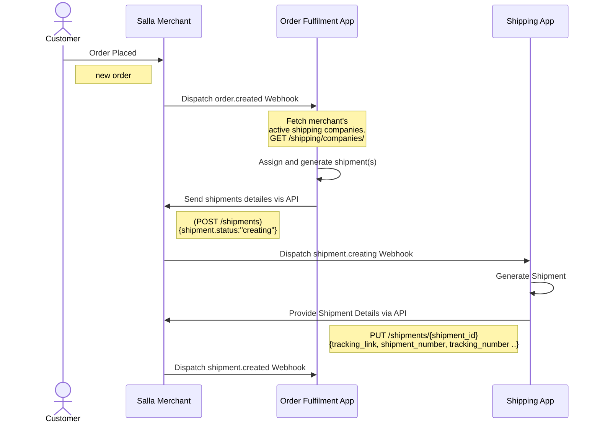
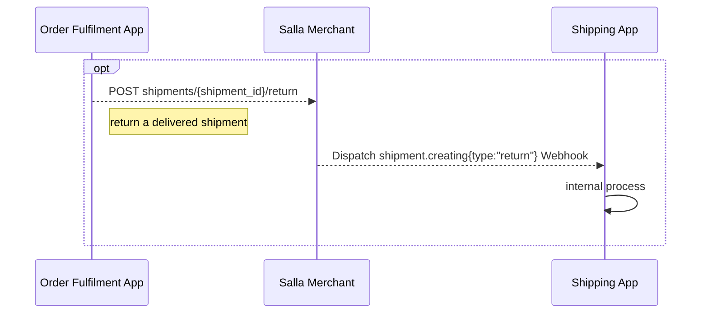
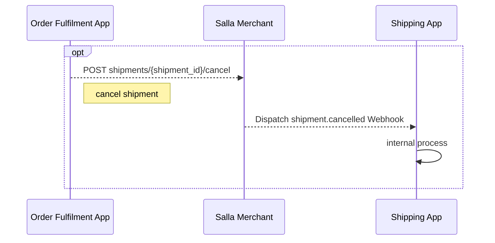

# Order Fulfilment

## Table of Contents

- [order-fulfilment/Create-Order-Fulfilment-App-Partners-Apps-APIs-Salla-Docs](#order-fulfilment-create-order-fulfilment-app-partners-apps-apis-salla-docs)
- [order-fulfilment/Order-Fulfilment-App-Cycle-Partners-Apps-APIs-Salla-Docs](#order-fulfilment-order-fulfilment-app-cycle-partners-apps-apis-salla-docs)
- [order-fulfilment/Setup-Order-Fulfilment-App-Partners-Apps-APIs-Salla-Docs](#order-fulfilment-setup-order-fulfilment-app-partners-apps-apis-salla-docs)
- [order-fulfilment/Test-Order-Fulfilment-App-Partners-Apps-APIs-Salla-Docs](#order-fulfilment-test-order-fulfilment-app-partners-apps-apis-salla-docs)
- [order/Cancel-Order-Salla-Developer-Docs-Twilight-Documentation](#order-cancel-order-salla-developer-docs-twilight-documentation)
- [order/Create-Cart-from-Previous-Order-Salla-Developer-Docs-Twilight-Documentation](#order-create-cart-from-previous-order-salla-developer-docs-twilight-documentation)
- [order/Send-Order-Invoice-Salla-Developer-Docs-Twilight-Documentation](#order-send-order-invoice-salla-developer-docs-twilight-documentation)
- [order/Show-Order-Details-Salla-Developer-Documentation-Twilight-Documentation](#order-show-order-details-salla-developer-documentation-twilight-documentation)

---

## order-fulfilment/Create-Order-Fulfilment-App-Partners-Apps-APIs-Salla-Docs

# Create App

Enabling a better and more efficient ordering process for Salla stores, the new Orders Fulfilment App is here! Salla is proud to introduce the new addition of Apps to help merchants better manage their orders by utilizing the most suitable shipping companies to ship and deliver the orders placed by the store customers.


## 📙 What you’ll learn:
In this article we’ll elaborate the process of creating an Orders Fulfilment App using the [Salla Partners Portal](https://salla.partners).
- [How to create a Salla App for Order Fulfilment](#create-orders-management-app)

### Create Orders Fulfilment App

Login to your account on the [Partners Portal](https://salla.partners/) using your credentials. Once logged in you will be redirected to the main page.

<!-- focus: false -->


From the left menu, can click on "My Apps". This will land on the Apps page where you can create your first app.

<!-- focus: false -->


:::tip[Note]
With Salla App Store, you can have two types of Apps:

**Public App:** your App can go into public usage and display for those users who browse the Salla App Store. The Merchants can view your App's details and may download/purchase your App.

**Private App:** privately built and developed apps for integration to either larger scaled or individual Merchants. The Apps won't be displayed or accessed from the Salla App Store homepage search results and more.
:::


In this step, you will need to choose your App's type  **Public**.

:::caution[Note]
**Private Apps** don’t have the option of Shipping App category
:::


<!-- focus: false -->
<!---->


Afterward, start entering the basic information of your App:
|Item|Description|
|--|--|
|Icon|The App icon image, should have Minimum width : 250 pixels, height : 250 pixels. And the Width to high ratio : 1 : 1 . |
|Name| The App name should be provided in English and Arabic|
|Category| **Shipping Apps** for Shipping services Apps, **General App** for other than Shipping App, **Communication App** for communication providers.|
|Description|Describe your App in 50 characters|
|App Website|The App website URL link|
|Support Email|The App support email address|


<!-- focus: false -->


Following is a complete example for App Basic information:


Now you can click on "Create App" to successfully created your first App on [Salla Partners Portal](https://salla.partners), and complete the [steps of creating an App](https://docs.salla.dev/doc-421410?nav=01HNA8M216X4HFNGWM9TWSTCKQ) as usual.


The developer will receive a notification for creating the App successfully in the [Partners Portal](https://salla.partners/) and on the email linked to the partner's account.

<TipInfo>Read more about publishing Salla App [here](https://salla.dev/blog/standards-salla-apps-publications/).</TipInfo>
<br>

---

## order-fulfilment/Order-Fulfilment-App-Cycle-Partners-Apps-APIs-Salla-Docs

# App Cycle

**Salla** Order Fulfilment is a powerful workflow used by Merchants to streamline their orders' processing. It manages the entire order-to-delivery from the time an order is placed until it has been fulfilled, returned, or canceled.

:::tip[Note]
Salla Shipping API supports assigning an order to **multiple shipping Apps**, providing accurate information about the order to the Shipping Apps ,and managing the order flow. 
:::


In this article, we will explore the following topics:
- Order Fulfilment
  - [Order Placement](#order-placement)
  - [Assign Shipments](#assign-shipments)
  - [Update Shipment Details](#update-shipment-details)
- Shipments Return and Cancellation
  - [Return Shipments](#return-shipments)
  - [Cancel Shipments](#cancel-shipments)


## Order Fulfilment
The following diagram explains two main workflows, which are receiving orders from customers, and then assigning those orders to multiple shipping Apps based on either custom Merchant preferences, the closest shipping service to the customer, and the least shipping cost for the Merchant. 

Moreover, the Order Fulfilment App can handle order shipping cancellations and returns from the customer. 
    


    
### Order Placement

The first step in the Order Fulfilment Cycle is when an order is placed/created, and this happens:

- After checkout is fully processed and done from the Customer's side of the Merchant's store.
- Via the [Create Order](https://docs.salla.dev/api-5394145?nav=01HNA8MH78MVX1S0DRXDHE3A1K) API Endpoint.

The store webhook, [`order.created`](https://docs.salla.dev/doc-433804/?nav=01J1Y9KTRRDA57Q8ZSW95TTVDB), will be triggered and sent over to the Order Fulfilment App, with shipment status being `pending`. That sent data can then be processed to assign the orders to multi-shipping Apps. 
<Tabs>
        
        
  <Tab title="Webhook Payload order.created">
   
At this step, the Order Fulfilment App has all the required information received from the [`order.created`](https://docs.salla.dev/doc-433804/?nav=01J1Y9KTRRDA57Q8ZSW95TTVDB) webhook event and is now able to process the splitting of orders to the shipping Apps. The following payload is correspondent to when the `order.created` event is fired.

      
<Tabs>
  <Tab title="Payload">

<DataSchema id="1307433" />
  </Tab>
  <Tab title="Response">
    ```json
{ 
  "event": "order.created",
  "merchant": 1305146709,
  "created_at": "Sun Jun 26 2022 12:21:48 GMT+0300",
  "data": {
    "id": 2116149737,
    "reference_id": 41027662,
    "urls": {
      "customer": "https://salla.sa/dev-wofftr4xsra5xtlv/order/DXZbOz68qjnYaOw04oBa35wVELBpJyxo",
      "admin": "https://s.salla.sa/orders/order/DXZbOz68qjnYaOw04oBa35wVELBpJyxo"
    },
    "date": {
      "date": "2022-06-26 12:21:45.000000",
      "timezone_type": 3,
      "timezone": "Asia/Riyadh"
    },
    "source": "store",
    "source_device": "desktop",
    "source_details": {
      "type": "direct",
      "value": null,
      "device": "desktop",
      "user-agent": "Mozilla/5.0 (Windows NT 10.0; Win64; x64) AppleWebKit/537.36 (KHTML, like Gecko) Chrome/102.0.0.0 Safari/537.36",
      "ip": "31.166.186.78"
    },
    "first_complete_at": null,
    "status": {
      "id": 566146469,
      "name": "بإنتظار المراجعة",
      "slug": "under_review",
      "customized": {
        "id": 986688842,
        "name": "بإنتظار المراجعة"
      }
    },
    "payment_method": "bank",
    "currency": "SAR",
    "amounts": {
      "sub_total": {
        "amount": 186,
        "currency": "SAR"
      },
      "shipping_cost": {
        "amount": 15,
        "currency": "SAR"
      },
      "cash_on_delivery": {
        "amount": 0,
        "currency": "SAR"
      },
      "tax": {
        "percent": "0.00",
        "amount": {
          "amount": 0,
          "currency": "SAR"
        }
      },
      "discounts": [
        {
          "title": "new offer",
          "type": "special",
          "code": "new offer",
          "discount": "5.00",
          "discounted_shipping": 0
        }
      ],
      "total": {
        "amount": 196,
        "currency": "SAR"
      }
    },
    "shipping": {
      "id": 1833934431,
      "app_id": null,
      "company": "السعودية",
      "logo": "",
      "receiver": {
        "name": "Mohammed Ali",
        "email": "usertest@gmail.com",
        "phone": "9991234%6789"
      },
      "shipper": {
        "name": "Demo",
        "company_name": "dev-wofftr4xsra5xtlv",
        "email": "wofftr4xsra5xtlv@email.partners",
        "phone": "966500000000"
      },
      "pickup_address": {
        "country": "السعودية",
        "country_code": "SA",
        "city": "مكة",
        "shipping_address": "شارع عبدالله,السلام,23233, سنابل السلام, مكة,السعودية",
        "street_number": "شارع عبدالله",
        "block": "السلام",
        "postal_code": "23233",
        "geo_coordinates": {
          "lat": 21.3825905096851,
          "lng": 39.77319103068542
        }
      },
      "address": {
        "country": "SA",
        "country_code": "SA",
        "city": "جدة",
        "shipping_address": " شارع ابو امية الضمري، الحي الزهراء ،, جدة, السعودية",
        "street_number": "ابو امية الضمري",
        "block": "الزهراء",
        "postal_code": "",
        "geo_coordinates": {
          "lat": 0,
          "lng": 0
        }
      },
      "shipment": {
        "id": "0",
        "pickup_id": null,
        "tracking_link": "0",
        "label": []
      },
      "policy_options": []
    },
    "can_cancel": true,
    "show_weight": false,
    "can_reorder": true,
    "is_pending_payment": false,
    "pending_payment_ends_at": 172796,
    "total_weight": "٠٫٢٥ كجم",
    "rating_link": "https://store-test.com/rating-link",
    "shipment_branch": [],
    "customer": {
      "id": 225167971,
      "first_name": "Mohammed",
      "last_name": "Ali",
      "mobile": 501806978,
      "mobile_code": "+966",
      "email": "usertest@gmail.com",
      "urls": {
        "customer": "https://salla.sa/dev-wofftr4xsra5xtlv/profile",
        "admin": "https://s.salla.sa/customers/l7mYBdgXA9xJwWZRZK8WD42GNkZbjvRO"
      },
      "avatar": "https://cdn.salla.sa/customer_profiles/5i6SUhu9dlF1fvL3EcV98U644eOlG9jcEipz6dOo.jpg",
      "gender": "female",
      "birthday": {
        "date": "1997-06-03 00:00:00.000000",
        "timezone_type": 3,
        "timezone": "Asia/Riyadh"
      },
      "city": "جدة",
      "country": "السعودية",
      "country_code": "SA",
      "currency": "SAR",
      "location": "",
      "updated_at": {
        "date": "2022-06-22 10:20:14.000000",
        "timezone_type": 3,
        "timezone": "Asia/Riyadh"
      }
    },
    "items": [
      {
        "id": 70815337,
        "name": "بيتزا",
        "sku": "54534534",
        "quantity": 1,
        "currency": "SAR",
        "weight": 0.25,
        "weight_label": "٠٫٢٥ كجم",
        "amounts": {
          "price_without_tax": {
            "amount": 186,
            "currency": "SAR"
          },
          "total_discount": {
            "amount": 5,
            "currency": "SAR"
          },
          "tax": {
            "percent": "0.00",
            "amount": {
              "amount": 0,
              "currency": "SAR"
            }
          },
          "total": {
            "amount": 186,
            "currency": "SAR"
          }
        },
        "notes": "",
        "product": {
          "id": 720881993,
          "type": "food",
          "promotion": {
            "title": "اطلبها ساخنه",
            "sub_title": "بيتزا خضار مشكل"
          },
          "status": "sale",
          "is_available": true,
          "sku": "54534534",
          "name": "بيتزا",
          "price": {
            "amount": 66,
            "currency": "SAR"
          },
          "sale_price": {
            "amount": 45,
            "currency": "SAR"
          },
          "currency": "SAR",
          "url": "https://salla.sa/dev-wofftr4xsra5xtlv/بيتزا/p720881993",
          "thumbnail": "https://cdn.salla.sa/bYQEn/buItWZf4OLbaTmL7vTMlDUWLOn20hfpq3QUbD2AB.jpg",
          "has_special_price": false,
          "regular_price": {
            "amount": 66,
            "currency": "SAR"
          },
          "calories": "600.00",
          "mpn": null,
          "gtin": null,
          "favorite": null,
          "starting_price": null
        },
        "options": [
          {
            "id": 1197801866,
            "product_option_id": 60176141,
            "name": "SIZE",
            "type": "checkbox",
            "value": [
              {
                "id": 408420634,
                "name": "BIG",
                "price": {
                  "amount": 120,
                  "currency": "SAR"
                }
              }
            ]
          },
          {
            "id": 289546379,
            "product_option_id": 1674915438,
            "name": "الاضافات",
            "type": "checkbox",
            "value": [
              {
                "id": 152115913,
                "name": "بصل",
                "price": {
                  "amount": 0,
                  "currency": "SAR"
                }
              },
              {
                "id": 1526610378,
                "name": "فلفل",
                "price": {
                  "amount": 0,
                  "currency": "SAR"
                }
              }
            ]
          }
        ],
        "images": [],
        "codes": [],
        "files": []
      }
    ],
    "bank": {
      "id": 326553500,
      "bank_name": "البنك الأهلي التجاري",
      "bank_id": 1473353380,
      "account_name": "Demo Account",
      "account_number": "000000608010167519",
      "iban_number": "SA2380000382608010130308",
      "status": "active"
    },
    "tags": []
  },
  "pickup_branch": {
    "id": 1345871747,
    "name": "Branch",
    "status": "active",
    "location": {
      "lat": "37.78044939",
      "lng": "-97.8503951"
    },
    "contacts": {
      "phone": "+201099999999",
      "whatsapp": "+201099999999",
      "telephone": "+201099999999"
    },
    "preparation_time": "ساعة 30 دقيقة",
    "is_open": false,
    "closest_time": {
      "from": "08:00",
      "to": "17:00"
    },
    "working_hours": [
      {
        "name": "الأحد",
        "times": [
          {
            "from": "08:00",
            "to": "17:00"
          },
          {
            "from": "19:00",
            "to": "23:30"
          }
        ]
      }
    ],
    "is_cod_available": true,
    "is_default": true,
    "type": [],
    "cod_cost": "15",
    "country": {
      "id": 1473353380,
      "name": "السعودية",
      "name_en": "Saudi Arabia",
      "code": "SA",
      "mobile_code": "+966"
    },
    "city": {
      "id": 1,
      "name": "الرياض",
      "name_en": "Riyadh"
    }
  }
}
```

  </Tab>
</Tabs>

  </Tab>
  <Tab title="List Shipping Apps Endpoint">
    
The Order Fulfilment App has to consume the [List Shipping Apps](https://docs.salla.dev/api-5394239?nav=01HNA8MH78MVX1S0DRXDHE3A1K) API Endpoint to know which shipping Apps have been enabled by the Merchant on the store, so that the assigning of the orders can be handled smoothly. 
      
      
<Tabs>
  <Tab title="Payload">
 
<DataSchema id="1384646" />
  </Tab>
  <Tab title="Response">
   ```json
{
  "status": 200,
  "success": true,
  "data": [
    {
      "id": 1723506348,
      "name": "سمسا",
      "app_id": "1683195908",
      "activation_type": "manual",
      "slug": null
    },
    {
      "id": 989286562,
      "name": "ارامكس",
      "app_id": "1311345502",
      "activation_type": "manual",
      "slug": null
    },
    {
      "id": 2079537577,
      "name": "البريد السعودي | سُبل",
      "app_id": "88903443",
      "activation_type": "manual",
      "slug": null
    },
    {
      "id": 814202285,
      "name": "DHL Express",
      "app_id": "827885927",
      "activation_type": "api",
      "slug": "dhl-express"
    },
    {
      "id": 1130931637,
      "name": "Ajeek",
      "app_id": "1499493023",
      "activation_type": "api",
      "slug": "ajeek"
    },
    {
      "id": 665151403,
      "name": "أي مكان",
      "app_id": "944213936",
      "activation_type": "manual",
      "slug": null
    },
    {
      "id": 915304371,
      "name": "UPS",
      "app_id": "1218344689",
      "activation_type": "api",
      "slug": "ups"
    },
    {
      "id": 1764372897,
      "name": "فتشر",
      "app_id": "2099547131",
      "activation_type": "api",
      "slug": "fetcher"
    },
    {
      "id": 1378987453,
      "name": "mlcGO",
      "app_id": "1720219575",
      "activation_type": "manual",
      "slug": null
    },
    {
      "id": 349994915,
      "name": "سلاسة",
      "app_id": "456034465",
      "activation_type": "manual",
      "slug": null
    },
    {
      "id": 1096243131,
      "name": "Storage Station",
      "app_id": "1353087977",
      "activation_type": "api",
      "slug": "storage-station"
    }
  ]
}
```
  </Tab>
</Tabs>

  </Tab>
  <Tab title=" Assign Shipments Body Request">
   

The Order Fulfilment App will then now be able to assign a shipment to the order using the [Create Shipment](https://docs.salla.dev/api-5394231?nav=01HNA8MH78MVX1S0DRXDHE3A1K) API endpoint. 

The following enlists the values that are sent to the endpoint to do so:


<DataSchema id="1383992" />
  </Tab>

   <Tab title="Assign Shipments Response">
         
When the endpoint is consumed successfully, the developer is expected to receive the following payload payload.

```json
{
  "status": 200,
  "success": true,
  "data": {
    "id": 1139865338,
    "order_id": 1915190521,
    "created_at": {
      "date": "2023-01-12 14:19:08.000000",
      "timezone_type": 3,
      "timezone": "Asia/Riyadh"
    },
    "type": "shipment",
    "courier_id": 814202285,
    "courier_name": "DHL",
    "courier_logo": "https://company.com/logo.png",
    "shipping_number": "0",
    "tracking_number": "0",
    "pickup_id": null,
    "trackable": true,
    "tracking_link": "https://www.logistics.dhl/us-en/home/tracking/tracking-express.html?submit=1&tracking-id=0",
    "label": [],
    "payment_method": "cod",
    "source": "api",
    "status": "creating",
    "total": {
      "amount": 100,
      "currency": "SAR"
    },
    "cash_on_delivery": {
      "amount": "10.70",
      "currency": "SAR"
    },
    "meta": {
      "app_id": null,
      "policy_options": {
        "types": "",
        "boxes": "1"
      }
    },
    "ship_from": {
      "type": "branch",
      "name": "Riyadh",
      "email": "",
      "phone": "0555555555",
      "country": "السعودية",
      "city": "RIYADH",
      "address_line": "7687 طريق الملك فهد الفرعي,الملك فهد,12262, 7687 طريق الملك فهد الفرعي، الملك فهد، الرياض 12262 3010، السعودية, RIYADH,السعودية",
      "street_number": "7687 طريق الملك فهد الفرعي",
      "block": "الملك فهد",
      "postal_code": "12262",
      "latitude": 24.7431373,
      "longitude": 46.6570741,
      "branch_id": 1723506348
    },
    "ship_to": {
      "type": "address",
      "name": "Username",
      "email": "username@email.com",
      "phone": "055-555-555",
      "country": "السعودية",
      "city": "الرياض",
      "address_line": " شارع 2345، الحي السلام 95128،, شارع عبدالله  سنابل السلام  مكة  السعوديه,, الرياض, السعودية",
      "street_number": "2345",
      "block": "السلام",
      "postal_code": "95128",
      "latitude": 21.382590509685,
      "longitude": 39.773191030685
    },
    "packages": [
      {
        "name": "منتج تجريبي",
        "sku": "6ytrrhrhr",
        "price": {
          "amount": "50.00",
          "currency": "SAR"
        },
        "quantity": 2,
        "weight": {
          "value": "1.00",
          "unit": "kg"
        }
      }
    ]
  }
}
```
  </Tab>
  
</Tabs>

<!-- theme: success
> ### 💡 Important
>
> Since [Orders Payload](https://docs.salla.dev/docs/merchant/branches/APIs_ShipmentsUpdate_Nabil/8bd32aa712b65-order) contains the `shipments` array of objects, the orders received by Salla Merchants can be assigned to multiple shipping companies. The `status` variable in the `shipments` payload will then be converted to [`order.creating`](https://docs.salla.dev/docs/merchant/594b08ec06528-orders-webhook-events-model) once the shipping assignment is conducted by the Order Fulfilment App. -->

### Update Shipment Details

Understanding the process of the [Shipping App Cycle](https://docs.salla.dev/doc-422994?nav=01HNA8MH78MVX1S0DRXDHE3A1K) is vital for the Order Fulfilment App, which adds a layer of smooth integration and communication between both services.

:::info[Information]
Checkout the [Shipping App Cycle guide](https://docs.salla.dev/doc-422994?nav=01HNA8MH78MVX1S0DRXDHE3A1K) for more details on the workflow.
:::

The store webhook, [`shipment.creating`](schema-1307439), will be triggered and sent to the Shipping App. The Shipping App will use the shipment information, such as the recipient's address and the items being shipped, to create the shipment and set up the delivery process, so the Merchant will be able to download the shipment policy.

Accordingly, after creating the shipment by the Shipping App, the Merchant store will receive the updates, and the store webhook, [`shipment.created`](https://docs.salla.dev/doc-433807/?nav=01J1Y9KTRRDA57Q8ZSW95TTVDB) will be triggered at that moment to update the shipment status for the Order Fulfillment App.

<Tabs>
  <Tab title="Update Shipment Request Body">
      
   The following enlists the values that can be sent to the endpoint to update the details of the shipment


<DataSchema id="1383986" />

  </Tab>
  <Tab title="Update Shipment Response Body">
      
   ✅ When the endpoint is consumed successfully, your shipping App is expected to receive this payload.

```json
{
  "status": 200,
  "success": true,
  "data": {
    "id": 1139865338,
    "reference_id": null,
    "created_at": {
      "date": "2023-01-12 14:19:08.000000",
      "timezone_type": 3,
      "timezone": "Asia/Riyadh"
    },
    "type": "shipment",
    "courier": {
      "id": 814202285,
      "name": "DHL",
      "logo": "https://company.com/logo.png"
    },
    "shipping_number": "0",
    "tracking_number": "0",
    "pickup_id": null,
    "trackable": true,
    "tracking_link": "https://www.company/tracking/tracking-express.html?submit=1&tracking-id=12345",
    "label": [],
    "payment_method": "cod",
    "source": "api",
    "status": {
      "id": 566146469,
      "name": "بإنتظار المراجعة",
      "slug": "under_review"
    },
    "total": {
      "amount": 7000,
      "currency": "SAR"
    },
    "cash_on_delivery": {
      "amount": 15,
      "currency": "SAR"
    },
    "meta": {
      "app_id": null,
      "policy_options": {
        "boxes": 2
      }
    },
    "ship_from": {
      "type": "branch",
      "branch_id": 1723506348,
      "name": "Riyadh",
      "email": null,
      "phone": "0555555555",
      "country": "السعودية",
      "city": "الرياض",
      "address_line": "7687 طريق الملك فهد الفرعي، الملك فهد، الرياض 12262 3010، السعودية",
      "street_number": "7687 طريق الملك فهد الفرعي",
      "block": "الملك فهد",
      "postal_code": "12262",
      "geo_coordinates": {
        "lat": "24.7431373",
        "lng": "46.6570741"
      }
    },
    "ship_to": {
      "type": "address",
      "name": "Username",
      "email": "username@email.com",
      "phone": "050-948-0868",
      "country": "السعودية",
      "city": "الرياض",
      "address_line": "شارع عبدالله  سنابل السلام  مكة  السعوديه",
      "street_number": "2345",
      "block": "السلام",
      "postal_code": "95128",
      "geo_coordinates": {
        "lat": "21.382590509685",
        "lng": "39.773191030685"
      }
    },
    "packages": [
      {
        "name": "Apple Watch",
        "sku": "6ytrrhrhr",
        "price": {
          "amount": "1000.00",
          "currency": "SAR"
        },
        "quantity": 2,
        "weight": {
          "value": "0.10",
          "unit": "kg"
        }
      },
      {
        "name": "Apple Iphone 14 Pro Max",
        "sku": "6ytrrhrhr3332",
        "price": {
          "amount": "5000.00",
          "currency": "SAR"
        },
        "quantity": 1,
        "weight": {
          "value": "0.50",
          "unit": "kg"
        }
      }
    ]
  }
}
```


  </Tab>
</Tabs>

## Shipments Return and Cancellation

### Return Shipments


The following diagram details the return process, which can be triggered by the Order Fulfilment App on behalf of the Merchant to the Shipping App




<Tabs>
  <Tab title="Return Shipments Request">

The Order Fulfilment can initiate a return on delivered shipment by consuming the [Return Shipments](https://docs.salla.dev/api-5394236?nav=01HNA8MH78MVX1S0DRXDHE3A1K) API Endpoint by sending the `shipment_id` as a path parameter in this manner `https://api.salla.dev/admin/v2/shipments/{shipment_id}/return`, which such request will then be sent to the [Shipping Apps](https://docs.salla.dev/doc-422994?nav=01HNA8MH78MVX1S0DRXDHE3A1K#handling-returns) for them to handle the returning process.

  </Tab>
  <Tab title="Return Shipments Response">
   
When the endpoint is consumed successfully, the developer is expected to receive the following payload.

```json
{
  "status": 200,
  "success": true,
  "data": {
    "id": 1139865338,
    "order_id": 1915190521,
    "created_at": {
      "date": "2023-01-12 14:19:08.000000",
      "timezone_type": 3,
      "timezone": "Asia/Riyadh"
    },
    "type": "shipment",
    "courier_id": 814202285,
    "courier_name": "DHL",
    "courier_logo": "https://company.com/logo.png",
    "shipping_number": "0",
    "tracking_number": "0",
    "pickup_id": null,
    "trackable": true,
    "tracking_link": "https://www.logistics.dhl/us-en/home/tracking/tracking-express.html?submit=1&tracking-id=0",
    "label": [],
    "payment_method": "cod",
    "source": "api",
    "status": "creating",
    "total": {
      "amount": 100,
      "currency": "SAR"
    },
    "cash_on_delivery": {
      "amount": "10.70",
      "currency": "SAR"
    },
    "meta": {
      "app_id": null,
      "policy_options": {
        "types": "",
        "boxes": "1"
      }
    },
    "ship_from": {
      "type": "branch",
      "name": "Riyadh",
      "email": "",
      "phone": "0555555555",
      "country": "السعودية",
      "city": "RIYADH",
      "address_line": "7687 طريق الملك فهد الفرعي,الملك فهد,12262, 7687 طريق الملك فهد الفرعي، الملك فهد، الرياض 12262 3010، السعودية, RIYADH,السعودية",
      "street_number": "7687 طريق الملك فهد الفرعي",
      "block": "الملك فهد",
      "postal_code": "12262",
      "latitude": 24.7431373,
      "longitude": 46.6570741,
      "branch_id": 1723506348
    },
    "ship_to": {
      "type": "address",
      "name": "Username",
      "email": "username@email.com",
      "phone": "055-555-555",
      "country": "السعودية",
      "city": "الرياض",
      "address_line": " شارع 2345، الحي السلام 95128،, شارع عبدالله  سنابل السلام  مكة  السعوديه,, الرياض, السعودية",
      "street_number": "2345",
      "block": "السلام",
      "postal_code": "95128",
      "latitude": 21.382590509685,
      "longitude": 39.773191030685
    },
    "packages": [
      {
        "name": "منتج تجريبي",
        "sku": "6ytrrhrhr",
        "price": {
          "amount": "50.00",
          "currency": "SAR"
        },
        "quantity": 2,
        "weight": {
          "value": "1.00",
          "unit": "kg"
        }
      }
    ]
  }
}
```

  </Tab>
</Tabs>


### Cancel Shipments


The following diagram details the cancellation process, which can be triggered by the Order Fulfilment App on behalf of the Merchant to the Shipping App



<Tabs>
  <Tab title="Cancel Shipments Request">
      
The Order Fulfilment App is able to cancel any shipment by consuming the [Cancel Shipments](https://docs.salla.dev/api-5394235?nav=01HNA8MH78MVX1S0DRXDHE3A1K) API Endpoint by sending the `shipment_id` as a path parameter in this manner `https://api.salla.dev/admin/v2/shipments/{shipment_id}/cancel`, which the [Shipping App](https://docs.salla.dev/doc-422994?nav=01HNA8MH78MVX1S0DRXDHE3A1K#cancelling-shipment) will receive to handle the proper action for that.
      
  </Tab>
  <Tab title="Cancel Shipments Response">
    
When the endpoint is consumed successfully, the developer is expected to receive the [following payload](schema-1307438).

```json
{
  "status": 200,
  "success": true,
  "data": {
    "id": 1139865338,
    "order_id": 1915190521,
    "created_at": {
      "date": "2023-01-12 14:19:08.000000",
      "timezone_type": 3,
      "timezone": "Asia/Riyadh"
    },
    "type": "shipment",
    "courier_id": 814202285,
    "courier_name": "DHL",
    "courier_logo": "https://company.com/logo.png",
    "shipping_number": "0",
    "tracking_number": "0",
    "pickup_id": null,
    "trackable": true,
    "tracking_link": "https://www.logistics.dhl/us-en/home/tracking/tracking-express.html?submit=1&tracking-id=0",
    "label": [],
    "payment_method": "cod",
    "source": "api",
    "status": "creating",
    "total": {
      "amount": 100,
      "currency": "SAR"
    },
    "cash_on_delivery": {
      "amount": "10.70",
      "currency": "SAR"
    },
    "meta": {
      "app_id": null,
      "policy_options": {
        "types": "",
        "boxes": "1"
      }
    },
    "ship_from": {
      "type": "branch",
      "name": "Riyadh",
      "email": "",
      "phone": "0555555555",
      "country": "السعودية",
      "city": "RIYADH",
      "address_line": "7687 طريق الملك فهد الفرعي,الملك فهد,12262, 7687 طريق الملك فهد الفرعي، الملك فهد، الرياض 12262 3010، السعودية, RIYADH,السعودية",
      "street_number": "7687 طريق الملك فهد الفرعي",
      "block": "الملك فهد",
      "postal_code": "12262",
      "latitude": 24.7431373,
      "longitude": 46.6570741,
      "branch_id": 1723506348
    },
    "ship_to": {
      "type": "address",
      "name": "Username",
      "email": "username@email.com",
      "phone": "055-555-555",
      "country": "السعودية",
      "city": "الرياض",
      "address_line": " شارع 2345، الحي السلام 95128،, شارع عبدالله  سنابل السلام  مكة  السعوديه,, الرياض, السعودية",
      "street_number": "2345",
      "block": "السلام",
      "postal_code": "95128",
      "latitude": 21.382590509685,
      "longitude": 39.773191030685
    },
    "packages": [
      {
        "name": "منتج تجريبي",
        "sku": "6ytrrhrhr",
        "price": {
          "amount": "50.00",
          "currency": "SAR"
        },
        "quantity": 2,
        "weight": {
          "value": "1.00",
          "unit": "kg"
        }
      }
    ]
  }
}
```
  </Tab>
</Tabs>

:::highlight green 🎉 
Reaching here means you have a full idea of how Order Fulfilment Apps functions and you can proceed to [Set Up](https://docs.salla.dev/doc-423002?nav=01HNA8MH78MVX1S0DRXDHE3A1K) your Orders Fulfilment App.
:::

---

## order-fulfilment/Setup-Order-Fulfilment-App-Partners-Apps-APIs-Salla-Docs

# Setup App

After successfully [creating](https://docs.salla.dev/doc-423001?nav=01HNA8MH78MVX1S0DRXDHE3A1K) Orders Fulfilment App the developer needs to apply further detailing to the App to make it fit for functioning at [Salla platform](https://apps.salla.sa). 

## 📙 What you’ll learn:
In this article we’ll elaborate the process of setting up Orders Fulfilment Apps using the [Salla Partners Portal](https://salla.partners).

- [How to setup a Salla App for Order Fulfilment](#setup-orders-management-app).

### Setup Orders Fulfilment App
Open the App details page by clicking on *My Apps* menu item on the left side of the main page in the [Partners Portal](https://salla.partners/apps). 
<!--
focus: false
-->

Set up the App using the basic [standards for Salla public Apps](https://salla.dev/blog/create-your-first-app-on-salla-developer-portal/). 
Additionally, you will be required to set up the **Scopes** and **Store Events** for the Orders Fulfilment App.

On the App details page, scroll down to the Scope and set it to include the following:
- Basic Info
- Orders
- Webhooks
- Shipping
As shown below.
<!--
focus: false
-->


These are the minimum requirements for Orders Fulfilment App, and the developer may add additional based on the App needs . After selecting the scopes, click on *Update the Scopes* to save the changes made

Next, set up the **Store Events** in the Webhooks/Notification section. Scroll down from the Scopes towards the Webhooks/Notifications section and click on *Add Events* in the Store Events.
<!--
focus: false
-->


This will display the list of Store Events, enable:
- **Order Created** store event in **Orders** category, and 
- **Shiment Created** store event in **Shipping** category. Then click *Save*.

<!--
focus: false
-->


:::highlight green 🎉
**Congratulations!** You have successfully set up an Orders Fulfilment App for Salla stores. Proceed to [Test](https://docs.salla.dev/doc-423003?nav=01HNA8MH78MVX1S0DRXDHE3A1K) your App using [Demo Stores](https://salla.dev/blog/how-to-test-your-app-using-salla-demo-stores/).

---

## order-fulfilment/Test-Order-Fulfilment-App-Partners-Apps-APIs-Salla-Docs

# Test App

Testing Apps is one step closer towards having your Apps on [Salla Apps Store](https://apps.salla.sa/). These step are critical and are simplified in this article.

## 📙 What you'll learn:

In this article we'll go through the App testing to test the Orders Fulfilment App functions using a [demo store](https://salla.dev/blog/how-to-test-your-app-using-salla-demo-stores/).
- [How to Test your Orders Fulfilment Apps](#how-to-test-your-orders-managements-apps)

## How to Test your Order Fulfilment Apps 

App testing is important in order to discover defects/bugs before publishing, this guarantees that the App functions perfectly. Salla offers demo stores where developers can test their Apps.
Here we will go through testing [Orders Fulfilment Apps](https://docs.salla.dev/doc-423001?nav=01HNA8MH78MVX1S0DRXDHE3A1K). 

### App Testing Scenarios
Testing Apps on [demo stores](https://salla.dev/blog/how-to-test-your-app-using-salla-demo-stores/) provides a safe and controlled environment to evaluate App functionality and performance, helping the developer verify App's behavior before publishing it.

The developer can test the Order Fulfilment App with a Salla demo store to inspect the link between the Orders Fulfilment App and Salla stores. For Orders Fulfilment Apps there is a number of [events](https://docs.salla.dev/doc-423003) that are triggered in the store including `order.created` which is triggered by creating an order in the store. 

In this testing scenario we will illustrate the merchant creating an order and then check the [Webhooks Log](https://salla.partners/logs) to see the event.

<Steps>
  <Step title="First Step">
The developer will need to set up the App's Webhook URL to receive the store notifications, for the sake of this test we will [set up a workable URL](https://salla.dev/blog/how-to-test-your-app-using-salla-demo-stores/) from https://webhook.site/. This will act as Salla Server, which will allow the developer to listen for Salla webhooks.
  </Step>
  <Step title="Second Step">
Create a [demo store](https://salla.dev/blog/how-to-test-your-app-using-salla-demo-stores/).
  </Step>
  <Step title="Third Step">
Install and authorize the App on the demo store.
  </Step>
      <Step title="Fourth Step">
Create an order on the Demo Store dashboard.
  </Step>
          <Step title="Fifth Step">
Generate a Shipping policy.
  </Step>
</Steps>

After finishing all the steps, the developer can check the [Webhooks Log](https://salla.dev/blog/the-new-salla-apps-events-activity-log/) on the [Salla Partners Portal](https://salla.partners/login)
to see the triggered event, which in our scenario is `order.created`.

<!--
focus: false
-->


The above summarized steps are thoroughly explained below with images for an elaborated explanation.


The developer may proceed to *App Details* page in the [Partners Portal](https://salla.partners/) to start the App testing.

<!--
focus: false
-->


1. [Set up the webhook URL](https://salla.dev/blog/how-to-test-your-app-using-salla-demo-stores/) using [Webhook stie](https://webhook.site). More details in [here](https://salla.dev/blog/how-to-test-your-app-using-salla-demo-stores/).

<!--
focus: false
-->


2. Scroll down to App Testing section to create a demo store and click on "Create Demo Store"

<!--
focus: false
-->


This will prompt a from for Demo Store details

<!--
focus: false
-->


3. After [creating](https://salla.dev/blog/how-to-test-your-app-using-salla-demo-stores/) a demo store, click on *Install App* button located on the right of the demo store chosen.

<!--
focus: false
-->


This will prompt an authorization request as customary to the real time experience.

<!--
focus: false
-->


Click on *Authorize App*, which will redirect the page to the demo store where the developer can test the Shipping App.

<!--
focus: false
-->


4. Create an Order on the demo store, by clicking on *Orders* on the right side of the page, and then click on create new order.

<!--
focus: false
-->


5. Fill up creating Order details as shown below.
<!--
focus: false
-->


Getting here means that the order has been successfully created in the store and the developer can check the 
[Webhooks Log](https://salla.dev/blog/the-new-salla-apps-events-activity-log/) on the [Salla Partners Portal](https://salla.partners/login) to see the triggered event, which in our scenario is `order.created`.

<!--
focus: false
-->


:::highlight green 🎉

**Hurray!!** You have successfully tested the link between your App and Salla store using a demo store. The App is now ready to go through [Publishing process](https://docs.salla.dev/doc-422990?nav=01HNA8MH78MVX1S0DRXDHE3A1K).

---

## order/Cancel-Order-Salla-Developer-Docs-Twilight-Documentation

# Cancel

This endpoint cancels an order, indicating that the customer no longer wants the product that was initially ordered.

## Payload `authenticated`
<DataSchema id="1427906" />

## Response
<Tabs>
  <Tab title="Success">

<DataSchema id="1427907" />
   
  </Tab>
   <Tab title="Error">

    
<DataSchema id="1427184" />
  </Tab>
  
</Tabs>


## Usage
The `cancel()` method receives the *id* of the order to be cancelled when the developer simply calls it.

```js
salla.order.cancel({ id: 98789 }).then((response) => {
  /* add your code here */
});

// TIP: short version
salla.order.cancel(12345).then((response) => {
  /* add your code here */
});
```


## Events
This endpoint may trigger two events, the onCanceled and onNotCanceled events.

### onCanceled
This event is triggered when cancelling an order process is done without having any errors coming back from the backend.

```js
salla.event.order.onCanceled((response) => {
  console.log(response)
});
```
### onNotCanceled
This event is triggered when cancelling an order process is not completed and an error has occurred.

```js
salla.event.order.onNotCanceled((errorMessage) => {
  console.log(errorMessage)
});

---

## order/Create-Cart-from-Previous-Order-Salla-Developer-Docs-Twilight-Documentation

# Create cart from order

This endpoint simply creates a new cart list for the customer, which will include the same items as any previous order. When customers are signed in to their account, they have the option to easily place a repeated order with one click. As a result, the customer will be sent to the checkout page with a new cart list that includes the previous order's items.

## Payload `authenticated`

<DataSchema id="1427901" />


## Response
<Tabs>
  <Tab title="Success">

<DataSchema id="1427902" />
      
  </Tab>
   <Tab title="Error">
       
<DataSchema id="1427184" />
  
    </Tab>
    </Tabs>


## Usage
To allow the customer to place the same order again, the developer may call the `createCartFromOrder()` method along with the `order_id`. 


```js
salla.order.createCartFromOrder({ id: 12345 }).then((response) => {
  /* add your code here */
});

// TIP: short version
salla.order.createCartFromOrder(12345).then((response) => {
  /* add your code here */
});
```


## Events
This endpoint may trigger two events, the onOrderCreated and onOrderCreationFailed events.

### onOrderCreated
This event is triggered when the request of placing the same order again is done without having any errors coming back from the backend.

```js
salla.event.order.onOrderCreated((response) => {
  console.log(response)
});
```
### onOrderCreationFailed
This event is triggered when the request of placing the same order again is not completed and an error has occurred.

```js
salla.event.order.onOrderCreationFailed((errorMessage) => {
  console.log(errorMessage)
});

---

## order/Send-Order-Invoice-Salla-Developer-Docs-Twilight-Documentation

# Send invoice

This endpoint is used to send the order's invoice to the customer's email. The invoice is to confirm the customer's order by showing the products he has ordered, their quantities, and their prices.

## Payload `authenticated`


<DataSchema id="1427908" />

## Response
<Tabs>
  <Tab title="Success">
      
<DataSchema id="1427912" />

  </Tab>
   <Tab title="Error">

<DataSchema id="1427184" />
  </Tab>
  
</Tabs>


## Usage
To perform the action of sending the order's invoice to the customer's email, the developer may call the method `send()` along with the `order_id`.

```js
salla.order.sendInvoice({ id: 98789 }).then((response) => {
  /* add your code here */
});

// TIP: short version
salla.order.sendInvoice(12345).then((response) => {
  /* add your code here */
});
```


## Events
This endpoins may trigger two events, the onSent and onNotSent events.

### onSent
This event is triggered when sending the order's invoice to the customer's email is done without having any errors coming back from the backend.

```js
salla.event.order.onSent((response) => {
  console.log(response)
});
```
### onNotSent
This event is triggered when sending the order's invoice to the customer's email is not completed and an error has occurred.

```js
salla.event.order.onNotSent((errorMessage) => {
  console.log(errorMessage)
});

---

## order/Show-Order-Details-Salla-Developer-Documentation-Twilight-Documentation

# Show order

This endpoint is used to show an order details, such as the quantity, price, delivery date,and payment terms. Mainly it should be called in the [thank you](https://docs.salla.dev/doc-422577?nav=01HNFTD5Y5ESFQS3P9MJ0721VM) page to display the order details.

## Payload `authenticated`

<DataSchema id="1427916" />

## Response

<Tabs>
  <Tab title="Success">

<DataSchema id="1427917" />
  </Tab>
   <Tab title="Error">

<DataSchema id="1427184" />
  </Tab>
  
</Tabs>


## Usage
To perform the action of showing the order's details, the developer may call the method `send()` along with the `order_id`.

```js
salla.order.show({ id: 98789, url: "/" }).then((response) => {
  /* add your code here */
});
```

---

