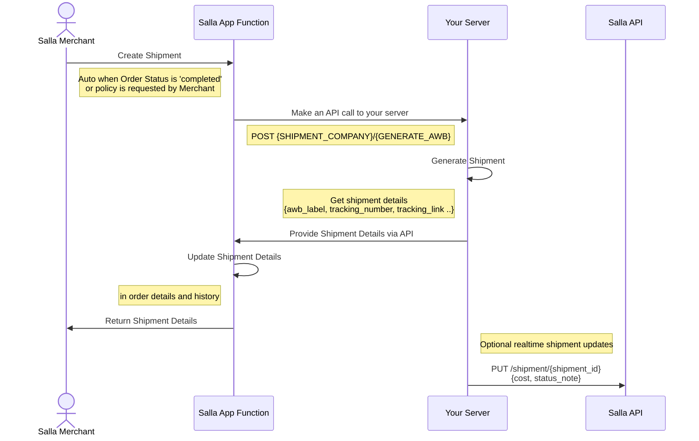
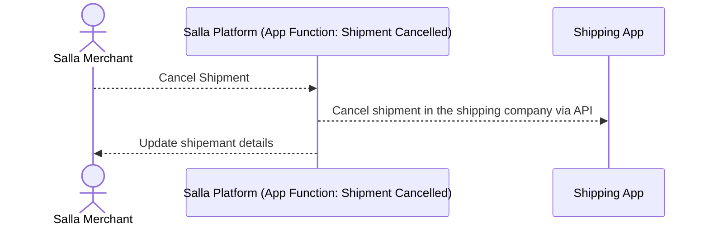
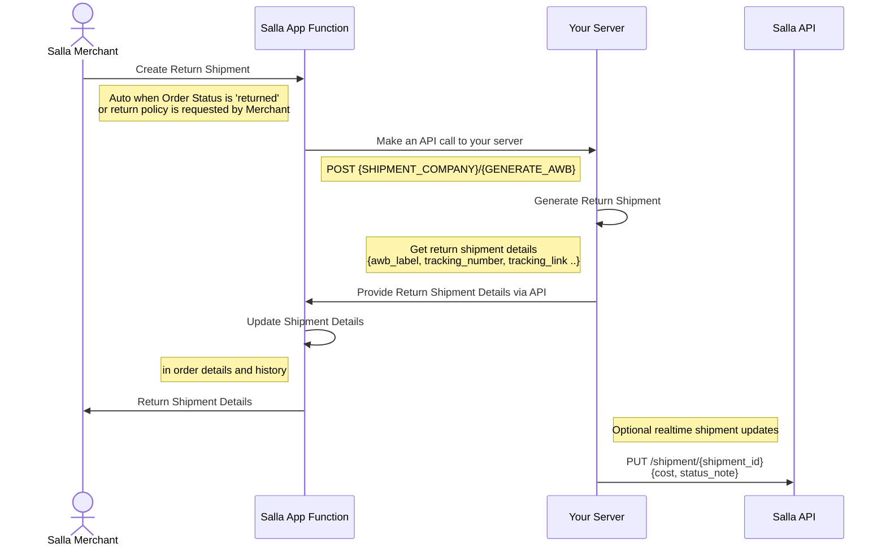
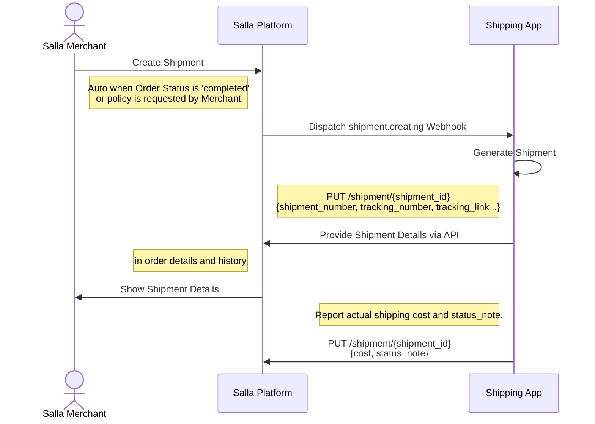
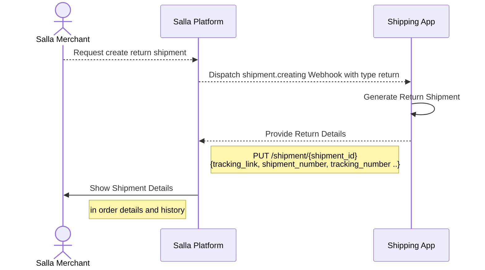
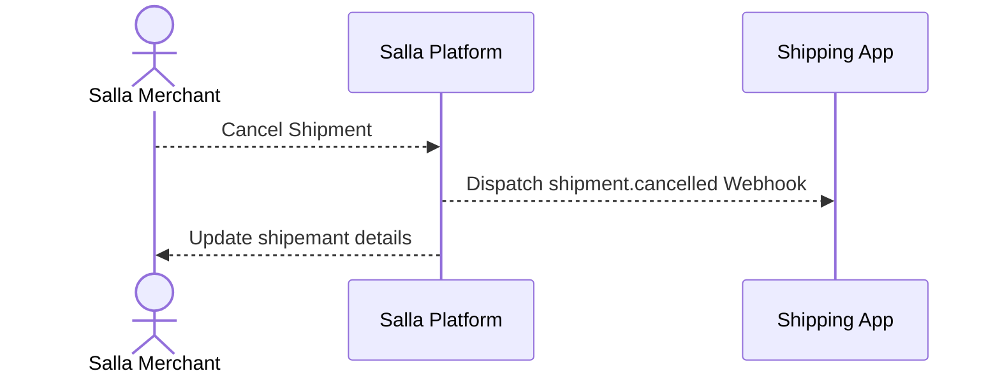

# Shipping Management

## Table of Contents

- [generating-awb/Shipment-AWB-Salla-Merchants-APIs-Salla-Docs](#generating-awb-shipment-awb-salla-merchants-apis-salla-docs)
- [generating-awb/Shipment-Cancelled-AWB-Salla-Merchants-APIs-Salla-Docs](#generating-awb-shipment-cancelled-awb-salla-merchants-apis-salla-docs)
- [generating-awb/Shipment-Return-AWB-Salla-Merchants-APIs-Salla-Docs](#generating-awb-shipment-return-awb-salla-merchants-apis-salla-docs)
- [shipping-companies/List-Shipping-Companies-Salla-Merchants-APIs-Salla-Docs](#shipping-companies-list-shipping-companies-salla-merchants-apis-salla-docs)
- [shipping-companies/Shipping-Company-Details-Salla-Merchants-APIs-Salla-Docs](#shipping-companies-shipping-company-details-salla-merchants-apis-salla-docs)
- [shipping-management/Create-Shipping-Management-App-Partners-Apps-APIs-Salla-Docs](#shipping-management-create-shipping-management-app-partners-apps-apis-salla-docs)
- [shipping-management/Setup-Shipping-Management-App-Partners-Apps-APIs-Salla-Docs](#shipping-management-setup-shipping-management-app-partners-apps-apis-salla-docs)
- [shipping-management/Shipping-Management-App-Cycle-Partners-Apps-APIs-Salla-Docs](#shipping-management-shipping-management-app-cycle-partners-apps-apis-salla-docs)
- [shipping-management/Test-Shipping-Management-App-Partners-Apps-APIs-Salla-Docs](#shipping-management-test-shipping-management-app-partners-apps-apis-salla-docs)

---

## generating-awb/Shipment-AWB-Salla-Merchants-APIs-Salla-Docs

# Shipment AWB

This guide walks you through how to test your Shipping App end-to-end and verify that it correctly generates the Shipment AWB label inside a Salla store.


## What you'll learn:

In this article, you will learn how to test your Shipping App using a [demo store](https://salla.dev/blog/how-to-test-your-app-using-salla-demo-stores/) and confirm that the App works behave as expected.

### How to Test your Shipping App 

App testing is important in order to discover defects/bugs before publishing, this guarantees that the App functions perfectly. Salla offers demo stores where developers can test their Apps.

Testing the Shipping App on [demo stores](https://salla.dev/blog/how-to-test-your-app-using-salla-demo-stores/) provides a safe and controlled environment to evaluate App functionality and performance, helping the developer verify App behavior before publishing it.


#### App Testing Scenarios
In this testing scenario we will illustrate the merchant generating a shipping policy.
<Steps>
  <Step title="Open Orders in the Merchant dashboard">
    From the Merchant dashboard, hover over **Orders** in the sidebar, then click **All Orders** to open the list of orders.


  </Step>


  <Step title="Create a new order using your Shipping App">
    Click **Create new order**. Fill in the customer, products, and any other required order details.  
    In the **Shipping / Courier** section, choose **your Shipping App** as the AWB shipping app so that Salla will use it to generate the label.


:::check[Note]
    You can verify that your app is registered as one of Salla's AWB couriers from the Merchant dashboard under  
    [**Shipping page → Couriers**](https://s.salla.sa/shipping).

    
:::
  </Step>

  <Step title="Generate the shipping label for the order">
    After the order is created, return to **All Orders**, select the order you just created, then click **Create shipping label** from the available actions. Moreover, the generating of the shipping lable can also be triggered when the Order Status is changed to completed | تم التنفيذ


  </Step>


  <Step title="Fill shipping label details and apply">
    In the shipping label form, fill in all required shipment package details, then click **Apply action**.


  </Step>


  <Step title="Call to App Functions (Shipment Creation) ">
    When you apply the action, Salla will make a call to the App Functions (Shipment Creation) you created. Find out more details as explained in the Shipment Creating article [here](https://docs.salla.dev/1792119m0).
      

      
  </Step>

  <Step title="Shipping App generates and returns AWB data">
After receiving the call to App Functions, the Shipping App must call the shipping company's API to generate the shipment AWBs.  
    That API will respond with the relevant shipping details, such as :
    - **PDF label**  
    - **Tracking link**  
    - **Tracking number**

Your App Function then maps these values into Salla’s Shipment response, which will update the shipment details directly to Salla.
  </Step>
    
    <Step title="Response from App Functions">
        
        

<Tabs>
  <Tab title="Success">

Once successful, you will be able to see a message on the screen indicating that the shipment is created.
        

  </Tab>
  <Tab title="Error">
In case of an error in the App Functions' code, you will be able to see that appearing on the screen
      
  

      
  </Tab>
</Tabs>

        
        

        
    </Step>
   
     <Step title="Showcase Details">
        
You may manually refresh the page and you will be able to see the shipping details, such as tracking number.


         
    </Step>
    
</Steps>

---

## generating-awb/Shipment-Cancelled-AWB-Salla-Merchants-APIs-Salla-Docs

# Shipment Cancelled AWB

This guide explains how to test the shipment cancellation flow for a Shipping App end to end and verify that it correctly updates the shipment status inside a Salla store.

## What you will learn

In this article, the focus is on testing shipment cancellations using a [demo store](https://salla.dev/blog/how-to-test-your-app-using-salla-demo-stores/) and confirming that the related App Functions works as expected.

### How to test the shipment cancellation flow

Testing the shipment cancellation flow is important to detect issues before publishing the app. This helps ensure that cancellation requests are handled correctly and that status updates behave as expected.

The Shipping App can be tested using a Salla demo store to confirm the connection between the App and the store, which is fired when the merchant requests to cancel an existing shipment.


#### App Testing Scenarios


For this testing scenario, the focus will be on the flow where the merchant initiates a cancellation request, and allows the cancellation logic to be tested end to end.

<Steps>
  <Step title="Open Orders to locate a cancellable shipment">
    From the Merchant dashboard, hover over **Orders** and click **All Orders** to locate the shipment that is eligible for cancellation.


      
  </Step>

  <Step title="Start the cancellation flow">
    Select an order that already has its shipping label. Open the action dropdown and choose **Cancel shipment** to begin the cancellation request.


      
  </Step>

  <Step title="Handling the cancellation event">
    When you apply the action, Salla will make a call to the app function you created, where retrieve cancelled shipment details happens and then update shipment status to “Cancelled” on the shipping api system. For more details follow the details [here](https://docs.salla.dev/1797616m0)

:::note[]
Shipping companies can reject cancellation if the shipment is already dispatched/delivered.
:::   
      


      
  </Step>
    
    <Step title="Success Page">
        
Once successful, you will be able to see a message on the screen indicating that the shipment is cancelled.
        


        
    </Step>
</Steps>

---

## generating-awb/Shipment-Return-AWB-Salla-Merchants-APIs-Salla-Docs

# Shipment Return AWB

This guide explains how to test the shipment return flow for a Shipping App end to end and verify that it correctly generates the return shipment AWB label inside a Salla store.

## What you will learn

In this article, the focus is on testing shipment returns using a [demo store](https://salla.dev/blog/how-to-test-your-app-using-salla-demo-stores/) and confirming that the related App works behave as expected.

### How to test the shipment return flow

Testing the shipment return flow is important to detect issues before publishing the app. This helps ensure that return shipments are created correctly and that the AWB label, tracking link, and status updates work as expected.

The Shipping App can be tested using a Salla demo store to confirm the connection between the App and the store, which is fired when the merchant generates a return shipping policy.  


#### App Testing Scenarios


For this testing scenario, the focus will be on the flow where the merchant generates a shipping policy, which allows the return shipment logic to be tested.

<Steps>


  <Step title="Start the return-label flow">
    Pick an order that already has its original shipping label, open the action dropdown, and choose **Create return label** so Salla knows you want to generate a return AWB.
      


    </Step>

    <Step title="Fill the return shipment form">
    Complete the return-label form with the required package information, pickup/drop-off details, and any carrier-specific data, then click **Apply action**.


        
  </Step>

  <Step title="Call to App Functions (Shipment Creation) ">
    When you apply the action, Salla will make a call to the App Functions (Shipment Creation) you created. Find out more details as explained in the Shipment Creating article [here](https://docs.salla.dev/1792119m0).


      
  </Step>

  <Step title="Shipping App generates and returns AWB data">
After receiving the call to App Functions, the Shipping App must call the shipping company's API to generate the return shipment AWBs.  
    That API will respond with the relevant shipping details, such as :
    - **PDF label**  
    - **Tracking link**  
    - **Tracking number**

Your App Function then maps these values into Salla’s Shipment response, which will update the shipment details directly to Salla.
  </Step>
    
    <Step title="Response from App Functions">
        
        

<Tabs>
  <Tab title="Success">

Once successful, you will be able to see a message on the screen indicating that the shipment is created.
        

  </Tab>
  <Tab title="Error">
In case of an error in the App Functions' code, you will be able to see that appearing on the screen
      
  

      
  </Tab>
</Tabs>

        
        

        
    </Step>

   
</Steps>

---

## shipping-companies/List-Shipping-Companies-Salla-Merchants-APIs-Salla-Docs

# List Shipping Companies

## OpenAPI Specification

```yaml
openapi: 3.0.1
info:
  title: ''
  description: ''
  version: 1.0.0
paths:
  /shipping/companies/:
    get:
      summary: List Shipping Companies
      deprecated: false
      description: >
        This endpoint allows you to list all active shipping companies
        associated with the store. 
         
        :::tip[Note]

        If the `"activation_type"` is set to:

          - ***manual*** : which means that the shipping company is from the merchant side *(not available to be linked from salla dashboard)*

          - ***api*** : which means it has been linked through salla.
          :::
        <Accordion title="Scopes" defaultOpen={true} icon="lucide-key-round">

        `shipping.read`- Shipping Read Only

        </Accordion>
      operationId: list-shipping-companies
      tags:
        - Default module/Shipping and Fulfilment API/Shipping Companies
        - Shipping Companies
      parameters: []
      responses:
        '200':
          description: ''
          content:
            application/json:
              schema:
                $ref: '#/components/schemas/ShippingCompaniesResponse'
              example:
                status: 200
                success: true
                data:
                  - id: 1723506348
                    name: سمسا
                    app_id: '1683195908'
                    activation_type: manual
                    slug: null
                  - id: 989286562
                    name: ارامكس
                    app_id: '1311345502'
                    activation_type: manual
                    slug: null
                  - id: 2079537577
                    name: البريد السعودي | سُبل
                    app_id: '88903443'
                    activation_type: manual
                    slug: null
                  - id: 814202285
                    name: DHL Express
                    app_id: '827885927'
                    activation_type: api
                    slug: dhl-express
                  - id: 1130931637
                    name: Ajeek
                    app_id: '1499493023'
                    activation_type: api
                    slug: ajeek
                  - id: 665151403
                    name: أي مكان
                    app_id: '944213936'
                    activation_type: manual
                    slug: null
                  - id: 915304371
                    name: UPS
                    app_id: '1218344689'
                    activation_type: api
                    slug: ups
                  - id: 1764372897
                    name: فتشر
                    app_id: '2099547131'
                    activation_type: api
                    slug: fetcher
                  - id: 1378987453
                    name: mlcGO
                    app_id: '1720219575'
                    activation_type: manual
                    slug: null
                  - id: 349994915
                    name: سلاسة
                    app_id: '456034465'
                    activation_type: manual
                    slug: null
                  - id: 1096243131
                    name: Storage Station
                    app_id: '1353087977'
                    activation_type: api
                    slug: storage-station
          headers: {}
          x-apidog-name: Success
      security:
        - bearer: []
      x-apidog-folder: Default module/Shipping and Fulfilment API/Shipping Companies
      x-apidog-status: released
      x-run-in-apidog: https://app.apidog.com/web/project/451700/apis/api-5578815-run
components:
  schemas:
    ShippingCompaniesResponse:
      type: object
      title: Shipping Companies Response
      properties:
        status:
          type: number
          description: >-
            Response status code, a numeric or alphanumeric identifier used to
            convey the outcome or status of a request, operation, or transaction
            in various systems and applications, typically indicating whether
            the action was successful, encountered an error, or resulted in a
            specific condition.
        success:
          type: boolean
          description: >-
            Response flag, boolean indicator used to signal a particular
            condition or state in the response of a system or application, often
            representing the presence or absence of certain conditions or
            outcomes.
        data:
          type: array
          items:
            $ref: '#/components/schemas/ShippingCompany'
      x-tags:
        - Responses
      x-apidog-orders:
        - status
        - success
        - data
      x-apidog-ignore-properties: []
      x-apidog-folder: ''
    ShippingCompany:
      type: object
      title: Shipping Company
      description: >-
        Detailed structure of the Shipping company model object showing its
        fields and data types.
      properties:
        id:
          type: number
          description: >-
            A unique identifier associated with a specific shipping company or
            carrier.
          examples:
            - 441225901
        name:
          type: string
          description: >-
            The formal name or title of a company or carrier responsible for the
            transportation and delivery of goods, packages, or shipments, and it
            is used to identify the specific entity handling the shipping
            services.
          examples:
            - DHL
        app_id:
          type: string
          description: >-
            A unique identifier associated with a shipping or logistics
            application.
          examples:
            - '112233445'
        activation_type:
          type: string
          enum:
            - manual
            - api
          description: >-
            the method or process by which a shipping company or carrier
            activates its services, such as whether it's manual or API.
        slug:
          type: string
          description: >-
            A short form would be the unique and URL-friendly identifier for a
            shipping company's name. If the `activation_type` is set to
            `manual`, a `null` is returned; otherwise, you will receive a value.
          examples:
            - dhl
          nullable: true
      x-examples:
        Example:
          id: 441225901
          name: DHL
          app_id: '112233445'
          activation_type: api
          slug: dhl
      x-tags:
        - Models
      x-apidog-orders:
        - id
        - name
        - app_id
        - activation_type
        - slug
      x-apidog-ignore-properties: []
      x-apidog-folder: ''
  securitySchemes:
    bearer:
      type: http
      scheme: bearer
servers:
  - url: ''
    description: Cloud Mock
  - url: https://api.salla.dev/admin/v2
    description: Production
security:
  - bearer: []

```

---

## shipping-companies/Shipping-Company-Details-Salla-Merchants-APIs-Salla-Docs

# Shipping Company Details

## OpenAPI Specification

```yaml
openapi: 3.0.1
info:
  title: ''
  description: ''
  version: 1.0.0
paths:
  /shipping/companies/{company_id}:
    get:
      summary: Shipping Company Details
      deprecated: false
      description: >-
        This endpoint allows you to fetch details of shipping companies for your
        store.


        <Accordion title="Scopes" defaultOpen={true} icon="lucide-key-round">

        `shipping.read`- Shipping Read Only

        </Accordion>

          
      operationId: get-shipping-companies-company_id
      tags:
        - Default module/Shipping and Fulfilment API/Shipping Companies
        - Shipping Companies
      parameters:
        - name: company_id
          in: path
          description: Shipping Company ID
          required: true
          example: 0
          schema:
            type: number
      responses:
        '200':
          description: ''
          content:
            application/json:
              schema:
                type: object
                properties:
                  status:
                    type: number
                    description: Response Status Code
                    examples:
                      - 200
                  success:
                    type: boolean
                    description: Whether or not the response is successful
                    default: true
                  data:
                    type: object
                    properties:
                      id:
                        type: number
                        description: Shipping Company ID
                        examples:
                          - 346226214
                      name:
                        type: string
                        description: Shipping Company Name
                        examples:
                          - Shipping Company
                      app_id:
                        type: string
                        description: Shipping Application ID
                        examples:
                          - '505994491'
                        nullable: true
                      activation_type:
                        type: string
                        enum:
                          - api
                          - manual
                          - null
                        description: Shipping Company Activation Type
                        examples:
                          - api
                        nullable: true
                      slug:
                        type: string
                        description: Shipping Company Slug
                        examples:
                          - shipping-company
                        nullable: true
                    x-apidog-orders:
                      - id
                      - name
                      - app_id
                      - activation_type
                      - slug
                    x-apidog-ignore-properties: []
                x-apidog-orders:
                  - status
                  - success
                  - data
                x-apidog-ignore-properties: []
              example:
                status: 200
                success: true
                data:
                  id: 976721503
                  name: Shipping Company
                  app_id: '505994491'
                  activation_type: api
                  slug: shipping-company
          headers: {}
          x-apidog-name: Success
        '404':
          description: ''
          content:
            application/json:
              schema:
                $ref: '#/components/schemas/NotFoundResponse'
              example:
                status: 404
                success: false
                error:
                  code: error
                  message: المحتوى الذي تحاول الوصول اليه غير متوفر
          headers: {}
          x-apidog-name: Not Found
      security:
        - bearer: []
      x-apidog-folder: Default module/Shipping and Fulfilment API/Shipping Companies
      x-apidog-status: released
      x-run-in-apidog: https://app.apidog.com/web/project/451700/apis/api-5578816-run
components:
  schemas:
    NotFoundResponse:
      type: object
      title: NotFoundResponse
      properties:
        status:
          type: number
          description: Response status Code
        success:
          type: boolean
          description: Response flag
        error:
          type: object
          properties:
            code:
              type: integer
              description: Response code
            message:
              type: string
              description: Response message
          x-apidog-orders:
            - code
            - message
          x-apidog-ignore-properties: []
      x-examples:
        Example:
          success: false
          status: 404
          error:
            code: 404
            message: The content you are trying to access is no longer available
      x-tags:
        - Responses
      x-apidog-orders:
        - status
        - success
        - error
      x-apidog-ignore-properties: []
      x-apidog-folder: ''
  securitySchemes:
    bearer:
      type: http
      scheme: bearer
servers:
  - url: ''
    description: Cloud Mock
  - url: https://api.salla.dev/admin/v2
    description: Production
security:
  - bearer: []

```

---

## shipping-management/Create-Shipping-Management-App-Partners-Apps-APIs-Salla-Docs

# Create App

Salla [Partners Portal](https://salla.partners/login) provides the tools to [create different types of Apps](https://salla.dev/blog/create-your-first-app-on-salla-developer-portal/) including Shipping Apps. These Apps streamline shipping for Salla stores by offering a platform to manage orders shipment. As well as integrate with Salla stores and couriers, providing multi-carrier support. They have become essential for online shopping, providing fast, affordable, and reliable shipping services.


## 📙 What you'll learn:
In this article we will walk you through the steps of creating a Shipping App using the [Partners Portal](https://salla.partners) as well as setting up the App for shipping service providers.

- [How to Create a Shipping App](#how-to-create-a-shipping-app)

## How to Create a Shipping App 

Creating Shipping Apps using the [Partners Portal](https://salla.partners) is a straightforward process.

First, log in to [Salla Partners](https://salla.partners) account

Then, click on the *My Apps* menu item on the left of the page. 
<!-- focus: false -->


This will redirect the page to the *My Apps* page. Click on *Create your first App* to begin creating an App.


<!-- focus: false -->


:::tip[Note]
With [Salla App Store](https://apps.salla.sa), you can have two types of Apps:

**Public App:** your App can go into public usage and display for those users who browse the Salla App Store. The Merchants can view your App's details and may download/purchase your App.

**Private App:** privately built and developed apps for integration to either larger scaled or individual Merchants. The Apps won't be displayed or accessed from the Salla App Store homepage search results and more.
:::

In this step, you will need to choose your App's type  **Public**.

:::caution[Note]
**Private Apps** don’t have the option of Shipping App category
:::


<!-- focus: false -->
<!---->


Afterward, start entering the basic information of your App:
|Item|Description|
|--|--|
|Icon|The App icon image, it should have Minimum width : 250 pixels, height : 250 pixels. And the Width to high ratio is : 1 : 1 . |
|Name| The App name should be provided in English and Arabic|
|Category| **Shipping Apps** for Shipping services Apps, **General App** for other than Shipping App, **Communication App** for communication providers.|
|Description|Describe your App in 50 characters, in English and Arabic|
|App Website|The App website URL link|
|Support Email|The App support email address|

Make sure to choose App Category as Shipping. As shown below:


Following is a complete example for Shipping App Basic information:


The developer will receive a notification for creating the App successfully in the [Partners Portal](https://salla.partners/) and on the email linked to the partner's account.

<TipInfo>Read more about publishing Salla App [here](https://salla.dev/blog/standards-salla-apps-publications/).</TipInfo>
<br>

---

## shipping-management/Setup-Shipping-Management-App-Partners-Apps-APIs-Salla-Docs

# Setup App

After successfully creating a [Shipping App](?nav=01HNA8MH78MVX1S0DRXDHE3A1Kdoc-422995) it is now ready to have a few tweaks to become a fully functioning Shipping App and is able to be published in the [Salla Apps Store](https://apps.salla.sa).

## 📙 What you'll learn:
In this article we will walk you through the steps of setting up the App for shipping service providers.

- [Setup the Shipping App](#setup-the-shipping-apps)

## Setup the Shipping App

The Shipping App settings done through the *App details* page. To get there, click on *My Apps* menu item on the left side of [Partners Portal](https://salla.partners/)  main page.  
<!--
focus: false
-->


The *App Details* page is where the developer can manage the [App's Scopes](#app-scope), [Webhooks/Notifications](#webhooksnotifications) and [Shipping Setting](#shipping-settings).

<!--
focus: false
-->


:::caution[Alert]
We highly recommend selecting the Easy mode option when setting up the authorization mode for your shipping app, as it is not only easier to use, but also offers more features compared to the custom mode. By choosing the Easy mode, you can ensure optimal functionality and take advantage of the additional upcoming features and benefits.
:::


### App Scope
App scope section allows the developer to determine the information needed by the App from the store in order to function correctly, by identifying and restricting accessibility to certain features and services. 

:::note[]
The developer can simply enable or disable accessibility by clicking on the option to *Read Only* or *Read and Write*.
:::
<!--
focus: false
-->


After assigning the scopes, click on *Update the scopes* to save the changes. Continue reading to set up [Webhooks](https://docs.salla.dev/doc-421119) of the App.

### Webhooks/Notifications
[Webhooks](https://docs.salla.dev/doc-421119) are used to exchange messages between Apps and the Salla store whereby they are also used to notify developers about store events. 

#### Store Events

For shipping Apps, the developer may need to know when an order shipment is created. This is 
done using [events](https://docs.salla.dev/doc-421119), the developer can easily listen to those events that happen in the store on using *Store Events*. For instance, Shipping Apps can receive events such as *Order Shipment Created*. 
The events are filtered based on the developer preference for the specific App.

The developer can edit store events by clicking on *Added Events*

<!--
focus: false
-->


The developer can enable and disable the relevant [events](doc-421119) then click on *Save* to save the changes.
<!--
focus: false
-->


All of the App Webhook events can be monitored using the [Webhook events log](https://salla.dev/blog/the-new-salla-apps-events-activity-log/).


:::info [A thing to know!]
 
As best practices the developer should enable both`Shipment Creating`and`Shipment Cancelled`for Salla Shipping Apps to enable minimal basic events.
:::


By reaching here, the developer have finished setting up the Store Events in the Webhook Notifications section. Next is Shipping Settings.


### Shipping Settings
Shipping settings are what appear to the store customers when they finish placing their orders in the store and proceed the check out, a summary of the order will be displayed along with shipping details. The shipping details will be explained here.

<Steps>
  <Step title="First Step">
On the *App details* page, scroll down to the *Shipping Settings* section and click on `View Rates` to display the rates.

<!--
focus: false
-->

  </Step>
  <Step title="Second Step">
Then click on *Add a New Rate* to start adding rates of the Shipping by completing the form.

<!--
focus: false
-->


      Form details are explained in the following table.

Item |Description
-----|-----------
Country| The country that the Shipping App offers its services in.
City|The city in the country the Shipping App offers its services.
Excluded Cities(Optional)| The cities excluded from the rate being set.
Rate Type| The developer can choose either Fixed or Rate. 
Cost| Cost of the shipping for fixed Rate Type.
Delivery Duration| The time required to deliver the parcel.
Cash on Delivery| The developer can enable this option to offer COD payment type.
      
      


#### Examples
Next we will be listing in detail two different examples where developers can gain real-world scenario experience while building and developing Shipping Rates for their Shipping Apps.

      
<Tabs>
  <Tab title="Example 1">
Following is an example of a completed form for a rate offered to Saudi Arabia Country, in two Cities; Riyadh and Jeddah, *Fixed* Rate Type, Cost of 50 SAR, Delivery Duration of 7 days, and option of Cash on Delivery enabled with zero fees.

<!--
focus: false
-->


  </Tab>
  <Tab title="Example 2">
Another example of a completed Rate form with Rate Type of *Rate*. 
The shipping rate is for the Country Saudi Arabia with Dammam, and Al Khobar Cities, Rate type of Rate where the initial cost is 10 SAR for the first 1 kg and an additional cost of 5 SAR for each 1 kg. At this rate, Cash on Delivery is not enabled and the delivery duration is 4 days.

<!--
focus: false
-->


  </Tab>
</Tabs>

      

The developer also has the option to add a rate for a country and exclude a few cities, like shown below.
This option will exclude the city Almuzaylif from the rate being set.

<!--
focus: false
-->


Click on Add after filling in the Rate details to save the rates. A notification will be displayed to confirm saving change and the newly added rate will be displayed.

<!--
focus: false
-->


Moreover, you can add shipping policy options straight from the Partners Portal by selecting from the drop down menu list


  </Step>
  <Step title="Third Step">

Finally, customize the shipment features with what accomplies with your shipping service


  </Step>
</Steps>


:::check[**Kudos!!🎉** ]
Reaching here, the developer has successfully [set up](#shipping-app-settings) the Shipping App using Salla Partners Portal.

The App is now ready to go through [Testing process](https://docs.salla.dev/doc-422998?nav=01HNA8MH78MVX1S0DRXDHE3A1K). 
:::

---

## shipping-management/Shipping-Management-App-Cycle-Partners-Apps-APIs-Salla-Docs

# App Cycle

There are several steps that occur before processing a shipping order, and these steps are crucial to streamlining the shipping process, from creating a shipment based on the order from the Merchant to handling returned and cancelled shipments. 

The Salla Shipping API is a tool designed to help developers integrate shipping functionality into Salla Stores. With this API, users can manage their shipments, returns, and cancellations through seamless endpoints and straightforward flows.


:::tip[Note]
- The App has to be subscribed to two [store webhooks](https://docs.salla.dev/doc-421119#list-of-salla-store-events?nav=01HNA8MH78MVX1S0DRXDHE3A1K), which are: [`shipment.creating`](https://docs.salla.dev/doc-433807/?nav=01J1Y9KTRRDA57Q8ZSW95TTVDB) & [`shipment.cancelled`](https://docs.salla.dev/doc-433807/?nav=01J1Y9KTRRDA57Q8ZSW95TTVDB). <br>
- To learn more about Webhooks, such as Registration, Security Strategies, Troubleshooting and more, read more [here](https://docs.salla.dev/doc-421119?nav=01HNA8MH78MVX1S0DRXDHE3A1K).
:::

In this article, we will take a closer look at:
- [Creating New Shipment](#creating-new-shipment)
- [Handling Returns](#handling-returns)
- [Cancelling Shipment](#cancelling-shipment)


### Creating New Shipment

The following diagram visually displays the Create New Shipment stage:

        


The first stage in the Shipping Cycle is creating a new shipment request when a new order has been set by the Salla Merchant, and this happens: 
- The [Order Status](https://docs.salla.dev/api-5394148?nav=01HNA8MH78MVX1S0DRXDHE3A1K) is changed to `completed | تم التنفيذ` 
- Via the Merchant Dashboard, where the Merchant clicks on the `Generate Policy | اصدار بوليصة` button

<!-- #### Consume Update Shipment Details Endpoint -->

The store webhook, [`shipment.creating`](https://docs.salla.dev/doc-433807/?nav=01J1Y9KTRRDA57Q8ZSW95TTVDB), will be triggered and sent to your shipping app. As a result, you will be able to use the shipment information, such as the recipient's address and the items being shipped, to create the shipment and set up the delivery process, and the Merchant will be able to download the shipment policy.

You will be able to update the shipment information using the [Update Shipment Details](http[s://docs.salla.dev/api-5394233?nav=01HNA8MH78MVX1S0DRXDHE3A1K) API endpoint.


<Tabs>
<Tab title="Webhook Payload shipment.creating">


<Tabs>
  <Tab title="Payload">

The following payload is correspondent to when the `shipment.creating` event is fired
      
<DataSchema id="1307439" />
      
  </Tab>
  <Tab title="Response">

The following response is what you should expect when the `shipment.creating` event is fired
      
```json
{
  "event":"shipment.creating",
  "merchant":136409261,
  "created_at":"Sun Jan 29 2023 21:16:38 GMT+0300",
  "data":{
    "order_id":538219147,
    "id":629905440,
    "created_at":{
      "date":"2023-01-29 21:16:38.000000",
      "timezone_type":3,
      "timezone":"Asia/Riyadh"
    },
    "type":"shipment",
    "courier_id":1927161457,
    "courier_name":"Shipping App",
    "courier_logo":"https://company.com/logo.png",
    "shipping_number":"846984645",
    "tracking_number":"4324233",
    "pickup_id":null,
    "trackable":true,
    "tracking_link":"https://www.company/tracking/tracking-express.html?submit=1&tracking-id=12345",
    "label":{
      "format":"pdf",
      "url":"https://company.com/lable.pdf"
    },
    "payment_method":"cod",
    "source":"api",
    "status":"delivered",
    "total":{
      "amount":25.5,
      "currency":"SAR"
    },
    "cash_on_delivery":{
      "amount":10.7,
      "currency":"SAR"
    },
    "is_international":false,
    "total_weight":{
      "value":5,
      "units":"kg"
    },
    "packages":[
      {
        "name":"منتج تجريبي",
        "sku":"6ytrrhrhr",
        "price":{
          "amount":25.5,
          "currency":"SAR"
        },
        "quantity":1,
        "weight":{
          "value":5,
          "unit":"kg"
        }
      }
    ],
    "ship_from":{
      "type":"branch",
      "name":"الفرع الرئيسي",
      "email":"",
      "phone":"966920034002",
      "country":"السعودية",
      "city":"Mecca",
      "address_line":"Mecca,السعودية",
      "street_number":null,
      "block":null,
      "postal_code":null,
      "latitude":21.3825905096851,
      "longitude":39.77319103068542,
      "branch_id":1987977866
    },
    "ship_to":{
      "type":"address",
      "name":"Username",
      "email":"username@email.com",
      "phone":"966501806978",
      "country":"السعودية",
      "city":"الرياض",
      "address_line":" شارع 2345، الحي السلام 95128،, شارع عبدالله  سنابل السلام  مكة  السعوديه,, الرياض, السعودية",
      "street_number":"2345",
      "block":"السلام",
      "postal_code":"95128",
      "latitude":21.382590509685,
      "longitude":39.773191030685
    },
    "meta":{
      "app_id":1222362158,
      "policy_options":{
        "boxes":1
      }
    }
  }
}
```
  </Tab>
 
</Tabs>

    

  </Tab>
  <Tab title="Update Shipment Request Body">
    
The following enlists the values that can be sent to the endpoint to update the details of the shipment


<DataSchema id="1383986" />

  </Tab>
  <Tab title="Update Shipment Response Body">
    


<Tabs>

    
  <Tab title="Payload">

✅ When the endpoint is consumed successfully, your shipping App is expected to receive this payload.
      
<DataSchema id="1384643" />
  </Tab>
  
<Tab title="Response">
✅ When the endpoint is consumed successfully, your shipping App is expected to receive this JSON payload.
```json
{
  "status": 200,
  "success": true,
  "data": {
    "id": 1139865338,
    "reference_id": null,
    "created_at": {
      "date": "2023-01-12 14:19:08.000000",
      "timezone_type": 3,
      "timezone": "Asia/Riyadh"
    },
    "type": "shipment",
    "courier": {
      "id": 814202285,
      "name": "DHL",
      "logo": "https://company.com/logo.png"
    },
    "shipping_number": "0",
    "tracking_number": "0",
    "pickup_id": null,
    "trackable": true,
    "tracking_link": "https://www.company/tracking/tracking-express.html?submit=1&tracking-id=12345",
    "label": [],
    "payment_method": "cod",
    "source": "api",
    "status": {
      "id": 566146469,
      "name": "بإنتظار المراجعة",
      "slug": "under_review"
    },
    "total": {
      "amount": 7000,
      "currency": "SAR"
    },
    "cash_on_delivery": {
      "amount": 15,
      "currency": "SAR"
    },
    "meta": {
      "app_id": null,
      "policy_options": {
        "boxes": 2
      }
    },
    "ship_from": {
      "type": "branch",
      "branch_id": 1723506348,
      "name": "Riyadh",
      "email": null,
      "phone": "0555555555",
      "country": "السعودية",
      "city": "الرياض",
      "address_line": "7687 طريق الملك فهد الفرعي، الملك فهد، الرياض 12262 3010، السعودية",
      "street_number": "7687 طريق الملك فهد الفرعي",
      "block": "الملك فهد",
      "postal_code": "12262",
      "geo_coordinates": {
        "lat": "24.7431373",
        "lng": "46.6570741"
      }
    },
    "ship_to": {
      "type": "address",
      "name": "Username",
      "email": "username@email.com",
      "phone": "050-948-0868",
      "country": "السعودية",
      "city": "الرياض",
      "address_line": "شارع عبدالله  سنابل السلام  مكة  السعوديه",
      "street_number": "2345",
      "block": "السلام",
      "postal_code": "95128",
      "geo_coordinates": {
        "lat": "21.382590509685",
        "lng": "39.773191030685"
      }
    },
    "packages": [
      {
        "name": "Apple Watch",
        "sku": "6ytrrhrhr",
        "price": {
          "amount": "1000.00",
          "currency": "SAR"
        },
        "quantity": 2,
        "weight": {
          "value": "0.10",
          "unit": "kg"
        }
      },
      {
        "name": "Apple Iphone 14 Pro Max",
        "sku": "6ytrrhrhr3332",
        "price": {
          "amount": "5000.00",
          "currency": "SAR"
        },
        "quantity": 1,
        "weight": {
          "value": "0.50",
          "unit": "kg"
        }
      }
    ]
  }
}
```
  </Tab>
</Tabs>
  </Tab>
</Tabs>


:::tip[Note]
As a shipping App, you need to ensure the following when updating the [Shipment Details](https://docs.salla.dev/api-5394234?nav=01HNA8MH78MVX1S0DRXDHE3A1K):
- Update the `cost` variable, containing the actual cost value of the Shipping that the Merchant will be charged for, which is calculated per the shipping App's actual costs. Ensure to include VAT in the cost. 
- Update the shipment status according to its current status.  
:::


### Updating Shipment / Order Status 

Update the shipment and/or order status based on its current status using the [Update Shipment Details](https://docs.salla.dev/api-5394234?nav=01HNA8MH78MVX1S0DRXDHE3A1K) endpoint. <br> <br>

This allows you to use a single API for both updating shipment and order status. You can take the following payload as an example to update the shipment / order status:
      
  
<Tabs>
  <Tab title="Payload">
    <DataSchema id="2548421" />
  </Tab>
  <Tab title="Sample">

```json
{
  "shipment_number": "123123",
  "status": "delivered",
}
```
  </Tab>
</Tabs>

#### Required vs Optional Parameters
The `"shipment_number"` and `"status"`values åre **required** and must match the value used in the first update shipment request. The rest of the parameters are optional. 

#### Available Statuses
  The available statuses when updating shipments / order statuses are listed as below:
&emsp;• `"created"`
&emsp;• `"shipped"`
&emsp;• `"delivering"`
&emsp;• `"delivered"`
&emsp;• `"in_progress"`
&emsp;• `"cancelled"`

#### Exception Shipment Statuses
   If the shipment status is set to either `"shipped"`, `"delivering"`, or `"delivered"`, the status cannot be updated to `"created"` nor `"in_progress"` 


<Frame caption="Update Shipments / Orders Diagram">
  
</Frame>


### Handling Returns

<!-- #### Retunred Process -->

In the case of a shipment return, the [store webhook](https://docs.salla.dev/doc-421119#list-of-salla-store-events) `shipment.creating` will be triggered with the `type` value set to `return` in the payload.

This event will be triggered when:
- The [Order Status](https://docs.salla.dev/api-5394148?nav=01HNA8MH78MVX1S0DRXDHE3A1K) is set to `restoring` or `restored`
- Via the Merchant Dashboard, where the Merchant clicks the `Generate Return Policy | اصدار بوليصة ارجاع` button

The following diagram visually explains the Shipment Cancellation stage:



The shipping App will be able to access the shipment information using the [Update Shipment Details](https://docs.salla.dev/api-5578810/?nav=01HNA8MH78MVX1S0DRXDHE3A1K) API endpoint. The following enlists the values that are sent to the endpoint to update the details of the order:


<Tabs>
<Tab title="Webhook Payload shipment.creating">


<Tabs>
  <Tab title="Payload">

The following payload is correspondent to when the `shipment.creating` event is fired with the `"type"` variable set to `"return"`.
      
<DataSchema id="1307439" />
      
  </Tab>
  <Tab title="Response">

The following response is what you should expect when the `shipment.creating` event is fired with the `"type"` variable set to `"return"`.
      
```json
{
  "event":"shipment.creating",
  "merchant":136409261,
  "created_at":"Sun Jan 29 2023 21:16:38 GMT+0300",
  "data":{
    "order_id":538219147,
    "id":629905440,
    "created_at":{
      "date":"2023-01-29 21:16:38.000000",
      "timezone_type":3,
      "timezone":"Asia/Riyadh"
    },
    "type":"return",
    "courier_id":1927161457,
    "courier_name":"Shipping App",
    "courier_logo":"https://company.com/logo.png",
    "shipping_number":"846984645",
    "tracking_number":"4324233",
    "pickup_id":null,
    "trackable":true,
    "tracking_link":"https://www.company/tracking/tracking-express.html?submit=1&tracking-id=12345",
    "label":{
      "format":"pdf",
      "url":"https://company.com/lable.pdf"
    },
    "payment_method":"cod",
    "source":"api",
    "status":"delivered",
    "total":{
      "amount":25.5,
      "currency":"SAR"
    },
    "cash_on_delivery":{
      "amount":10.7,
      "currency":"SAR"
    },
    "is_international":false,
    "total_weight":{
      "value":5,
      "units":"kg"
    },
    "packages":[
      {
        "name":"منتج تجريبي",
        "sku":"6ytrrhrhr",
        "price":{
          "amount":25.5,
          "currency":"SAR"
        },
        "quantity":1,
        "weight":{
          "value":5,
          "unit":"kg"
        }
      }
    ],
    "ship_from":{
      "type":"branch",
      "name":"الفرع الرئيسي",
      "email":"",
      "phone":"966920034002",
      "country":"السعودية",
      "city":"Mecca",
      "address_line":"Mecca,السعودية",
      "street_number":null,
      "block":null,
      "postal_code":null,
      "latitude":21.3825905096851,
      "longitude":39.77319103068542,
      "branch_id":1987977866
    },
    "ship_to":{
      "type":"address",
      "name":"Username",
      "email":"username@email.com",
      "phone":"966501806978",
      "country":"السعودية",
      "city":"الرياض",
      "address_line":" شارع 2345، الحي السلام 95128،, شارع عبدالله  سنابل السلام  مكة  السعوديه,, الرياض, السعودية",
      "street_number":"2345",
      "block":"السلام",
      "postal_code":"95128",
      "latitude":21.382590509685,
      "longitude":39.773191030685
    },
    "meta":{
      "app_id":1222362158,
      "policy_options":{
        "boxes":1
      }
    }
  }
}
```
  </Tab>
 
</Tabs>

    

  </Tab>
  <Tab title="Update Shipment Request Body">
    
The following enlists the values that can be sent to the endpoint to update the details of the shipment


<DataSchema id="1383986" />

  </Tab>
  <Tab title="Update Shipment Response Body">
    


<Tabs>

    
  <Tab title="Payload">

✅ When the endpoint is consumed successfully, your shipping App is expected to receive this payload with the `"type"` variable set to `"return"`.
      
<DataSchema id="1384643" />
  </Tab>
  
<Tab title="Response">
✅ When the endpoint is consumed successfully, your shipping App is expected to receive this JSON payload with the `"type"` variable set to `"return"`.
```json
{
  "status": 200,
  "success": true,
  "data": {
    "id": 1139865338,
    "reference_id": null,
    "created_at": {
      "date": "2023-01-12 14:19:08.000000",
      "timezone_type": 3,
      "timezone": "Asia/Riyadh"
    },
    "type": "return",
    "courier": {
      "id": 814202285,
      "name": "DHL",
      "logo": "https://company.com/logo.png"
    },
    "shipping_number": "0",
    "tracking_number": "0",
    "pickup_id": null,
    "trackable": true,
    "tracking_link": "https://www.company/tracking/tracking-express.html?submit=1&tracking-id=12345",
    "label": [],
    "payment_method": "cod",
    "source": "api",
    "status": {
      "id": 566146469,
      "name": "بإنتظار المراجعة",
      "slug": "under_review"
    },
    "total": {
      "amount": 7000,
      "currency": "SAR"
    },
    "cash_on_delivery": {
      "amount": 15,
      "currency": "SAR"
    },
    "meta": {
      "app_id": null,
      "policy_options": {
        "boxes": 2
      }
    },
    "ship_from": {
      "type": "branch",
      "branch_id": 1723506348,
      "name": "Riyadh",
      "email": null,
      "phone": "0555555555",
      "country": "السعودية",
      "city": "الرياض",
      "address_line": "7687 طريق الملك فهد الفرعي، الملك فهد، الرياض 12262 3010، السعودية",
      "street_number": "7687 طريق الملك فهد الفرعي",
      "block": "الملك فهد",
      "postal_code": "12262",
      "geo_coordinates": {
        "lat": "24.7431373",
        "lng": "46.6570741"
      }
    },
    "ship_to": {
      "type": "address",
      "name": "Username",
      "email": "username@email.com",
      "phone": "050-948-0868",
      "country": "السعودية",
      "city": "الرياض",
      "address_line": "شارع عبدالله  سنابل السلام  مكة  السعوديه",
      "street_number": "2345",
      "block": "السلام",
      "postal_code": "95128",
      "geo_coordinates": {
        "lat": "21.382590509685",
        "lng": "39.773191030685"
      }
    },
    "packages": [
      {
        "name": "Apple Watch",
        "sku": "6ytrrhrhr",
        "price": {
          "amount": "1000.00",
          "currency": "SAR"
        },
        "quantity": 2,
        "weight": {
          "value": "0.10",
          "unit": "kg"
        }
      },
      {
        "name": "Apple Iphone 14 Pro Max",
        "sku": "6ytrrhrhr3332",
        "price": {
          "amount": "5000.00",
          "currency": "SAR"
        },
        "quantity": 1,
        "weight": {
          "value": "0.50",
          "unit": "kg"
        }
      }
    ]
  }
}
```
  </Tab>
</Tabs>
  </Tab>
</Tabs>


### Cancelling Shipment

<!-- #### Canceled Process -->

In the case of cancelling a shipment, the event shipment.cancelled will be triggered with a `type` value set to `return` or `shipment`, depending on the canceled shipment.

The following diagram visually explains the Shipment Cancellation stage:



The store webhook, [`shipment.cancelled`](https://docs.salla.dev/doc-433807/?nav=01J1Y9KTRRDA57Q8ZSW95TTVDB), will be triggered and sent to the shipping app, which then will be able to access the updated shipment information and handle the cancellation process.

<Tabs>   
    <Tab title=" Webhook Payload shipment.cancelled">


When the event is fired successfully, the shipping App is expected to receive the following payload 


<Tabs>
  <Tab title="Payload">

<DataSchema id="1307439" />
  </Tab>
  <Tab title="Response">
```json
{
  "event": "shipment.cancelled",
  "merchant": 136409261,
  "created_at": "Sun Jan 29 2023 21:16:38 GMT+0300",
  "data": {
    "order_id": 538219147,
    "id": 629905440,
    "created_at": {
      "date": "2023-01-29 21:16:38.000000",
      "timezone_type": 3,
      "timezone": "Asia/Riyadh"
    },
    "type": "shipment",
    "courier_id": 1927161457,
    "courier_name": "Shipping App",
    "courier_logo": "https://company.com/logo.png",
    "shipping_number": "846984645",
    "tracking_number": "4324233",
    "pickup_id": null,
    "trackable": true,
    "tracking_link": "https://www.company/tracking/tracking-express.html?submit=1&tracking-id=12345",
    "label": {
      "format": "pdf",
      "url": "https://company.com/lable.pdf"
    },
    "payment_method": "cod",
    "source": "api",
    "status": "cancelled",
    "total": {
      "amount": 25.5,
      "currency": "SAR"
    },
    "cash_on_delivery": {
      "amount": 10.7,
      "currency": "SAR"
    },
    "is_international": false,
    "total_weight": {
      "value": 5,
      "units": "kg"
    },
    "packages": [
      {
        "name": "منتج تجريبي",
        "sku": "6ytrrhrhr",
        "price": {
          "amount": 25.5,
          "currency": "SAR"
        },
        "quantity": 1,
        "weight": {
          "value": 5,
          "unit": "kg"
        }
      }
    ],
    "ship_from": {
      "type": "branch",
      "name": "الفرع الرئيسي",
      "email": "",
      "phone": "966920034002",
      "country": "السعودية",
      "city": "Mecca",
      "address_line": "Mecca,السعودية",
      "street_number": null,
      "block": null,
      "postal_code": null,
      "latitude": 21.3825905096851,
      "longitude": 39.77319103068542,
      "branch_id": 1987977866
    },
    "ship_to": {
      "type": "address",
      "name": "Username",
      "email": "username@email.com",
      "phone": "966501806978",
      "country": "السعودية",
      "city": "الرياض",
      "address_line": " شارع 2345، الحي السلام 95128،, شارع عبدالله  سنابل السلام  مكة  السعوديه,, الرياض, السعودية",
      "street_number": "2345",
      "block": "السلام",
      "postal_code": "95128",
      "latitude": 21.382590509685,
      "longitude": 39.773191030685
    },
    "meta": {
      "app_id": 1222362158,
      "policy_options": {
        "boxes": 1
      }
    }
  }
}
```
  </Tab>
</Tabs>


  </Tab>
    
</Tabs> 


:::highlight green 🎉
Getting here means that the developer has a full overview of the Shipping App Cycle and now ready to [Setup](https://docs.salla.dev/doc-422996?nav=01HNA8MH78MVX1S0DRXDHE3A1K) the Shipping App.

:::

---

## shipping-management/Test-Shipping-Management-App-Partners-Apps-APIs-Salla-Docs

# Test App

Testing and shipping are the final steps towards having your App on [Salla App Store](https://apps.salla.sa/). These steps are critical and are simplified in this article.

## 📙 What you'll learn:

In this article we'll go through the App testing to test the App functions using a [demo store](https://salla.dev/blog/how-to-test-your-app-using-salla-demo-stores/).
- [How to Test your Shipping App ](#how-to-test-your-shipping-app)

### How to Test your Shipping App 

App testing is important in order to discover defects/bugs before publishing, this guarantees that the App functions perfectly. Salla offers demo stores where developers can test their Apps.
Testing the Shipping App on [demo stores](https://salla.dev/blog/how-to-test-your-app-using-salla-demo-stores/) provides a safe and controlled environment to evaluate App functionality and performance, helping the developer verify App behavior before publishing it.


#### App Testing Scenarios
The developer can test the Shipping App with a Salla demo store to check the link between the App and Salla stores, there are a number of [events](https://docs.salla.dev/doc-422994) that are triggered in the store including `shipment.creating` which is triggered by either changing the order status to *Completed* or by the merchant generating a shipping policy. In this testing scenario we will illustrate the merchant generating a shipping policy.


<Steps>
  <Step title="First Step">
The developer will need to set up the App's Webhook URL to receive the store notifications, for the sake of this test we will [set up a workable URL](https://salla.dev/blog/how-to-test-your-app-using-salla-demo-stores/) from https://webhook.site/. This will act as Salla Server, which will allow the developer to listen for Salla webhooks.
  </Step>
  <Step title="Second Step">
Create a [demo store](https://salla.dev/blog/how-to-test-your-app-using-salla-demo-stores/).
  </Step>
  <Step title="Third Step">
Install and authorize the App on the demo store.
  </Step>
      <Step title="Fourth Step">
Create an order on the Demo Store dashboard.
  </Step>
          <Step title="Fifth Step">
Generate a Shipping policy.
  </Step>
</Steps>


After finishing all the steps, the developer can check the [Webhooks Log](https://salla.dev/blog/the-new-salla-apps-events-activity-log/) on the [Salla Partners Portal](https://salla.partners/login)
to see the triggered event, which in our scenario is `shipment.creating`.

The above summarized steps are explained below in more details including images for an elaborated explanation.

The developer may proceed to *App Details* page in the [Partners Portal](https://salla.partners/) to start the App testing.

<!--
focus: false
-->


1. [Set up the webhook URL](https://salla.dev/blog/how-to-test-your-app-using-salla-demo-stores/) using [Webhook stie](https://webhook.site). More details in [here](https://salla.dev/blog/how-to-test-your-app-using-salla-demo-stores/).

<!--
focus: false
-->


2. Scroll down to App Testing section to create a demo store and click on "Create Demo Store"

<!--
focus: false
-->


This will prompt a from for Demo Store details

<!--
focus: false
-->


3. After [creating](https://salla.dev/blog/how-to-test-your-app-using-salla-demo-stores/) a demo store , click on *Install App* button located on the right of the demo store chosen.

<!--
focus: false
-->


This will prompt an authorization request as customary to the real time experience.

<!--
focus: false
-->


Click on *Authorize App*, which will redirect the page to the demo store where the developer can test the Shipping App.

<!--
focus: false
-->


4. Create an Order on the demo store, by clicking on *Orders* on the right side of the page.

<!--
focus: false
-->


- Click on create new order, and fill up creating Order details as shown below.


<!--
focus: false
-->


- On the *Orders* page. Click on the order you just created to generate a Shipping policy.

<!--
focus: false
-->


Then, click on *Issue Policy* in the shipment section.

<!--
focus: false
-->


This action will trigger the event `shipment.creating` which you can view in [Partners Portal](https://salla.partners) [Webhooks Log](https://salla.partners/logs)

<!--
focus: false
-->


The Shipping App must return shipment and return shipment AWB after the Shipping App receives the `shipment.creating` event.

:::highlight green
**Well done!! 🎉** you have successfully Tested the Shipping App using a demo store and generated a shipping policy to listen to Webhook notification of the App. The App is now ready to go through [Publishing process](https://docs.salla.dev/doc-422990?nav=01HNA8M216X4HFNGWM9TWSTCKQ). 
:::

<TipInfo>Make your Shipping App a hit using these simple [tips](https://salla.dev/blog/make-your-app-popular-with-these-simple-tips/)!</TipInfo>

---

