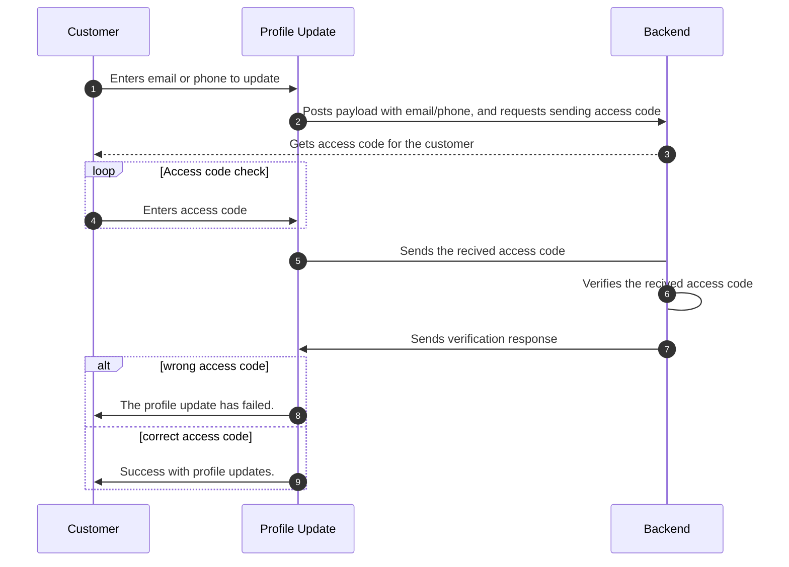

# Storefront Misc

## Table of Contents

- [booking/Add-Booking-Salla-Developer-Documentation-Twilight-Documentation](#booking-add-booking-salla-developer-documentation-twilight-documentation)
- [comment/Add-Customer-Comments-&-Reviews-Twilight-Documentation](#comment-add-customer-comments-&-reviews-twilight-documentation)
- [comment/Fetch-Customer-Comments-&-Reviews-Twilight-Documentation](#comment-fetch-customer-comments-&-reviews-twilight-documentation)
- [comment/Retrieve-Page-Comments-by-Page-ID-Twilight-Documentation](#comment-retrieve-page-comments-by-page-id-twilight-documentation)
- [comment/Retrieve-Product-Comments-by-Product-ID-Twilight-Documentation](#comment-retrieve-product-comments-by-product-id-twilight-documentation)
- [currency/Change-Store-Currency-Salla-Developer-Documentation-Twilight-Documentation](#currency-change-store-currency-salla-developer-documentation-twilight-documentation)
- [currency/List-Store-Currencies-Salla-Developer-Documentation-Twilight-Documentation](#currency-list-store-currencies-salla-developer-documentation-twilight-documentation)
- [loyalty/Exchange-Loyalty-Points-for-Rewards-Twilight-Documentation](#loyalty-exchange-loyalty-points-for-rewards-twilight-documentation)
- [loyalty/Get-Loyalty-Program-Details-Twilight-Documentation](#loyalty-get-loyalty-program-details-twilight-documentation)
- [loyalty/Remove-Loyalty-Reward-from-Cart-Twilight-Documentation](#loyalty-remove-loyalty-reward-from-cart-twilight-documentation)
- [profile/Update-Customer-Contact-Info-Twilight-Documentation](#profile-update-customer-contact-info-twilight-documentation)
- [profile/Update-Customer-Profile-Information-Twilight-Documentation](#profile-update-customer-profile-information-twilight-documentation)
- [subscriptions/App-Subscription-Details-Partners-Apps-APIs-Salla-Docs](#subscriptions-app-subscription-details-partners-apps-apis-salla-docs)
- [subscriptions/Update-Subscription-Balance-Partners-Apps-APIs-Salla-Docs](#subscriptions-update-subscription-balance-partners-apps-apis-salla-docs)
- [wishlist/Add-to-Wishlist-Save-Favorite-Products-Twilight-Documentation](#wishlist-add-to-wishlist-save-favorite-products-twilight-documentation)
- [wishlist/Remove-from-Wishlist-Manage-Favorite-Products-Twilight-Documentation](#wishlist-remove-from-wishlist-manage-favorite-products-twilight-documentation)
- [wishlist/Toggle-Wishlist-Item-Add-or-Remove-Products-Instantly-Twilight-Documentation](#wishlist-toggle-wishlist-item-add-or-remove-products-instantly-twilight-documentation)

---

## booking/Add-Booking-Salla-Developer-Documentation-Twilight-Documentation

# Add

This endpoint is a feature provided by an online Salla Store that allows customers to book a product as a service. This endpoint handles requests to add a new booking for a specific product/service, and creates a booking record in the store's database that includes relevant details. The endpoint streamlines the booking process for customers and store administrators, and provides a convenient way to book products as services. 


## Payload 


<DataSchema id="1387195" />

## Response
<Tabs>
  <Tab title="Success">

<DataSchema id="1387196" />
      
  </Tab>
   
  
</Tabs>


## Usage
To perform the action of booking a product as a service, the method `add()` may be used as follows.


```js
const productId = 123;
salla.booking.add(productId)
  .then((response) => {
    // Do something with the add endpoint response
    console.log(response.status);
  })
  .catch((error) => {
    // Handle any errors that occurred during the request
    console.error(error);
  });
```

## Events
This endpoint may trigger two events, the onAdded and onAdditionFailed events.

### onAdded
This event is triggered when booking a product as a service is done without having any errors coming back from the backend.

```js
salla.event.booking.onAdded((response) => {
  console.log(response)
});
```
### onAdditionFailed
This event is triggered when booking a product as a service is not completed and an error has occurred.

```js
salla.event.booking.onAdditionFailed((errorMessage) => {
  console.log(errorMessage)
});

---

## comment/Add-Customer-Comments-&-Reviews-Twilight-Documentation

# Add Comment

The customer can add their review to the merchant's store using the *add* endpoint. The comment can be about a specific product or a specific page.

## Payload `authenticated`

<DataSchema id="1387222" />


## Response

<Tabs>
  <Tab title="Success">
 
<DataSchema id="1427929" />
  </Tab>
   <Tab title="Error">

<DataSchema id="1427184" />

  </Tab>
  
</Tabs>


## Usage
To add the customer's comment about a specific product or a specific page, the developer may call the `add` method.

```js
salla.comment.add({
    id: 85214,
    comment: "The product's price is good",
    type: "product",
  })
  .then((response) => {
    /* add your code here */
  });

```


## Events
This endpoint may trigger two events, the onAdded and onAdditionFailed events.

### onAdded
This event is triggered when adding a new comment by the customer is done without having any errors coming back from the backend.

```js
salla.event.comment.onAdded((response) => {
  console.log(response)
});
```
### onAdditionFailed
This event is triggered when when adding a new comment by the customer is not completed and an error has occurred.

```js
salla.event.comment.onAdditionFailed((errorMessage) => {
  console.log(errorMessage)
});
```

---

## comment/Fetch-Customer-Comments-&-Reviews-Twilight-Documentation

# Fetch

The *fetch* endpoint allows you to retrieve comments related to a particular object or resource within the platform. By making a request to this endpoint, you can retrieve comments made by users or customers, providing valuable insights, feedback, and discussions related to the specific object.

## Payload 

<DataSchema id="1387223" />

## Response
<Tabs>
  <Tab title="Success">
 
<DataSchema id="1427930" />

     
  </Tab>
   <Tab title="Error">

<DataSchema id="1427314" />
  </Tab>
  
</Tabs>


## Usage
To fetch the customer's comment about a specific product or a specific page, the developer may call the `fetch` method.

```js
salla.comment.fetch({
    id: 85214,
    comment: "The product's price is good",
    type: "product",
  })
  .then((response) => {
    /* add your code here */
  });

```


## Events
This endpoint may trigger two events, the onFetch and onFetchedFailed events.

### onFetch
This event is triggered when fetching a comment by the customer is done without having any errors coming back from the backend.

```js
salla.event.comment.Fetch((response) => {
  console.log(response)
});
```
### onFetchedFailed
This event is triggered when when fetching a new comment by the customer is not completed and an error has occurred.

```js
salla.event.comment.onFetchedFailed((errorMessage) => {
  console.log(errorMessage)
});
```

---

## comment/Retrieve-Page-Comments-by-Page-ID-Twilight-Documentation

# Get Page Comments

The *get page comments* endpoint enables you to retrieve comments associated with a specific page identified by its pageId. By making a request to this endpoint, you can retrieve comments made by users or customers on the specified page.

## Payload 

<DataSchema id="1387225" />

## Response

<Tabs>
  <Tab title="Success">

<DataSchema id="1427934" />
      
  </Tab>
   <Tab title="Error">

<DataSchema id="1427184" />

      
  </Tab>
  
</Tabs>


## Usage
To add the customer's comment about a specific product or a specific page, the developer may call the `send` method.

```js
salla.comment.getPageComments({
  pageId: 123,
  page: 1,
  per_page: 10,
})
.then((response) => {
  /* add your code here */
});

// TIP: short version
salla.comment.getPageComments(123, 1, 10)
.then((response) => {
  /* add your code here */
});
```


## Events
This endpoint may trigger the onFetched event.

### onFetched
This event is triggered when fetching the comments is done without having any errors coming back from the backend.

```js
salla.event.comment.onFetch((response) => {
  console.log(response)
});
```

---

## comment/Retrieve-Product-Comments-by-Product-ID-Twilight-Documentation

# Get Product Comments

The *get product comments* endpoint enables you to retrieve comments associated with a specific product identified by its productId. By making a request to this endpoint, you can retrieve comments made by users or customers on the specified product.

## Payload 

<DataSchema id="1387226" />

## Response
<Tabs>
  <Tab title="Success">

<DataSchema id="1427935" />
      
  </Tab>
   <Tab title="Error">

<DataSchema id="1427184" />

  </Tab>
  
</Tabs>


## Usage
To get the customer's comment about a specific product or a specific page, the developer may call the `getProductComments` method.

```js
salla.comment.getProductComments({
  productId: 23,
  page: 2,
  per_page: 5,
})
.then((response) => {
  /* add your code here */
});

// TIP: short version
salla.comment.getProductComments(23, 2, 5)
.then((response) => {
  /* add your code here */
});
```


## Events
This endpoint may trigger the onFetched event.

### onFetched
This event is triggered when fetching the comments is done without having any errors coming back from the backend.

```js
salla.event.comment.onFetch((response) => {
  console.log(response)
});
```

---

## currency/Change-Store-Currency-Salla-Developer-Documentation-Twilight-Documentation

# Change

This endpoint is used to *change* the currency of a merchant's store and to represent prices for the products. Although the store payouts can be in a different currency, the customer can choose any of the currencies mentioned in the currency selection to display the prices.


:::tip
The *change* endpoint has been implemented in the [Localization](https://docs.salla.dev/doc-422710?nav=01HNFTE06J4QC24T0D5BPRYKMD) Web Component, and It's all setup to save developer's time and effort.
:::


## Payload


<DataSchema id="1387231" />


## Response
<Tabs>
  <Tab title="Success">

<DataSchema id="1427927" />
     
  </Tab>
   <Tab title="Error">
       
<DataSchema id="1427184" />
  </Tab>
  
</Tabs>

## Usage
To perform the action of changing the store's currency, the developer may call the `change()` method as below.


```js
salla.currency.change({ currency_code: "SAR") }).then((response) => {
  /* add your code here */
});

// TIP: short version
salla.currency.change("SAR").then((response) => {
  /* add your code here */
});
```


## Events
This endpoint may trigger two events, the onChanged and onFailed events.

### onChanged
This event is triggered when changing the store's currency is done without having any errors coming back from the backend.

```js
salla.event.currency.onChanged((response) => {
  console.log(response)
});
```
### onFailed
This event is triggered when changing the store's currency is not completed and an error has occurred.

```js
salla.event.currency.onFailed((errorMessage) => {
  console.log(errorMessage)
});

---

## currency/List-Store-Currencies-Salla-Developer-Documentation-Twilight-Documentation

# List

This endpoint is used to list the currencies of a merchant's store. Although the store payouts can be in a different currency, the store's owners can list the different available currencies in the store.
:::tip
The *list* endpoint has been implemented in the [Localization](https://docs.salla.dev/doc-422710?nav=01HNFTE06J4QC24T0D5BPRYKMD) Web Component, and It's all setup to save developer's time and effort.
:::
## Response
<Tabs>
  <Tab title="Success">
 
<DataSchema id="1387235" />
     
  </Tab>
   <Tab title="Error">
       
<DataSchema id="1427314" />
      
  </Tab>
  
</Tabs>


## Usage
To perform the action of listing the avaliabe currencies for the store, the developer can call `list()` method.


```js
salla.currency.list().then((response) => {
  /* add your code here */
});
```


## Events
This endpoint may trigger two events, the onFetched and onFailedToFetch events.

### onFetched
This event is triggered when listing the avaliabe currencies for the store is done without having any errors coming back from the backend.

```js
salla.event.currency.onFetched((response) => {
  console.log(response)
});
```
### onFailedToFetch
This event is triggered when listing the avaliabe currencies for the store is not completed and an error has occurred.

```js
salla.event.currency.onFailedToFetch((errorMessage) => {
  console.log(errorMessage)
});

---

## loyalty/Exchange-Loyalty-Points-for-Rewards-Twilight-Documentation

# Exchange

This endpoint is used to exchange a customer's accumulated points for any preset reward, such as free goods or discounts.

:::tip
The *exchange* endpoint has been implemented in the [Loyalty](https://docs.salla.dev/doc-422712?nav=01HNFTE06J4QC24T0D5BPRYKMD) Web Component , and It's all setup to save developer's time and effort.
:::


## Payload `authenticated`

<DataSchema id="1387244" />

## Response

<Tabs>
  <Tab title="Success">
 
<DataSchema id="1387243" />
  
  </Tab>
   <Tab title="Error">


<DataSchema id="1427184" />
       
  </Tab>
  
</Tabs>


## Usage
To perform the action of exchanging a customer's accumulated points for any preset reward, the method `exchange()` may be called as below:

```js
salla.loyalty.exchange({ prize_id: 978, cart_id:123 }).then((response) => {
  /* add your code here */
});
```


## Events
This endpoint may trigger two events, the onExchangeSucceeded and onExchangeFailed events.

### onExchangeSucceeded
This event is triggered when performing the action of exchanging a customer's accumulated points for any preset reward is done without having any errors coming back from the backend.

```js
salla.event.rating.onExchangeSucceeded((response) => {
  console.log(response)
});
```
### onExchangeFailed
This event is triggered when performing the action of exchanging a customer's accumulated points for any preset reward is not completed and an error has occurred.

```js
salla.event.rating.onExchangeFailed((errorMessage) => {
  console.log(errorMessage)
});

---

## loyalty/Get-Loyalty-Program-Details-Twilight-Documentation

# Get Program

This endpoint is used to retrieve the details of the loyalty program sponsored by the store, as well as offer prizes and discounts to attract and retain customers. 
:::tip
The *get program* endpoint has been implemented in the [Loyalty](https://docs.salla.dev/doc-422712?nav=01HNFTE06J4QC24T0D5BPRYKMD) Web Component , and It's all setup to save developer's time and effort.

:::
## Response
<Tabs>
  <Tab title="Success">

<DataSchema id="1387245" />
     
  </Tab>
   <Tab title="Error">

<DataSchema id="1427314" />
  </Tab>
  
</Tabs>


## Usage
To perform the action of getting a program details, the method `order()` may be called as below, with the id of the order to be rated.

```js
salla.loyalty.getProgram().then((response) => {
  /* add your code here */
});
```


## Events
This endpoint may trigger two events, the onProgramFetched and onProgramNotFetched events.

### onProgramFetched
This event is triggered when fetching the loyalty program is done without having any errors coming back from the backend.

```js
salla.event.rating.onProgramFetched((response) => {
  console.log(response)
});
```
### onProgramNotFetched
This event is triggered when fetching the loyalty program is not completed and an error has occurred.

```js
salla.event.rating.onProgramNotFetched((errorMessage) => {
  console.log(errorMessage)
});

---

## loyalty/Remove-Loyalty-Reward-from-Cart-Twilight-Documentation

# Reset

This endpoint is used when the customer removes an added reward from the live cart. In some cases, customers may need to remove a prize after adding it to the live cart.

:::tip
The *reset* endpoint has been implemented in the [Loyalty](https://docs.salla.dev/doc-422712?nav=01HNFTE06J4QC24T0D5BPRYKMD) Web Component, , and It's all setup to save developer's time and effort.
:::

## Response
<Tabs>
  <Tab title="Success">

<DataSchema id="1427840" />
  </Tab>
   <Tab title="Error">

<DataSchema id="1427314" />
  </Tab>
  
</Tabs>


## Usage
To perform the action of removing an added reward from the live cart, the method `reset()` may be called as below, with the id of the order to be rated.

```js
salla.loyalty.reset().then((response) => {
  /* add your code here */
});
```


## Events
This endpoint may trigger two events, the onResetSucceeded and onResetFailed events.

### onResetSucceeded
This event is triggered when the action of removing an added reward from the live cart is done without having any errors coming back from the backend.

```js
salla.event.rating.onResetSucceeded((response) => {
  console.log(response)
});
```
### onResetFailed
This event is triggered when the action of removing an added reward from the live cart is not completed and an error has occurred.

```js
salla.event.rating.onResetFailed((errorMessage) => {
  console.log(errorMessage)
});

---

## profile/Update-Customer-Contact-Info-Twilight-Documentation

# Update contact

This endpoint is used to update a customer's contact information. The profile contains information such as the customer's `phone`, `country_code`, and `email`.

## Payload `authenticated`

<DataSchema id="1427940" />


## Response
<Tabs>
  <Tab title="Success">


<DataSchema id="1427941" />
      
  </Tab>
   <Tab title="Error">

<DataSchema id="1427184" />
  </Tab>
  
</Tabs>


## Usage
To update the contact informtion for the customer, the developer may call the methos `updateContact()` along with the customer's new information as below.

```js
salla.profile.updateContacts({
  "phone": "59874654",
  "country_code": "966",
  "email": "user@demo.com"
}).then((response) => {
  /* add your code here */
});
```

### Verification
An additional endpoint is required to be used here for handling the verification process. This is to ensure the user's confirmation of the changes. It functions similarly to the [login verification](https://docs.salla.dev/doc-422620?nav=01HNFTDZPB31Y2E120R84YXKCX) endpoint. 

The `verification` status will change if the profile's phone, country code, or email are modified. It takes the values pending and success as inputs. The pending state implies that the user must confirm the modifications by an OTP code issued to his phone or email. The success status indicates that the profile update was completed successfully and that the user does not need to take any additional action.

This endpoint sends the entered access code to the backend and waits for a response. If an affirmative response is received, the profile is updated. If the verification process doesn't work, the customer is told to send the right access code again.

<!-- theme: success -->
> 💡 **Tip:**
> The *profile verify* endpoint has been implemented in the [Verify](https://docs.salla.dev/doc-422620?nav=01HNFTE06J4QC24T0D5BPRYKMD) Web Component, , and It's all setup to save developer's time and effort.



An additional endpoint is required to be used here for handling the verification process. This is to ensure the user's confirmation of the changes. It functions similarly to the [login verification](https://docs.salla.dev/doc-422620?nav=01HNFTDZPB31Y2E120R84YXKCX) endpoint. 

This endpoint sends the entered access code to the backend and waits for a response. If an affirmative response is received, the profile is updated. If the verification process doesn't work, the customer is told to send the right access code again.

The `salla.profile.verify()` passes the customer access code to the backend in order to proceed with the verification process. In the case of using the phone number method to receive the access code, this method will pass the received access code along with the customer's phone number and the country code.


#### With web componenet


in case the user change the phone/email a OTP required to complete the changes, you can take advancige of `salla-verify-modal` to hanlde the OTP verifation

```html
<script type="javascript">
salla.profile.updateContacts({
  "phone": "5555555",
  "country_code": "966",
  "email": "user@demo.com"
}).then((response) => {
  /* add your code here */

  // in case the mobile/email has been change
  // a event will disaptch to `salla-verify-modal` to show 
  // and colloct the OTP and complete the verifation process
});
</script>

<salla-verify-modal></salla-verify-modal>
```

<!-- theme: success -->
> 💡 **Tip:**
> The *profile verify* endpoint has been implemented in the [Verify](doc-422620?nav=01HNFTE06J4QC24T0D5BPRYKMD) Web Component, , and It's all setup to save developer's time and effort.

#### Without web componenet


```js
salla.profile.updateContacts({
  "phone": "5555555",
  "country_code": "966",
  "email": "user@demo.com"
}).then((response) => {
  /* add your code here */

  // in case the mobile/email has been change
  // a otp required to complete the changes 
  if(response.data.verification.status === 'pending') {
    // you have to colloct the OTP from the user and submit it again like this
    let payload = {
      type: response.data.verification.type, 
      code: '1111' // the OTP from the customer form
    };

    if(payload.type === 'phone') {
      payload.phone = response.data.phone.number;
      payload.country_code = response.data.phone.country;
    } else {
      payload.email = response.data.email;
    }

    salla.profile.verify(payload).then((response) => {
      // phone/email has been changed
    }).catch((error) => {
      // OTP incorrect
    });
  }
});
```


## Events
This endpoint may trigger two events, which are the `onVerificationCodeSent`and `onUpdateContactsFailed` events.

### onVerificationCodeSent
This event may happen will be triggered when the verification process fails and the backend sends error codes. In other words, the received response status is not 200.
```js
salla.event.profile.onVerificationCodeSent((errorMessage) => {
  console.log(errorMessage)
});
```

### onUpdateContactsFailed
This event is triggered when updating the contact information for the customer is not completed and an error has occurred.

```js
salla.event.profile.onUpdateMobileFailed((errorMessage) => {
  console.log(errorMessage)
});
```

---

## profile/Update-Customer-Profile-Information-Twilight-Documentation

# Update profile

This endpoint is used to update a customer's profile. The profile contains information such as the customer's `first_name`, `last_name`, `birthday`, `gender`, and `avatar`.

## Payload `authenticated`

<DataSchema id="1387263" />

## Response
<Tabs>
  <Tab title="Success">


<DataSchema id="1430679" />
      
  </Tab>
   <Tab title="Error">

<DataSchema id="1427184" />
  </Tab>
  
</Tabs>


## Usage
To update the content of the customer's profile, the developer may call the methos `update()` along with the customer's new information as below.

<!--
type: tab
title: With web componenet
-->

in case the user change the phone/email a OTP required to complete the changes, you can take advancige of `salla-verify-modal` to hanlde the OTP verifation


```html
<script type="javascript">
salla.profile.update({
  first_name: "Mohammed",
  last_name: "Salah",
  birthday: "2022-02-22",
  gender: "male",
  phone: "555555555",
  country_code: "SA",
  email: "demo@demo.com"
}).then((response) => {
  /* add your code here */

  // in case the mobile/email has been change
  // a event will disaptch to `salla-verify-modal` to show 
  // and colloct the OTP and complete the verifation process
});
</script>

<salla-verify-modal></salla-verify-modal>
```


#### Without web componenet


```js
salla.profile.update({
  first_name: "Mohammed",
  last_name: "Salah",
  birthday: "2022-02-22",
  gender: "male",
  phone: "555555555",
  country_code: "SA",
  email: "demo@demo.com"
}).then((response) => {
  /* add your code here */

  // in case the mobile/email has been change
  // a otp required to complete the changes 
  if(response.data.verification.status === 'pending') {
    // you have to colloct the OTP from the user and submit it again like this
    let payload = {
      type: response.data.verification.type, 
      code: '1111' // the OTP from the customer form
    };

    if(payload.type === 'phone') {
      payload.phone = response.data.phone.number;
      payload.country_code = response.data.phone.country;
    } else {
      payload.email = response.data.email;
    }

    salla.profile.verify(payload).then((response) => {
      // phone/email has been changed
    }).catch((error) => {
      // OTP incorrect
    });
  }
});
```

## Events
This endpoint may trigger two events, the onUpdated and onUpdateFailed events.

### onUpdated
This event is triggered when updating the content of the customer's profile is done without having any errors coming back from the backend.

```js
salla.event.profile.onUpdated((response) => {
  console.log(response)
});
```
### onUpdateFailed
This event is triggered when updating the content of the customer's profile is not completed and an error has occurred.

```js
salla.event.profile.onUpdateFailed((errorMessage) => {
  console.log(errorMessage)
});

---

## subscriptions/App-Subscription-Details-Partners-Apps-APIs-Salla-Docs

# App Subscription Details

## OpenAPI Specification

```yaml
openapi: 3.0.1
info:
  title: ''
  description: ''
  version: 1.0.0
paths:
  /apps/{app_id}/subscriptions:
    get:
      summary: App Subscription Details
      deprecated: false
      description: >-
        This endpoint allows you to fetch details of App Subscriptions per
        [Salla Store](http://s.salla.sa/).
      operationId: get-apps-app-id-subscriptions
      tags:
        - Partner Apps APIs/Subscriptions
        - Subscriptions
      parameters:
        - name: app_id
          in: path
          description: >-
            Salla Application ID. [Salla Partners](https://salla.partners) > My
            Apps > Your App
          required: true
          example: 0
          schema:
            type: integer
      responses:
        '200':
          description: ''
          content:
            application/json:
              schema:
                type: object
                properties:
                  status:
                    type: number
                    description: Response Status Code
                    examples:
                      - 200
                  success:
                    type: boolean
                    default: true
                    description: Whether or not the response is successful
                  data:
                    type: array
                    items:
                      $ref: '#/components/schemas/SubscriptionDetailResponse'
                x-apidog-orders:
                  - status
                  - success
                  - data
                x-apidog-ignore-properties: []
              examples:
                '1':
                  summary: Example | Free Subscription
                  value:
                    status: 200
                    success: true
                    data:
                      - id: '657032372'
                        app_name: App 1.2
                        description: >-
                          App 1.2 App 1.2 App 1.2 App 1.2 App 1.2 App 1.2 App
                          1.2
                        app_type: app
                        categories:
                          - Others
                        plan_type: recurring
                        plan_name: Free
                        plan_period: null
                        start_date: null
                        end_date: null
                        initialization_cost: 0
                        price_before_discount: 0
                        price: 0
                        tax: 0
                        tax_value: 0
                        total: 0
                        subscription_balance: null
                        coupon: null
                        features: []
                '2':
                  summary: Example | Monthly Subscription
                  value:
                    status: 200
                    success: true
                    data:
                      - id: '635600867'
                        app_name: BitoShip
                        description: BitoShip Description
                        app_type: app
                        categories:
                          - Others
                        plan_type: recurring
                        plan_name: Monthly
                        plan_period: '1'
                        start_date: '2022-05-23'
                        end_date: '2022-06-23'
                        initialization_cost: 10
                        price_before_discount: 5
                        price: 15
                        tax: 0.15
                        tax_value: 2.23
                        total: 17.08
                        subscription_balance: 50
                        coupon:
                          name: SPVMPSF
                          amount: '0.15'
                        features:
                          - key: Feature1
                            quantity: 1
                          - key: Feature2
                            quantity: 2
                '3':
                  summary: Example | Yearly Subscription
                  value:
                    status: 200
                    success: true
                    data:
                      - id: '657032372'
                        app_name: BitoShip
                        description: BitoShip Description
                        app_type: app
                        categories:
                          - Others
                        plan_type: recurring
                        plan_name: yearly
                        plan_period: '12'
                        start_date: '2022-05-23'
                        end_date: '2023-05-23'
                        initialization_cost: 15
                        price_before_discount: 6
                        price: 20
                        tax: 0.15
                        tax_value: 3
                        total: 23
                        subscription_balance: 50
                        coupon: null
                        features: []
                '4':
                  summary: Example | Trial Subscription
                  value:
                    status: 200
                    success: true
                    data:
                      - id: '1512343377'
                        app_name: BitoShip
                        description: BitoShip Description
                        app_type: app
                        categories:
                          - Others
                        plan_type: once
                        plan_name: trail
                        plan_period: '1'
                        start_date: '2022-05-23'
                        end_date: '2022-05-24'
                        initialization_cost: 0
                        price_before_discount: 0
                        price: null
                        tax: null
                        tax_value: null
                        total: null
                        subscription_balance: null
                        coupon: null
                        features: []
                '5':
                  summary: Example | One-Time Subscription
                  value:
                    status: 200
                    success: true
                    data:
                      - id: '1512343377'
                        app_name: BitoShip
                        description: BitoShip Description
                        app_type: app
                        categories:
                          - Others
                        plan_type: once
                        plan_name: Free
                        plan_period: null
                        start_date: null
                        end_date: null
                        initialization_cost: 0
                        price_before_discount: 0
                        price: 1
                        tax: 0.15
                        tax_value: 0.15
                        total: 1.15
                        subscription_balance: 50
                        coupon: null
                        features: []
                '6':
                  summary: Example | Pay As You Go Subscription
                  value:
                    status: 200
                    success: true
                    data:
                      - id: '2032004508'
                        app_name: BitoShip
                        description: BitoShip Description
                        app_type: shipping
                        categories:
                          - Shipping & Fulfillment
                        plan_type: on_demand
                        plan_name: plan name in english OR FREE
                        plan_period: null
                        start_date: null
                        end_date: null
                        initialization_cost: 100
                        price_before_discount: 0
                        price: 100
                        tax: 15
                        tax_value: 15
                        total: 115
                        coupon:
                          - name: coupon name
                            amount: 10
                        subscription_balance: 5000
                        features:
                          - key: feature_slug
                            quantity: 100
          headers: {}
          x-apidog-name: Success
        '403':
          description: ''
          content:
            application/json:
              schema:
                $ref: '#/components/schemas/NotFoundResponse'
              example:
                status: 403
                success: false
                error:
                  code: error
                  message: ليس لديك صلاحية لتعديل الخدمة
          headers: {}
          x-apidog-name: Unauthorized
      security:
        - bearer: []
      x-apidog-folder: Partner Apps APIs/Subscriptions
      x-apidog-status: released
      x-run-in-apidog: https://app.apidog.com/web/project/451700/apis/api-5401098-run
components:
  schemas:
    SubscriptionDetailResponse:
      type: object
      x-examples: {}
      title: Subscription Detail Response
      properties:
        id:
          type: string
          description: Salla App ID
          examples:
            - '2032004508'
        app_name:
          type: string
          description: Salla App Name
          examples:
            - BitoShip
        description:
          type: string
          description: Salla App Description
          examples:
            - BitoShip Description
        app_type:
          type: string
          description: Salla App Type
          enum:
            - app
            - shipping
          examples:
            - shipping
        categories:
          type: array
          description: Salla App Categories
          items:
            type: string
            enum:
              - Shipping' & 'Fulfillment
              - Accounting & Finance
              - Marketing
              - Analytics
              - Email
              - Geolocation
              - Site Optimization
              - SMS
              - Chat
              - Others
            examples:
              - Shipping & Fulfillment
        plan_type:
          type: string
          description: App Plan Types
          enum:
            - free
            - once
            - recurring
            - on_demand
          examples:
            - recurring
        plan_name:
          type: string
          description: Plan Name
          examples:
            - Yearly
        plan_period:
          type: string
          description: Plan Period in months
          examples:
            - '12'
          nullable: true
        start_date:
          type: string
          description: Plan Start Date
          examples:
            - '2022-12-31'
          nullable: true
        end_date:
          type: string
          description: Plan End Date
          examples:
            - '2023-12-31'
          nullable: true
        initialization_cost:
          type: integer
          description: >-
            This refers to the one-time cost associated with setting up a new
            subscription. This cost can include things like the cost of
            hardware, software, and installation
          examples:
            - 10
          nullable: true
        price_before_discount:
          type: integer
          description: Original Price Before Discount
          examples:
            - 5
          nullable: true
        price:
          type: integer
          description: Original Plan Price
          examples:
            - 200
          nullable: true
        tax:
          type: number
          description: Tax Percentage
          examples:
            - 0.15
          nullable: true
        tax_value:
          type: number
          description: Tax Value
          examples:
            - 30
          nullable: true
        total:
          type: number
          description: Total Price Amount (tax included)
          examples:
            - 230
          nullable: true
        subscription_balance:
          type: number
          x-stoplight:
            id: 7ba4aj5qcgew3
          description: >-
            The subscription balance is the amount of balance that a Merchant
            owes for the App’s service.
          examples:
            - 50
          nullable: true
        coupon:
          type: object
          properties:
            name:
              type: string
              description: Coupon Name
              examples:
                - SPVMPSF
            amount:
              type: string
              description: Coupon Amount
              examples:
                - '0.15'
          x-apidog-orders:
            - name
            - amount
          x-apidog-ignore-properties: []
          nullable: true
        features:
          type: array
          items:
            type: object
            properties:
              key:
                type: string
                description: Feature Key value
                examples:
                  - Feature1
              quantity:
                type: number
                description: Feature Quantity
                examples:
                  - 1
            x-apidog-orders:
              - key
              - quantity
            x-apidog-ignore-properties: []
      x-apidog-orders:
        - id
        - app_name
        - description
        - app_type
        - categories
        - plan_type
        - plan_name
        - plan_period
        - start_date
        - end_date
        - initialization_cost
        - price_before_discount
        - price
        - tax
        - tax_value
        - total
        - subscription_balance
        - coupon
        - features
      x-apidog-ignore-properties: []
      x-apidog-folder: ''
    NotFoundResponse:
      type: object
      title: NotFoundResponse
      properties:
        status:
          type: number
          description: Response status Code
        success:
          type: boolean
          description: Response flag
        error:
          type: object
          properties:
            code:
              type: integer
              description: Response code
            message:
              type: string
              description: Response message
          x-apidog-orders:
            - code
            - message
          x-apidog-ignore-properties: []
      x-examples:
        Example:
          success: false
          status: 404
          error:
            code: 404
            message: The content you are trying to access is no longer available
      x-tags:
        - Responses
      x-apidog-orders:
        - status
        - success
        - error
      x-apidog-ignore-properties: []
      x-apidog-folder: ''
  securitySchemes:
    bearer:
      type: http
      scheme: bearer
servers:
  - url: ''
    description: Cloud Mock
  - url: https://api.salla.dev/admin/v2
    description: Production
security:
  - bearer: []

```

---

## subscriptions/Update-Subscription-Balance-Partners-Apps-APIs-Salla-Docs

# Update Subscription Balance

## OpenAPI Specification

```yaml
openapi: 3.0.1
info:
  title: ''
  description: ''
  version: 1.0.0
paths:
  /apps/balance:
    post:
      summary: Update Subscription Balance
      deprecated: false
      description: >-
        This endpoint allows you to update the balance of an Application's
        subscription. 


        :::note

        The endpoint complies with the [Pay As You Go
        Plan](https://salla.dev/blog/maximizing-revenue-and-user-satisfaction-with-pay-as-you-go-pricing/)
        feature on [Salla Partners](https://salla.partners)

        :::
      operationId: post-apps-balance
      tags:
        - Partner Apps APIs/Subscriptions
        - Subscriptions
      parameters: []
      requestBody:
        content:
          application/json:
            schema:
              type: object
              properties:
                balance:
                  type: integer
                  x-stoplight:
                    id: x6195h3k8428f
                  description: App Subscription Balance
                  examples:
                    - 2399
              required:
                - balance
              x-apidog-orders:
                - balance
              x-apidog-ignore-properties: []
            example:
              balance: 2399
      responses:
        '201':
          description: ''
          content:
            application/json:
              schema:
                $ref: '#/components/schemas/progress_ActionSuccess'
              example:
                status: 201
                success: true
                data:
                  message: تم تحديث رصيد المتجر بنجاح
                  code: 201
          headers: {}
          x-apidog-name: Created
        '422':
          description: ''
          content:
            application/json:
              schema:
                type: object
                x-examples:
                  Example 1:
                    status: 422
                    success: false
                    error:
                      code: error
                      message: alert.invalid_fields
                      fields:
                        balance:
                          - حقل الرصيد مطلوب.
                properties:
                  status:
                    type: integer
                    description: Response Status
                  success:
                    type: boolean
                    description: Whether or not the response was successful
                  error:
                    type: object
                    properties:
                      code:
                        type: string
                        description: error code value
                      message:
                        type: string
                        description: error message value
                      fields:
                        type: object
                        properties:
                          balance:
                            type: array
                            description: error field value
                            items:
                              type: string
                        x-apidog-orders:
                          - balance
                        x-apidog-ignore-properties: []
                    x-apidog-orders:
                      - code
                      - message
                      - fields
                    x-apidog-ignore-properties: []
                x-apidog-orders:
                  - status
                  - success
                  - error
                x-apidog-ignore-properties: []
              examples:
                '2':
                  summary: Example 1
                  value:
                    status: 422
                    success: false
                    error:
                      code: error
                      message: alert.invalid_fields
                      fields:
                        balance:
                          - حقل الرصيد مطلوب.
                '3':
                  summary: Example 2
                  value:
                    status: 422
                    success: false
                    error:
                      code: error
                      message: alert.invalid_fields
                      fields:
                        balance:
                          - يجب أن يكون حقل الرصيد عددًا صحيحًا
                '4':
                  summary: Example 3
                  value:
                    status: 422
                    success: false
                    error:
                      code: '422'
                      message: الرصيد المتبقى يجب ان يكون اقل من رصيد المتجر
          headers: {}
          x-apidog-name: Error Validation
      security:
        - bearer: []
      x-apidog-folder: Partner Apps APIs/Subscriptions
      x-apidog-status: released
      x-run-in-apidog: https://app.apidog.com/web/project/451700/apis/api-5401099-run
components:
  schemas:
    progress_ActionSuccess:
      type: object
      properties:
        status:
          type: number
          description: >-
            Response status code, a numeric or alphanumeric identifier used to
            convey the outcome or status of a request, operation, or transaction
            in various systems and applications, typically indicating whether
            the action was successful, encountered an error, or resulted in a
            specific condition.
        success:
          type: boolean
          description: >-
            Response flag, boolean indicator used to signal a particular
            condition or state in the response of a system or application, often
            representing the presence or absence of certain conditions or
            outcomes.
        data:
          type: object
          properties:
            message:
              type: string
              description: >-
                A text or data communication generated by a system or
                application in response to a request.
            code:
              type: number
              description: >-
                A numerical or alphanumeric identifier used in various systems
                and protocols to indicate the status or outcome of a specific
                request.
          x-apidog-orders:
            - message
            - code
          x-apidog-ignore-properties: []
      x-apidog-orders:
        - status
        - success
        - data
      x-apidog-ignore-properties: []
      x-apidog-folder: ''
  securitySchemes:
    bearer:
      type: http
      scheme: bearer
servers:
  - url: ''
    description: Cloud Mock
  - url: https://api.salla.dev/admin/v2
    description: Production
security:
  - bearer: []

```

---

## wishlist/Add-to-Wishlist-Save-Favorite-Products-Twilight-Documentation

# Add

This endpoint adds a product to the customer's wishlist. A customer's wishlist is a collection of desired products saved to the customer's account, indicating interest but not an immediate intent to buy. 
 

## Payload `authenticated`


<DataSchema id="1387278" />


## Response
<Tabs>
  <Tab title="Success">


<DataSchema id="1427827" />
  </Tab>

  
</Tabs>


## Usage
To perform the action of adding a product to the customer's wishlist, the method `add()` may be used as follows.


```js
salla.wishlist.add({ id: 12345 }).then((response) => {
  /* add your code here */
});

// TIP: short version
salla.wishlist.add(12345).then((response) => {
  /* add your code here */
});
```

## Events
This endpoint may trigger two events, the onAdded and onAdditionFailed events.

### onAdded
This event is triggered when adding a product to the customer's wishlist is done without having any errors coming back from the backend.

```js
salla.event.wishlist.onAdded((response) => {
  console.log(response)
});
```
### onAdditionFailed
This event is triggered when adding a product to the customer's wishlist is not completed and an error has occurred.

```js
salla.event.wishlist.onAdditionFailed((errorMessage) => {
  console.log(errorMessage)
});

---

## wishlist/Remove-from-Wishlist-Manage-Favorite-Products-Twilight-Documentation

# Remove

This endpoint removes a product to the customer's wishlist. A customer's wishlist is a collection of desired products saved to the customer's account, indicating interest but not an immediate intent to buy. 

## Payload `authenticated`


<DataSchema id="1387279" />


## Response
<Tabs>
  <Tab title="Success">
 
<DataSchema id="1427828" />
  </Tab>
 
</Tabs>

## Usage
To perform the action of removing a product to the customer's wishlist, the method `remove()` may be used as follows.

```js
salla.wishlist.remove({ id: 12345 }).then((response) => {
  /* add your code here */
});

// TIP: short version
salla.wishlist.remove(12345).then((response) => {
  /* add your code here */
});
```


## Events
This endpoint may trigger two events, the onRemoved and onRemovingFailed events.

### onRemoved
This event is triggered when removing a product to the customer's wishlist is done without having any errors coming back from the backend.

```js
salla.event.wishlist.onRemoved((response) => {
  console.log(response)
});
```
### onRemovingFailed
This event is triggered when removing a product to the customer's wishlist is not completed and an error has occurred.

```js
salla.event.wishlist.onRemovingFailed((errorMessage) => {
  console.log(errorMessage)
});

---

## wishlist/Toggle-Wishlist-Item-Add-or-Remove-Products-Instantly-Twilight-Documentation

# Toggle

This endpoint switches a product's addition or removal from the customer's wishlist. It simply calls the other endpoints [Add](https://docs.salla.dev/doc-422654?nav=01HNFTDZPB31Y2E120R84YXKCX) and [Remove](https://docs.salla.dev/doc-422655?nav=01HNFTDZPB31Y2E120R84YXKCX) as needed. A copy of the customer's wishlist is saved in the [broswer local storage](https://docs.salla.dev/doc-422613?nav=01HNFTDZPB31Y2E120R84YXKCX) to speed the process of retrieving its content. Based on the content of the wishlist in the local storage, the items will be added or removed.

## Payload `authenticated`


<DataSchema id="1387280" />

## Response
<Tabs>
  <Tab title="Success">

<DataSchema id="1427829" />
  
  </Tab>
   
  
</Tabs>


## Usage
To perform the action of switching a product's addition or removal from a wishlist, the method `toggle()` may be called as below.

```js
salla.wishlist.toggle({ id: 12345 }).then((response) => {
  /* add your code here */
});

// TIP: short version
salla.wishlist.toggle(12345).then((response) => {
  /* add your code here */
});
```

## Events
This endpoint calls the  [`add`](https://docs.salla.dev/doc-422654?nav=01HNFTDZPB31Y2E120R84YXKCX) and [`remove`](https://docs.salla.dev/doc-422655?nav=01HNFTDZPB31Y2E120R84YXKCX)endpoint, accordingly, all of their  [events](https://docs.salla.dev/doc-422611?nav=01HNFTDZPB31Y2E120R84YXKCX) are applicable.

---

